# MarkDown to use in Typora

### 1.标题的使用

``` 
"# "一级标题
"## "二级标题
"### "三级标题
"#### "四级标题
"##### "五级标题
"###### "六级标题
```

#### 自动生成目录

[toc]

```
输入[toc]然后回车。
```

#### 段落

```一个段落就是一行或多行连续的文本。在 Markdown 源代码中,段落由两行或多行空行分隔。在 Typora 中,你只需要一行空行(按下 Return 一次)即可创建新段落。按下 Shift + Return 键即可创建单行改行。大多数其他 Markdown 解析器会忽略单行改行,因此为了让其他 Markdown 解析器识别你的改行,你可以在行末留下两个空格,或者插入 。```

#### 警告框

> [!NOTE]
>
> 111

`> [!NOTE]`

> [!TIP]
>
> 222

`> [!TIP]`

> [!IMPORTANT]
>
> 333

`> [!IMPORTANT]`

> [!WARNING]
>
> 444

`> [!WARNING]`

> [!CAUTION]
>
> 555

`> [!CAUTION]`

#### YAML使用

Typora 现在支持 [YAML Front Matter](http://jekyllrb.com/docs/frontmatter/)。在文章顶部输入 `---`,然后按 `Return` 引入元数据块。或者,您可以从 Typora 的顶部菜单插入元数据块。

### 2.文本样式

```
斜体：把需要改变的字体添加在两个"*"之间；
粗体："**添加文字**"
粗体加斜体："***添加文字***"
加底色："==文字=="；
删除："~~文字~~".
```

*斜体*      	`*斜体*`

**粗体**			`**粗体**`

***粗体加斜体***	`***粗体加斜体***`

==加底色==   		`==加底色==`

~~删除~~				`~~删除~~`

<u>下划线</u>			`<u>下划线</u>`

上下标： x^2^+y^2^=z^2^   `x^2^+y^2^=z^2^`

​                H~2~O              `H~2~O`

<!--这是注释-->

`<!--注释内容-->`

脚注 ：     一个具有脚注的文本。[^2]    `一个注脚文本[^2]`

[^2]: 脚注2的解释

脚注 [^3]

[^3]:脚注三的解释


#### 水平线 

***

---

```
*** 或者 ---
然后点enter将出现一个水平线。
```

#### 引用

> > 这是一个引用
>
> > 一级引用                                                   
> >
> > > ​	二级引用
> > >
> > > > ​	三级引用
> > > >
> > > > > ​	四级引用
> > > > >
> > > > > > ​	五级引用
>
> ```
> > 一级引用
> >> 二级引用
> >>> 三级引用
> 。。。。。。
> ```
>
> 

``` 
"> "这是引用符号；
在一行引用的下一行输入">"可进入下一级引用；
没有进行测试，应该有无数级
当不需要引用时，一直按enter
```

####  markdown链接与图片

[这是链接的名称](http://example.com)

`[这里填写链接的名称](这里填写链接的地址)`

下面是一个皮卡丘图片：


``

#### Emoji

:smile:  `:smile:`

使用语法 '：smile：' 输入 emoji。

用户可以通过按“ESC”键触发表情符号的自动完成建议，或者在首选项面板上启用它后自动触发它。此外，通过转到菜单栏（macOS）中的'编辑' -> '表情符号和符号'，也可以直接输入UTF-8表情符号字符。

`<script src="https://gist.github.com/rxaviers/7360908.js"></script>`

[Emoji语法表情速查表](https://shw2018.github.io/posts/a927e90e.html#toc-heading-6)

[Emoji-cheat-sheet](https://www.webfx.com/tools/emoji-cheat-sheet/)

<script src="https://gist.github.com/rxaviers/7360908.js"></script>

### 3.列表

#### 无序列表

`"* " "- " "+ "都可进入无序列表；`

`效果如下`

* 第一条        `* 第一条`

  * 第二条

  * 二级
    - 三级
* 第三条

#### 有序列表

`"数字. "进入有序列表`

1. 第一点
2. 第二点
3. 第三点

`按"enter"自动向下递增，多按一次退出`

#### 表格


| 标题一 |      | 标题二 |      |      |      |
| :----: | ---- | :----: | ---- | ---- | ---- |
|        |      |        |      |      |      |
|        |      |        |      |      |      |
|        |      |        |      |      |      |
|        |      |        |      |      |      |
|        |      |        |      |      |      |

``` 
| 主标题 | 副标题 |
然后点击enter键，就会自动创造一个两列的表格；
点击创建的表格，将会打开一个工具栏可以设置表格的大小、行数、列数或者删除。
当然还有一些其他更细节性的语法使用，但是你并不需要全部了解，掌握上面的知识，也就可以了。
| 标题一 | 标题二 | 标题三 |
|：------ |：--- ：|-------：|根据冒号的位置，使标题靠左靠右居中。
```

#### 任务完成框

- [x] 任务一
- [x] 任务二 
- [x] 已完成的任务三

``` html
- [x] 任务一
- [x] 任务二
- [x] 任务三
```


#### markdown代码片段

`sayHello()函数`          

```
`sayHello()`函数
```

也可写一整段代码：

```java
public class Main{
	public static void main(String[] args){
		System.out.println("Hello");
    }
}
```

```
```public class Main{
         public static void main(String[] args){
                System.out.println("Hello");
         }
    }```
    可以在右下角选择语言。
```


### 5.数学公式

You can find more details [here](https://support.typora.io/Math/).

[Supported TeX/LaTeX commands — MathJax 3.2 documentation](https://docs.mathjax.org/en/latest/input/tex/macros/index.html)

[mhchem-漂亮的化学公式](https://mhchem.github.io/MathJax-mhchem/)

[数学表达式 - Latex](https://www.overleaf.com/learn/latex/Mathematical_expressions)


#### 数学表达式

| 名称           | 示例                                                         | 示例效果                                                     |
| -------------- | ------------------------------------------------------------ | ------------------------------------------------------------ |
| 简单等式       | `$99+2-1=100$`                                               | 99+2-1=100                                                   |
| 方程           | `$x^2 + 2x + 5 + \sqrt x = 0$`                               | $x^2 + 2x + 5 + \sqrt x = 0$                                 |
| 方程组         | `$\begin{cases} x+y+z=10\\ x+2y+3z=20\\ x+4y+5z=30 \end{cases}$` | $\begin{cases} x+y+z=10\\ x+2y+3z=20\\ x+4y+5z=30 \end{cases}$ |
| 求和           | `$\sum_{i=1}^{n}$``$\sum_{i=1}^nx_i$`                        | $\sum_{i=1}^{n}  \sum_{i=1}^nx_i$                            |
| 连乘           | `$\prod\limits_{i=1}^n$`                                     | $\prod\limits_{i=1}^n$                                       |
| 分数           | `$\frac 1 5$`，`$\frac{x+1}{x^2}$`                           | $\frac 1 5\frac{x+1}{x^2}$                                   |
| 乘除法         | $9 \times 8 = 72$ `$5 \cdot 6 = 30$ $30 \div 6 = 5$`         | $9 \times 8 = 72 5 \cdot 6 = 30 30 \div 6 = 5$               |
| 函数           | `$y= \begin{cases} x^2, & x>0,\\ x^2 +x-8, & x \le 0 \end{cases}$` | $y= \begin{cases} x^2, & x>0,\\ x^2 +x-8, & x \le 0 \end{cases}$ |
| 矩阵           | `$\left( \begin{array}{ccc} 1 & 2 & 3\\ 4 & 5 & 6\\ 7 & 8 & 9\\ \end{array} \right)$` | $\left( \begin{array}{ccc} 1 & 2 & 3\\ 4 & 5 & 6\\ 7 & 8 & 9\\ \end{array} \right)$ |
| 欧拉等式       | `$e^{i\pi} + 1 = 0$`                                         | $e^{i\pi} + 1 = 0$                                           |
| 质能守恒公式   | `$E = mc^2$`                                                 | $E = mc^2$                                                   |
| 万有引力公式   | `$F=G \frac {m_{1}m_{2}}{R^{2}}$`                            | $F=G \frac {m_{1}m_{2}}{R^{2}}$                              |
| 麦克斯韦方程组 | `$\begin{array}{lll} \nabla\times E &=& -\;\frac{\partial{B}}{\partial{t}}    \ \nabla\times H &=& \frac{\partial{D}}{\partial{t}}+J    \ \nabla\cdot D &=& \rho \ \nabla\cdot B &=& 0 \ \end{array}$` | $\begin{array}{lll} \nabla\times E &=& -\;\frac{\partial{B}}{\partial{t}}    \ \nabla\times H &=& \frac{\partial{D}}{\partial{t}}+J    \ \nabla\cdot D &=& \rho \ \nabla\cdot B &=& 0 \ \end{array}$ |
| 薛定谔方程     | `$\hbar\frac {\partial \psi} {\partial t} = \frac{-\hbar^2}{2m} \left(\frac{\partial^2} {\partial x^2} + \frac{\partial^2} {\partial y^2}+\frac{\partial^2} {\partial z^2} \right) \psi + V \psi$` | $\hbar\frac {\partial \psi} {\partial t} = \frac{-\hbar^2}{2m} \left(\frac{\partial^2} {\partial x^2} + \frac{\partial^2} {\partial y^2}+\frac{\partial^2} {\partial z^2} \right) \psi + V \psi$ |


#### 上下标和一些符号组合

| 名称       | 示例                      | 内容                    |
| ---------- | ------------------------- | ----------------------- |
| 上标符号   | `$x ^ 3$`                 | $x^3$                   |
| [下标符号] | `$x _ 1$`                 | $x_1$                   |
| 组合符号   | `$\lim\limits_{x \to 0}$` | $\lim\limits_{x \to 0}$ |
| [求导符号] | `$x' x''$`                | $x'$,$x''$              |

| LaTeX 加价            | 渲染为                |
| --------------------- | --------------------- |
| `a_{n_i}`             | $a_{n_i}$             |
| `\int_{i=1}^n`        | $\int_{i=1}^n$        |
| `\sum_{i=1}^{\infty}` | $\sum_{i=1}^{\infty}$ |
| `\prod_{i=1}^n`       | $\prod_{i=1}^n$       |
| `\cup_{i=1}^n`        | $\cup_{i=1}^n$        |
| `\cap_{i=1}^n`        | $cap_{i=1}^n$         |
| `\oint_{i=1}^n`       | $\oint_{i=1}^n$       |
| `\coprod_{i=1}^n`     | $\coprod_{i=1}^n$     |


| 名称       | 符号                         | 示例                                                 | 示例效果                                           |
| ---------- | ---------------------------- | ---------------------------------------------------- | -------------------------------------------------- |
| 字体控制   | \displaystyle                | `$\displaystyle \frac{x+y}{y+z}$`                    | $\displaystyle \frac{x+y}{y+z}$                    |
| 下划线符号 | \underline                   | `$\underline{x+y}$`                                  | $\underline{x+y}$                                  |
| 上大括号   | \overbrace{算式}^{标签}      | `$\overbrace{a+b+c+d}^{2.0}$`                        | $\overbrace{a+b+c+d}^{2.0}$                        |
| 下大括号   | \overbrace{算式}             | `$a+\underbrace{b+c}_{1.0}+d$`                       | $a+\underbrace{b+c}_{1.0}+d$                       |
| 上位符号   | \stacrel{上位符号}{基位符号} | `$\vec{x}\stackrel{\mathrm{def}}{=}{x_1,\dots,x_n}$` | $\vec{x}\stackrel{\mathrm{def}}{=}{x_1,\dots,x_n}$ |


| LaTeX 表示                | 名称                             | 示例效果               |
| ------------------------- | -------------------------------- | ---------------------- |
| `$a^{\prime}$`            | 撇音符 (Prime)                   | $a^{\prime}$           |
| `$\acute{a}$`             | 重音符(Acute)                    | $\acute{a}$            |
| `$\bar{y}$`               | 横线符 (Bar)                     | $\bar{y}$              |
| `$\breve{a}$`             | 弯弧符 (Breve)                   | $\breve{a}$            |
| `$\check{a}$`             | 勾符 (Check)                     | $\check{a}$            |
| `$\dot{a}$`               | 点符 (Dot)                       | $\dot{a}$              |
| `$\ddot{a}$`              | 重点符 (Double Dot)              | $\ddot{a}$             |
| `$a''$`                   | 重点符 (Double Dot)              | $a''$                  |
| `$a^{\prime}$`            | 重点符 (Double Dot)              | $a^{\prime}$           |
| `$\grave{a}$`             | 重音符 (Grave)                   | $\grave{a}$            |
| `$\hat{\theta}$`          | 帽子符 (Hat)                     | $\hat{\theta}$         |
| `$\widehat{ac}$`          | 宽帽子符 (Wide Hat)              | $\widehat{ac}$         |
| `$\tilde{a}$`             | 波浪符 (Tilde)                   | $\tilde{a}$            |
| `$\widetilde{ac}$`        | 点型波浪符 (Dot Tilde)           | $\widetilde{ac}$       |
| `$\underline{AB}$`        | 下划线符 (Underline)             | $\underline{AB}$       |
| `$\underleftarrow{AB}$`   | 宽下划线符 (Wide Underline)      | $\underleftarrow{AB}$  |
| `$\underrightarrow{AB}$`  | 宽下划线符 (Wide Underline)      | $\underrightarrow{AB}$ |
| `$\vec{F}$`               | 矢量符 (Vector)                  | $\vec{F}$              |
| `$\overleftarrow{AB}$`    | 左箭头上方符 (Over Leftarrow)    | $\overleftarrow{AB}$   |
| `$\overrightarrow{AB}$`   | 右箭头上方符 (Over Rightarrow)   | $\overrightarrow{AB}$  |
| `$\underleftarrow{AB}$`   | 左箭头下方符 (Under Leftarrow)   | $\underleftarrow{AB}$  |
| `$\underrightarrow{AB}$`  | 右箭头下方符 (Under Rightarrow)  | $\underrightarrow{AB}$ |
| `$\overleftharpoon{ac}$`  | 左弯曲箭头符 (Over rightharpoon) |                        |
| `$\overrightharpoon{ac}$` | 右弯曲箭头符 (Over rightharpoon) |                        |
| `$\overbrace{AB}$`        | 上方弯曲括号符 (Overbrace)       | $\overbrace{AB}$       |
| `$\underbrace{AB}$`       | 下方弯曲括号符 (Underbrace)      | $\underbrace{AB}$      |
|                           |                                  |                        |


#### 定界符

| 数学公式中的名称     | LaTeX 表示          | 定界符(需要放在$$之间) |
| -------------------- | ------------------- | ---------------------- |
| 方括号               | $[~]$               | `[~]`                  |
| 花括号               | $\{ ~\}$            | `\{ ~\}`               |
| 除号（斜杠）         | $/$                 | `/`                    |
| 反斜杠               | $\backslash$        | \backslash             |
| 向上取整符号         | $\lceil ~ \rceil$   | \lceil ~ \rceil        |
| 向下取整符号         | $\lfloor ~ \rfloor$ | `\lfloor ~ \rfloor`    |
| 向上箭头             | $\uparrow$          | \uparrow               |
| 向下箭头             | $\downarrow$        | \downarrow             |
| 上下箭头             | $\updownarrow$      | \updownarrow           |
| 向上大箭头           | $\Uparrow$          | \Uparrow               |
| 向下大箭头           | $\Downarrow$        | \Downarrow             |
| 上下大箭头           | $\Updownarrow$      | \Updownarrow           |
| 向上取整符号         | $\lceil$            | \lceil                 |
| 向下取整符号         | $\lfloor$           | \lfloor                |
| 向上弯曲的箭头       | $\lceil ~ \rceil$   | \lceil ~ \rceil        |
| 向下弯曲的箭头       | $\lfloor ~ \rfloor$ | \lfloor ~ \rfloor      |
| 大括号上下弯曲的形状 |                     | \lBrace ~ \rBrace      |

> 定界符的尺寸

| 名称         | LaTeX 表示 | 示例                           | 示例效果(需放入$$中)        |
| ------------ | ---------- | ------------------------------ | --------------------------- |
| 左边界符     | \left      | $\left( \frac{a}{b} \right) $  | \left( \frac{a}{b} \right)  |
| 大界符       | \big       | $\big( \frac{a}{b} \big) $     | \big( \frac{a}{b} \big)     |
| 大界符（左） | \bigl      | $\bigl( \frac{a}{b} \bigr) $   | \bigl( \frac{a}{b} \bigr)   |
| 大界符（中） | \bigm      | $\bigm\|_{x=0}^{x=1} $         | \bigm\|_{x=0}^{x=1}         |
| 大界符（右） | \bigr      | $\bigr( \frac{a}{b} \bigr)$    | \bigr( \frac{a}{b} \bigr)   |
| 中间界符     | \middle    | $\\middle\|_{x=0}^{x=1} $      | \middle\|_{x=0}^{x=1}       |
| 大界符       | \Big       | $\Big( \frac{a}{b} \Big) $     | \Big( \frac{a}{b} \Big)     |
| 大界符（左） | \Bigl      | $\Bigl( \frac{a}{b} \Bigr) $   | \Bigl( \frac{a}{b} \Bigr)   |
| 大界符（中） | \Bigm      | $\Bigm\|_{x=0}^{x=1} $         | \Bigm\|_{x=0}^{x=1}         |
| 大界符（右） | \Bigr      | $\Bigr( \frac{a}{b} \Bigr) $   | \Bigr( \frac{a}{b} \Bigr)   |
| 右边界符     | \right     | $\left( \frac{a}{b} \right) $  | \left( \frac{a}{b} \right)  |
| 大界符       | \bigg      | $\bigg( \frac{a}{b} \bigg) $   | \bigg( \frac{a}{b} \bigg)   |
| 大界符（左） | \biggl     | $\biggl( \frac{a}{b} \biggr) $ | \biggl( \frac{a}{b} \biggr) |
| 大界符（中） | \biggm     | $\biggm\|_{x=0}^{x=1} $        | \biggm\|_{x=0}^{x=1}        |
| 大界符（右） | \biggr     | $\biggr( \frac{a}{b} \biggr) $ | \biggr( \frac{a}{b} \biggr) |
| 大界符       | \Bigg      | $\Bigg( \frac{a}{b} \Bigg) $   | \Bigg( \frac{a}{b} \Bigg)   |
| 大界符（左） | \Biggl     | $\Biggl( \frac{a}{b} \Biggr) $ | \Biggl( \frac{a}{b} \Biggr) |
| 大界符（中） | \Biggm     | $\Biggm\|_{x=0}^{x=1} $        | \Biggm\|_{x=0}^{x=1}        |
| 大界符（右） | \Biggr     | $\Biggr( \frac{a}{b} \Biggr) $ | \Biggr( \frac{a}{b} \Biggr) |

> 尺寸示例

| 示例                                                         | 示例效果（需放在$$之间）                                     |
| ------------------------------------------------------------ | ------------------------------------------------------------ |
| $\big( \Big( \bigg( \Bigg( $                                 | \big( \Big( \bigg( \Bigg(                                    |
| $\Bigg(\bigg(\Big(\big((x)\big)\Big)\bigg)\Bigg) $           | \Bigg(\bigg(\Big(\big((x)\big)\Big)\bigg)\Bigg)              |
| $\Bigg[\bigg[\Big[\big[[x]\big]\Big]\bigg]\Bigg] $           | \Bigg[\bigg[\Big[\big[[x]\big]\Big]\bigg]\Bigg]              |
| $\Bigg \langle \bigg \langle \Big \langle\big\langle\langle x \rangle \big \rangle\Big\rangle\bigg\rangle\Bigg\rangle $ | \Bigg \langle \bigg \langle \Big \langle\big\langle\langle x \rangle \big \rangle\Big\rangle\bigg\rangle\Bigg\rangle |
| $\Bigg\lvert\bigg\lvert\Big\lvert\big\lvert\lvert x \rvert\big\rvert\Big\rvert\bigg\rvert\Bigg\rvert $ | \Bigg\lvert\bigg\lvert\Big\lvert\big\lvert\lvert x \rvert\big\rvert\Big\rvert\bigg\rvert\Bigg\rvert |
| $\Bigg\lVert\bigg\lVert\Big\lVert\big\lVert\lVert x \rVert\big\rVert\Big\rVert\bigg\rVert\Bigg\rVert $ | \Bigg\lVert\bigg\lVert\Big\lVert\big\lVert\lVert x \rVert\big\rVert\Big\rVert\bigg\rVert\Bigg\rVert |


#### 方括号和括号、矩阵

| 类型        | LaTeX 加价                                                   | 渲染为                                                       |
| ----------- | ------------------------------------------------------------ | ------------------------------------------------------------ |
| 括弧;圆括号 | `(x+y)`                                                      | $（x+y）$                                                    |
| 括弧;方括号 | `[x+y]`                                                      | $[x+y]$                                                      |
| 括号;大括号 | `\{ x+y \}`                                                  | ${ x+y }$                                                    |
| 尖括号      | `\langle x+y \rangle`                                        | $\langle x+y\rangle$                                         |
| 管道;竖杆   | `|x+y|`                                                      | $\displaystyle| x+y |$                                       |
| 双管        | `\|x+y\|`                                                    | $\| x+y \|$                                                  |
|             | LaTeX 加价                                                   | 渲染为                                                       |
|             | `\left\lceil\begin{matrix}1 & 2 & 3\\a & b & c\end{matrix}\right\rceil` | $\left\lceil\begin{matrix}1 & 2 & 3\\a & b & c\end{matrix}\right\rceil$ |
|             | `\left\langle\begin{matrix}1 & 2 & 3\\a & b & c\end{matrix}\right\rvert` | $\left\langle\begin{matrix}1 & 2 & 3\\a & b & c\end{matrix}\right\rvert$ |
|             | `\left\langle\begin{matrix}1 & 2 & 3\\a & b & c\end{matrix}\right\rangle` | $\left\langle\begin{matrix}1 & 2 & 3\\a & b & c\end{matrix}\right\rangle$ |


#### 运算符

| 算子      | 渲染为    |
| --------- | --------- |
| `\cos`    | $\cos$    |
| `\csc`    | $\csc$    |
| `\exp`    | $\exp$    |
| `\ker`    | $\ker$    |
| `\limsup` | $\limsup$ |
| `\min`    | $\min$    |
| `\sinh`   | $\sinh$   |
| `\arcsin` | $\arcsin$ |
| `\cosh`   | $\cosh$   |
| `\deg`    | $\deg$    |
| `\gcd`    | $\gcd$    |
| `\lg`     | $\lg$     |
| `\ln`     | $\ln$     |
| `\Pr`     | $\Pr$     |
| `\sup`    | $\sup$    |
| `\arctan` | $\arctan$ |
| `\cot`    | $\cot$    |
| `\det`    | $\det$    |
| `\hom`    | $\hom$    |
| `\lim`    | $\lim$    |
| `\log`    | $\log$    |
| `\sec`    | $\sec$    |
| `\tan`    | $\tan$    |
| `\arg`    | $\arg$    |
| `\coth`   | $\coth$   |
| `\dim`    | $\dim$    |
| `\liminf` | $\liminf$ |
| `\max`    | $\max$    |
| `\sin`    | $\sin$    |
| `\tanh`   | $\tanh$   |
|           |           |

#### 希腊字母和数学符号列表

> 希腊字母

**Greek letters**

|  | `\alpha A`                |  | `\nu N`             |
| ------------------------------------------------------------ | ------------------------- | ------------------------------------------------------------ | ------------------- |
|  | `\beta B`                 |  | `\xi \Xi`           |
|  | `\gamma \Gamma`           |  | `o O`               |
|  | `\delta \Delta`           |  | `\pi \Pi`           |
|  | `\epsilon \varepsilon E`  |  | `\rho \varrho P`    |
|  | `\zeta Z`                 |  | `\sigma \Sigma`     |
|  | `\eta H`                  |  | `\tau T`            |
|  | `\theta \vartheta \Theta` |  | `\upsilon \Upsilon` |
|  | `\iota I`                 |  | `\phi \varphi \Phi` |
|  | `\kappa K`                |  | `\chi X`            |
|  | `\lambda \Lambda`         |  | `\psi \Psi`         |
|  | `\mu M`                   |  | `\omega \Omega`     |

**Arrows**

|  | `\leftarrow`       |  | `\Leftarrow`         |      |      |
| ------------------------------------------------------------ | ------------------ | ------------------------------------------------------------ | -------------------- | ---- | ---- |
|  | `\rightarrow`      |  | `\Rightarrow`        |      |      |
|  | `\leftrightarrow`  |  | `\rightleftharpoons` |      |      |
|  | `\uparrow`         |  | `\downarrow`         |      |      |
|  | `\Uparrow`         |  | `\Downarrow`         |      |      |
|  | `\Leftrightarrow`  |  | `\Updownarrow`       |      |      |
|  | `\mapsto`          |  | `\longmapsto`        |      |      |
|  | `\nearrow`         |  | `\searrow`           |      |      |
|  | `\swarrow`         |  | `\nwarrow`           |      |      |
|  | `\leftharpoonup`   |  | `\rightharpoonup`    |      |      |
|  | `\leftharpoondown` |  | `\rightharpoondown`  |      |      |

**Miscellaneous symbols**

|  | `\infty`       |  | `\forall`     |
| ------------------------------------------------------------ | -------------- | ------------------------------------------------------------ | ------------- |
|  | `\Re`          |  | `\Im`         |
|  | `\nabla`       |  | `\exists`     |
|  | `\partial`     |  | `\nexists`    |
|  | `\emptyset`    |  | `\varnothing` |
|  | `\wp`          |  | `\complement` |
|  | `\neg`         |  | `\cdots`      |
|  | `\square`      |  | `\surd`       |
|  | `\blacksquare` |  | `\triangle`   |

**Binary Operation/Relation Symbols**

|  | `\times` |  | `\cdot`     |
| ------------------------------------------------------------ | -------- | ------------------------------------------------------------ | ----------- |
|  | `\div`   |  | `\cap`      |
|  | `\cup`   |  | `\neq`      |
|  | `\leq`   |  | `\geq`      |
|  | `\in`    |  | `\perp`     |
|  | `\notin` |  | `\subset`   |
|  | `\simeq` |  | `\approx`   |
|  | `\wedge` |  | `\vee`      |
|  | `\oplus` |  | `\otimes`   |
|  | `\Box`   |  | `\boxtimes` |
|  | `\equiv` |  | `\cong`     |
| $\pm$                                                        | \pm      | $\emptyset$                                                  | \emptyset   |
| $\mid$                                                       | \mid     | $\supset$                                                    | \supset     |
| $\circ$                                                      | \circ    | $\subseteq$                                                  | \subseteq   |
| $\ast$                                                       | \ast     | $\supseteq$                                                  | \supseteq   |
| $\bigodot$                                                   | \bigodot |                                                              |             |


| 运算符   | 表达式（转义） | 运算符   | 表达式（转义） |
| -------- | -------------- | -------- | -------------- |
| $\oint$  | \oint          | $\infty$ | \infty         |
| $\nabla$ | \nabla         | $-$      | -              |


| 运算符     | 表达式（转义） | 运算符       | 表达式（转义） |
| ---------- | -------------- | ------------ | -------------- |
| $\because$ | \because       | $\therefore$ | \therefore     |
| $\forall$  | \forall        | $\exists$    | \exists        |


| 含义     | 符号     | 表达式（转义） | 示例 |
| -------- | -------- | -------------- | ---- |
| 求和符号 | $\sum$   | \sum           |      |
| 积分符号 | $\int$   | \int           |      |
| 极限符号 | $\lim$   | \lim           |      |
| 向量符号 | $\vec{}$ | \vec{}         |      |

#### 字体

|       |          |                      |          |          |                         |
| :---- | :------- | :------------------- | :------- | :------- | :---------------------- |
| 输入  | 说明     | 显示                 | 输入     | 说明     | 显示                    |
| \rm   | 罗马体   | $\rm SampleSample$   | \cal     | 花体     | $\cal SAMPLESAMPLE$     |
| \it   | 意大利体 | $\it SampleSample$   | \Bbb     | 黑板粗体 | $\Bbb SAMPLESAMPLE$     |
| \bf   | 粗体     | $\bf SampleSample$   | \mathit  | 数字斜体 | $\mathit SAMPLESAMPLE$  |
| \sf   | 等线体   | $\sf SampleSample$   | \mathscr | 手写体   | $\mathscr SAMPLESAMPLE$ |
| \tt   | 打字机体 | $\tt SampleSample$   |          |          |                         |
| \frak | 旧德式体 | $\frak SampleSample$ |          |          |                         |


### 6.mermaid语法绘图

> **Mermaid 允许你使用文本和代码创建图表和可视化。**
>
> 它是一个基于 JavaScript 的图表绘制工具，可渲染 Markdown 启发的文本定义以动态创建和修改图表。

#### [流程图](https://mermaid.nodejs.cn/syntax/flowchart.html)

流程图由节点（几何形状）和边（箭头或线条）组成。Mermaid 代码定义了如何制作节点和边，并适应不同的箭头类型、多方向箭头以及任何与子图的链接。

> [!WARNING]
>
> 如果你在流程图节点中使用单词 "end"，请将整个单词或任何字母大写（例如，"End" 或 "END"），或应用此 [workaround](https://github.com/mermaid-js/mermaid/issues/1444#issuecomment-639528897)。输入全部小写字母的 "end" 将破坏流程图。

> [!WARNING]
>
> 如果你使用字母 "o" 或 "x" 作为连接流程图节点的首字母，请在字母前添加空格或将字母大写（例如，"dev--- ops"、"dev---Ops"）。输入 "A---oB" 将创建 [circle edge](https://mermaid.nodejs.cn/syntax/flowchart.html#circle-edge-example)。输入 "A---xB" 将创建 [cross edge](https://mermaid.nodejs.cn/syntax/flowchart.html#cross-edge-example)。

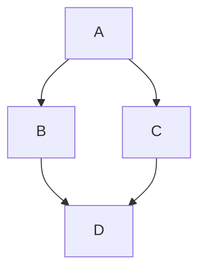


#### [时序图](https://mermaid.nodejs.cn/syntax/sequenceDiagram.html)

时序图是一种交互图，显示进程如何彼此运行以及以什么顺序运行.


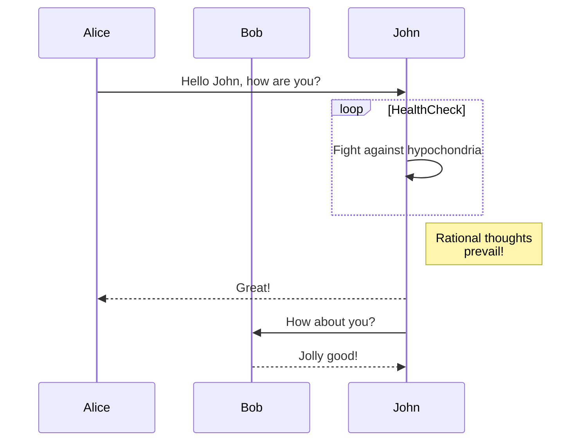


#### [类图](https://mermaid.nodejs.cn/syntax/classDiagram.html)

> "在软件工程中，统一建模语言（UML）中的类图是一种静态结构图，它通过显示系统的类、它们的属性、操作（或方法）以及对象之间的关系来描述系统的结构。"
>
> -Wikipedia

类图是面向对象建模的主要构建块。它用于应用结构的一般概念建模，以及将模型转换为编程代码的详细建模。类图也可用于数据建模。类图中的类表示主要元素、应用中的交互以及要编程的类。


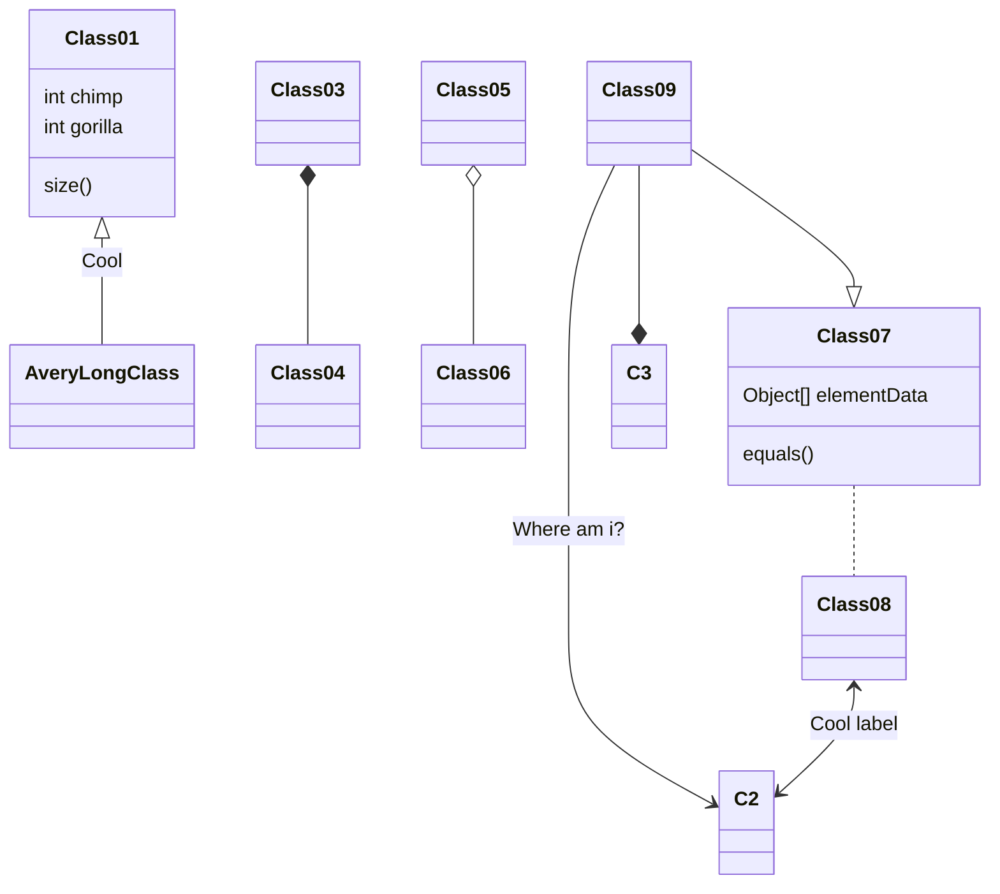


#### [状态图](https://mermaid.nodejs.cn/syntax/stateDiagram.html)

> “状态图是计算机科学及相关字段中用于描述系统行为的一种图表。状态图要求所描述的系统由有限数量的状态组成；有时，情况确实如此，而有时这是一个合理的抽象。”维基百科

Mermaid 可以渲染状态图。该语法尝试与 plantUml 中使用的语法兼容，因为这将使用户更容易在 mermaid 和 plantUml 之间共享图表。


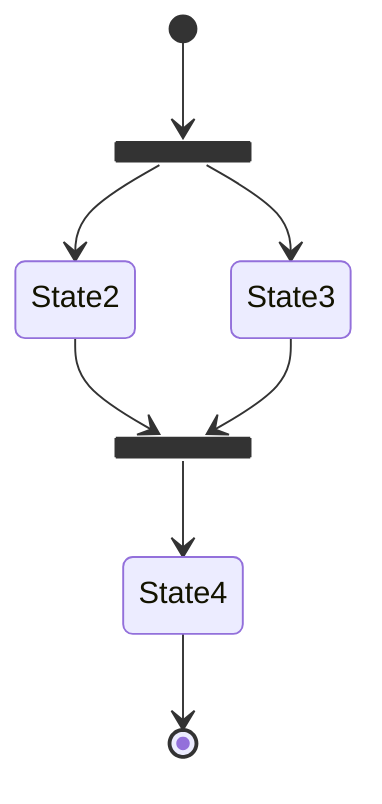


#### [实体关系图](https://mermaid.nodejs.cn/syntax/entityRelationshipDiagram.html)

> 实体关系模型（或 ER 模型）描述特定知识字段中相关的感兴趣的事物。基本 ER 模型由实体类型（对感兴趣的事物进行分类）组成，并指定实体（这些实体类型的实例）之间可以存在的关系 [维基百科](https://en.wikipedia.org/wiki/Entity–relationship_model)。

请注意，ER 建模的实践者几乎总是将实体类型简称为实体。例如，`CUSTOMER` 实体类型将简称为 `CUSTOMER` 实体。这种情况很常见，不建议做任何其他事情，但从技术上讲，实体是实体类型的抽象实例，这就是 ER 图所示的内容 - 抽象实例以及它们之间的关系。这就是为什么实体总是使用单数名词来命名。

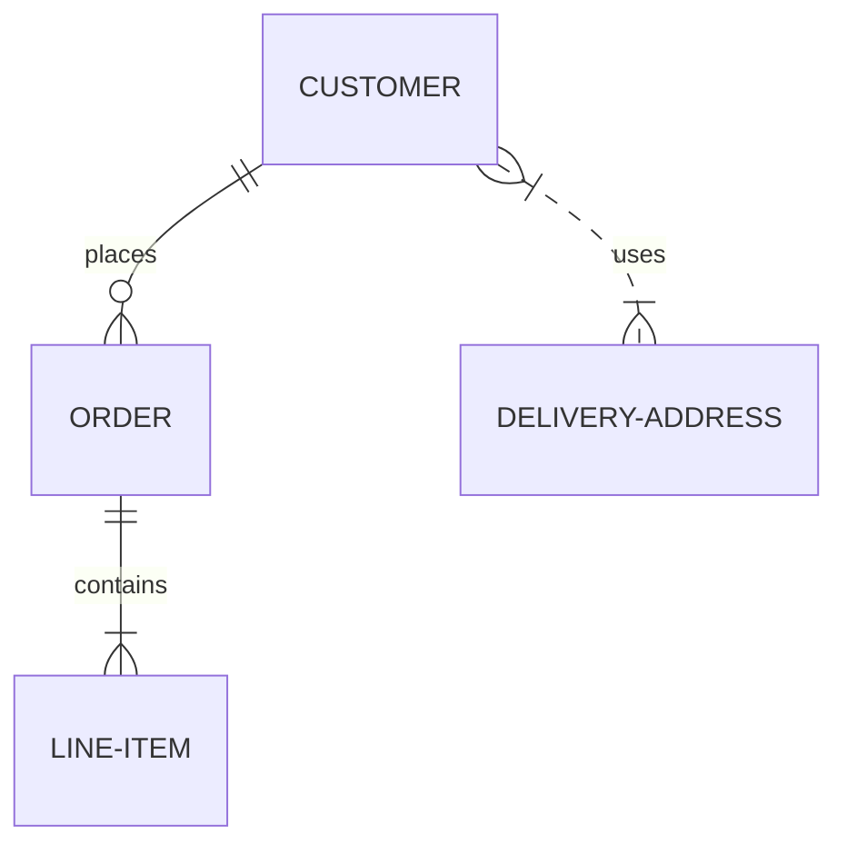


#### [用户旅程图](https://mermaid.nodejs.cn/syntax/userJourney.html)

用户旅程高度详细地描述了不同用户在系统、应用或网站内完成特定任务所采取的步骤。该技术显示当前（原样）用户工作流程，并揭示未来工作流程的改进字段。（维基百科）

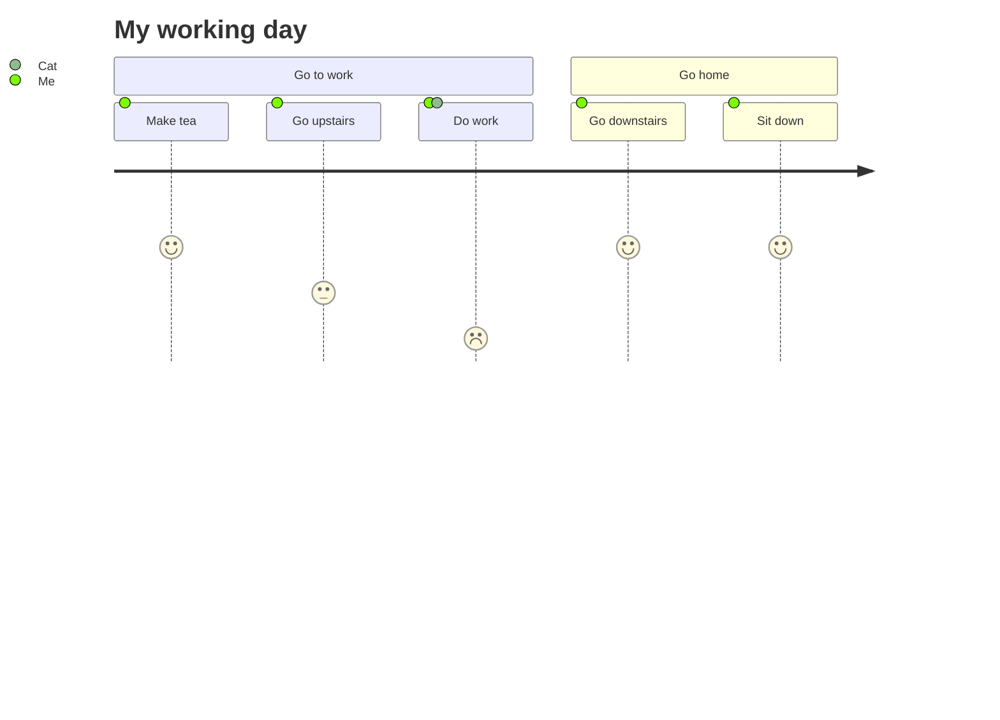


#### [甘特图](https://mermaid.nodejs.cn/syntax/gantt.html)

甘特图是一种柱状图，最初由 Karol Adamiecki 于 1896 年开发，并由 Henry Gantt 在 1910 年代独立开发，它说明了项目进度表以及任何一个项目完成所需的时间。甘特图显示了项目的终端元素和摘要元素的开始日期和完成日期之间的天数


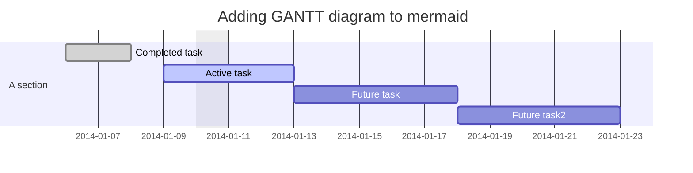


#### [饼图](https://mermaid.nodejs.cn/syntax/pie.html)

饼图（或圆形图）是一种圆形统计图形，将其划分为多个切片以说明数字比例。在饼图中，每个切片的弧长（及其中心角和面积）与其表示的数量成正比。虽然它因其类似于切片的馅饼而得名，但它的渲染方式却有多种变化。已知最早的饼图通常归功于 William Playfair 于 1801 年发布的统计手册 - 维基百科

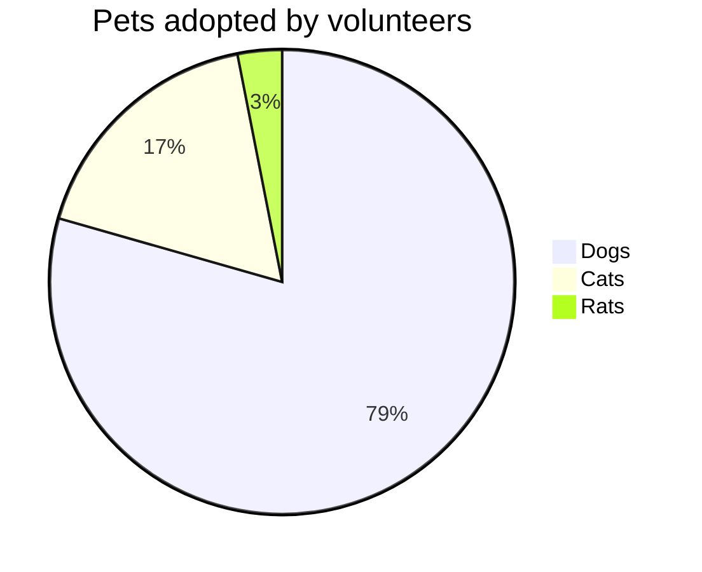


#### [象限图](https://mermaid.nodejs.cn/syntax/quadrantChart.html)

象限图是分为四个象限的数据的直观表示。它用于在二维网格上绘制数据点，其中一个变量表示在 x 轴上，另一个变量表示在 y 轴上。象限是通过根据一组特定于所分析数据的标准将图表分为四个相等部分来确定的。象限图通常用于识别数据的模式和趋势，并根据图表中数据点的位置确定操作的优先级。它们通常用于商业、营销和风险管理等字段。


#### [需求图](https://mermaid.nodejs.cn/syntax/requirementDiagram.html)

需求图提供了需求及其相互之间以及其他记录元素之间的联系的可视化。建模规范遵循 SysML v1.6 定义的规范。

> 语法：
>
> 需求图包含三种类型的组件：要求、要素和关系。
>
> 用于定义每个的语法定义如下。尖括号中表示的单词（例如 `<word>`）是枚举关键字，其选项在表格中详细说明。`user_defined_...` 用于任何需要用户输入的地方。
>
> 关于用户文本的重要说明：所有输入都可以用引号引起来，也可以不用引号引起来。例如，`Id: "here is an example"` 和 `Id: here is an example` 都有效。但是，用户必须小心未加引号的输入。如果检测到另一个关键字，解析器将失败。

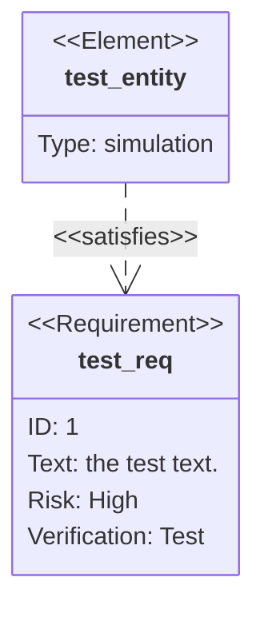


#### [GitGraph(Git)图](https://mermaid.nodejs.cn/syntax/gitgraph.html)

> Git 图表是各个分支上 git 提交和 git 操作（命令）的图形表示。

此类图表对于开发者和 DevOps 团队分享他们的 Git 分支策略特别有帮助。例如，它可以更轻松地可视化 git flow 的工作原理。

在 Mermaid 中，我们支持基本的 git 操作，例如：

- commit ：代表当前分支上的新提交。
- 分支 ：创建并切换到新分支，将其设置为当前分支。
- checkout ：签出现有分支并将其设置为当前分支。
- merge ：将现有分支合并到当前分支。

借助这些关键的 git 命令，你将能够非常轻松快速地在 Mermaid 中绘制 gitgraph。实体名称通常是大写的，尽管对此没有公认的标准，并且在 Mermaid 中也没有要求。

注意：`checkout` 和 `switch` 可以互换使用。


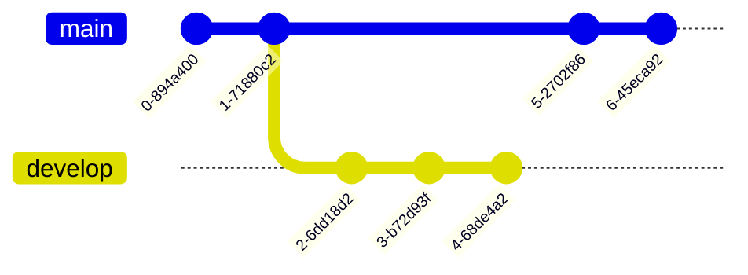


#### [C4图](https://mermaid.nodejs.cn/syntax/c4.html)


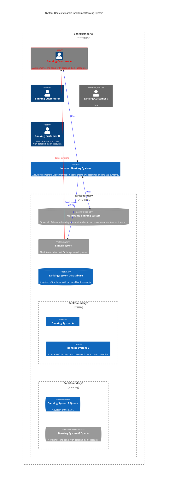


#### [思维导图](https://mermaid.nodejs.cn/syntax/mindmap.html)

> 思维导图：这是目前的实验图。语法和属性可能会在未来版本中更改。除了图标集成是实验部分之外，语法是稳定的。

“思维导图是一种图表，用于将信息直观地组织成层次结构，显示整体各个部分之间的关系。它通常是围绕一个概念创建的，在空白页面的中心绘制为图片，并在其中添加相关的想法表示，例如图片、单词和单词的一部分。主要思想与中心概念直接相关，而其他思想则从这些主要思想中分支出来。”维基百科

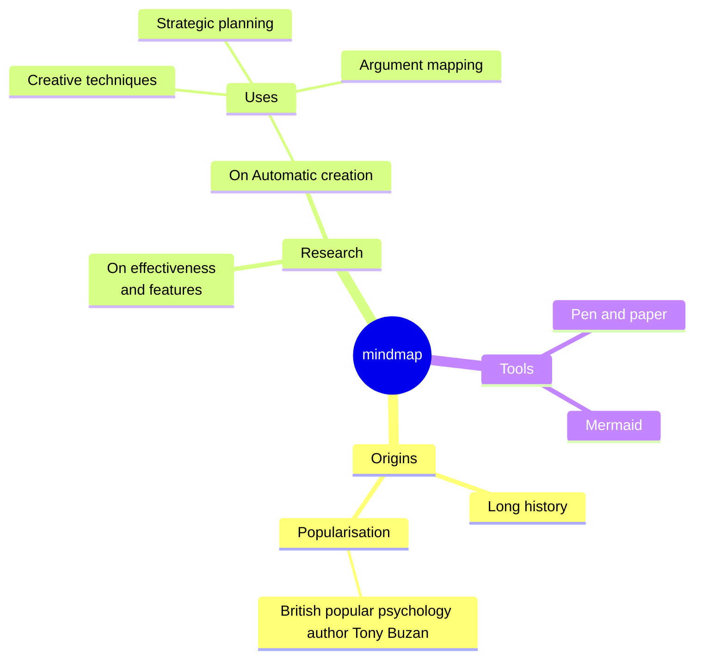


#### [时间线](https://mermaid.nodejs.cn/syntax/timeline.html)

> 时间线：这是目前的实验图。语法和属性可能会在未来版本中更改。除了图标集成是实验部分之外，语法是稳定的。

“时间线是一种图表，用于说明事件、日期或时间段的年表。它通常以图形方式渲染以指示时间的流逝，并且通常按时间顺序组织。基本时间线按时间顺序渲染事件列表，通常使用日期作为标记。时间线还可以用来展示事件之间的关系，比如一个人一生中的事件之间的关系”[（维基百科）](https://en.wikipedia.org/wiki/Timeline).

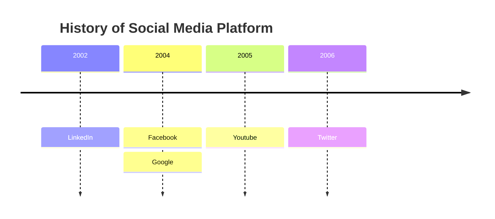


#### [ZenUML](https://mermaid.nodejs.cn/syntax/zenuml.html)

> 时序图是一种交互图，显示进程如何彼此运行以及以什么顺序运行。

Mermaid 可以使用 [ZenUML](https://zenuml.com/) 渲染时序图。请注意，ZenUML 使用与 mermaid 中原始时序图不同的语法。

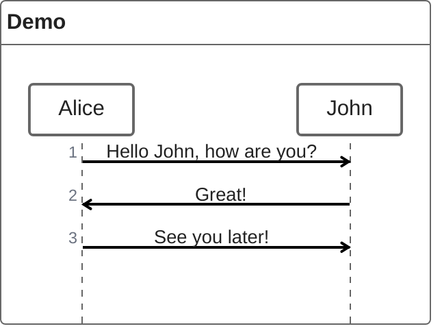


#### [桑葚图](https://mermaid.nodejs.cn/syntax/sankey.html)

> 桑基图是一种可视化，用于描述从一组值到另一组值的流动。

> [!WARNING]
>
> 这是一个实验图表。它的语法非常接近纯 CSV，但它将在不久的将来得到扩展。


连接的事物称为节点，连接称为链接。


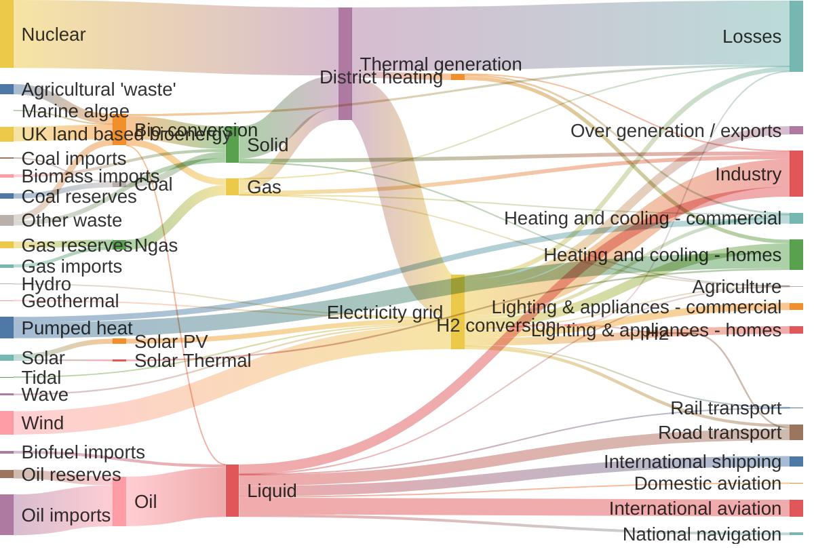


#### [XY图](https://mermaid.nodejs.cn/syntax/xyChart.html)

> 在 mermaid-js 的上下文中，XY 图是一个综合图表模块，包含利用 x 轴和 y 轴进行数据表示的各种类型的图表。目前，它包括两种基本图表类型：柱状图和折线图。这些图表旨在直观地显示和分析涉及两个数值变量的数据。

> 值得注意的是，虽然 mermaid-js 当前的实现包含这两种图表类型，但该框架被设计为动态且适应性强的。因此，它具有将来扩展和包含其他图表类型的能力。这意味着用户可以在 XY 图模块中期待一套不断发展的图表选项，以满足随着时间的推移引入新图表类型的各种数据可视化需求。

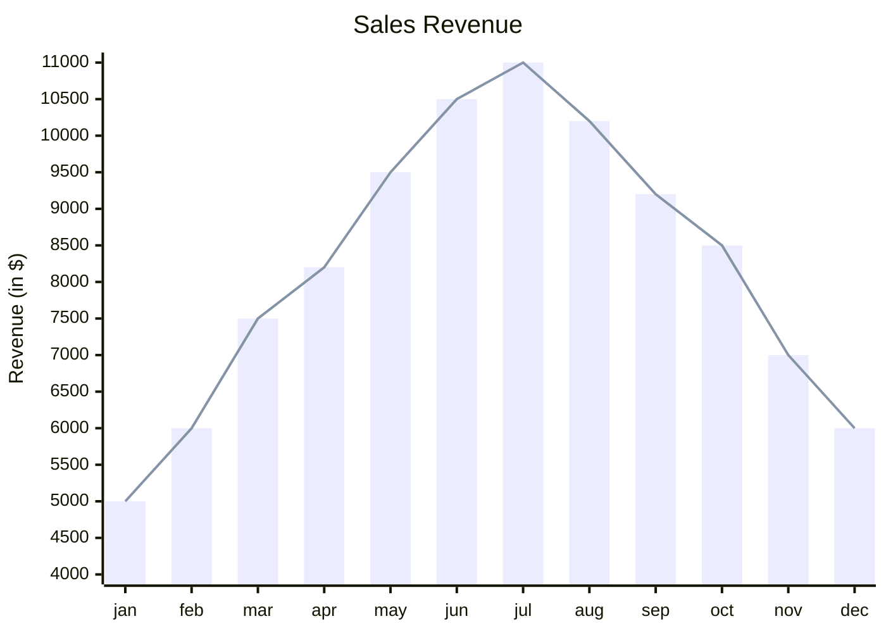


#### [框图](https://mermaid.nodejs.cn/syntax/block.html)

> ### 定义和目的
>
> 框图是一种直观、有效的方式来直观地表示复杂的系统、流程或架构。它们由块和连接器组成，其中块代表基本组件或功能，连接器显示这些组件之间的关系或流程。这种图表方法在工程、软件开发和流程管理等各个字段都至关重要。
>
> 框图的主要目的是提供系统的高级视图，以便轻松理解和分析，而无需深入研究每个组件的复杂细节。这使得它们对于简化复杂系统以及解释系统内组件的整体结构和交互特别有用。
>
> 许多人使用 Mermaid 流程图来达到此目的。这样做的副作用是自动布局有时会将形状移动到图表制作者不想要的位置。框图使用不同的方法。在此图中，我们让作者完全控制形状的放置位置。
>
> ### 一般用例
>
> 框图在各个行业和学科中都有广泛的应用。一些关键用例包括：
>
> - 软件架构：在软件开发中，框图可用于说明软件应用的体系结构。这包括显示不同模块或服务如何交互、数据流和高级组件交互。
> - 网络图：框图非常适合表示 IT 和电信中的网络架构。它们可以描述不同的网络设备和服务如何互连，包括路由、交换机、防火墙以及网络上的数据流。
> - 工艺流程图：在商业和制造中，可以使用框图来创建流程图。这些流程图代表业务或制造流程的各个阶段，有助于可视化步骤顺序、决策点和控制流程。
> - 电气系统：工程师使用框图来表示电气系统和电路。它们可以说明电气系统的高级结构、不同电气组件之间的相互作用以及电流的流动。
> - 教育目的：框图也广泛用于教育材料中，以简化的方式解释复杂的概念和系统。它们有助于分解和可视化科学理论、工程原理和技术系统。
>
> 这些示例展示了框图在提供复杂系统的清晰简洁表示方面的多功能性。它们的简单性和清晰度使它们成为各个字段的专业人士有效交流复杂想法的宝贵工具。
>
> 在以下部分中，我们将深入研究使用 Mermaid 创建和操作框图的细节，涵盖从基本语法到高级配置和样式的所有内容。
>
> 使用 Mermaid 创建框图非常简单且易于访问。

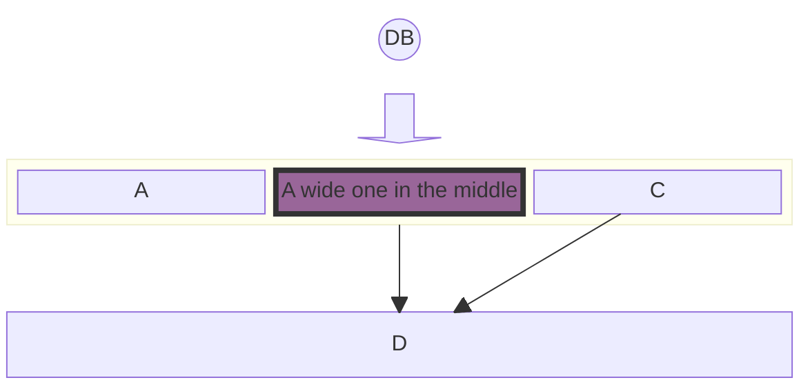


#### [数据包图](https://mermaid.nodejs.cn/syntax/packet.html)


数据包图是用于说明网络数据包的结构和内容的可视化表示。网络数据包是通过网络传输的数据的基本单位。

## 

这种图表类型对于需要以清晰简洁的方式表示网络数据包结构的开发者、网络工程师、教育工作者和学生特别有用。


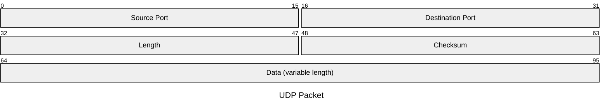


#### [KanBan](https://mermaid.nodejs.cn/syntax/kanban.html)

Mermaid 的看板图允许你创建在工作流程的不同阶段移动的任务的可视化表示。本指南根据提供的示例解释了如何使用看板图语法。


#### [架构图](https://mermaid.nodejs.cn/syntax/architecture.html) 

在 mermaid-js 的上下文中，架构图用于显示云或 CI/CD 部署中常见的服务和资源之间的关系。在架构图中，服务（节点）通过边连接。相关服务可以放在组中，以更好地说明它们的组织方式。


```mermaid
architecture-beta
    group api(cloud)[API]

    service db(database)[Database] in api
    service disk1(disk)[Storage] in api
    service disk2(disk)[Storage] in api
    service server(server)[Server] in api

    db:L -- R:server
    disk1:T -- B:server
    disk2:T -- B:db

```


### 7. HTML

You can use HTML to style content what pure Markdown does not support. For example, use `<span style="color:red">this text is red</span>` to add text with red color.

#### Embed Contents

Some websites provide iframe-based embed code which you can also paste into Typora. For example:

```markdown
<iframe height='265' scrolling='no' title='Fancy Animated SVG Menu' src='http://codepen.io/jeangontijo/embed/OxVywj/?height=265&theme-id=0&default-tab=css,result&embed-version=2' frameborder='no' allowtransparency='true' allowfullscreen='true' style='width: 100%;'></iframe>
```

#### Video

You can use the `<video>` HTML tag to embed videos. For example:

```Markdown
<video src="xxx.mp4" />
```

#### Other HTML Support

You can find more details [here](https://support.typora.io/HTML/).


