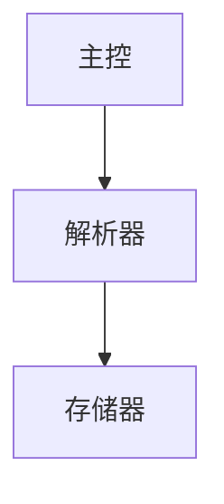

## C/C++ 代码规范与文档规范（完整版）

本规范适用于项目内所有 C/C++ 代码，旨在统一风格、提升可读性与可维护性。建议配合 `clang-format`、`Doxygen` 等工具落地。

---

## 一、代码规范

### 1.1 命名规范

| 类别                 | 规则                                                      | 示例                                                 |
| :------------------- | :-------------------------------------------------------- | :--------------------------------------------------- |
| **类名 / 结构体名**  | 大驼峰（PascalCase）                                      | `class FileManager`, `struct ConfigNode`             |
| **函数名**           | 小驼峰（camelCase）或下划线（snake_case），**全项目统一** | `readData()` 或 `read_data()`                        |
| **变量名**           | 与函数名规则相同（推荐下划线）                            | `int file_count;`                                    |
| **成员变量（私有）** | 下划线风格 + 后置 `_`（可选）或前置 `m_`                  | `int count_;` 或 `m_count`                           |
| **常量 / 宏**        | 全大写 + 下划线                                           | `const int MAX_SIZE = 1024;`<br>`#define PI 3.14159` |
| **枚举值**           | 全大写 + 下划线（或前缀风格统一）                         | `enum Color { COLOR_RED, COLOR_GREEN };`             |
| **命名空间**         | 小写 + 下划线（或全小写）                                 | `namespace my_lib`, `namespace base_utils`           |
| **源文件 / 头文件**  | 小写 + 下划线                                             | `config_parser.cpp`, `file_utils.h`                  |
| **测试文件**         | 原文件名 `_test` 后缀                                     | `config_parser_test.cpp`                             |

> 📌 **优先级原则**：本地可读性 > 跨平台一致性。下划线风格在 Linux 生态更常见，小驼峰在 Windows 较多，选定后使用 `clang-format` 保证统一。

### 1.2 注释规范

#### 文件头注释（每个 .h/.cpp 必备）

```cpp
/**
 * @file    file_name.h
 * @author  作者名 <邮箱> (或团队名)
 * @date    2026-06-10
 * @brief   本文件实现/声明了哪些核心功能（一句话）
 * @version 1.0
 */
```

#### 类注释（放在类定义前）

```cpp
/**
 * @brief   类简要说明，例如“负责解析 JSON 配置文件”。
 * @details 详细描述（可选）：线程安全性、使用注意事项、示例代码。
 */
class ConfigParser { ... };
```

#### 复杂函数注释（参数、返回值、异常）

```cpp
/**
 * @brief   解析文件并填充内部数据结构。
 * @param   file_path 配置文件路径（绝对或相对）。
 * @param   mode      解析模式，0=快速模式，1=严格模式。
 * @return  true 解析成功，false 失败（文件不存在或格式错误）。
 * @throw   std::runtime_error 当内存不足时抛出。
 */
bool parseFile(const std::string& file_path, int mode);
```

#### 行内注释（仅必要处）

- 解释“为什么这么做”，而非“做了什么”。
- 复杂算法、边界条件必须注释。

### 1.3 代码格式（基于 clang-format）

使用 `.clang-format` 配置文件（推荐 Google 风格，根据项目微调）：

```yaml
BasedOnStyle: Google
IndentWidth: 2
ColumnLimit: 80
AllowShortFunctionsOnASingleLine: Inline
BreakBeforeBraces: Attach
```

**统一要求：**
- 缩进：2 或 4 空格（禁止 Tab）
- 行宽：≤ 80 或 ≤ 120（团队约定）
- 大括号：K&R 风格（左括号不换行）
- 指针/引用 `*` / `&` 紧跟类型：`int* ptr;`
- `#include` 顺序：当前类头、C库、C++库、第三方库、项目内头文件（每类按字母排序）


### 1.4 头文件与源文件职责划分

| 内容                                   | `.h` 头文件 |      `.c` 源文件      |
| -------------------------------------- | :---------: | :-------------------: |
| **结构体定义**`struct/typedef struct`  |  ✅ 放这里   |        ❌ 不放         |
| **宏常量**`#define PI 3.14`            |  ✅ 放这里   |        ❌ 不放         |
| **枚举**`enum`                         |  ✅ 放这里   |        ❌ 不放         |
| **函数声明**`void foo(int x);`         |  ✅ 放这里   | ❌ 不放（除非 static） |
| **extern 变量声明**`extern int count;` |  ✅ 放这里   |        ❌ 不放         |
| **内联函数 / 模板**                    |   ✅放这里   |           ❌           |
| **函数实现**`void foo(int x) { ... }`  |   ❌ 不放    |       ✅ 放这里        |
| **全局变量定义**`int count = 0;`       |   ❌ 不放    |      ✅ 只放一处       |
| **static 变量/函数**                   |   ❌ 不放    | ✅ 放在使用它的 .c 里  |
| **类静态成员初始化**                   |   ❌ 不放    |       ✅ 放这里        |


```
遇到一段代码，问自己：
    │
    ├── 这是"声明/描述/公告"吗？ ──→ 放 .h
    │
    └── 这是"实现/定义/干活"吗？ ──→ 放 .c
```

#### 具体判断流程

```
是 struct/enum/typedef 吗？
    └── 是 → 放 .h

是函数吗？
    ├── 只有声明（带分号，无花括号）→ 放 .h
    └── 有实现（有花括号）        → 放 .c

是变量吗？
    ├── 带 extern（只声明，不分配内存）→ 放 .h
    └── 不带 extern（分配内存）      → 放 .c（且只放一处）

是 static 吗？
    └── 只在本文件用 → 放 .c
```

---

####  常见错误

| 错误做法                       | 后果                               | 正确做法                              |
| :----------------------------- | :--------------------------------- | :------------------------------------ |
| 在 `.h` 里写函数实现           | 多重定义链接错误                   | 声明放 `.h`，实现放 `.c`              |
| 在 `.h` 里定义全局变量         | 多个文件包含 → 重定义              | `.h` 里用 `extern` 声明，`.c` 里定义  |
| 在多个 `.c` 里定义同名全局变量 | 链接冲突                           | 只在一个 `.c` 里定义，其他用 `extern` |
| `static` 函数写在 `.h` 里      | 每个包含它的 `.c` 都有一份独立副本 | 只在需要它的 `.c` 里定义              |


---

## 二、文档规范

### 2.1 项目级文档：`README.md`（必须）

```markdown
# 项目名称

一句话简介。

## 目录结构
简要说明核心目录。

## 编译与运行
### 依赖
- CMake ≥ 3.10
- OpenSSL …

### 构建步骤
```bash
mkdir build && cd build
cmake .. -DCMAKE_BUILD_TYPE=Release
make -j4
```

### 运行示例
```bash
./bin/demo --help
```

## 架构图
（Mermaid 或 ASCII 图）


## 核心模块说明
- 模块A：功能简述，详见 `docs/module_a.md`
- 模块B：…

## 测试
```bash
ctest
```

## 常见问题（FAQ）


### 2.2 核心模块文档

两种方式任选或并存：

#### 方式一：独立 Markdown（推荐大型模块）

- 位置：`docs/` 目录下，文件名与模块名对应，如 `config_parser.md`
- 内容：模块概述、设计思路、接口说明、使用示例、依赖关系图

#### 方式二：Doxygen 生成

- 在头文件中按 1.2 注释规范写好 Doxygen 格式注释
- 项目根目录提供 `Doxyfile`（可用 `doxygen -g` 生成）
- 启用：`EXTRACT_ALL = YES`, `JAVADOC_AUTOBRIEF = YES`
- 输出：HTML 或 PDF，放在 `docs/html/`

> 📌 推荐**二者结合**：README 总览 + Doxygen 生成 API 文档 + 核心模块单独写架构设计.md。

---

## 三、工具链集成建议

| 目的 | 工具 | 配置建议 |
| :--- | :--- | :--- |
| 自动格式化 | `clang-format` | 提交前运行 `git-clang-format` |
| 静态检查 | `clang-tidy` | 合并前 CI 检查 |
| API 文档生成 | `Doxygen` | CI 自动生成并发布到 GitHub Pages |
| 拼写检查 | `codespell` | 检查注释中的拼写错误 |

---

## 四、文件与目录组织（推荐）

```cpp
project/
├── .clang-format
├── .clang-tidy
├── CMakeLists.txt
├── README.md
├── CONTRIBUTING.md
├── src/               # 源代码
│   ├── module_a/
│   │   ├── parser.cpp
│   │   └── parser.h
│   └── main.cpp
├── include/           # 公开头文件
│   └── project/...
├── docs/              # 文档
│   ├── api/           # Doxygen 输出
│   ├── architecture.md
│   └── module_details.md
├── tests/             # 单元测试
│   └── parser_test.cpp
└── examples/          # 示例代码
    └── demo.cpp
```

---

## 五、示例汇总（快速参考）

```cpp
/**
 * @file    math_utils.h
 * @author  dev@example.com
 * @brief   数学辅助函数声明。
 * @date    2026-06-10
 */

#ifndef MATH_UTILS_H
#define MATH_UTILS_H

/**
 * @brief 计算两个整数的最大公约数（GCD）。
 * @param a 第一个整数（非负）
 * @param b 第二个整数（非负）
 * @return 二者的最大公约数
 * @throw  std::invalid_argument 当两者同时为 0 时抛出
 */
int gcd(int a, int b);

#endif // MATH_UTILS_H
```

对应的 `math_utils.cpp` 需包含相同注释（简要版）或仅实现。

---

**本规范即日起生效，所有新增代码必须遵循，存量代码逐步迁移。**  
如有争议，以 `clang-format` 自动格式化的结果为准。