编译原理期末快考试了，所以在复习过程中做了一些笔记；主要参考的是*编译原理第三版-张素琴-王原生* 这本书，还有一些B站的视频，链接放在下面：

> [编译原理-期末不挂（习题速成）_哔哩哔哩_bilibili](https://www.bilibili.com/video/BV1pi421f7sB/?spm_id_from=333.1387.homepage.video_card.click&vd_source=df3e26a691d84ad8881a8e4eb1c6e243)
>
> [编译原理期末速成_哔哩哔哩_bilibili](https://www.bilibili.com/video/BV1hD4y1H72n?spm_id_from=333.788.videopod.episodes&vd_source=df3e26a691d84ad8881a8e4eb1c6e243)
>
> [【编译原理不挂科】【速成学习】知识点重现&大题秒杀模板，考试不挂科，学会就得分，分分钟带你走近编译原理_哔哩哔哩_bilibili](https://www.bilibili.com/video/BV1Ar4y1M7vG?spm_id_from=333.788.videopod.episodes&vd_source=df3e26a691d84ad8881a8e4eb1c6e243)
>
> [【武汉大学】编译原理混子速成——面向期末试卷复习：全集_哔哩哔哩_bilibili](https://www.bilibili.com/video/BV1SB4y1S7Sc?spm_id_from=333.788.videopod.episodes&vd_source=df3e26a691d84ad8881a8e4eb1c6e243)
>
> [东北大学编译原理符号表部分讲解——张俐老师_哔哩哔哩_bilibili](https://www.bilibili.com/video/BV18B4y1S7Tx/?spm_id_from=333.1391.0.0&vd_source=df3e26a691d84ad8881a8e4eb1c6e243)
>
> 参考的文件：[NiuTrans/compiler-notes](https://github.com/NiuTrans/compiler-notes)
>
> 参考MOOC资源：
>
> 1. [编译原理-期末复习资料（学霸笔记）_中国大学MOOC(慕课)](https://www.icourse163.org/learn/kaopei-1469305162?tid=1470637443#/learn/announce)
> 2. [编译原理_中国大学MOOC(慕课)](https://www.icourse163.org/learn/NEU-1003735010?tid=1207032207#/learn/announce)

# 编译原理-期末预习

> - 编译原理概念，每一步骤的作用干啥了前端后端
> - 词法分析部分：BNF，正则式等概念，自动机DFA NFA 确定化，简化，含有空串边ε的转化(简单的_子集构造法，复杂的_ε闭包算法)  自动机>正则式转化  
> - 语法分析部分：文法，语言等概念，由给定的句型或语言进行语法树绘制_找短语简单短语句柄，判断二义性_画俩语法树_优先级-结合性的二义性， 等价文法_直接左递归处理_公式_改写 ，**FIRST集FOLLOW集 SELECT集 LL（1）分析表**，LL(1)  简单优先没时间就别看了  **LR(0) _可归前缀图_构造矩阵**
> - 符号表_数组-记录型_复杂的内部表示会画，几种中间代码-逆波兰式_三元式_**四元式**  优化前优化后的四元式能写出，中间代码优化-对应的VVL表_二元组写出，前两种优化_   

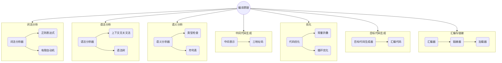


# 第一章 引论

**翻译程序**：将一种计算机编程语言所编写的程序（源程序）翻译成与之等价的另外一种计算机语言的程序（目标程序），完成这个翻译工作的程序称为翻译程序。编译程序、解释程序、汇编程序均被认为是翻译程序。

**编译程序**：源程序语言是高级语言，目标程序语言是汇编语言或机器语言之类的低级语言，这样的翻译程序称为编译程序。

**解释程序**：在词法、语法、语义分析方面与编译程序的工作原理基本相同，但在执行过程中不产生目标程序，而是直接解释执行源程序或源程序的内部形式（中间代码），即边解释边执行。

**汇编程序**：源程序语言是汇编语言，输出目标程序语言是机器语言，这样的翻译程序称为汇编程序。

$\\$

----

# 第二章 文法和语言

> 
>
> 阐明语法的一个工具是文法，本章节介绍文法和语言的概念，重点讨论上下文无关文法及其句型分析中的有关问题。
>
> 

定义：文法 $G$ 定义为四元组（$V_N$，$V_T$，$P$，$S$）

> $V_N$ :  非终结符集（语法实体-变量）
>
> $V_T$ ： 终结符集
>
> $P$ ： 规则（$\alpha \to \beta$ )的集合
>
> $S$ ： 识别符或开始符

设$G[S]$是一个文法，如果符号串 $x$ 是从识别符号推导出来的，即有$S \overset\ast\Rightarrow x$ ，则称$x$ 是文法$G[S]$的*句型*，若$x$仅由终结符组成，即$S \overset\ast\Rightarrow x$ ,$x\in V_T$ ，则$x$为$G[S]$的*句子*。文法$G$所产生的语言定义为集合$L[G]$*语言*，文法描述的语言是该文法一切句子的集合。

乔姆斯基对文法类型分类：$4$种，$0$型，$1$型，$2$型，$3$型

> $0$型文法，短语文法，任何$0$型语言都是可递归可枚举的
>
> $1$型文法，上下文有关，每个产生式$\alpha\to\beta$，$|\beta|\geqslant\ |\alpha|$ ，仅$S\to\epsilon$除外。
>
> $2$型文法，上下文无关，每一个产生式$\alpha\to\beta$ 满足：$\alpha \in V_N$，$\beta \in (V_N \cup V_T)^*$ ，(形式：$A \to \beta$)
>
> $3$型文法，正规文法，每一个产生式形式为$A \to \alpha\beta 或者 A\to\alpha$ ，其中$A$和$B$都$\in V_N$，$\alpha \in V_T^*$,

四种文法类型的定义是逐渐增加限制的，因此每一种正规文法都是上下文无关的，每一种上下文无关文法是上下文有关的，而每一种上下文有关文法都是0型文法。一种文法产生相对应的语言。  $\\$$\newline$

## 2.5上下文无关文法及其语法树

语法树（推导树-语法分析树）

| ---      | ---                               |
| -------- | --------------------------------- |
| 最左推导 | 最右推导(规范推导) $\to$ 规范句型 |

一个文法存在某个句子对应两棵不同的语法树，这个语法是*二义的*。

> 上下文无关语言每一个文法都是二义的，才说此语言是二义的

不存在一个算法，在有限的步骤内确切判定任给的一个文法是否为二义的，为构造无二义性文法，寻找一组充分条件。

## 2.6 句型的分析

| ---                                  | ---                                |
| ------------------------------------ | ---------------------------------- |
| 自上而下的分析(选择正确的右部去替换) | 自下而上的分析(选择正确的可归约串) |

> $G$ 是一个文法，$S$ 是文法的开始符号，$\alpha \beta \delta$ 是文法 $G$ 的一个句型，如果有 $S \overset \ast \to \alpha A \beta$ 且 $A \overset + \Rightarrow \beta$ ，称 $\beta$ 是句型 $\alpha \beta \delta$ 相对于 $A$ 的**短语**。

> 如果有 $A \Rightarrow \beta$ ，则称 $\beta$ 是句型 $\alpha \beta \delta $ 相对于规则 $A \to \beta$ 的**直接短语**（简单短语）。

> 一个右句型的直接短语称为该句型的**句柄**。（句柄只适用于右句型）。

### *求一个句型的短语、简单短语、句柄*

`画出句型的语法树`

> **短语**：看有子节点的结点，一个节点的所有叶节点的组合；
>
> **直接短语**：一个结点它的子节点就是叶节点，所有满足这个的短语。
>
> **句柄**：最左直接短语。

:memo:  

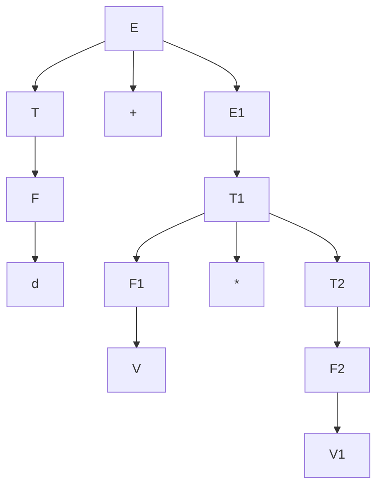

> 短语：d+V$*$V1，d，V$*$V1，V，V1
>
> 直接短语：d，V，V1
>
> 句柄：d

:memo:

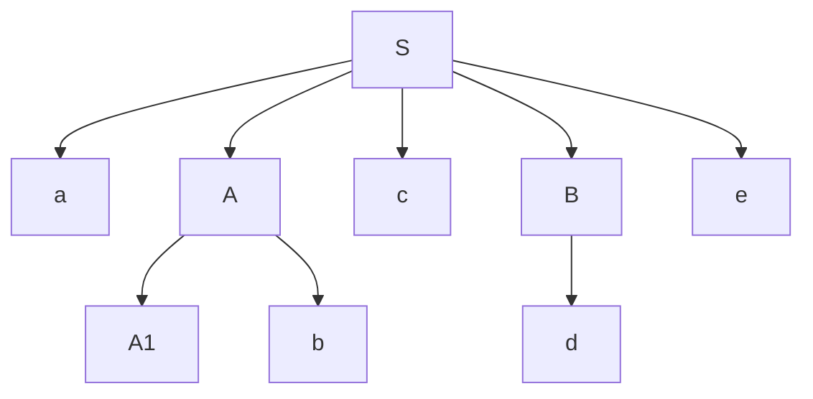

> 短语：aA1bcde、A1b、d
>
> 直接短语：A1b、d
>
> 句柄：A1b

:memo:

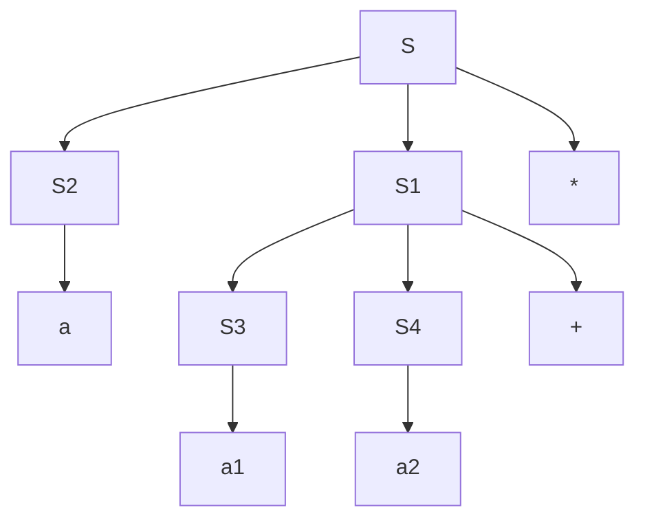

> 短语：a，a1， a2， a1a2 $+$，   a a1 a2$+*$
>
> 直接短语：a ，a1， a2
>
> 句柄：a

$\\$

## 2.7 有关文法的实际应用说明

应限制文法不得含有 $\space$ *有害规则*[^1] $\space$ 和 $\space$ *多余规则*[^2]$\space$ 。

[^1]: $U \to U$ 
[^2]: 非终结符不可到达的$/$ 不可终止的。

$\\$

----

# 第三章 词法分析

> 
>
> 词法分析是编译的第一个阶段,它的主要任务是从左至右逐个字符地对源程序进行扫描,产生一个个单词序列,用于语法分析。执行词法分析的程序称为词法分析程序或扫描程序。本章讨论词法分析程序的设计原则、单词的描述技术、识别机制及词法分析程序的自动构造原理。
>
> 

## 3.1 词法分析程序设计

> 从左至右逐个字符对源程序进行扫描，产生单词序列，用于语法分析

词法分析中扫描的单词符号一般有5类：(1)关键字；(2)标识符；(3)常数；(4)运算符；(5)界符。

作用：获得有意义的单词符号：$ \to$ 二元式（单词种别码，单词自身的值）

```markdown
词法分析程序中如何识别有意义的单词？
主要依据*词法规则描述* 
词法规则描述的工具有：状态转换图、扩展巴斯克范式(EBNF)、有限状态自动机、正规表达式、正规文法。
```

<br>

## 3.3 正规文法和正规式的等价性


## 3.4 有穷自动机

| DFA---确定的有穷自动机        | NFA---不确定的有穷自动机         |
| ----------------------------- | -------------------------------- |
| Deterministic Finite Automata | Nondeterministic Finite Automata |

```markdown
有几个问题：NFA的确定化；DFA的化简。。。
```

DFA：$M = (K,\Sigma,f,S,Z)$ 

> $K$ ，有穷状态集
>
> $\Sigma$  ，有穷字母表(输入符号表)
>
> $f$  ，转换函数，$K \times \Sigma \to K$ , 
>
> $S$  ， $S\in K $, 唯一初态 
>
> $Z$  ，$Z \subseteq K$ ，终态集（可接受/结束状态）

初态结点 ：$\Rightarrow $ Ⓢ   或 标记 $-$     终态结点用双圆圈表示-◎ 或者 标记$+$

NFA：$M = (K,\Sigma,f,S,Z)$  $f,K \times\Sigma^* \to 2^k$ ，$S\subseteq K$，非空初态集。

==NFA确定化 $\Rightarrow$ DFA==

**子集法**：DFA中的每一个状态对应NFA的一组状态

```markdown
定义状态集合 *I* 的两个运算 ：
1. 状态集合*I* 的$\epsilon - clousure(I)$ ,定义为一个状态集，是状态集*I*中的任何状态S经任意条$\epsilon$弧而能到达的状态集合。
2.状态集合I的a弧转换,表示为move(I,a),定义为状态集合J,其中J是所有那些可从I中的某一状态经过一条a弧而到达的状态的全体。
```

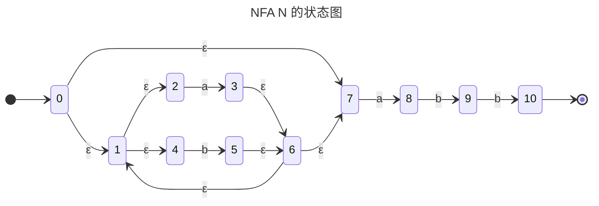

:memo: 

$\epsilon$-closure(0) = {0，1，2，4，7}，即{0,1,2,4,7}中的任一状态都是从状态0经任意条 $\epsilon$ 弧可到达的状态， 令{0,1,2,4,7}=A，则move(A,a)={3,8}，因为状态0,1,2,4,7中，只有状态2和7有a弧射出，分别到达状态3和8.  而 $\epsilon-closure$({3,8})={1,2,3,4,6,7,8}。

```c
// 子集构造算法
开始,令e-closure(K0)为C中唯一成员,并且它是未被标
记的。
While(C中存在尚未被标记的子集T)do
{ 标记T;
	for 每个输入字母a do
		{U := e-closure (Move(T,a));
			if U不在C中 then
				将U作为未被标记的子集加在C中
        }
}
```

```markdown
使用子集构造算法对上图NFA N构造子集：
1. 首先计算e-closure(0),令T0=e-closure(0)={0,1,2,4,7},T。未被标记,它现在是子集族C的唯一成员。
2. 标记T0;令T1=e-closure(move(To,a))={1,2,3,4,6,7,8},将T1加入C中,T1未被标记。
令T2=E-closure(move(To,b))={1,2,4,5,6,7},将T2加入C中,它未被标记。
3. 标记T1;计算e-closure(move(T1,a)),结果为{1,2,3,4,6,7,8},即T1,T1已在C中。
计算e-closure(move(T1,b)),结果为{1,2,4,5,6,7,9},令其为T3,加至C中,它未被标记。
4. 标记T2,计算e-closure(move(T2,a)),结果为{1,2,3,4,6,7,8},即T1,T1已在C中。
计算e-closure(move(T2,b)),结果为{1,2,4,5,6,7},即T2,T2已在C中。
5. 标记T3,计算e-closure(move(T3,a)),结果为{1,2,3,4,6,7,8},即T1。
计算e-closure(move(T3,b)),结果为{1,2,4,5,6,7,10},令其为T1,加入C中,T1未被标记。
6. 标记T4,计算e-closure(move(T(,a)),结果为{1,2,3,4,6,7,8},即T1。
计算e-closure(move(T4,b)),结果为{1,2,4,5,6,7},即T2。
至此,算法终止,共构造了5个子集:
    To={0,1,2,4,7}
    T1={1,2,3,4,6,7,8}
    T2={1,2,4,5,6,7}
    T3={1,2,4,5,6,7,9}
    T4={1,2,4,5,6,7,10}
NFA N 构造的DFA M如下：
1. S={[T0],[T1],[T2],[T3],[T4]}
2. Σ={a,b}
3. 	D([To],a)=[T1]
	D([To],b)=[T2]
	D([T1],a)=[T1]
	D([T1],b)=[T3]
	D([T2],a)=[T1]
	D([T2],b)=[T2]
	D([T3],a)=[T1]
	D([T3],b)=[T4]
	D([T4],a)=[T1]
	D([T4],b)=[T2]
4.	S0=[T0]
(5) S1=[T4]
为便于书写,将[To]、[T1]、[T2]、[T3]、[T4]重新命名,用0、1、2、3、4分别表示,该DFA 的状态转换图如下：
```

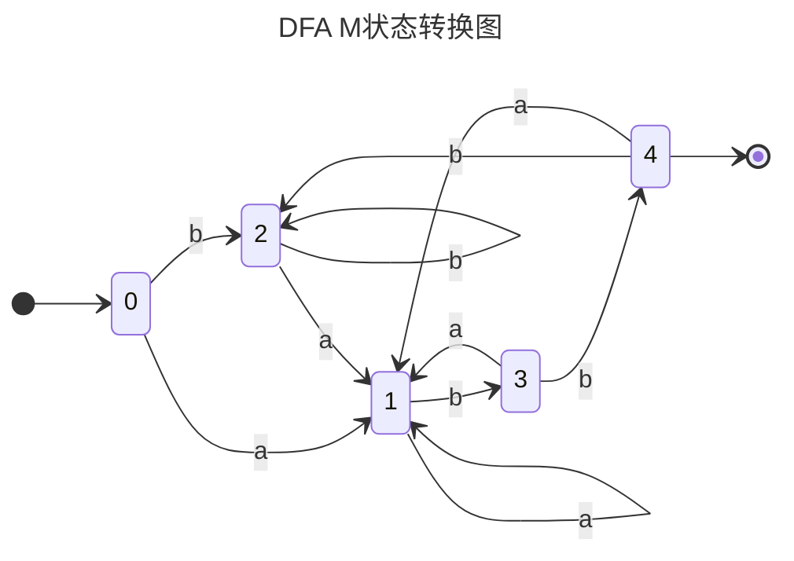


 ==DFA的化简== 最小化

> 没有多余状态--状态中没有两个是相互等价的

FA的无用状态：从自动机开始状态出发，任何输入串也不能到达此状态，或者从这个状态没有通路到达终态。

FA中两个状态s和t等价的条件是：

1. 一致性条件--状态s和t必须同时为可接受状态或不可接受状态
2. 蔓延性条件--对于所有输入符号，状态s和状态t必须转换到等价的状态里。

**分割法**：把DFA状态分为一些不相交的子集，任何不同的两个子集的状态都是可区别的，同一子集中的任何两个状态都是等价的。

:memo: 将下图的DFA M最小化

```markdown

1. 首先将M的状态分成两个子集：一个由终态(可接受态)组成，一个由非终态组成;划分为P0=({1,2,3,4},{5,6,7});这两个子集中的状态不会等价。
2. 第一个子集{1,2,3,4},在读入输入符号a后,状态3和4分别转换为第1个子集中所含的状态1和4,而1和2分别转换为第2个子集中所含的状态6和7,这就意味着{1,2}中的任何状态和{3,4}中的任何状态在读入a后为不等价的状态,因此{1,2}中的任何状态与{3,4}中的任何状态都是可区别的,因此得到了新的划分如下:
	P1=({1,2}{3,4}{5,6,7})
```

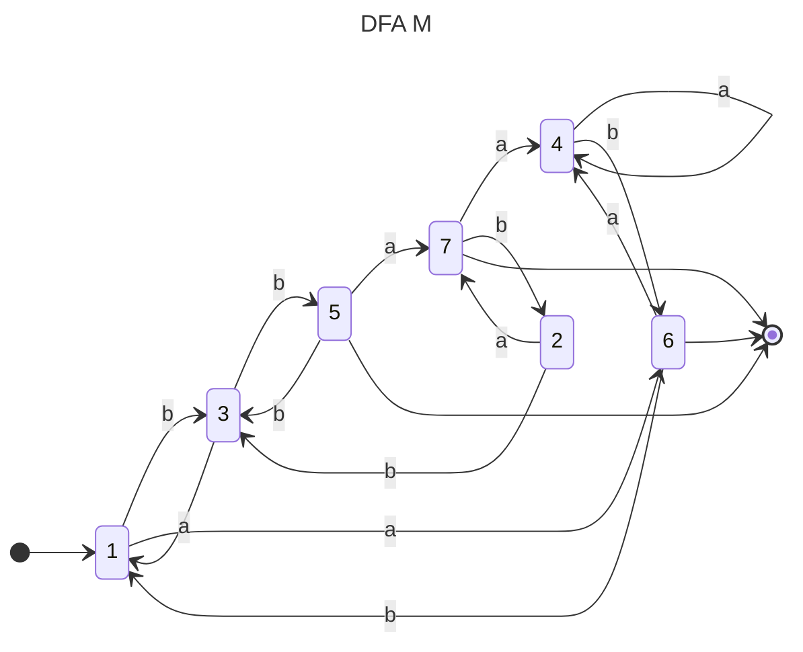

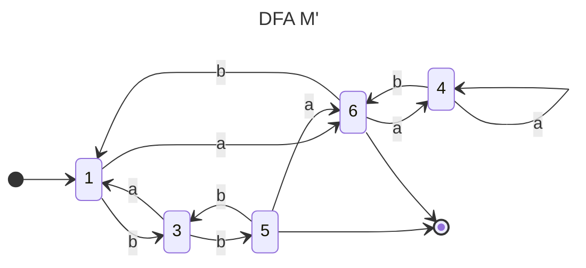

$\\$

## 3.5 正规式和FA的等价性

一、对于 $\Sigma$ 上的 $NFA \space M$ ，可以构造一个 $\Sigma$ 上的正规式 $r$ 

 ```mermaid
 stateDiagram-v2
 	direction LR
 	1 --> 2: r1 
 	2 --> 3: r2
 ```

 `转换为：`

 ```mermaid
 stateDiagram-v2
 	direction LR
 	1 --> 3:r1r2
 ```

---

 ```mermaid
 stateDiagram-v2
 	direction LR
 	1 --> 2:r1
 	1 --> 2:r2
 ```

 `转换为:`

 ```mermaid
 stateDiagram-v2
 	direction LR
 	1 --> 2:r1|r2
 ```

---

 ```mermaid
 stateDiagram-v2
 	Direction LR
 	1 --> 2:r1
 	2 --> 2:r2
 	2 --> 3:r3
 ```

 `转换为:`

 ```mermaid
 stateDiagram-v2
 	direction LR
 	1 --> 3:r1r2*r3
 ```

---

 > 弧上的标记为所求的正规式 $r$ 

 :memo: *$\epsilon$ 使用 e 替代*

 ```mermaid
 ---
 title: (a)
 ---
 stateDiagram-v2
 	direction LR
 	x --> 0:e
 	0 --> 0:a,b
 	0 --> 1:b
 	0 --> 3:a
 	1 --> 2:b
 	3 --> 4:a
 	2 --> 2:a,b
 	4 --> 4:a,b
 	4 --> y:e
 	2 --> y:e
 	y -->[*]
 	2 -->[*]
 	4 -->[*]
 ```

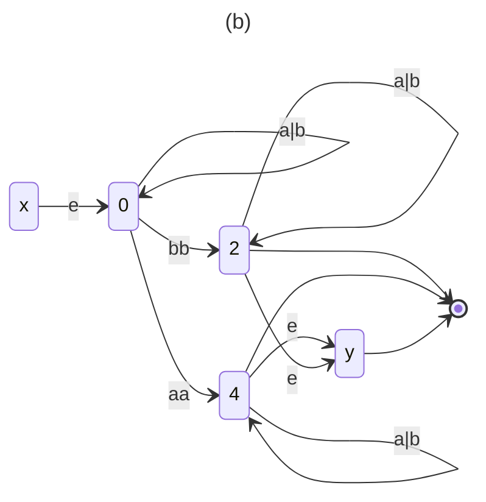

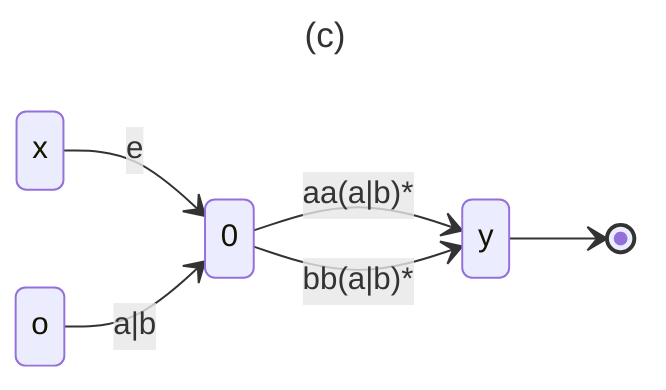

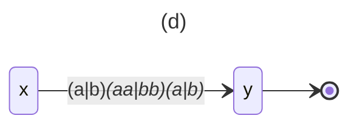


二、从 $\Sigma$ 上的一个正规式 $r$ 构造 $\Sigma$ 上的一个 $NFA\space M$ 

> (1) 为 $\phi$ 、$\epsilon$ 和 $a$ 构造 $NFA$ 为
>
 ```mermaid 
 ---
 title: 空串
 ---
 
 stateDiagram-v2
 	direction LR
 	[*] --> x
     y --> [*]
 ```

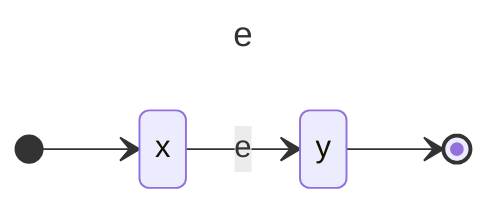

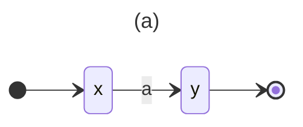

(2) 若 $s,t$ 为 $\Sigma$ 上的正规式，相应的 $NFA$ 分别为 $N(s)$ 和 $N(t)$

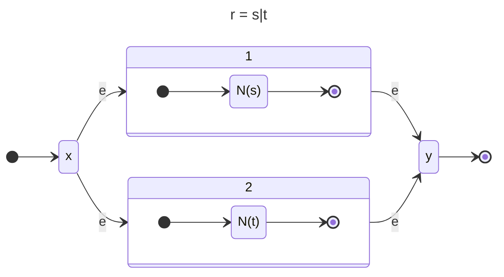

$r = st$


$r=s^*$ 


:memo: 为 $r=(a|b)^*abb$ 构造 $NFA\space N$ 

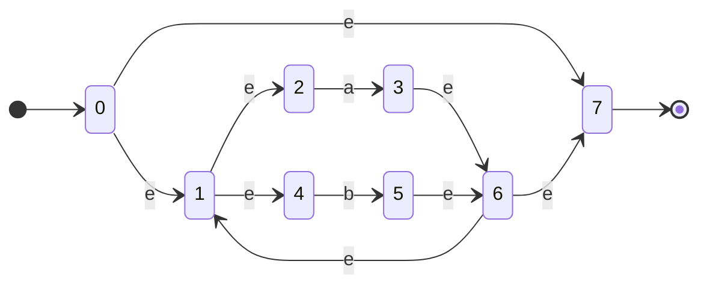

## 3.6 正规文法和FA的等价性

正规文法 $G \Rightarrow NFA \space M$ 

(1)  $G$ 的开始符号 $S$ 是 $M$ 的开始状态 $S$ 

(2)  增加一个新状态 $Z$ 作为 $M$ 的终态  当有 letter $\to \epsilon$ 时 指向终态

(3)  对 $G$ 中形如 $A \to tB$ ，构造 $M$ 的转换函数 $f(A,t)=B$

(4)  对 $G$ 中形如 $A \to t$ ，构造 $f(A,t)=Z$ ，$Z$ 为终态

(5)  $M$ 的字母表与 $G$ 的终结符集相同；$G$ 的非终结符对应 $M$ 的状态 

:memo: 与文法 $G(S)$ 等价的 $NFA \space M$ 

$G(S): \space S \to aA \quad S \to bB \quad S \to \epsilon \quad A \to aB \\  A \to bA \quad B \to aS \quad B \to bA \quad B \to \epsilon$  

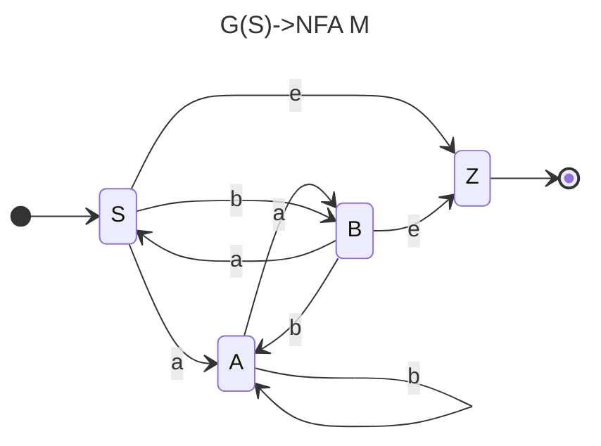

:black_medium_small_square: 与下面 $NFA$ 等价的正规文法 $G$ 

$G={(A,B,C,D),{a,b},P,A}$  ，其中 $P$ 为：

$A \to aB \quad C \to \epsilon \quad A \to bD \quad D \to aB \\ B \to bC \quad D \to bD \quad C \to aA \quad D \to \epsilon \quad C \to bD$

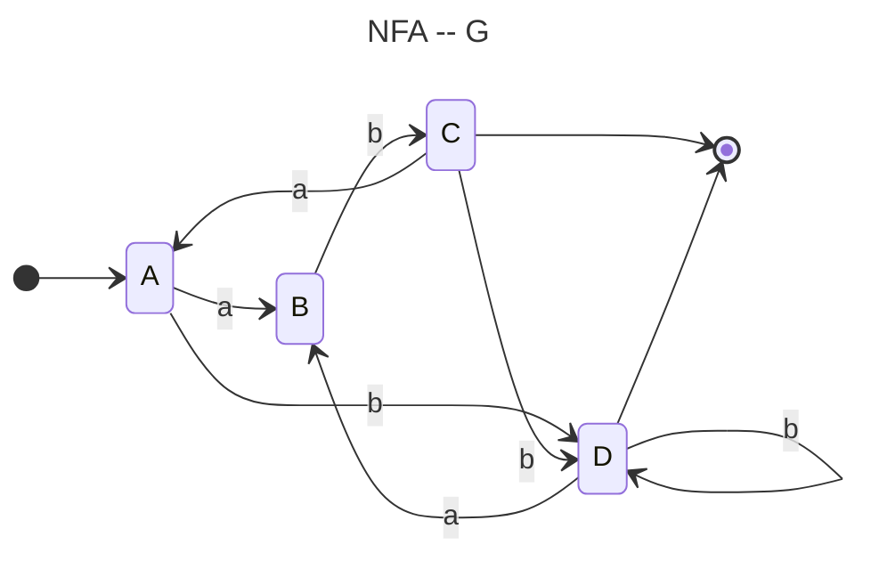

<br> <br>

----

<br><br><br>

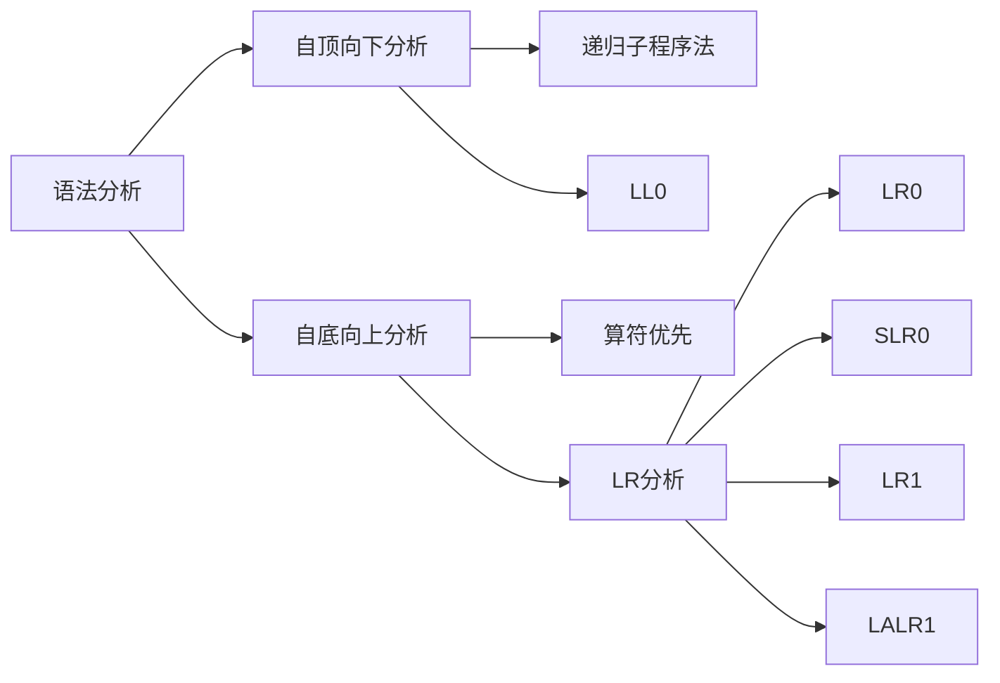

语法分析是编译程序的核心部分。语法分析的作用是识别由词法分析给出的单词符号串是否是给定文法的正确句子(程序)。语法分析常用的方法可分为自顶向下分析和自底向上分析两大类。虽然语法分析可以通过确定分析或者不确定分析来实现,但在实际的编译器构造中,几乎都是采用确定分析方式,不确定分析仅具有理论价值。</br>

本章主要介绍自顶向下的确定分析。在第5、6章中,分别介绍两种确定的自底向上分析方法:算符优先分析1和LR分析。这些分析方法各有优缺点,但都是迄今编译程序构造的实用方法。


# 第四章 自顶向下语法分析

自顶向下分析方法也称面向目标的分析方法,也就是从文法的开始符号出发企图推导出与输入的单词符号串完全相匹配的句子,若输入串是给定文法的句子,则必能推出,反之必然出错。自顶向下的确定分析方法需对文法有一定的限制,但由于实现方法简单、直观,便于手工构造或自动生成语法分析器,因而仍是目前常用的方法之一。而自顶向下的不确定分析方法是带回溯的分析方法,这种方法实际上是一种穷举的试探方法,效率低,代价高,因而极少使用.

## 4.1 确定的自顶向下分析思想 

(1)     设 $G=(V_T,V_N,P,S)$ 是上下文无关文法。$FIRST(a)={\alpha|\alpha \overset * \Rightarrow a\beta,~~~a,\beta \in V^* }$ ；若 $\alpha \in \epsilon$ ，则规定 $\epsilon \in FIRST(\alpha)$ 。称 $FIRST(\alpha)$ 为 $\alpha$ 的**开始符号集**或**首符号集**。

(2)     设 $G=(V_T,V_N,P,S)$ 是上下文无关文法。$A\in V^N$，$S$ 是开始符号，$FOLLOW(A)=\{a|S \overset * \Rightarrow \mu A \beta \quad  a\in V_T,a\in FIRST(\beta),\mu \in V_T ^* ,\beta \in V^+\}$ 若 $S \overset * \Rightarrow \mu A \beta,\;\beta \overset * \Rightarrow \epsilon,$ 则 $\# \in FOLLOW(A)$ 。 $S$为开始符号，#为输入串的结束符(输入串括号)

 **后跟符号的集合--$FOLLOW(A)$**

(3)  一个产生式的**选择符号集**--$SELECT$ ，给定上下文无关文法的产生式 $A \to \alpha$ ，$A\in V_N,\alpha \in V^*$，若 $\alpha \overset * \nRightarrow$ ，则 $SELECT(A\to \alpha)=FIRST(\alpha)$。

如果 $\alpha \overset * \Rightarrow \epsilon, ~SELECT(A \to \alpha)=(FIRST(\alpha)-\{\epsilon\})\cup FOLLOW(A)$ 。

(4）  一个上下文无关文法是 $LL(1)$ 文法的充要条件，对每个非终结符 $A$ 的两个不同产生式，$A \to \alpha , A\to \beta,$ 满足：$SELECT(A \to \alpha) \cap SELECT(A \to \beta) = \empty$ ，其中 $\alpha、\beta$ 不同时 $\overset * \Rightarrow \epsilon $  

由此， $LL(1)$ 文法是能够使用确定的自顶向下分析技术的。

```markdown
LL(1)的含义是：
1. 第一个L表明自顶向下分析是从左到右扫描输入串
2. 第二个L表明分析过程中将用最左推导
“1”表明只需向右看一个符号便可决定如何推导(选择哪个产生式规则进行推导)
```

## 4.2 LL(1)文法的判别

`计算FIRST、FOLLOW、SELECT集`

**判断LL(1)文法的步骤**：

第一步，求出能推出 $\epsilon$ 的非终结符

第二步，计算FIRST集

- 若 $X \in V_T$ ，则 $FIRST(X) = \{X\}$ .

-  若 $X \in V_N$ ，且有产生式 $X \to a...,a \in V_T$，则 $a \in FIRST(X)$.

- 若 $X \in V_N$ ，$X \to \epsilon$ ，则 $\epsilon \in FIRST(X)$ .

- 若 $X，Y_1,Y_2,...,Y_n \in V_N$，而有产生式 $X \to Y_1,Y_2,...,Y_n$ 。当 $Y_1,Y_2,...,Y_(i-1) \overset * \Rightarrow \epsilon$ 时($1 \leqslant i \leqslant n$)，则 $FIRST(Y_1)-\{\epsilon\},FIRST(Y_2)-\{\epsilon\},...,FIRST(Y_(i-1))-\{\epsilon\},FIRST(Y_i)$都包含在 $FIRST(X)$ 中。

  > 此点意思是，看X产生式，由左向右看，只有前面的产生了 $\epsilon$ 才继续向后看，是这么个意思。 

- 当 上一点中 所有 $Y_i \overset * \Rightarrow \epsilon,(i=1,2,...,n)$，则 $FIRST(X)=FIRST(Y_i) \cup FIRST(Y_2) \cup ... \cup FIRST(Y_n) \cup \{\epsilon \} $

第三步，计算FOLLOW集

- $S$ 为文法的开始符号，把 {$\#$}加入 $FOLLOW(S)$ 中 这里#为句子括号
- 若 $A \to \alpha B \beta$ 是一个产生式，则把 $FIRST(\beta)$ 的非空元素加入 $FOLLOW(B)$ 中；如果 $\beta \overset * \Rightarrow \epsilon$ 则把 $FOLLOW(A)$ 也加入到 $FOLLOW(B)$ 中。。

第四步，计算SELECT集

- 一般是，$SELECT(A \to \alpha)=FIRST(\alpha)$ 
- 若 $\alpha \overset * \Rightarrow \epsilon$ 则 $SELECT(A\to \alpha)=(FIRST(\alpha)-\{\epsilon\})\cup FOLLOW(A)$ 

第五步，由SELECT结果，可求相同左部产生式的SELECT集的交集是否为 $\empty$ ，都为 $\empty$ 时，才为LL(1)文法。

>  :memo:
>
>  文法 $G[S]$ 为 $S\to AB \quad S \to bC \quad A\to\epsilon \quad A\to b \quad B\to\epsilon \\ B\to aD \quad C\to AD \quad C\to b \quad D\to aS \quad D\to c$
>
>  (1) $S \overset * \Rightarrow \epsilon \quad A \overset * \Rightarrow \epsilon \quad B \overset * \Rightarrow \epsilon \quad C \overset * \nRightarrow \epsilon \quad D \overset * \nRightarrow \epsilon $ 
>
>  (2) 求FIRST集：
>
>  (3) 求各非终结符FOLLOW集：
>
>  $FOLLOW(S)=\{\#\}\cup FOLLOW(D)=\{\#\}$
>
>   $ FOLLOW(A) =(FIRST(B)-\{\epsilon\})\cup FOLLOW(S) \cup FIRST(D)=\{a,\#,c\} $
>
>  $ FOLLOW(B)=FOLLOW(S)=\{\#\} $
>
>  $ FOLLOW(C)= FOLLOW(S)=\{\#\} $
>
>  $ FOLLOW(D)=FOLLOW(B)\cup FOLLOW(C)=\{\#\}$
>
>  (4)  求SELECT集：
>
>  $SELECT(S\to AB)=(FIRST(AB)-\{\epsilon\})\cup FOLLOW(S)=\{b,a,\#\}$
>
>  $SELECT(S\to bC)=FIRST(bC)=\{b\}$
>
>  $SELECT(A\to \epsilon)=(FIRST(\epsilon)-\{\epsilon\})\cup FOLLOW(A)=\{c,a,\#\}$
>
>  $SELECT(A\to b)=FIRST(b)=\{b\}$
>
>  $SELECT(B\to \epsilon)=(FIRST(\epsilon)-\{\epsilon\})\cup FOLLOW(B)=\{\#\}$
>
>  $SELECT(B\to aD)=FIRST(aD)=\{a\}$
>
>  $SELECT(C\to AD)=FIRST(AD)=\{b,a,c\}$
>
>  $SELECT(C\to b)=FIRST(b)=\{b\}$
>
>  $SELECT(D\to aS)=FIRST(aS)=\{a\}$
>
>  $SELECT(D\to c)=FIRST(c)=\{c\}$
>
>  (5) 由以上计算结果，得相同做不产生式的SELECT交集为：
>
>  $SELECT(S\to AB)\cap SELECT(S\to bC)=\{b,a,\#\}\cap \{b\}=\{b\} \neq \empty$
>
>  $SELECT(A\to \epsilon)\cap SELECT(A\to b)=\{a,c,\#\}\cap \{b\} = \empty$
>
>  $SELECT(B\to \epsilon)\cap SELECT(B\to aD)=\{\#\}\cap \{a\} = \empty$
>
>  $SELECT(C\to AD)\cap SELECT(C\to b)=\{b,a,c\}\cap \{b\}=\{b\} \neq \empty$
>
>  $SELECT(D\to aS)\cap SELECT(D\to c)=\{a\}\cap \{c\}=\empty$
>
>  由LL(1)文法定义得 该文发不是LL(1)文法，因为S和C的相同左部 其产生式的SELECT集的交集不是 $\empty$ .

<br>

## 4.3 某些非LL(1)文法到LL(1)文法的等价交换

**`含有直接或间接左递归，含有左公共因子`**

一、**提取左公共因子**：

> $A\to \alpha\beta_1|\alpha\beta_2|...|\alpha\beta_n$
>
> $A \to \alpha(\beta_1|\beta_2|...|\beta_n)$
>
> $A\to aA'$        $A'\to\beta_1|\beta_2|...|\beta_n$

(1) 不一定每个文法的左公共因子都能在有限的步骤内替换成无左公共因子的文法

(2) 一个文法提取了左公共因子后，只解决了相同左部产生式右部FIRST集不相交的问题。当改写后的文法不含空产生式，且无左递归时，则改写后的文法是LL(1)文法，若还有空产生式时，则还需要LL(1)文法的判别方式进行判断才能确定是否为LL(1)文法。

二、**消除左递归**：

> $A\to A\beta,A\in V_N.\beta \in V^*$     直接左递归  (1)
>
> $A\to B\beta ~~ B\to A\alpha ~~A,B\in V_N,~ \alpha,\beta\in V^*$    间接左递归 (2)

(1)  $A\to A\alpha_1|A\alpha_2|...|A\alpha_m|\beta_1|\beta_2|...|\beta_n$

$\Rightarrow A\to\beta_1A'|\beta_2A'|...|\beta_nA'$      $\Rightarrow A'\to\alpha_1A'|\alpha_2A'|...|\alpha_mA'|\epsilon$ 

(2) 先通过产生式非终结符置换，将间接左递归变为直接左递归

:memo: 文法 $G \quad A\to aB ~~A\to Bb~~B\to Ac~~B\to d$ 

$\Rightarrow B \to aBc ~~~ B\to Bbc ~~~ B\to d $ 

$\Rightarrow B\to aBcB'|dB' \quad B'\to bcB'|\epsilon$ 

$\Rightarrow A\to aB ~~A\to Bb \quad B\to aBcB'|dB' \quad B'\to bcB'|\epsilon$

三、消除文法中一切左递归(要求不含回路、无 $A\to \overset + \Rightarrow A$推导)

```markdown
算法步骤:
1. 把文法的所有非终结符按某一顺序排序；
2. 消除 3. 去掉无用产生式。
```

> :memo: 如下文法：
>
> $(1)S\to Qc|c \quad (2)Q\to Rb|b \quad (3)R\to Sa|a$
>
> 若非终结符排序为：$S、Q、R$ ,左部为S的产生式(1)无直接左递归，左部为Q的产生式(2)中右部不含S,所以把产生式(1)的右部代入产生式(3)得： 
>
> $(4) R\to Qca|ca|a$  再将产生式(2)的右部代入产生式(4)得  ：$(5) R\to Rbca|bca|ca|a$    
>
> 对产生式(5)消除直接左递归得： $R\to bcaR'|caR'|aR'\quad R'\to bcaR'| \epsilon$  
>
> 最终文法为：$S\to Qc|c \quad Q\to Rb|b \quad R\to bcaR'|caR'|aR'\quad R'\to bcaR'| \epsilon$
>
> 当非终结符得排序不同时，最终结果的产生式形式不同，但他们是等价的。

<br>

## 4.4 不确定的自顶向下分析思想(带回溯)

> 不作详细解释
>
> 1. 由于相同左部的产生式的右部FIRST集交集不为空而引起回溯
> 2. 由于相同左部非终结符的右部存在能 $\overset * \Rightarrow \epsilon$ 的产生式，且该非终结符的FOLLOW集中含有其它产生式右部FIRST集的元素
> 3. 由于文法含有左递归而引起回溯

 <br>

## 4.5 LL(1)文法的实现

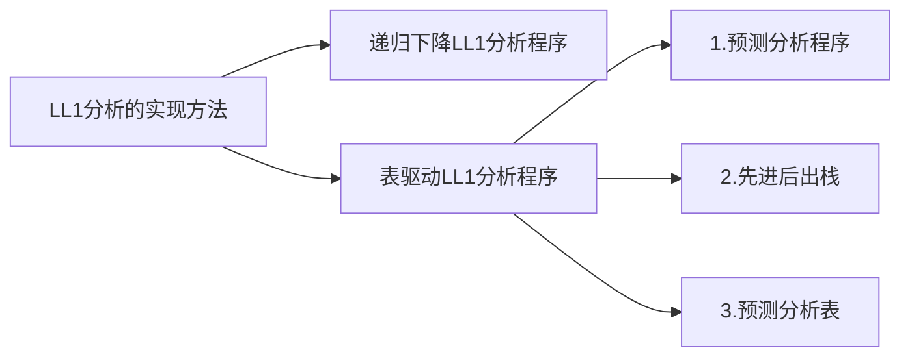

:memo: ==现以表达式文法为例构造预测分析表==

表达式文法： $E\to E+T|T \quad T\to T*F|F \quad F\to i|(E)$ 

构造步骤如下：

第一步，判断文法是否为LL(1)文法：

>  由于文法中含有左递归，所以必须先消除左递归，文法变为：
>
> $E\to TE' \quad E'\to+TE'|\epsilon \quad T\to FT' \quad F\to i|(E)$

(1) 可推出 $\epsilon$ 的非终结符表为：

| E    | E'   | T    | T'   | F    |
| ---- | ---- | ---- | ---- | ---- |
| 否   | 是   | 否   | 是   | 否   |

(2) 各非终结符的FIRST集合如下：

$\qquad \qquad FIRST(E)=\{(,i\} \\ FIRST(E')=\{+,\epsilon\} \\ FIRST(T)=\{(,i\} \\ FIRST(T')=\{*,\epsilon\} \\ FIRST(F)=\{(,i\}$

(3) 各非终结符的 FOLLOW 集合为：

$\quad \quad \quad FOLLOW(E)=\{),\#\} \\ FOLLOW(E')=\{),\#\} \\ FOLLOW(T)=\{*,\epsilon\} \\ FOLLOW(T')=\{+,),\#\} \\ FOLLOW(F)=\{*,+,),\#\}$

(4) 各产生式的 SELECT 集合为：

$SELECT(E\to TE')=\{(,i\}$

$SELECT(E'\to +TE')=\{+\}$

$SELECT(E'\to \epsilon)=\{),\#\}$

$SELECT(T\to FT')=\{(,i\}$

$SELECT(T'\to *FT')=\{*\}$

$SELECT(T'\to \epsilon)=\{+,),\#\}$

$SELECT(F\to (E))=\{(\}$

$SELECT(F\to i)=\{i\}$

由上可知，有相同左部产生式的SELECT集合的交集为空，所以文法是LL(1)文法。

第二步，构造预测分析表：

> 对每个终结符或’#‘号用 $a$ 表示。若 $a \in SELECT(A\to \alpha)$ ,则把 $A\to \alpha $ 放入 $M[A,a]$ 单元格中，把所有无定义的 $M[A,a]$ 标上出错标记；为了简化，产生式的左部可以不写，表中空白处为出错。

|      | $i$       | $+$           | $*$        | (         | )             | #              |
| ---- | --------- | ------------- | ---------- | --------- | ------------- | -------------- |
| E    | $\to TE'$ |               |            | $\to TE'$ |               |                |
| E'   |           | $\to+TE'$     |            |           | $\to\epsilon$ | $\to \epsilon$ |
| T    | $\to+FT'$ |               |            | $\to+FT'$ |               |                |
| T'   |           | $\to\epsilon$ | $\to *FT'$ |           | $\to\epsilon$ | $\to\epsilon$  |
| F    | $\to i$   |               |            | $\to (E)$ |               |                |

下面用预测分析程序、栈和预测分析表对输入串 $i+i*i\#$ 进行分析，栈的变化过程如下表：

| 步骤 | 分析栈     | 剩余输入串 | 推导所用产生式或匹配 |
| ---- | ---------- | ---------- | -------------------- |
| 1    | $\#E$      | $i+i*i\#$  | $E\to TE'$           |
| 2    | $\#E'T$    | $i+i*i\#$  | $T\to FT'$           |
| 3    | $\#E'T' F$ | $i+i*i\#$  | $F\to i$             |
| 4    | $\#E'T'i$  | $i+i*i\#$  | "$i$" 匹配           |
| 5    | $\#E'T'$   | $+i*i\#$   | $T'\to \epsilon$     |
| 6    | $\#E'$     | $+i*i\#$   | $E' \to +TE'$        |
| 7    | $\#E'T+$   | $ +i*i\#$  | "+"匹配              |
| 8    | $\#E'T$    | $i*i\#$    | $T\to FT'$           |
| 9    | $\#E'T' F$ | $i*i\#$    | $F\to i$             |
| 10   | $\#E'T' i$ | $i*i\#$    | "$i$"匹配            |
| 11   | $\#E'T'$   | $*i\#$     | $T'\to *FT'$         |
| 12   | $\#E'T'F*$ | $ *i\#$    | "*"匹配              |
| 13   | $\#E'T'F$  | $i\#$      | $F \to i$            |
| 14   | $\#E'T' i$ | $ i\# $    | "$i$ " 匹配          |
| 15   | $\#E'T'$   | $ \#$      | $T' \to \epsilon$    |
| 16   | $\#E'$     | $\#$       | $E' \to \epsilon$    |
| 17   | $\#$       | $\#$       | 接受                 |

<br>

## 4.6 LL(1)分析中的出错处理

> 报错、错误恢复
>
> (1) 应急恢复  (2) 短语层恢复

<br><br>

---

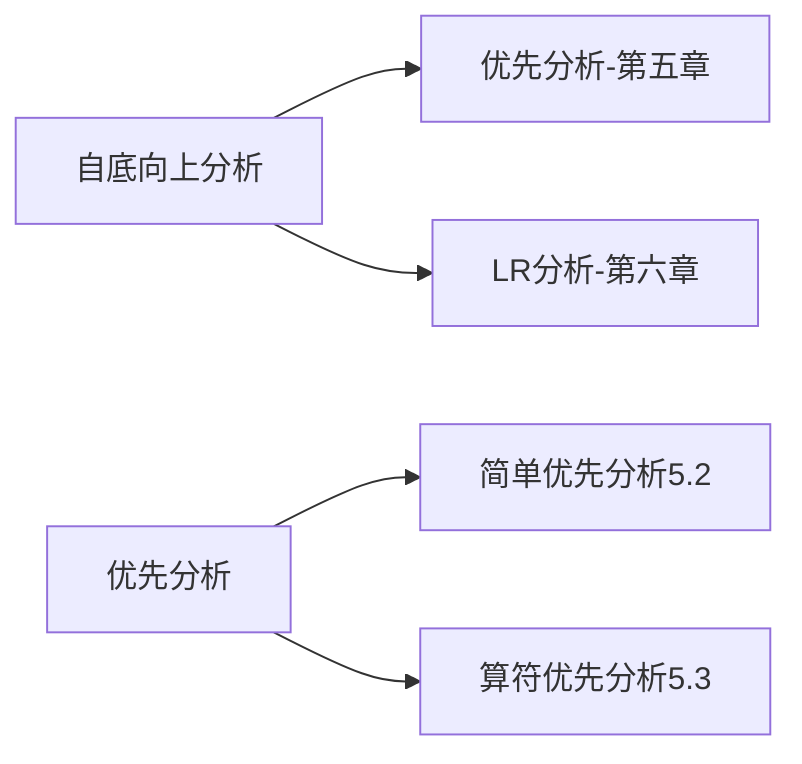

> 最右推导--规范推导         自左向右规约--规范规约
>
> 自底向上分析的移进-规约过程 为自顶向下最右推导的逆过程

> *简单优先分析*：文法中所有符号之间的优先关系，确定归约过程中句柄。【规范规约】-- 实用价值不大
>
> *算符(终结符)优先分析*：算符之间的优先关系，有可归约串就归约，不是规范规约--有一些用处

# 第五章 自底向上优先分析

> 自底向上分析,也称移进-归约分析,粗略地说它的实现思想是对输入符号串自左向右进行扫描,并将输入符逐个移入一个后进先出栈中,边移入边分析,一旦栈顶符号串形成某个句型的句柄或其他可归约串时(该句柄或可归约串对应某产生式的右部),就用该产生式的左部非终结符代替相应右部的文法符号串,这个行为称为一步归约。重复这一过程,直到归约至栈中只剩文法的开始符号时则为分析成功,也就确认了输入串是文法的句子。

`**分析过程中如何确定句柄或其它可归约串，就可确定何时进行归约**`

:memo: 对输入串 $abbbcde\#$ 进行分析，检查符号串是否符合 下面文法$G[S]$ 的句子。【使用移进--归约】

> $S\to aAcBe \quad A\to b \quad A\to Ab \quad B\to d$ 
>
> $S \Rightarrow aAcBe \Rightarrow aAcde\Rightarrow aAbcde \Rightarrow abbcde $ 

| 步骤 | 符号栈    | 输入符号串 | 动作               |
| ---- | --------- | ---------- | ------------------ |
| 1    | $\#$      | $abbcde\#$ | 移进               |
| 2    | $\#a$     | $bbcde\#$  | 移进               |
| 3    | $\#b$     | $bcde\#$   | 归约($A\to b$)     |
| 4    | $\#A$     | $bcde\#$   | 移进               |
| 5    | $\#aAb$   | $cde\#$    | 归约($A\to Ab$)    |
| 6    | $\#aA$    | $cde\#$    | 移进               |
| 7    | $\#aAc$   | $de\#$     | 移进               |
| 8    | $\#aAcd$  | $e\#$      | 归约($B\to d$)     |
| 9    | $\#aAcB$  | $e\#$      | 移进               |
| 10   | $\#aAcBe$ | $\#$       | 归约($S\to aAcBe$) |
| 11   | $\#S$     | $\#$       | 接受               |

上述分析过程也可看成自底向上构造语法树的过程，每步归约都是构造一棵子树，最后输入串结束时刚好构造出整个语法树。

<br>

## 5.2 简单优先分析

(1)  $X\doteq Y$ 当且仅当 G 中存在产生式规则 $A\to ...XY...$ 

(2)  $X \lessdot Y$ 当且仅当 G 中存在产生式规则 $A \to ...XB...$ 且 $B \overset + \Rightarrow Y ...$ 

(3)  $X \gtrdot Y $ 当且仅当 G 中存在产生式规则，$A \to ...BD...$ 且 $B\overset + \Rightarrow ...X$  或 $D\to \overset * \Rightarrow Y...$ 

> :memo:
>
> 
>
> > 文法的简单优先关系矩阵
>
> |      | $S$        | $b$        | $A$        | $($        | $B$      | $a$        | $)$      | $\#$      |
> | ---- | ---------- | ---------- | ---------- | ---------- | -------- | ---------- | -------- | --------- |
> | $S$  |            |            |            |            |          |            |          | $\gtrdot$ |
> | $b$  |            |            | $\doteq$   | $\lessdot$ |          | $\lessdot$ |          | $\gtrdot$ |
> | $A$  |            |            | $\doteq$   |            |          | $\doteq$   |          |           |
> | $($  |            |            | $\lessdot$ | $\lessdot$ | $\doteq$ | $\lessdot$ |          |           |
> | $B$  |            | $\gtrdot$  |            |            |          | $\gtrdot$  |          |           |
> | $a$  |            | $\gtrdot$  |            |            |          | $\gtrdot$  | $\doteq$ |           |
> | $)$  |            | $\gtrdot$  |            |            |          | $\gtrdot$  |          |           |
> | $\#$ | $\lessdot$ | $\lessdot$ |            |            |          |            |          | $\doteq$  |
>
> $\#$ 用来表示句子括号，# 的优先性小于所有符号
>
> 

```markdown
简单优先文法的定义：
1. 在文法符号集V中,任意两个符号之间最多只有一种优先关系成立；
2. 在文法中，任意两个产生式没有相同的右部(否则归约不唯一)
```

```markdown
优先分析算法:根据一直优先文法构造相应的优先关系矩阵，并将文法的产生式保存，设置符号栈S,步骤如下:
1. 将输入符号串a1a2…an,#依次逐个存入符号栈S中,直到遇到栈顶符号ai的优先性大于下一个待输入符号aj时为止。
2. 栈顶当前符号ai为句柄尾,由此向左在栈中找句柄的头符号ak,即找到a(k-1) <. ak为止。
3. 由句柄ak…ai在文法的产生式中查找右部为ak…ai的产生式。若找到,则用相应的左部代替句柄;若找不到,则为出错,这时可断定输入串不是该文法的句子。
4. 重复上述(1)、(2)、(3)步骤直到归约完输入符号串,栈中只剩文法的开始符号为止。
```

<br>

## 5.3 算符优先分析法

 $a \lessdot b \quad a \doteq b \quad a \gtrdot b$ 三个关系是有序的。

若有  $a \gtrdot b$ 比一定有 $b \lessdot a$ ；$a \doteq b$ 不一定 $b \doteq a$  ； 通常表达式中运算符优先关系：$+ \gtrdot -$ 但没有 $-\lessdot +$ ；有 $(\doteq)$ 但没有 $)\doteq($ 

*算符文法*(OG文法): 有文法G，如果G中没有形如 $A\to ...BC...$ 的产生式，其中 $B$ $C$ 为非终结符

1. 在算符文法中任何句型都不包含两个相邻的非终结符
2. 如果Ab(或bA)出现在算符文法的句型 $\gamma$  中，其中 $A\in V_N,b\in V_T$ 则 $\gamma$ 中任何含此b的短语必含有A.


*算符优先文法*(OPG文法): 一个不含 $\epsilon $ 产生式的算符文法 G ,任一终结符对(a,b)之间至多有 $\lessdot \doteq \gtrdot$ 三种关系的一种成立。

优先关系是有序的，允许 $a \gtrdot b,b\lessdot a$ 同时存在，不允许 $a \gtrdot b ,a\lessdot b,a\doteq b$ 中的两种同时存在 。

*算符优先关系表的构造*：

> $FIRSTVT(B) = \{b:B\overset + \Rightarrow b... or B \overset + \Rightarrow Cb...\},(...)$ 表示 **V^*^** 中的符号串；
>
> $LASTVT(B)=\{a|B\overset + \Rightarrow...a ~or~B \overset + \Rightarrow ...aC\}$ 
>
> 这两种集合求时，类似于递归式的求法，可不断深入找符合要求。
>
> **FIRSTVT集构造有以下两条规则**：
>
> (1) 若有产生式 $A \to a...~or A\to Ba...$ 则 $a\in FIRSTVT(A),~A、B\in V_N,a\in V_T$
>
> (2) 若 $a\in FIRSTVT(B)$ 且有产生式 $A\to B...,$ 则有 $a\in FIRSTVT(A)$ 

:memo: 


> 表达式文法的算符优先关系表

|      | $+$        | $*$        | $+$        | $i$        | $($        | $)$       | $\#$      |
| ---- | ---------- | ---------- | ---------- | ---------- | ---------- | --------- | --------- |
| $+$  | $\gtrdot$  | $\lessdot$ | $\lessdot$ | $\lessdot$ | $\lessdot$ | $\gtrdot$ | $\gtrdot$ |
| $*$  | $\gtrdot$  | $\gtrdot$  | $\lessdot$ | $\lessdot$ | $\lessdot$ | $\gtrdot$ | $\gtrdot$ |
| $+$  | $\gtrdot$  | $\gtrdot$  | $\lessdot$ | $\lessdot$ | $\lessdot$ | $\gtrdot$ | $\gtrdot$ |
| $i$  | $\gtrdot$  | $\gtrdot$  | $\gtrdot$  |            |            | $\gtrdot$ | $\gtrdot$ |
| $($  | $\lessdot$ | $\lessdot$ | $\lessdot$ | $\lessdot$ | $\lessdot$ | $\doteq$  |           |
| $)$  | $\gtrdot$  | $\gtrdot$  | $\gtrdot$  |            |            | $\gtrdot$ | $\gtrdot$ |
| $\#$ | $\lessdot$ | $\lessdot$ | $\lessdot$ | $\lessdot$ | $\lessdot$ |           | $\doteq$  |

算符优先分析算法(算符优先分析的归约过程与规范归约不同)【略】

**最左素短语** : （解决在算符优先分析过程中如何寻找句柄）

有文法G[S] ，其句型的素短语是一个短语，它至少包含一个终结符，并除自身外不包含其它素短语，最左边的素短语称最左素短语。

优先函数【略】

算符优先分析法的局限性；(仅适用于表达式的语法分析)

由于其去掉了单非终结符之间的归约，所以有可能错误的句子得到“正确的”归约。

<br><br>

----

# 第六章 LR分析

> 在第5章中已经讨论过,自底向上分析方法是一种移进-归约过程,当分析的栈顶符号串形成句柄或可归约串时就采取归约动作。
>
> 若是限定采用规范规约,那么自底向上分析法的关键问题是在分析过程中如何确定句柄。**LR分析法**正是给出一种能根据当前分析栈中的符号串(通常以状态表示)和向右顺序查看输入串的k(k≥0)个符号就可唯一地确定分析器的动作是移进还是归约和用哪个产生式归约,因而也就能唯一地确定句柄。
>
> LR分析法的归约过程是规范推导的逆过程,所以LR分析过程是一种规范归约过程。
> LR(k)分析方法比起自顶向下的LL(k)分析方法和自底向上的优先分析方法对文法的限制要少得多,也就是说,对于大多数用无二义性上下文无关文法描述的语言都可以用相应的LR分析器进行识别,而且这种方法还具有分析速度快,能准确、即时地指出出错位置的特点。
> 它的主要缺点是对于一个实用语言文法的分析器的构造工作量相当大,k愈大,构造愈复杂,实现比较困难。
> 本章主要介绍LR分析的基本思想和当k≤1时LR分析器的基本构造原理和方法。其中**LR(0)分析器**在分析过程中不需向右查看输入符号,因而它对文法的限制较大,对绝大多数高级语言的语法分析器是不能适用的;然而,它是*构造其他LR类分析器的基础*。
>
> 当k=1时,已能满足当前绝大多数高级语言编译程序的需要。本章着重介绍LR(0)、SLR(1)、LALR(1)和LR(1)这4种分析器的构造方法,其中SLR(1)和LALR(1)分别是LR(0)和LR(1)的一种改进。

<br>

## 6.1 LR分析概述

一个LR分析器由3个部分组成：
(1) *总控程序*,也可以称为驱动程序。对所有的LR分析器,总控程序都是相同的。
(2) *分析表或分析函数*。分析表又可分为动作(ACTION)表和状态转换(GOTO)表两个部分,它们都可用二维数组表示。
(3)*分析栈*,包括文法符号栈和相应的状态栈。它们均是先进后出栈。
分析器的动作由栈顶状态和当前输入符号来决定(LR(0)分析器不需向前查看输入符号)。

> $ACTION[S_i,a]$ 规定了栈顶状态为$S_i$时遇到输入符号$a$应执行的4种动作：
> (1)移进
> 当 $S1=GOTO[S_i,a]$ 成立,则把 $S_1$ 移入到状态栈,把a移入到文法符号栈。其中 $i,j$ 表示状态号。
> (2)归约
> 当文法中有 $A\to \beta$ 的产生式，进行归约，而 $\beta$ 的长度为 $r$(即 $|\beta|=r$ )S_i，则从状态栈和文法符号栈中自栈顶向下去掉 $r$ 个符号；并把 $A$ 移入文法符号栈内，再 $A$ 把满足 $S_i=GOTO[S_i,A]$ 的状态移进状态栈，其中 $S_i$ 为修改指针后的栈顶状态。
> (3)接受acc
> 归约到文法符号栈中只剩文法的开始符号S,并且输入符号串已结束,即当前输入符是#,则为分析成功。
> (4)报错。
> 当遇到状态栈顶为某一状态下出现不该遇到的文法符号时则报错,说明输入串不是该文法能接受的句子。
>
> **LR分析器的关键部分是分析表的构造**

## 6.2 LR(0)分析

:memo: 文法 $G[S]$ ：$S\to aAcBe \quad A\to b \quad A\to Ab \quad B\to d $  

> 对输入串 $abbcde\#$ 用自底向上归约进行分析时，(有时归约所用的产生式不同，但栈顶符号相同，原因在于已分析过的部分，即栈中前缀不同) ，在LR分析中视为状态栈的栈顶状态不同。
>
> `文法G[S]的LR(0)分析表`
>
> | ---  | ---   | ---   | ACTION | ---   | ---   | ---\| | GOTO | ---  | ---  |
> | ---- | ----- | ----- | ------ | ----- | ----- | ----- | ---- | ---- | ---- |
> |      | $a$   | $c$   | $e$    | $b$   | $d$   | $\#$  | $S$  | $A$  | $B$  |
> | $0$  | $S_2$ |       |        |       |       |       | $1$  |      |      |
> | $1$  |       |       |        |       |       | $acc$ |      |      |      |
> | $2$  |       |       |        | $S_4$ |       |       |      | $3$  |      |
> | $3$  |       | $S_5$ |        | $S_6$ |       |       |      |      |      |
> | $4$  | $r_2$ | $r_2$ | $r_2$  | $r_2$ | $r_2$ | $r_2$ |      |      |      |
> | $5$  |       |       |        |       | $S_8$ |       |      |      | $7$  |
> | $6$  | $r_3$ | $r_3$ | $r_3$  | $r_3$ | $r_3$ | $r_3$ |      |      |      |
> | $7$  |       |       | $S_9$  |       |       |       |      |      |      |
> | $8$  | $r_4$ | $r_4$ | $r_4$  | $r_4$ | $r_4$ | $r_4$ |      |      |      |
> | $9$  | $r_1$ | $r_1$ | $r_1$  | $r_1$ | $r_1$ | $r_1$ |      |      |      |
>
> `对输入串 abbcde# 的分析过程`
>
> | 步骤 | 状态栈   | 符号栈    | 输入串     | ACTION | GOTO |
> | ---- | -------- | --------- | ---------- | ------ | ---- |
> | (1)  | $0$      | $\#$      | $abbcde\#$ | $S_2$  |      |
> | (2)  | $02$     | $\#a$     | $bbcde\#$  | $S_4$  |      |
> | (3)  | $024$    | $\#ab$    | $bcde\#$   | $r_2$  | 3    |
> | (4)  | $023$    | $\#aA$    | $bcde\#$   | $S_6$  |      |
> | (5)  | $0236$   | $\#aAb$   | $cde\#$    | $r_3$  | 3    |
> | (6)  | $023$    | $\#aA$    | $cde\#$    | $S_5$  |      |
> | (7)  | $0235$   | $\#aAc$   | $de\#$     | $S_8$  |      |
> | (8)  | $02358$  | $\#aAcd$  | $e\#$      | $r_4$  | 7    |
> | (9)  | $02357$  | $\#aAcB$  | $e\#$      | $S_9$  |      |
> | (10) | $023579$ | $\#aAcBe$ | $\#$       | $r_1$  | 1    |
> | (11) | $01$     | $\#S$     | $\#$       | $acc$  |      |
>
> 

```markdown
## 可归前缀和子前缀 【略】
为适于LR分析的进行,对文法作扩充,在原文法G中增加产生式S'→S,S为原文法G的开始符号,所得的新文法称为G的拓广文法; 
对文法进行拓广的目的是:对某些右部含有开始符号的文法,在归约过程中能分清是否已归约到文法的最初开始符,还是在文法右部出现的开始符号,拓广文法的开始符号S'只在左部出现,确保不会混淆。
## 识别活前缀的有限自动机 【略略】

## 活前缀及可归前缀的一般计算方法【略】
```

<br>

## 6.2.4 LR(0)项目集规范族的构造

> #### 1.LR(0)项目
> `在文法G中每个产生式的右部适当位置添加一个圆点.构成项目`
>
> :memo: 产生式 $S\to aAcBe$ 有6个项目。
>
> $S \to .aAcBe \quad S\to a.AcBe \quad S\to aA.cBe \quad S\to aAc.Be \quad S\to a.AcB.e \quad S\to a.AcBe. \quad$
>
> $A\to \epsilon $ 仅有一个项目 $A\to .$
>
> #### 2.构造识别活前缀的NFA【略】
>
> (1)移进项目，$A\to \alpha.a\beta$，其中 $\alpha,\beta\in V^*,a\in V_T$，即圆点后面为终结符的项目为移进项目，对应移进状态。分析时把 $a$ 移进符号栈。
>
> (2)待约项目，形如 $A\to\alpha.B\beta$  其中 $\alpha,\beta\in V^*,B\in V_N$即圆点后面为非终结符的项目称待约项目，等待分析B所能推出的串归约成B,才能继续分析A的右部。	
>
> (3)归约项目，形如 $A \to a.$  其中 $a\in V^*$ 即圆点在最右端的项目，称归约项目，表明一个产生式的右部已分析完，句柄已形成,可以归约。
>
> (4)接受项目，形如 $S'\to a.$ 其中 $a\in V^+,S'\to a$ 为拓广文法，S'为左部的产生式只有一个,因而它是归约项目的特殊情况,对应状态称为接受状态。规定 $S'\to.a$ 为初态。实际上接受项目中的α为文法的开始符号。
>
> #### **==3.LR(0)项目集规范族的构造==** 
>
> 构成识别一个文法活前缀的DFA项目集(状态)的全体称为这个文法的*LR(0)项目集规范族*；然而,构造识别活前缀的DFA若按上面的2.的方法，工作量较大。 **可以用闭包函数 $(CLOSURE)$ 求一个状态的项目集，转向函数 $GO(I,x) $构造规范族 **  
>
> ### 定义和构造 $I$ 的闭包 $CLOSURE(I)$ 的步骤如下：
>
> (1) $I$ 的项目均在 $CLOSURE(I)$ 中。
>
> (2) 若 $A\to a.B\beta$ 属于 $CLOSURE(I)$ 则每一形如 $B\to.\gamma$ 的项目也属于$CLOSURE(I)$。
>
> (3) 重复(2)直到不出现新的项目为止，即$CLOSURE(I)$不再扩大。
>
> 由此,可以很容易构造出初态的闭包，即 $S'\to.S \in I$ 再按上述3步求其闭包。
>
> #### 使用闭包函数 $CLOSURE(I)$ 和转向函数 $GO(I,X)$ 构造文法 $G'$ 的 $LR(0)$ 项目集规范族，步骤如下：
>
> (1)  置项目 $S'\to .S$  为初态集的核，然后对核求闭包，$CLOSURE(\{S'→·S\})$，得到初态的项目集。
>
> (2)  对初态集或其他所构造的项目集，应用转换函数$GO(I,X)=CLOSURE(J)$ 求出新状态 $J$ 的项目集。
>
> (3)  重复(2)直到不出现新的项目集为止。
>
> #### 总结 
>
> ##### 以上介绍了构造识别文法活前缀DFA的三种方法：
>
> 第1种方法，是根据形式定义求出活前缀的正规表达式，然后由此正规表达式构造NFA，再确定化为DFA。
>
> 第2种方法，是求出文法的所有项目，按一定规则构造识别活前缀的NFA，再确定化为DFA。
>
> 第3种方法，是把拓广文法的第一个项目 $\{S'\to.S\}$ 作为初态集的核，通过求核的闭包和转换函数，求出 $LR(0)$ 项目集规范族，再由转换函数建立状态之间的连接关系，得到*识别活前缀的 DFA*。
>
> ---
>
> 一个项目集可能包含 移进项目、归约项目、待约项目、接受项目 四种不同的项目。但不能有下列情况存在：
>
> (1) 移进-归约同时存在，$A\to \alpha.a\beta \quad B\to \gamma.$  [移进-归约冲突]
>
> (2)  归约-归约同时存在，$A\to \beta. \quad B\to \gamma.$  【归约-归约冲突】
>
> 一个文法的 $LR(0)$ 项目集规范族不存在移进-归约冲突或归约-归约冲突，此文法为**LR(0)文法 **。
>
> ----
>
> #### ==4.LR(0)分析表的构造==
>
> 构造算法如下：【文字描述较难懂，多看例子:memo:】
>
> 假设已构造出 $LR(0)$ 项目集规范族为：$C=\{I_0,I_1,...,I_n\}$ ，其中 $I_k$ 为项目集的名字，$k$ 为状态名，令包含 $S'\to .S$ 项目的集合 $I_k$ 的下标 $k$ 为分析器的初始态，那么分析表的 $ACTION$ 表 和 $GOTO$ 表 的构造步骤如下：
>
> (1)若项目 $A\to \alpha.a\beta$ 属于 $I_k$ 且转换函数 $GO(I_k,a)=I_j$ ，当 $a$ 为终结符时则置 $ACTION[k,a]$ 为 $S_j$ ，其动作含义为将终结符 $a$ 移进符号栈，状态 $j$ 进入状态栈(相当于在状态 $k$ 时遇 $a$ 转向状态 $j$ )。
>
> (2)若项目 $A\to \alpha.a\beta$ 属于 $I_k$ ，则对任何终结符 $a$ 和 $\#$ 号置 $ACTION[k,a]$ 和 $ACTION[k,\#]$ 为 $r_j$ ， $j$ 为在文法 $G'$ 中某产生式 $A \to \alpha$ 的序号。$r_j$ 动作的含义是把当前文法符号栈顶的符号串 $\alpha$ 归约为 $A$ ，并将栈指针从栈顶向下移动 $|\alpha|$ 的长度，符号栈中弹出 $|\alpha|$ 个符号，非终结符 $A$ 变为当前面临的符号。
>
> (3)若 $GO(I_k,A)=I_j$ ，则置 $GOTO[k,A]$ 为" $j$ "，其中 $A$ 为非终结符，表示当前状态为 "$k$ "时，遇文法符号 $A$ 时状态应转向 $j$ ，因此 $A$ 移入文法符号栈，$j$ 移入状态栈。
>
> (4)若项目 $S'\to S.$ 属于 $I_k$ ，则置 $ACTION[k,\#]$ 为$acc$，表示接受
>
> (5)凡不能用上述方法填入的分析表的元素，均应填上报错标志。为了表的清晰，表中用空白表示错误标志。
>
> #### 5.LR(0)分析器的工作过程
>
> (1)若 $ACTION[S,a]=S_j$ ，$a$ 为终结符，则把 $a$ 移入符号栈，$j$ 移入状态栈。
>
> (2)若 $ACTION[S,a]=r_j$ ，$a$ 为终结符或 $\#$ 号，则用第 $j$ 个产生式归约，并将两个栈的指针减去 $k$ ，其中 $k$ 为第 $j$ 个产生式右部的符号串长度，这时当前符号为第 $j$ 个产生式左部的非终结符，假设为 $A$ ，归约后栈顶状态设为 $n$ ，则再进行 $GOTO[n,A]$ 。
>
> (3)若$ACTION[S,a]=acc$，$a$应为$\#$号，则为接受，表示分析成功。
>
> (4)若$GOTO[S,A]=j$，$A$为非终结符，表明前一动作是用关于$A$的产生式归约的，当前的非终结符$A$应移入符号栈，$j$移入状态栈。对于终结符的$GOTO[S,a]$已和$ACTION[S,a]$重合。
>
> (5)若$ACTION[S,a]$为空白，则出错处理。

:memo:

以文法 $G'$ 为例：$S'\to E \quad E\to aA|bB \quad A\to cA|d \quad B\to cB|d$

> 该文法的项目有：
>
> $1. S'\to.E \quad 2. S'\to E. \quad 3.E\to .aA \quad 4.E\to a.A \quad 5.E\to aA. \\ 6.A\to .cA \quad 7.A\to c.A \quad 8.A\to cA. \quad 9.A\to .d \quad 10.A\to d. \\ 11.E\to.bB \quad 12.E\to b.B \quad 13.E\to bB. \quad 14. B\to.cB \quad 15.B\to c.B \\ 16.B\to cB. \quad 17. B\to .d \quad 18. B\to d.$ 


```mermaid
---
title: 识别活前缀的DFA
---
flowchart LR
    E1[I0: S' → .E<br>E → .aA<br>E → .bB]
    E2[I1: S' → E.]
    E3[I2: E → a.A<br>A → .cA<br>A → .d]
    E4[I3: E → b.B<br>B → .cB<br>B → .d]
    E5[I4: A → c.A <br> A → .cA <br> A → .d]
    E6[I5: B → c.B <br> B → .cB <br> B → .d]
    E7[I6: E → aA.]
    E8[I7: E → bB.]
    E9[I8: A → cA.]
    E10[I9: B → cB.]
    E11[I10: A → d.]
    E12[I11: B → d.]
    
    E1 -->|E| E2
    E1 -->|a| E3
    E1 -->|b| E4
    
    E3 -->|c|E5
    E3 -->|d|E11
    E3 -->|A|E7
    
    E4 -->|B|E8
    E4 -->|c|E6
    E4 -->|d|E12
    
    E5 -->|c|E5
    E5 -->|A|E9
    E5 -->|d|E11
    
    E6 --> |c|E6
    E6 --> |B|E10
    E6 --> |d|E12
       
```

**`构造 LR(0) 分析表`**

> | 状态 | ---   | ---   | ACTION | ---    | ---\| | \|--- | GOTO | ---  |
> | ---- | ----- | ----- | ------ | ------ | ----- | ----- | ---- | ---- |
> | 状态 | $a$   | $b$   | $c$    | $d$    | $\#$  | $E$   | $A$  | $B$  |
> | $0$  | $S_2$ | $S_3$ |        |        |       | $1$   |      |      |
> | $1$  |       |       |        |        | $acc$ |       |      |      |
> | $2$  |       |       | $S_4$  | $S_10$ |       |       | $6$  |      |
> | $3$  |       |       | $S_5$  | $S_11$ |       |       |      | $7$  |
> | $4$  |       |       | $S_4$  | $S_10$ |       |       | $8$  |      |
> | $5$  |       |       | $S_5$  | $S_13$ |       |       |      | $9$  |
> | $6$  | $r_1$ | $r_1$ | $r_1$  | $r_1$  | $r_1$ |       |      |      |
> | $7$  | $r_2$ | $r_2$ | $r_2$  | $r_2$  | $r_2$ |       |      |      |
> | $8$  | $r_3$ | $r_3$ | $r_3$  | $r_3$  | $r_3$ |       |      |      |
> | $9$  | $r_5$ | $r_5$ | $r_5$  | $r_5$  | $r_5$ |       |      |      |
> | $10$ | $r_4$ | $r_4$ | $r_4$  | $r_4$  | $r_4$ |       |      |      |
> | 11   | $r_6$ | $r_6$ | $r_6$  | $r_6$  | $r_6$ |       |      |      |

**`对输入串 bccd# 的LR(0)分析过程`**

| 步骤 | 状态栈     | 符号栈   | 输入串   | ACTION | GOTO |
| ---- | ---------- | -------- | -------- | ------ | ---- |
| (1)  | $0$        | $\#$     | $bccd\#$ | $S_3$  |      |
| (2)  | $03$       | $\#b$    | $ccd\#$  | $S_5$  |      |
| (3)  | $035$      | $\#bc$   | $cd\#$   | $S_5$  |      |
| (4)  | $0355$     | $\#bcc$  | $d\#$    | S~11~  |      |
| (5)  | $0355(11)$ | $\#bccd$ | $\#$     | $r_6$  | $9$  |
| (6)  | $03559 $   | $\#bccB$ | $\#$     | $r_5$  | $9$  |
| (7)  | $0359 $    | $\#bcB$  | $\#$     | $r_5$  | $7$  |
| (8)  | $037$      | $\#bB$   | $\#$     | $r_2$  | $1$  |
| (9)  | $01 $      | $\#E$    | $\#$     | $acc$  |      |

<br>

## 6.3 SLR(1)分析 

> 简单的LR(1)分析法 【略】
>
> 基于允许LR(0)规范族中有冲突的项目集(状态)，向前看一个符号来进行处理，以解决冲突---需要用到 $FOLLOW$ 集

## 6.4 LR(1)分析

> 解决SLR(1)方法在某些情况下存在的无效归约问题，【略】

## 6.5 LALR(1)分析

> 可以解决SLR(1)方法解决不了的问题【略】
>
> 可能导致存储容量急剧增加，应用受到限制

## 6.6 二义性文法在LR分析中的应用【略】

> 我们已经知道任何一个二义性文法绝不是LR类文法，也不是一个算符优先文法或LL(k)文法，任何一个二义性文法不存在与其相应的确定的语法分析器,但是对某些二义性文法，可以人为地给出优先性和结合性的规定，从而可以构造出比相应非二义性文法更优越的LR分析器。
>
> 例如,算术表达式的二义性文法为
>
> $E→E+E|E* E|(E)|i$
>
> 相应的非二义性文法为：
>
> $E\to E+T|T$
>
> $T\to T*F|F$
>
> $F→(E)|i$

<br>

-----

# 第七章 语法制导的语义计算【略】

----

# 第八章 静态语义分析和中间代码生成

## 8.1 符号表

符号表是编译程序用到的最重要的数据结构之一,几乎在编译的每个阶段每一遍都要涉及符号表。符号表自创建后便开始被用于收集符号(标识符)的属性信息,不同阶段会有不同的信息。

> 符号表是标识符的动态语义词典，属于编译中语义分析的知识库。它的核心目的是组织标 识符的查询。其中，符号表面向的对象是标识符，变量、函数名都是标识符。

```markdown
标识符的四种语义信息
1. 名字name：标识符源码，用作查询关键字。即一个符号，能用来指示标识符，用于唯一标识标识符的身份，便于查询。
2. 类型type：该标识符的数据类型及其相关信息。
3. 种类cat：该标识符在源程序中的语义角色。
4. 地址address：与值单元相关的一些信息。地址保存了标识符所对应变量的内容，“值单元”就是存储的地方。
```

### 符号表的结构设计

*有下列过程函数*： :memo:

```pascal
FUNCTIONexp (x:REAL;VAR y : INTEGER):REAL;
CONSTpai = 3.14;
TYPEarr = ARRAY[1..5, 1..10] OF INTEGER; 
VAR a: arr; b, a: real; 
BEGIN …; a[2,5]:= 100; b := z + 6; …END;
1. 程序说明： 
全局 符号表区 局部 符号表区 这是一段简单的Pascal语言程序，定义了一个名为exp，返回值为实型的函数，包含两个 形参x和y，x是实数（浮点数）类型，是赋值形参，y是整型，是换名形参，由关键字 VAR声明。函数的代码段从BEGIN开始，一直到END。在函数声明和代码段中间的内 容，是一系列声明，包括常量标识符pai=3.14，类型标识符定义整型数组arr，两个变量 标识符a和b，VAR是定义变量的关键字，后面的是变量名.
2. 符号表要回答的问题：
- 需要进符号表的标识符exp (函数，附带信息：类型、参数情况和入口地址…),pai(常量),arr(类型),a(下标变量),b(简单变量),…
- 怎样检查出：a重定义、z无定义以及下标变量？a[2,5]的值地址在何处？…
```


```markdown
由于标识符的种类不同，导致语义属性也不尽相同。上面提供一个符号表的体系结构,观察符号表是怎样组织的:
符号表(SYNBL)由词法分析里学到的Token，留有一个指针指向它。符号表有四个属性，可以看成是一个表格。
• 名字(NAME)：符号表的名字
• 类型(TYPE)：符号的数学类型。
int、float、char 都是数学类型，类型仍然是一个指针，指向一个叫“类型表”的结构。也就是说，符号表是使用一个额外的表来描述类型的。类型表既能表示常见的数据类型，还能记录其它的类型（通过指针指向其他表）。例如“数组表(ALNFL)”，用来描述数组，在Pascal语言里，数组是一个常见的类型。数组大小，上界和下界，数组的每个元素是什么，都可以通过数组表来定义。此外，类型表还可以指向“结构表(RINFL)”，C 语言里的structure 类型即结构体类型，也可以用类型表来描述。类型表可以指向丰富的类型，所有的数据类型都可以通过类型表来定义。
• 种类(CAT)：变量的种类，按值传递（变量）或按地址传递（函数名）。
• 地址(ADDR)：值单元的描述，可简单理解为标识符所存在的物理地址。地址指向的是内容，例如假设种类是个函数，这时地址指向的是函数表(PFINFL)，来描述函数的信息；假设定义的是一个常量pai，指向的就是常量表(CONSL)；还可以指向长度表(LENL)，记录这个类型多大，占几个字节；最重要的，可能会指向活动记录(VALL)，活动记录和函数的执行是同时进行的，函数执行过程中会生成相应的活动记录。所有的变量，真正保存的地址就是活动记录里关于这个变量描述的内容，换句话说，变量的物理存储保存在活动记录里。
```

> 下面分别具体介绍符号表各个部分的内容。

1. **符号表总表(SYNBL)**

   结构包括四项内容： 

| NAME | TYPE | CAT  | ADDR |
| ---- | ---- | ---- | ---- |

• NAME(名字)：标识符源码（或内部码）。

• TYPE(类型)：指针，指向类型表相应项。

• CAT(种类)：种类编码。

> f (函数)，c(常量)，t(类型)，d(域名)，v(常规变量)，vn(换名形参，即地址传递，只需拷 贝存储地址)，vf(赋值形参，即值传递，需要将实参拷贝一份到形参存储位置)。

• ADDR(地址)：指针，根据标识符的种类不同，分别指向函数表PFINFL，常数表CONSL， 长度表LENL，活动记录VALL ...

2. **类型表(TYPEL)**

类型表结构包括两项内容：

| TVAL | TPOINT |
| ---- | ------ |

```markdown
• TVAL(类码)：表示类型的编码。
1. 静态数据类型：包括i(整型)、r(实数型/浮点型)、c(字符型)、b(布尔型)，以及编译器 简单预定义好的其他静态数据类型。 
2. 复杂数据类型，例如a(数组型)或d(结构体型)，结构体有几个域，每个域是什么，是 程序员自己写的，编译器不知道，只能在看到源程序的时候去分析它。从编译的角度来看， 它是一个不确定的动态结构，但从执行的角度来看，它又是确定的（这里不需要用静态和 动态来区分）。 

• TPOINT (指针)：根据数据类型不同，指向不同的信息表项。指针进一步描述数据的类型。 
1. 基本数据类型(i,r,c, b) ——nul (空指针)。数据类型是预定义好的，不需要进一步描述， 指针部分不需要指向任何单元。 
2. 数组类型(a)——指向数组表。编译器不知道具体地址，需要根据用户输入的源程序才 知道。如果定义了一个数组，指针可能要指向的是数组表。 
3. 结构类型(d)——指向结构表。同理数组类型。
```

3. **数组表(AINFL)**

数组表结构包括四项内容：

   

| LOW  | UP   | CTP  | CLEN |
| ---- | ---- | ---- | ---- |

```markdown
• LOW(数组的下界)：C语言自动设置为0。
• UP(数组的上界)：用户定义的最大访问范围。
• CTP(成分类型指针)：指针，指向该维数组成分类型（在类型表中的信息）。
• CLEN(成分类型长度)：成分类型的数据所占值单元的个数（假定：值单元个数依字长为单
位计算）。
```

4. **结构表(RINFL)**

一个结构体会包括若干项，称之为域，每个域占表中的一个记录，指示结构体的每一项都 是什么类型。结构表结构包括三项内容：

| ID   | OFF  | TP   |
| ---- | ---- | ---- |

```markdown
• ID (结构的域名)：每个域的名字。
• OFF(区距)：是idk 的值单元首地址相对于所在记录值区区头位置。计算公式如下：
	约定: off1 =0,
 		 off2 = off1 + LEN(tp1), ……
 	     offn = offn−1 + LEN(tpn−1)
公式说明：第1个域的偏移是0，即区距是0。第2个域的区距将第1个域所对应的区距加上第1个域所对应变量的长度。以此类推，第n个域的区距就是域n-1的起始地址再加上第n-1个域对应变量的长度，称为第n个域的偏移。
• TP(域成分类型指针)：指针，指向idk域成分类型（在类型表中的信息）。
```

5. **函数表(PFINFL)--过程或函数语义信息**

| LEVEL | OFF  | FN   | ENTRY | PARAM | ...  |
| ----- | ---- | ---- | ----- | ----- | ---- |

```markdown
• LEVEL(层次号)：该过函静态层次嵌套号，用来表示函数的位置（并非递归的层次）。
 • OFF(区距)：该过函自身数据区起始单元相对该过函值区区头位置。
• FN(参数个数)：该过函的形式参数的个数（可以没有）。
• PARAM(参数表)：指针，指向形参表（描述每个参数的内容）。形参是函数非常重要的语
义信息，且数量可能较多，因此构建形参表，并以指针形式由PARAM指向形参表。
• ENTRY(入口地址)：该函数目标程序首地址（运行时填写）
```

6. **其他表(…)**


```markdown
**常量表(CONSL)**：存放相应常量的初值，仅有一个域。对于字符常量、字符串常量、实型常量、整型常量等这些不同类型的常量，分别列表。
**长度表(LENL)**：存放相应数据类型所占值单元个数，仅有一个域。
**活动记录表(VALL)**：一个函数（或过程）虚拟的值单元存储分配表；是函数（或过程）所定义的数据，在运行时刻的内存存储映像。

```

:memo:


```markdown
# 分析过程
1. exp (函数)
 • 填符号表SYNBL：NAME域填函数名字exp，TYP域填函数的返回值类型rtp（实数型），CAT域填写函数的种类f（函数），ADDR域指向函数表。说明：rtp是指针，指向TYPEL中的r项，此处是为了节省画图空间，简化为这样。
 • 填函数表PFINFL：没有完整的程序不知道函数表的层次号，编译时才知道，所以暂时不填LEVEL域，OFF域指向exp返回值所存的内容，即v1的地址，FN域填函数的变量个数2，ENTRY域填函数入口地址ENT，PARAM域指向形参表，暂时不填。
2. x (变量)
 • 填符号表SYNBL：函数有两个变量，在符号表中继续填x的相关内容，NAME域填变量名字x，TYP域填变量类型rtp（实数型，指向类型表的r项），CAT域填写变量种类vf（赋值形参，按值传递的参数）。x值存在活动记录VALL中exp值的下一个位置（VALL中的地址从下至上依次增大），x的起始地址记为v2，将其填在ADDR域内（实际上v2是一个指针，指向VALL中v2的内容，此处为了记录简洁，没有画出指针）。
 • 填形参表PARAM：根据x的名字、类型、种类、地址，填写NAME、TYP、CAT、ADDR四项内容。
3. y (变量)
 • 填符号表SYNBL：在符号表中继续填y的相关内容，NAME域填变量名字y，TYP域填变量类型itp（整型，指向类型表的i项），CAT域填写变量种类vn（换名形参，按地址传递的参数）。y值存在活动记录VALL中x值的下一个位置，起始地址记为v3，将其填在ADDR域内
 • 填形参表PARAM：根据y的名字、类型、种类、地址，填写NAME、TYP、CAT、ADDR四项内容。
4. pai (常量)
 • 填符号表SYNBL：在符号表中继续填pai的相关内容，NAME域填常量名字pai，TYP域填常量类型rtp（实数型，指向类型表的r项），CAT域填写常量种类c。ADDR域指向常量表CONSL。
 • 填常量表CONSL：填入3.14。
5. arr (数组类型)
 • 填符号表SYNBL：在符号表中继续填arr的相关内容，NAME域填名字arr，TYP域指向数组的定义——类型表。
 • 填类型表TYPEL：没有数组的定义，要新增。TVAL域填类码a，TPOINT域指向数组表。
 • 填数组表ALNFL：LOW域填数组的下界1（Pascal语言从1开始），UP域填数组的上界5，CTP域指向类型表，表示每个单元的类型，仍然是数组类型a（嵌套）。由于该数组类型没有被定义过，所以类型表再次新增一行。CLEN域填值单元的长度10 填完ALNFL之后得到，根据数组范围可计算整个数组长度为50）。
 • 填类型表TYPEL：TVAL域填类码a（与上一个数组类型的定义不同），TPOINT域指向数组表。
 • 填数组表ALNFL：LOW域填数组的下界1，UP域填数组的上界10，CTP域指向类型表，此处填itp（整型，指向类型表的i项），CLEN域填值单元的长度1。此时，反推上一个数组单元的长度为10。
 • 填符号表SYNBL：CAT域填写数组种类t（类型，可以用作定义其他变量的数据类型）。ADDR域指向长度表。
 • 填长度表CONSL：填入50。
6. a (变量)
	填符号表SYNBL：在符号表中继续填a的相关内容，NAME域填变量名字a，TYP域指
	向类型表中arr定义的数组类型a，CAT域填写变量种类v。a值存在活动记录VALL中，
	起始地址记为v4，将其填在ADDR域内（占50个单元）。
	VALL中链接表的作用：静态数据类型直接放在底部，复杂数据类型编译器不知道内容，需要指令分析所以放在链接表上面。
7. b (变量)
	填符号表SYNBL：在符号表中继续填b的相关内容，NAME域填变量名字b，TYP域填
	变量类型rtp（实数型，指向类型表的r项），CAT域填写变量种类v。b值存在活动记录
	VALL中，起始地址记为v5，将其填在ADDR域内。
※强调：如果种类是类型，指向的是长度表，因为要知道这个类型占多少空间；如果种类是变量，只需要知道它的物理地址，指向地址。
```

> :memo:
>
> 
>
> :memo:
>
> 

## 8.2 静态语义分析【略】

## 8.3 中间代码生成

