### 1.词法分析

```c
#include <stdio.h>
#include <string.h>
#include <conio.h>  // getch()
#include <stdlib.h>

char prog[80], token[32], ch;  // 扩大 token 的大小，防止溢出
int syn, p, m, n, sum;
char *rwtab[6] = {"begin", "if", "then", "while", "do", "end"};  // 保留字表

void scaner();

int main() {
    p = 0;
    printf("\nPlease input a string (end with '#'):\n");

    // 读取输入直到#
    do {
        scanf("%c", &ch);
        prog[p++] = ch;
    } while (ch != '#');

    p = 0;
    do {
        scaner();  // 执行词法分析
        switch (syn) {
            case 11:
                printf("( %-10d%5d )\n", sum, syn);
                break;
            case -1:
                printf("You have input a wrong string\n");
                getch();
                exit(0);
            default:
                printf("( %-10s%5d )\n", token, syn);
                break;
        }
    } while (syn != 0);  // 直到遇到终止符号 #

    getch();
}

// 词法分析函数
void scaner() {
    sum = 0;
    memset(token, 0, sizeof(token));  // 清空token数组
    ch = prog[p++];
    m = 0;

    // 跳过空格和换行符
    while ((ch == ' ') || (ch == '\n')) {
        ch = prog[p++];
    }

    // 处理标识符或保留字
    if (((ch >= 'a') && (ch <= 'z')) || ((ch >= 'A') && (ch <= 'Z'))) {
        while (((ch >= 'a') && (ch <= 'z')) || ((ch >= 'A') && (ch <= 'Z')) || ((ch >= '0') && (ch <= '9'))) {
            token[m++] = ch;
            ch = prog[p++];
        }
        p--;  // 回退一个字符
        syn = 10;  // 标识符默认值

        // 检查是否是保留字
        for (n = 0; n < 6; n++) {
            if (strcmp(token, rwtab[n]) == 0) {
                syn = n + 1;  // 是保留字
                break;
            }
        }
    }
        // 处理数字
    else if ((ch >= '0') && (ch <= '9')) {
        while ((ch >= '0') && (ch <= '9')) {
            sum = sum * 10 + ch - '0';
            ch = prog[p++];
        }
        p--;  // 回退一个字符
        syn = 11;  // 数字
    }
        // 处理其他符号
    else {
        token[m++] = ch;
        switch (ch) {
            case '<':
                ch = prog[p++];
                if (ch == '=') {
                    syn = 22;
                    token[m++] = ch;
                } else {
                    syn = 20;
                    p--;
                }
                break;
            case '>':
                ch = prog[p++];
                if (ch == '=') {
                    syn = 24;
                    token[m++] = ch;
                } else {
                    syn = 23;
                    p--;
                }
                break;
            case '+':
                ch = prog[p++];
                if (ch == '+') {
                    syn = 17;
                    token[m++] = ch;
                } else {
                    syn = 13;
                    p--;
                }
                break;
            case '-':
                ch = prog[p++];
                if (ch == '-') {
                    syn = 29;
                    token[m++] = ch;
                } else {
                    syn = 14;
                    p--;
                }
                break;
            case '!':
                ch = prog[p++];
                if (ch == '=') {
                    syn = 21;
                    token[m++] = ch;
                } else {
                    syn = 31;
                    p--;
                }
                break;
            case '=':
                ch = prog[p++];
                if (ch == '=') {
                    syn = 25;
                    token[m++] = ch;
                } else {
                    syn = 18;
                    p--;
                }
                break;
            case '*': syn = 15; break;
            case '/': syn = 16; break;
            case '(': syn = 27; break;
            case ')': syn = 28; break;
            case '{': syn = 5; break;
            case '}': syn = 6; break;
            case ';': syn = 26; break;
            case '\"': syn = 30; break;
            case '#': syn = 0; break;
            case ':': syn = 17; break;
            default: syn = -1; break;
        }
    }
    token[m] = '\0';  // 结束token字符串
}

```


<details> 
<summary>点击显示/隐藏</summary>
<p>这段代码是一个简单的词法分析器（Lexical Analyzer），用于解析输入字符串并将其拆分为词法单元（Token），如标识符、数字、保留字和操作符等。词法分析器是编译器前端的一部分，它读取源代码，将其分解为有意义的基本元素，供后续的语法分析阶段使用。</p>
<h3>程序的结构概述</h3>
<ul>
<li><strong>全局变量</strong>：<ul>
<li><code>prog[80]</code>: 用来存储输入的程序字符序列，最多可容纳80个字符。</li>
<li><code>token[32]</code>: 存储当前识别的词法单元（Token），最大长度为32个字符。</li>
<li><code>ch</code>: 用来存储当前读取的字符。</li>
<li><code>syn</code>: 用来表示当前识别的词法单元的类型（如保留字、标识符、操作符等）。</li>
<li><code>p</code>: 指向 <code>prog</code> 中当前读取字符的位置。</li>
<li><code>m</code>: 指向 <code>token</code> 中存储字符的位置。</li>
<li><code>n</code>: 辅助变量，用于遍历保留字表。</li>
<li><code>sum</code>: 用于处理数字时存储数值。</li>
<li><code>rwtab[6]</code>: 保留字表，包含6个保留字：<code>begin</code>, <code>if</code>, <code>then</code>, <code>while</code>, <code>do</code>, <code>end</code>。</li>
</ul>
</li>
</ul>
<h3>主要函数</h3>
<ol>
<li><p><strong><code>main</code> 函数</strong>：</p>
<ul>
<li>程序从 <code>main</code> 函数开始，首先读取用户输入的字符串并存储在 <code>prog</code> 数组中，输入以 <code>#</code> 结束。</li>
<li>然后，调用 <code>scaner</code> 函数进行词法分析。<code>scaner</code> 函数会不断返回词法单元，直到遇到 <code>#</code> 为止。</li>
<li>根据 <code>syn</code> 的值，决定如何输出词法单元，分别处理数字、保留字、标识符、符号以及错误情况。</li>
</ul>
</li>
<li><p><strong><code>scaner</code> 函数（词法分析的核心部分）</strong>：</p>
<ul>
<li><strong>步骤 1：跳过空白字符</strong>。从 <code>prog</code> 中读取字符，忽略空格和换行符。</li>
<li><strong>步骤 2：识别标识符或保留字</strong>。如果字符是字母，进入标识符或保留字识别逻辑。持续读取字母或数字字符，直到遇到非字母或非数字字符。然后检查是否是保留字，如果是，设置相应的 <code>syn</code> 值（1-6），否则 <code>syn</code> 设为 10（标识符）。</li>
<li><strong>步骤 3：识别数字</strong>。如果字符是数字，进入数字识别逻辑，构造数值并存储在 <code>sum</code> 中，最后将 <code>syn</code> 设为 11。</li>
<li><strong>步骤 4：识别符号</strong>。如果是操作符或其他符号（如 <code>+</code>、<code>-</code>、<code>&lt;</code>、<code>&gt;</code> 等），根据规则构造相应的词法单元，给出对应的 <code>syn</code> 值。部分符号（如 <code>&lt;=</code>、<code>&gt;=</code>）需要多读取一个字符进行判断。</li>
<li><strong>步骤 5：结束标记</strong>。如果遇到 <code>#</code>，将 <code>syn</code> 设为 0，表示结束。</li>
<li><strong>步骤 6：错误处理</strong>。如果遇到无法识别的字符，将 <code>syn</code> 设为 -1，并在 <code>main</code> 函数中输出错误信息。</li>
</ul>
</li>
</ol>
<h3>词法单元类型 (<code>syn</code>) 对应表：</h3>
<ul>
<li>保留字（<code>begin</code>, <code>if</code>, <code>then</code>, <code>while</code>, <code>do</code>, <code>end</code>）：1-6</li>
<li>标识符：10</li>
<li>数字：11</li>
<li>操作符和符号：<ul>
<li><code>&lt;</code>：20, <code>&lt;=</code>：22</li>
<li><code>&gt;</code>：23, <code>&gt;=</code>：24</li>
<li><code>=</code>：18, <code>==</code>：25</li>
<li><code>!</code>：31, <code>!=</code>：21</li>
<li><code>+</code>：13, <code>++</code>：17</li>
<li><code>-</code>：14, <code>--</code>：29</li>
<li><code>*</code>：15</li>
<li><code>/</code>：16</li>
<li><code>(</code>：27, <code>)</code>：28</li>
<li><code>{</code>：5, <code>}</code>：6</li>
<li><code>;</code>：26</li>
<li><code>#</code>：0 （结束标记）</li>
</ul>
</li>
<li>错误字符：<code>syn = -1</code></li>
</ul>
<h3>程序运行过程：</h3>
<ol>
<li><p><strong>输入阶段</strong>：</p>
<ul>
<li>用户输入一段以 <code>#</code> 结束的字符串，程序读取并存储在 <code>prog</code> 数组中。</li>
</ul>
</li>
<li><p><strong>词法分析阶段</strong>：</p>
<ul>
<li>程序调用 <code>scaner</code> 函数，逐个扫描字符并识别出相应的词法单元。</li>
<li><code>scaner</code> 会判断当前字符属于哪种类型：保留字、标识符、数字或符号，并赋值 <code>syn</code> 作为识别标志。</li>
<li>程序输出对应的词法单元和 <code>syn</code> 值，直到遇到 <code>#</code> 为止。</li>
</ul>
</li>
<li><p><strong>输出阶段</strong>：</p>
<ul>
<li>若为标识符或保留字，程序会输出标识符或保留字的字符串和对应的 <code>syn</code> 值。</li>
<li>若为数字，程序会输出数值和 <code>syn = 11</code>。</li>
<li>若遇到错误输入，程序会提示用户输入了错误的字符串，并终止运行。</li>
</ul>
</li>
</ol>
<h3>总结：</h3>
<p>这个程序实现了一个简单的词法分析器，能够处理保留字、标识符、数字和常见的操作符。对于初学者而言，它提供了一个理解编译器前端词法分析功能的基础框架，后续可以通过增加更多的保留字、符号或扩展错误处理来进一步完善。</p>
<h3>1. <code>memset(token, 0, sizeof(token));  // 清空token数组</code></h3>
<p><code>memset</code> 是 C 标准库中的函数，用于将内存中的某一块区域全部填充为某个值。在这行代码中：</p>
<ul>
<li><strong><code>token</code></strong> 是一个字符数组，用来存储当前正在分析的词法单元（Token）。</li>
<li><strong><code>sizeof(token)</code></strong> 表示 <code>token</code> 数组的大小，即 32 字节。</li>
<li><strong><code>memset(token, 0, sizeof(token))</code></strong> 将 <code>token</code> 数组的所有元素设置为 0，也就是将整个数组清空。</li>
</ul>
<p>在词法分析中，每次读取到新的词法单元时，需要重置 <code>token</code>，以确保不受之前词法单元的影响。</p>
<h3>2. <code>p--;  // 回退一个字符</code></h3>
<p>在词法分析过程中，程序会不断从 <code>prog</code> 数组中读取字符，<code>p</code> 是当前字符的指针（数组下标）。当 <code>scaner</code> 函数识别出一个完整的标识符、数字或符号时，通常会多读取了一个不属于该词法单元的字符（如空格、符号等），这时就需要将指针回退一个字符。</p>
<p><strong>作用</strong>：</p>
<ul>
<li>在识别标识符、数字等连续字符的词法单元时，<code>p--;</code> 确保不会跳过或漏掉字符。通过回退，可以让下次词法分析继续处理下一个未分析的字符。</li>
</ul>
<p>例如：</p>
<ul>
<li>假设输入为 <code>&quot;abc &quot;</code>，程序在读取 <code>&quot;abc&quot;</code> 时，会额外读取一个空格。因此需要回退一个字符，以便后续继续分析。</li>
</ul>
<h3>3. <code>strcmp(token, rwtab[n])  // 比较 token 和 rwtab[n]</code></h3>
<p><code>strcmp</code> 是 C 标准库中的字符串比较函数。它用来比较两个字符串的内容是否相同。</p>
<ul>
<li><strong><code>token</code></strong> 是存储当前识别的词法单元的字符数组。</li>
<li><strong><code>rwtab[n]</code></strong> 是保留字表中的一个字符串，如 <code>&quot;begin&quot;</code>, <code>&quot;if&quot;</code> 等。</li>
<li><strong><code>strcmp(token, rwtab[n])</code></strong> 会比较 <code>token</code> 和 <code>rwtab[n]</code> 是否相等。<ul>
<li>如果相等，返回 0，说明当前 <code>token</code> 是保留字；</li>
<li>如果不相等，返回非 0 值，说明 <code>token</code> 不是当前比较的保留字。</li>
</ul>
</li>
</ul>
<p>通过遍历 <code>rwtab</code> 数组中的保留字列表，可以判断当前 <code>token</code> 是否为保留字。</p>
<h3>4. <code>token[m] = &#39;\0&#39;;  // 结束token字符串</code></h3>
<p>C 语言中的字符串以 <code>\0</code>（空字符）作为结束标志。这一行代码的作用是将 <code>token</code> 数组的最后一位设置为 <code>\0</code>，从而将它标记为一个合法的 C 字符串。</p>
<ul>
<li><strong>为什么要这样做？</strong><ul>
<li>在 C 语言中，字符串是以字符数组的形式表示的，并且字符串的结尾必须用 <code>\0</code> 来表示，否则该字符数组无法作为字符串使用。</li>
<li><code>\0</code> 确保 <code>token</code> 在后续操作（例如 <code>strcmp</code>）中可以正确处理和比较。</li>
</ul>
</li>
</ul>
<p><strong>总结</strong>：  </p>
<ul>
<li><strong><code>memset</code></strong>：清空 <code>token</code>，以防残留数据影响词法分析。</li>
<li><strong><code>p--</code></strong>：回退一个字符，确保下次分析从正确位置开始。</li>
<li><strong><code>strcmp</code></strong>：比较 <code>token</code> 是否与保留字表中的某个保留字相同。</li>
<li><strong><code>token[m] = &#39;\0</code></strong>：将 <code>token</code> 标记为一个以 <code>\0</code> 结尾的合法 C 字符串，确保后续字符串操作可以正确进行。</li>
</ul></details>


### 2. 语法分析

```c
#include <conio.h>
#include <stdio.h>
#include <string.h>

char prog[100], token[32], ch;
char *rwtab[6] = {"begin", "if", "then", "while", "do", "end"};
int syn, p, m, n, sum, kk;

// 函数声明
void scaner();
int lrparser();
int yucu();
int statement();
int expression();
int term();
int factor();

int main() {
    p = kk = 0;
    printf("\nPlease input a string (end with '#'): \n");

    // 读入程序字符
    do {
        scanf("%c", &ch);
        prog[p++] = ch;
    } while (ch != '#');

    p = 0;
    scaner(); // 读取第一个单词符号
    lrparser(); // 进行语法分析
    getch();
    return 0;
}

// LR语法分析器
int lrparser() {
    if (syn == 1) { // 'begin'
        scaner();       // 读下一个单词符号
        yucu();         // 调用语句序列处理
        if (syn == 6) { // 'end'
            scaner();
            if (syn == 0) { // 成功
                printf("Success!\n");
            }
        } else {
            printf("Error: Expected 'end'!\n");
        }
    } else {
        printf("Error: Expected 'begin'!\n");
    }
    return 0;
}

// 处理语句序列
int yucu() {
    statement();   // 调用语句处理
    while (syn == 26) { // ';'
        scaner();   // 读下一个单词符号
        if (syn != 6) { // 如果不是'end'，继续处理下一个语句
            statement();
        }
    }
    return 0;
}

// 处理单条语句
int statement() {
    if (syn == 10) { // 标识符
        scaner(); // 读下一个单词符号
        if (syn == 18) { // ':='
            scaner(); // 读下一个单词符号
            expression(); // 处理表达式
        } else {
            printf("Error: Expected ':='\n");
            kk = 1;
        }
    } else {
        printf("Error: Invalid statement!\n");
        kk = 1;
    }
    return 0;
}

// 处理表达式
int expression() {
    term(); // 处理项
    while (syn == 13 || syn == 14) { // '+'或'-'
        scaner(); // 读下一个单词符号
        term();   // 处理项
    }
    return 0;
}

// 处理项
int term() {
    factor(); // 处理因子
    while (syn == 15 || syn == 16) { // '*'或'/'
        scaner(); // 读下一个单词符号
        factor(); // 处理因子
    }
    return 0;
}

// 处理因子
int factor() {
    if (syn == 10 || syn == 11) { // 标识符或数字
        scaner(); // 读下一个单词符号
    } else if (syn == 27) { // '('
        scaner();
        expression(); // 处理表达式
        if (syn == 28) { // ')'
            scaner(); // 读下一个单词符号
        } else {
            printf("Error: Expected ')'\n");
            kk = 1;
        }
    } else {
        printf("Error: Invalid factor!\n");
        kk = 1;
    }
    return 0;
}

// 词法分析器
void scaner() {
    sum = 0;
    memset(token, 0, sizeof(token)); // 清空token
    m = 0;
    ch = prog[p++];

    while (ch == ' ') ch = prog[p++]; // 跳过空格

    if ((ch >= 'a' && ch <= 'z') || (ch >= 'A' && ch <= 'Z')) {
        // 处理标识符
        while ((ch >= 'a' && ch <= 'z') || (ch >= 'A' && ch <= 'Z') || (ch >= '0' && ch <= '9')) {
            token[m++] = ch;
            ch = prog[p++];
        }
        p--; // 回退
        syn = 10; // 默认是标识符
        for (n = 0; n < 6; n++) {
            if (strcmp(token, rwtab[n]) == 0) {
                syn = n + 1; // 是保留字
                break;
            }
        }
    } else if (ch >= '0' && ch <= '9') {
        // 处理数字
        while (ch >= '0' && ch <= '9') {
            sum = sum * 10 + ch - '0';
            ch = prog[p++];
        }
        p--; // 回退
        syn = 11; // 数字
    } else {
        // 处理运算符和分隔符
        switch (ch) {
            case '<': ch = prog[p++]; syn = (ch == '=') ? 22 : (ch == '>') ? 21 : 20; break;
            case '>': ch = prog[p++]; syn = (ch == '=') ? 24 : 23; break;
            case ':': ch = prog[p++]; syn = (ch == '=') ? 18 : 17; break;
            case '+': syn = 13; break;
            case '-': syn = 14; break;
            case '*': syn = 15; break;
            case '/': syn = 16; break;
            case '(': syn = 27; break;
            case ')': syn = 28; break;
            case '=': syn = 25; break;
            case ';': syn = 26; break;
            case '#': syn = 0; break;
            default: syn = -1; break;
        }
    }
}

```


<details>
<summary>点击显示/隐藏</summary>
<p>这个程序实现了一个简单的 <strong>LR语法分析器</strong>，用来分析包含保留字、标识符、数字和基本算术表达式的小型程序。语法分析器通过词法分析（<code>scaner</code> 函数）解析输入的字符流，并基于一定的语法规则逐步匹配输入内容，检测输入是否符合语言定义的语法结构。</p>
<p>下面我将详细解释程序的功能和运行过程：</p>
<h3>1. <strong>运行过程概述</strong>：</h3>
<ul>
<li>程序首先读入一个以 <code>#</code> 结尾的字符串，该字符串表示一个简化的程序。</li>
<li>程序通过词法分析（<code>scaner</code> 函数）将输入字符流解析成词法单元（Token），词法单元可以是标识符、保留字、数字或符号。</li>
<li>然后通过语法分析器（<code>lrparser</code> 函数），依据一个预定的语法规则，判断输入是否符合特定的语法。如果输入符合语法规则，输出 &quot;Success!&quot;，否则输出相应的错误信息。</li>
</ul>
<h3>2. <strong>主要函数介绍</strong>：</h3>
<h4><strong>主函数 <code>main</code></strong></h4>
<pre><code class="language-c">int main() {
    p = kk = 0;
    printf(&quot;\nPlease input a string (end with &#39;#&#39;): \n&quot;);
    do {
        scanf(&quot;%c&quot;, &amp;ch);
        prog[p++] = ch;
    } while (ch != &#39;#&#39;);
    p = 0;
    scaner(); // 读取第一个单词符号
    lrparser(); // 进行语法分析
    getch();
    return 0;
}
</code></pre>
<ul>
<li><strong><code>p</code></strong> 和 <strong><code>kk</code></strong> 初始化为 0，<code>p</code> 是指向当前字符的索引，<code>kk</code> 是错误标志变量。</li>
<li>程序通过 <code>scanf</code> 一次读取一个字符，直到遇到 <code>#</code>。读入的字符保存在 <code>prog</code> 数组中。</li>
<li>调用 <code>scaner()</code> 函数进行词法分析，从输入字符串中解析出第一个词法单元。</li>
<li>调用 <code>lrparser()</code> 函数进行 LR 语法分析，分析输入的句子是否符合语法规则。</li>
</ul>
<h4><strong>LR 语法分析器 <code>lrparser</code></strong></h4>
<pre><code class="language-c">int lrparser() {
    if (syn == 1) { // &#39;begin&#39;
        scaner();       // 读下一个单词符号
        yucu();         // 调用语句序列处理
        if (syn == 6) { // &#39;end&#39;
            scaner();
            if (syn == 0) { // 成功
                printf(&quot;Success!\n&quot;);
            }
        } else {
            printf(&quot;Error: Expected &#39;end&#39;!\n&quot;);
        }
    } else {
        printf(&quot;Error: Expected &#39;begin&#39;!\n&quot;);
    }
    return 0;
}
</code></pre>
<ul>
<li><code>lrparser</code> 是语法分析器的核心。它判断输入的程序是否以 <code>begin</code> 开头，并调用 <code>yucu()</code> 函数处理语句序列。</li>
<li>如果匹配到 <code>begin</code> 后，解析到 <code>end</code>，且 <code>end</code> 后没有其他多余的字符（即遇到 <code>#</code>），表示语法分析成功，输出 &quot;Success!&quot;。</li>
<li>如果未能正确匹配到 <code>begin</code> 或 <code>end</code>，则输出相应的错误信息。</li>
</ul>
<h4><strong>处理语句序列 <code>yucu</code></strong></h4>
<pre><code class="language-c">int yucu() {
    statement();   // 调用语句处理
    while (syn == 26) { // &#39;;&#39;
        scaner();   // 读下一个单词符号
        if (syn != 6) { // 如果不是&#39;end&#39;，继续处理下一个语句
            statement();
        }
    }
    return 0;
}
</code></pre>
<ul>
<li><code>yucu</code> 负责处理一连串的语句。它首先调用 <code>statement()</code> 处理一条语句，然后检查是否有分号（<code>;</code>）分隔的多条语句。</li>
<li>每当遇到分号时，继续处理下一条语句，直到遇到 <code>end</code> 或没有更多语句。</li>
</ul>
<h4><strong>处理单条语句 <code>statement</code></strong></h4>
<pre><code class="language-c">int statement() {
    if (syn == 10) { // 标识符
        scaner(); // 读下一个单词符号
        if (syn == 18) { // &#39;:=&#39;
            scaner(); // 读下一个单词符号
            expression(); // 处理表达式
        } else {
            printf(&quot;Error: Expected &#39;:=&#39;\n&quot;);
            kk = 1;
        }
    } else {
        printf(&quot;Error: Invalid statement!\n&quot;);
        kk = 1;
    }
    return 0;
}
</code></pre>
<ul>
<li><code>statement</code> 负责处理单个语句。它要求语句必须是 <strong>标识符（syn = 10）</strong>，并且接着是赋值运算符 <code>:=</code>（syn = 18）。</li>
<li>如果语句格式正确，则调用 <code>expression()</code> 处理右侧的表达式。</li>
<li>如果语法不正确，会输出相应的错误信息，并设置错误标志 <code>kk</code>。</li>
</ul>
<h4><strong>处理表达式 <code>expression</code></strong></h4>
<pre><code class="language-c">int expression() {
    term(); // 处理项
    while (syn == 13 || syn == 14) { // &#39;+&#39;或&#39;-&#39;
        scaner(); // 读下一个单词符号
        term();   // 处理项
    }
    return 0;
}
</code></pre>
<ul>
<li><code>expression</code> 负责处理一个由 <strong>项（term）</strong> 组成的表达式。项之间可以由 <code>+</code> 或 <code>-</code> 连接。</li>
<li>它首先调用 <code>term()</code> 处理一个项，然后检查是否有 <code>+</code> 或 <code>-</code>，如果有则继续处理下一个项。</li>
</ul>
<h4><strong>处理项 <code>term</code></strong></h4>
<pre><code class="language-c">int term() {
    factor(); // 处理因子
    while (syn == 15 || syn == 16) { // &#39;*&#39;或&#39;/&#39;
        scaner(); // 读下一个单词符号
        factor(); // 处理因子
    }
    return 0;
}
</code></pre>
<ul>
<li><code>term</code> 处理一个由 <strong>因子（factor）</strong> 组成的项，项之间可以由 <code>*</code> 或 <code>/</code> 连接。</li>
<li>它首先调用 <code>factor()</code> 处理一个因子，然后检查是否有 <code>*</code> 或 <code>/</code>，如果有则继续处理下一个因子。</li>
</ul>
<h4><strong>处理因子 <code>factor</code></strong></h4>
<pre><code class="language-c">int factor() {
    if (syn == 10 || syn == 11) { // 标识符或数字
        scaner(); // 读下一个单词符号
    } else if (syn == 27) { // &#39;(&#39;
        scaner();
        expression(); // 处理表达式
        if (syn == 28) { // &#39;)&#39;
            scaner(); // 读下一个单词符号
        } else {
            printf(&quot;Error: Expected &#39;)&#39;\n&quot;);
            kk = 1;
        }
    } else {
        printf(&quot;Error: Invalid factor!\n&quot;);
        kk = 1;
    }
    return 0;
}
</code></pre>
<ul>
<li><code>factor</code> 处理一个因子，因子可以是 <strong>标识符、数字</strong> 或 <strong>带括号的表达式</strong>。</li>
<li>如果遇到 <code>(</code>，则递归调用 <code>expression()</code> 处理括号内的表达式，并要求最后必须遇到 <code>)</code>。</li>
<li>如果遇到的不是标识符、数字或有效括号表达式，输出错误信息。</li>
</ul>
<h3>3. <strong>词法分析器 <code>scaner</code></strong></h3>
<pre><code class="language-c">void scaner() {
    sum = 0;
    memset(token, 0, sizeof(token)); // 清空token
    m = 0;
    ch = prog[p++];
    while (ch == &#39; &#39;) ch = prog[p++]; // 跳过空格
    if ((ch &gt;= &#39;a&#39; &amp;&amp; ch &lt;= &#39;z&#39;) || (ch &gt;= &#39;A&#39; &amp;&amp; ch &lt;= &#39;Z&#39;)) {
        // 处理标识符
        while ((ch &gt;= &#39;a&#39; &amp;&amp; ch &lt;= &#39;z&#39;) || (ch &gt;= &#39;A&#39; &amp;&amp; ch &lt;= &#39;Z&#39;) || (ch &gt;= &#39;0&#39; &amp;&amp; ch &lt;= &#39;9&#39;)) {
            token[m++] = ch;
            ch = prog[p++];
        }
        p--; // 回退
        syn = 10; // 默认是标识符
        for (n = 0; n &lt; 6; n++) {
            if (strcmp(token, rwtab[n]) == 0) {
                syn = n + 1; // 是保留字
                break;
            }
        }
    } else if (ch &gt;= &#39;0&#39; &amp;&amp; ch &lt;= &#39;9&#39;) {
        // 处理数字
        while (ch &gt;= &#39;0&#39; &amp;&amp; ch &lt;= &#39;9&#39;) {
            sum = sum * 10 + ch - &#39;0&#39;;
            ch = prog[p++];
        }
        p--; // 回退
        syn = 11; // 数字
    } else {
        // 处理运算符和分隔符
        switch (ch) {
            case &#39;&lt;&#39;: ch = prog[p++]; syn = (ch == &#39;=&#39;) ? 22 : (ch == &#39;&gt;&#39;) ? 21 : 20; break;
            case &#39;&gt;&#39;: ch = prog[p++]; syn = (ch
 == &#39;=&#39;) ? 24 : 23; break;
        case &#39;:&#39;: ch = prog[p++]; syn = (ch == &#39;=&#39;) ? 18 : 17;break;
            case &#39;+&#39;: syn = 13; break;
            case &#39;-&#39;: syn = 14; break;
            case &#39;*&#39;: syn = 15; break;
            case &#39;/&#39;: syn = 16; break;
            case &#39;(&#39;: syn = 27; break;
            case &#39;)&#39;: syn = 28; break;
            case &#39;=&#39;: syn = 25; break;
            case &#39;;&#39;: syn = 26; break;
            case &#39;#&#39;: syn = 0; break;
            default: syn = -1; break;
        }
    }
}</code></pre><ul>
<li><code>scaner()</code> 函数是词法分析器，用来从输入中读取下一个词法单元并根据类型给 <code>syn</code> 赋值。</li>
<li>它会处理空格，跳过空格后继续分析单词。</li>
<li><strong>标识符</strong>：由字母和数字组成，默认 <code>syn = 10</code>，并检查是否为保留字（如 <code>begin</code>、<code>if</code> 等）。</li>
<li><strong>数字</strong>：连续的数字序列，<code>syn = 11</code>。</li>
<li><strong>运算符和符号</strong>：通过 <code>switch</code> 语句处理常见的运算符和分隔符（如 <code>+</code>, <code>-</code>, <code>*</code>, <code>:</code>, <code>#</code> 等）。</li>
</ul>
<h3>4. <strong>难点解释</strong>：</h3>
<ul>
<li><strong>词法分析中的回退 <code>p--</code></strong>：在处理标识符或数字时，会多读入一个字符（可能是下一个单词的开始），因此需要将指针 <code>p</code> 回退一个，以便下次分析能正确从未处理的字符开始。</li>
<li><strong>语法分析中的递归调用</strong>：语法分析器通过递归调用（如 <code>expression</code> 调用 <code>term</code>，<code>term</code> 调用 <code>factor</code>）来处理更复杂的语法结构。递归调用是匹配嵌套语法（如括号中的表达式）的常用方式。</li>
</ul>
<h3>总结：</h3>
<ul>
<li>这个程序通过词法分析将输入分割成词法单元，再通过语法分析判断词法单元是否符合预定的语法规则。</li>
<li>语法分析器采用递归下降法处理保留字、赋值语句、算术表达式等简单语法结构。</li>
<li>输入若符合语法规则，程序输出 <code>Success!</code>，否则输出错误信息。</li>
</ul></details>

### 3.语义分析

```c
// By Jin Majue
// at 2024/12/25

#include <conio.h> // 提供 getch() 等控制台相关功能
#include <stdlib.h> // 提供 malloc()、exit() 等内存分配和退出函数
#include <stdio.h> // 提供标准输入输出功能
#include <string.h> // 提供字符串操作功能
#include <stdbool.h> // 提供布尔类型

// 定义常量
#define MAX_PROG_LEN 100  // 最大程序长度
#define MAX_SYM_LEN 100   // 符号表最大容量
#define MAX_TOKEN_LEN 8   // 最大单词长度-
#define MAX_QUAD 20       // 最大四元式数量

// 全局变量
char symbols[MAX_SYM_LEN][MAX_TOKEN_LEN]; // 符号表，存储所有标识符
int symbol_count = 0; // 符号表中的标识符数量
char prog[MAX_PROG_LEN]; // 存储程序的输入
char token[MAX_TOKEN_LEN]; // 存储当前词法单元
char ch; // 当前读取的字符
char *rwtab[6] = {"begin", "if", "then", "while", "do", "end"}; // 保留字表
int syn, p, m, n, sum;
int q; // 词法分析和语法分析的状态变量
int temp_count = 0; // 临时变量计数器

// 添加新的错误处理状态变量
bool has_error = false;  // 用于跟踪当前输入是否有错误
// 四元式结构
struct {
    char result[MAX_TOKEN_LEN]; // 结果
    char arg1[MAX_TOKEN_LEN];   // 操作数1
    char op[MAX_TOKEN_LEN];     // 运算符
    char arg2[MAX_TOKEN_LEN];   // 操作数2
} quad[MAX_QUAD]; // 四元式数组

// 函数声明
bool is_defined(const char* name); // 检查变量是否已定义
void define(const char* name); // 定义新变量
void scaner(); // 词法分析器
char* factor(); // 解析因子
char* term(); // 解析项
char* expression(); // 解析表达式
int statement(); // 解析单个语句
int parse_statements(); // 解析多个语句
int lrparser(); // 递归下降语法分析
char* new_temp(); // 生成新临时变量
int emit(const char* result, const char* arg1, const char* op, const char* arg2); // 生成四元式
void error(const char* msg); // 错误处理
void reset_state(); // 初始化状态

int main() {
    int i;
    while (true) {
        reset_state();  // 完全重置所有状态
        has_error = false;
        printf("\nPlease input a string (end with '#', or type 'exit#' to quit): ");

        // 清空输入缓冲区
        fflush(stdin);

        // 读取输入
        p = 0;
        while (p < MAX_PROG_LEN - 1) {
            ch = getchar();
            if (ch == EOF || ch == '#') {
                prog[p++] = '#';
                break;
            }
            prog[p++] = ch;
        }
        prog[p] = '\0';

        // 去除开头的空白字符
        char *trimmed = prog;
        while (*trimmed == ' ' || *trimmed == '\n' || *trimmed == '\t' || *trimmed == '\r') {
            trimmed++;
        }

        // 检查是否是退出命令
        if (strncmp(trimmed, "exit#", 5) == 0) {
            printf("Exiting...\n");
            break;
        }

        // 重置分析起始位置
        p = 0;

        // 开始分析
        scaner();
        lrparser();

        // 只有在没有错误时才输出四元式
        if (!has_error && q > 0) {
            for (i = 0; i < q; i++) {
                printf("(%d) %s = %s %s %s \n", i+1,
                       quad[i].result, quad[i].arg1,
                       quad[i].op, quad[i].arg2);
            }
        }
    }

    return 0;
}

// 修改 error 函数，简化错误处理
void error(const char* msg) {
    printf("Error: %s\n", msg);
    has_error = true;
}

// 修改 reset_state 函数确保完全重置
void reset_state() {
    q = 0;          // 重置四元式计数器
    p = 0;          // 重置输入指针
    temp_count = 0; // 重置临时变量计数器
    symbol_count = 0; // 重置符号表计数器
    has_error = false; // 重置错误标志
    syn = -1;       // 重置词法分析状态
    ch = ' ';       // 重置当前字符

    // 清空所有数据结构
    memset(symbols, 0, sizeof(symbols));
    memset(prog, 0, sizeof(prog));
    memset(quad, 0, sizeof(quad));
    memset(token, 0, sizeof(token));
}

// 修改 lrparser 函数
int lrparser() {
    if (has_error) return -1;

    if (syn != 1) {  // 不是 begin
        error("Missing 'begin'!");
        return -1;
    }

    scaner();
    if (has_error) return -1;

    parse_statements();
    if (has_error) return -1;

    if (syn != 6) {  // 不是 end
        error("Missing 'end'!");
        return -1;
    }

    scaner();
    if (has_error) return -1;

    if (syn == 0) {
        printf("Success!\n");
        return 0;
    } else {
        error("Unexpected token after 'end'");
        return -1;
    }
}

// 修改各个解析函数，添加错误检查
int parse_statements() {
    if (has_error) return -1;

    while (syn == 10) {
        statement();
        if (has_error) return -1;

        if (syn == 26) {
            scaner();
        } else {
            break;
        }
    }
    return 0;
}

// 修改语句分析器，添加更好的错误恢复
int statement() {
    char tt[MAX_TOKEN_LEN], eplace[MAX_TOKEN_LEN];

    if (syn != 10) {
        error("Expected identifier!");
        return -1;
    }

    strcpy(tt, token);
    if (!is_defined(tt)) {
        define(tt);
    }

    scaner();
    if (syn != 18) {
        error("Missing ':='!");
        return -1;
    }

    scaner();
    char* expr_result = expression();

    if (!has_error && expr_result != NULL) {
        emit(tt, expr_result, "", "");
    }

    return 0;
}


// 修改表达式解析函数，添加错误检查
char* expression() {
    if (has_error) return NULL;

    char* eplace = term();
    if (has_error) return NULL;

    while (syn == 13 || syn == 14) {
        char op[MAX_TOKEN_LEN];
        strcpy(op, (syn == 13) ? "+" : "-");
        scaner();
        char* ep2 = term();
        if (has_error) return NULL;

        char* temp = new_temp();
        emit(temp, eplace, op, ep2);
        eplace = temp;
    }
    return eplace;
}

// 解析项
char* term() {
    char* eplace = factor(); // 解析因子
    while (syn == 15 || syn == 16) { // '*' 或 '/'
        char op[MAX_TOKEN_LEN];
        strcpy(op, (syn == 15) ? "*" : "/");
        scaner();
        char* ep2 = factor(); // 解析下一个因子
        char* temp = new_temp(); // 生成临时变量
        emit(temp, eplace, op, ep2); // 生成四元式
        eplace = temp; // 更新结果变量
    }
    return eplace;
}

// 修改 factor 函数
char* factor() {
    if (has_error) return NULL;

    char* fplace = (char*)malloc(MAX_TOKEN_LEN);
    if (!fplace) {
        error("Memory allocation failed!");
        return NULL;
    }

    if (syn == 10) {  // 标识符
        if (!is_defined(token)) {
            char msg[MAX_TOKEN_LEN + 50];
            sprintf(msg, "Variable '%s' is not defined!", token);
            error(msg);
            free(fplace);
            return NULL;
        }
        strcpy(fplace, token);
        scaner();
    } else if (syn == 11) {  // 数字
        sprintf(fplace, "%d", sum);
        scaner();
    } else if (syn == 27) {  // 左括号
        scaner();
        char* expr_result = expression();
        if (has_error || !expr_result) {
            free(fplace);
            return NULL;
        }
        if (syn != 28) {  // 缺少右括号
            error("Missing ')'!");
            free(fplace);
            return NULL;
        }
        strcpy(fplace, expr_result);
        scaner();
    } else {
        error("Syntax error in factor!");
        free(fplace);
        return NULL;
    }

    return fplace;
}

// 检查变量是否已定义
bool is_defined(const char* name) {
    for (int i = 0; i < symbol_count; i++) {
        if (strcmp(symbols[i], name) == 0) {
            return true;
        }
    }
    return false;
}

// 定义新变量
void define(const char* name) {
    if (symbol_count < MAX_SYM_LEN) {
        strcpy(symbols[symbol_count++], name);
    } else {
        error("Symbol table overflow!");
    }
}

// 生成新临时变量
char* new_temp() {
    char* temp = (char*)malloc(MAX_TOKEN_LEN);
    sprintf(temp, "t%d", ++temp_count); // 临时变量格式为 t1, t2, ...
    return temp;
}

// 修改 scaner 函数，添加错误状态检查
void scaner() {
    if (has_error) return;  // 如果有错误，不继续扫描

    sum = 0;
    memset(token, 0, sizeof(token));
    m = 0;
    ch = prog[p++];

    while (ch == ' ' || ch == '\n' || ch == '\r' || ch == '\t') {
        ch = prog[p++];
    }

    if ((ch >= 'a' && ch <= 'z') || (ch >= 'A' && ch <= 'Z')) {
        while ((ch >= 'a' && ch <= 'z') || (ch >= 'A' && ch <= 'Z') || (ch >= '0' && ch <= '9')) {
            token[m++] = ch;
            ch = prog[p++];
        }
        p--;
        token[m] = '\0';
        syn = 10;
        for (n = 0; n < 6; n++) {
            if (strcmp(token, rwtab[n]) == 0) {
                syn = n + 1;
                break;
            }
        }
    } else if (ch >= '0' && ch <= '9') {
        while (ch >= '0' && ch <= '9') {
            sum = sum * 10 + ch - '0';
            ch = prog[p++];
        }
        p--;
        syn = 11;
    } else {
        switch (ch) {
            case '<': syn = (prog[p] == '=') ? (p++, 22) : 20; break;
            case '>': syn = (prog[p] == '=') ? (p++, 24) : 23; break;
            case ':': syn = (prog[p] == '=') ? (p++, 18) : 17; break;
            case '+': syn = 13; break;
            case '-': syn = 14; break;
            case '*': syn = 15; break;
            case '/': syn = 16; break;
            case '(': syn = 27; break;
            case ')': syn = 28; break;
            case ';': syn = 26; break;
            case '#': syn = 0; break;
            default: syn = -1; break;
        }
    }
}

// 生成四元式
int emit(const char* result, const char* arg1, const char* op, const char* arg2) {
    strcpy(quad[q].result, result);
    strcpy(quad[q].arg1, arg1);
    strcpy(quad[q].op, op);
    strcpy(quad[q].arg2, arg2);
    q++;
    return 0;
}
```

这段代码实现了一个简易的编译器前端，完成了词法分析、语法分析，并生成了四元式中间代码，适用于一个简单的编程语言。下面从程序结构、作用和运行流程几个方面进行详细讲解：

------

### **一、程序结构**

1. **头文件与宏定义**
   - 包含了标准库（如 `stdio.h`, `stdlib.h`, `string.h` 等）和自定义宏，定义了程序中使用的常量，如最大程序长度、符号表大小等。
2. **全局变量**
   - **`prog` 和 `token`**: 存储输入的程序代码和当前处理的词法单元。
   - **`quad`**: 用于存储生成的四元式中间代码。
   - **`symbols`**: 记录变量的符号表，用于变量定义和检查。
   - **`syn`**: 标识当前词法单元的类别，如关键字、标识符等。
3. **辅助函数**
   - 词法分析函数：`scaner`。
   - 语法分析函数：`lrparser`、`statement`、`expression` 等。
   - 符号表操作：`is_defined` 和 `define`。
   - 四元式生成函数：`emit`。
   - 错误处理：`error`。
4. **核心逻辑**
   - 实现了一个递归下降解析器，能够解析一个包含赋值语句和表达式的简单语言。

------

### **二、程序作用**

1. **词法分析**
   - 读取用户输入的程序代码，将其分割成**标识符、数字、关键字、运算符等**词法单元。
2. **语法分析**
   - 检查代码是否符合指定的语法规则。例如：
     - 必须以 `begin` 开头，以 `end` 结尾。
     - 每条语句的结束需要分号 `;`。
     - 表达式和赋值的语法需要符合规则。
3. **生成四元式中间代码**
   - 将输入程序转换为类似于汇编指令的四元式中间代码，便于进一步优化或翻译为目标机器码。

------

### **三、运行流程**

1. **用户输入代码**

   - 用户输入一个以 `#` 结尾的程序代码字符串。

   - 示例输入：

     ```
     begin
     a := 5;
     b := a + 3;
     end#
     ```

2. **词法分析**

   - `scaner` 逐字符扫描输入，识别出关键字 `begin`、标识符 `a`、数字 `5` 等，并赋予不同的 `syn` 值。
   - 标识符和数字会存储在 `token` 中，运算符直接根据符号分类。

3. **语法分析**

   - 调用 

     ```
     lrparser
     ```

      对程序进行整体语法检查：

     - 确保以 `begin` 开始，调用 `parse_statements` 处理中间的语句块。
     - 每个语句调用 `statement` 检查，解析赋值表达式或简单语句。

4. **生成中间代码**

   - 对于每个赋值语句，解析左值和右值，并生成四元式。例如：
     - 输入 `a := 5;` 会生成 `(1) a = 5`。
     - 输入 `b := a + 3;` 会生成类似于 `(2) t1 = a + 3` 和 `(3) b = t1` 的四元式。

5. **结果输出**

   - 语法分析完成后，程序输出所有生成的四元式。

   - 示例输出：

     ```
     (1) a = 5
     (2) t1 = a + 3
     (3) b = t1
     ```

6. **错误处理**

   - 遇到语法错误或未定义变量时，调用 `error` 函数显示错误信息并终止程序。

------

### **四、运行示例分析**

假设输入程序如下：

```
begin
x := 10;
y := x * 2 + 5;
end#
```

**运行步骤：**

1. **词法分析**
   - 识别出 `begin`、`x`、`:=`、`10`、`;`、`y`、`:=`、`x`、`*`、`2`、`+`、`5`、`;`、`end`、`#` 等词法单元。
2. **语法分析**
   - 首先匹配 `begin` 和 `end`。
   - 对每个语句 `x := 10;` 和 `y := x * 2 + 5;` 进行解析，生成对应的四元式。
3. **生成四元式**
   - (1) `x = 10`
   - (2) `t1 = x * 2`
   - (3) `t2 = t1 + 5`
   - (4) `y = t2`

------

# 课程设计报告

# 实验报告：语义分析程序实现

## 目录

1. 设计目的
2. 设计要求
3. 设计方案及算法
4. 详细设计及程序源代码
5. 结果分析
6. 课程设计总结

------

## 一、设计目的

在实现词法、语法分析程序的基础上，编写相应的语义子程序，进行语义检查，加深对语法制导翻译原理的理解。进一步掌握将语法分析所识别的语法范畴变换为中间代码（四元式）的语义分析方法，完成编译器前端开发工作。

## 二、设计要求

1. 在语法分析程序的基础上增加语义子程序，实现对源程序的语义检查和中间代码生成。
2. 输入为测试用例的源程序文件。
3. 输出源程序转换的中间代码形式（四元式）并将中间代码输出到文件。
4. 在检测到语法或语义错误时，能够准确报告错误信息。
5. 对不同数据类型的运算对象，在算术运算前需转换为相同的数据类型。

------

## 三、设计方案及算法

### 设计方案

语义分析基于语法制导翻译模式，程序由以下模块组成：

1. **词法分析模块**：读取源代码，解析标识符、关键字、运算符、分隔符等基本单元。
2. **语法分析模块**：按照文法规则对词法分析结果进行解析，构建语法树。
3. **语义分析模块**：在语法树的基础上添加语义检查，生成中间代码（四元式）。
4. **错误处理模块**：发现词法、语法或语义错误时，能够准确定位并输出错误信息。

### 算法流程

1. **词法分析**：
   - 逐字符读取源程序，将标识符、数字等转换为对应的记号（Token）。
   - 记录每个标识符的位置，用于错误提示。
2. **语法分析**：
   - 基于递归下降分析法或LR分析法，对输入的记号序列进行匹配，按照产生式规则构造语法树。
3. **语义分析**：
   - 在每个产生式匹配时调用对应的语义子程序。
   - 检查标识符的定义状态，未定义时输出错误。
   - 根据运算生成中间代码，并记录到四元式表中。
4. **生成中间代码**：
   - 使用四元式格式 `(结果, 参数1, 操作符, 参数2)` 表示。
   - 在遇到复合表达式时生成临时变量存储中间结果。

------

## 四、详细设计及程序源代码

以下为实验程序完整源代码：

```c
略。。。。
```

以下是每个函数及整个程序的流程图，使用Mermaid语法表示。

### 整体程序流程图

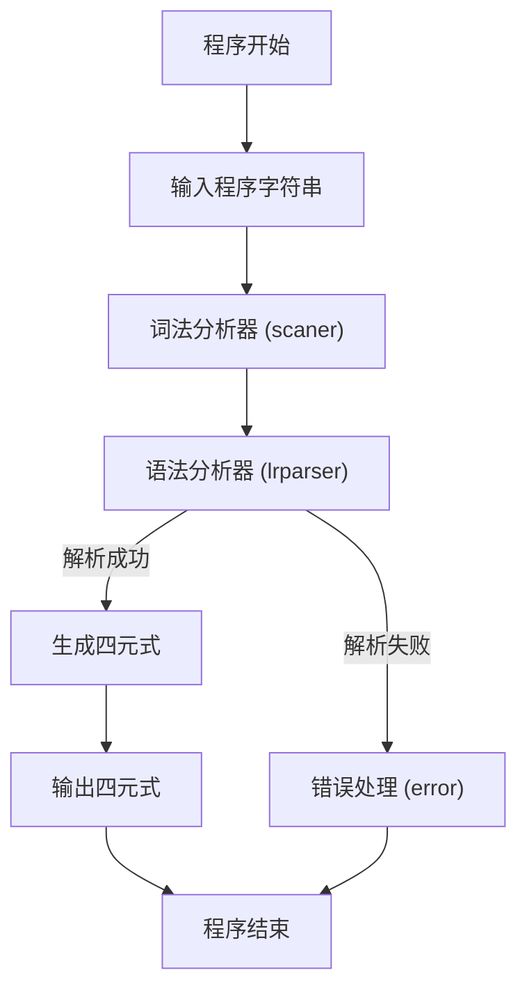

- `lrparser` 函数流程图

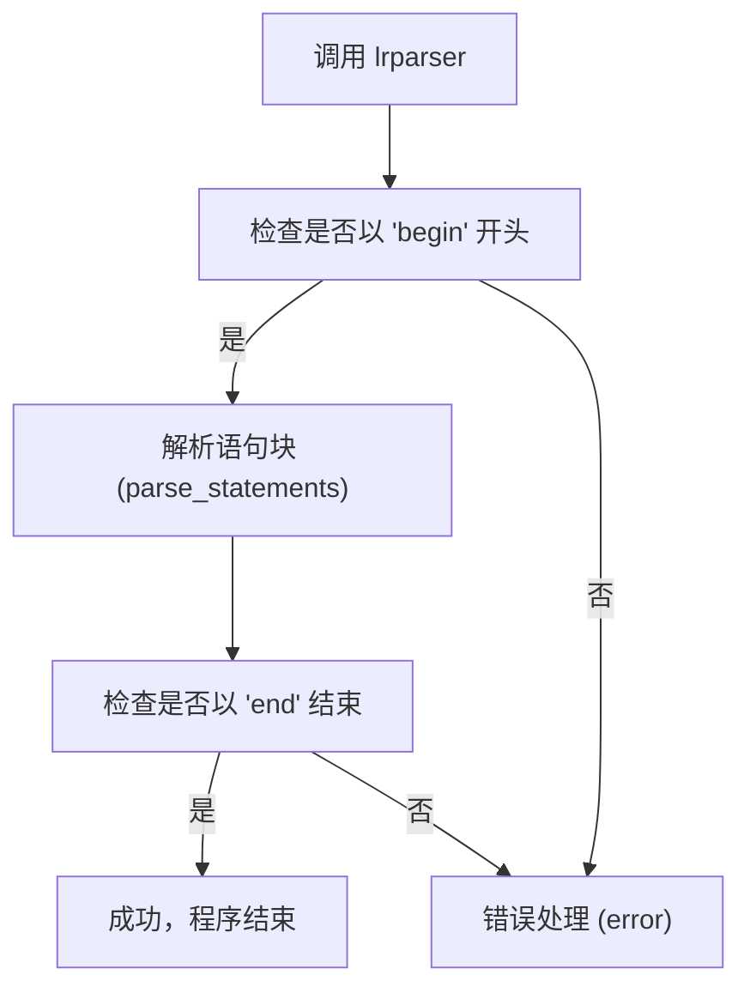

- `parse_statements` 函数流程图

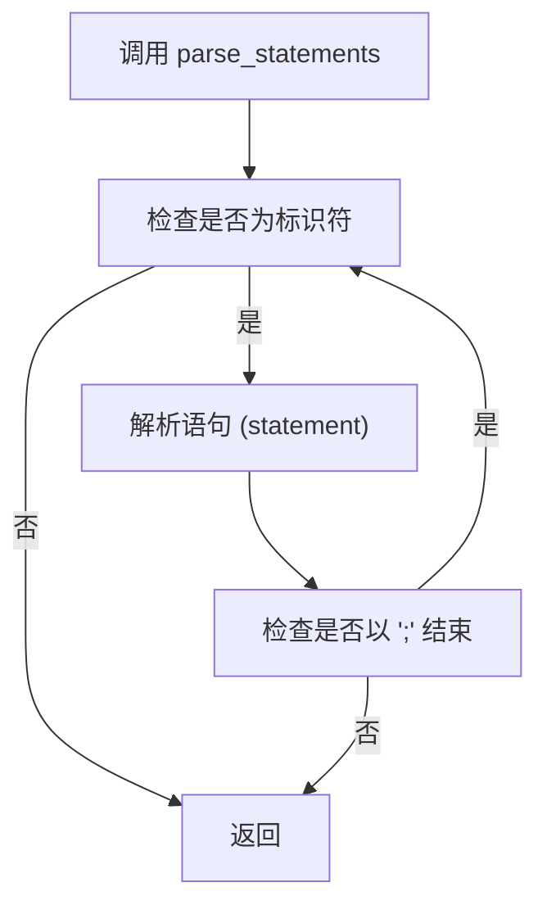

- `statement` 函数流程图

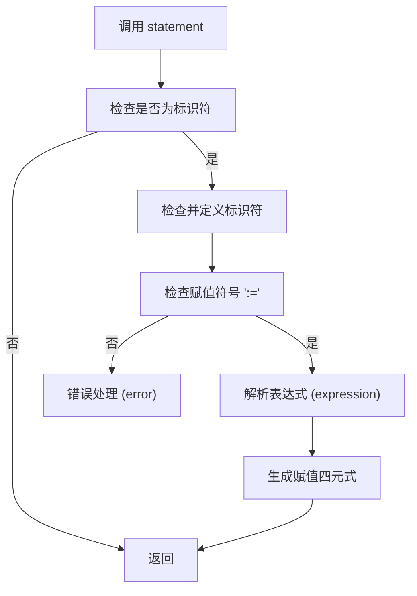

- `expression` 函数流程图

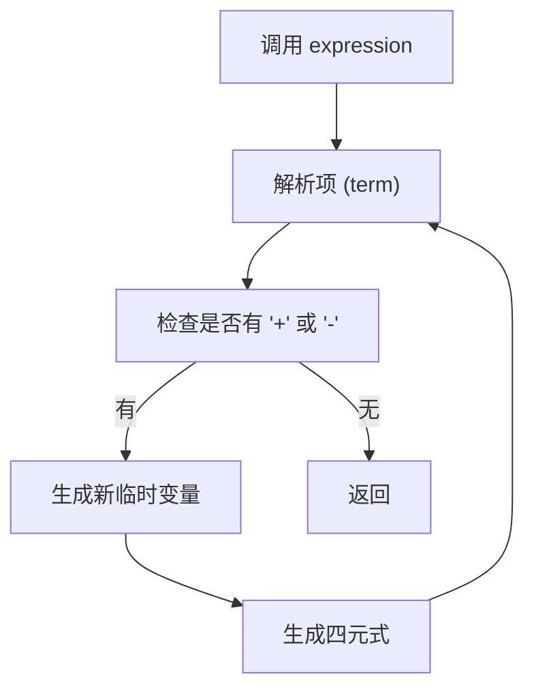

- `term` 函数流程图

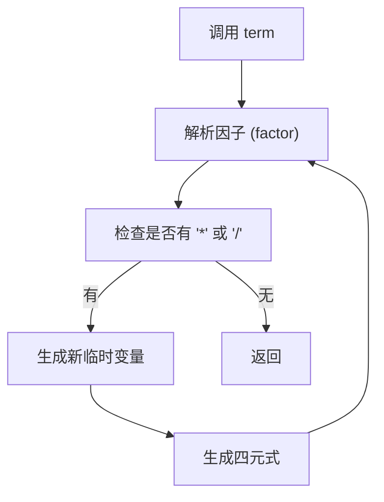

- `factor` 函数流程图

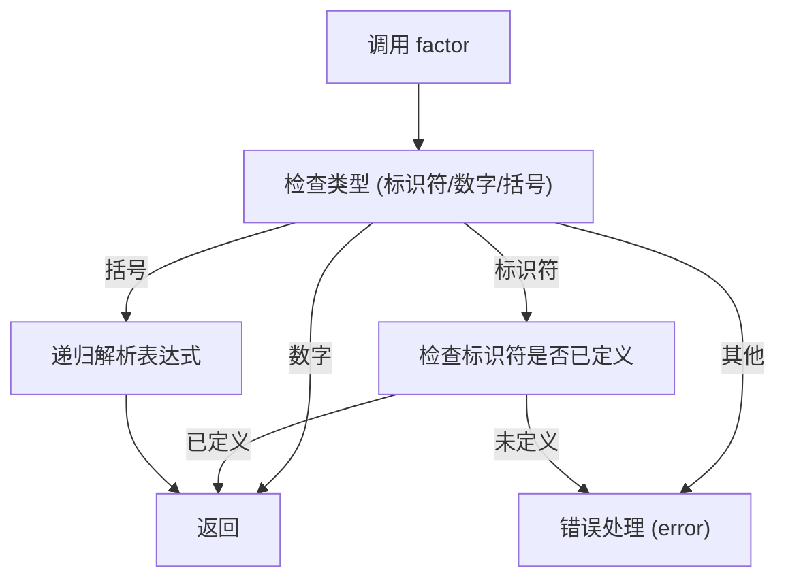

- `scaner` 函数流程图

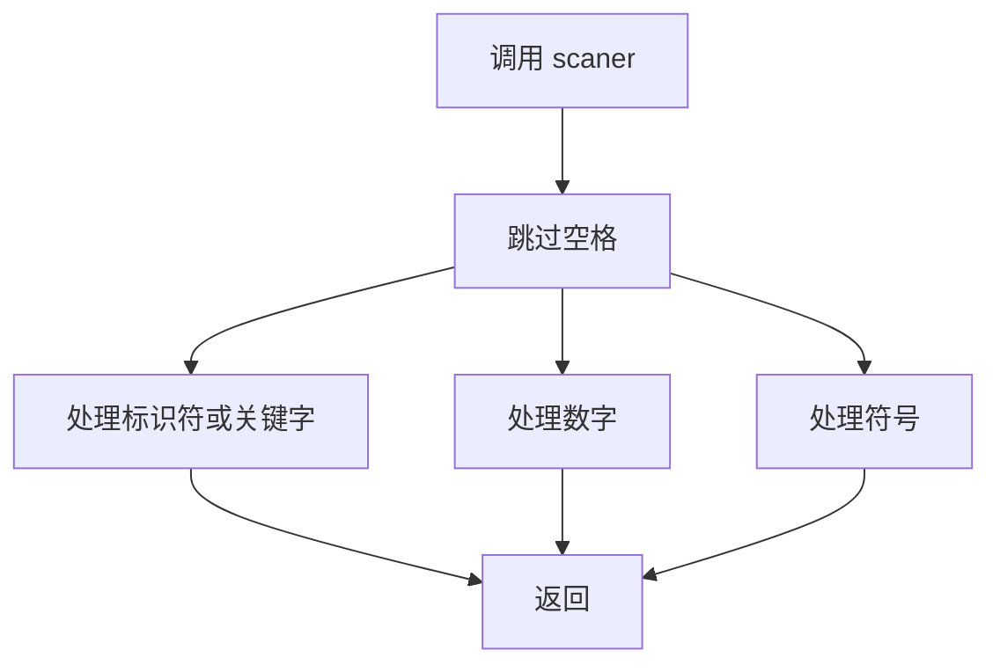

- `emit` 函数流程图

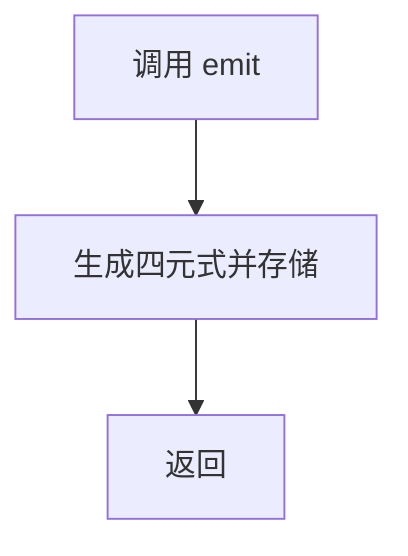

- `error` 函数流程图

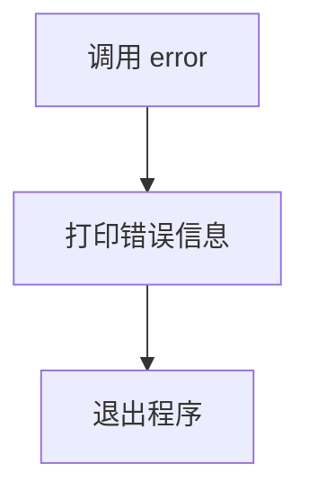

以下是补充的 **变量检查函数 (`is_defined`)** 和 **定义变量函数 (`define`)** 的流程图：

------

1 `is_defined` 函数流程图

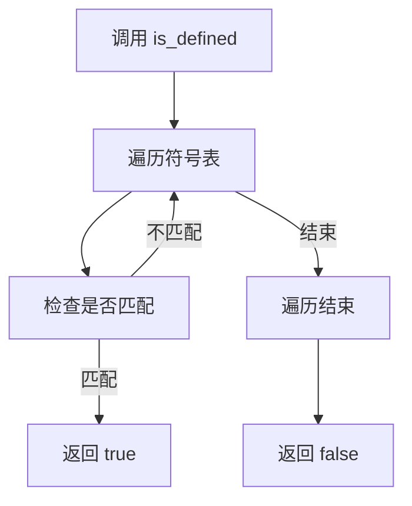

------

2 `define` 函数流程图

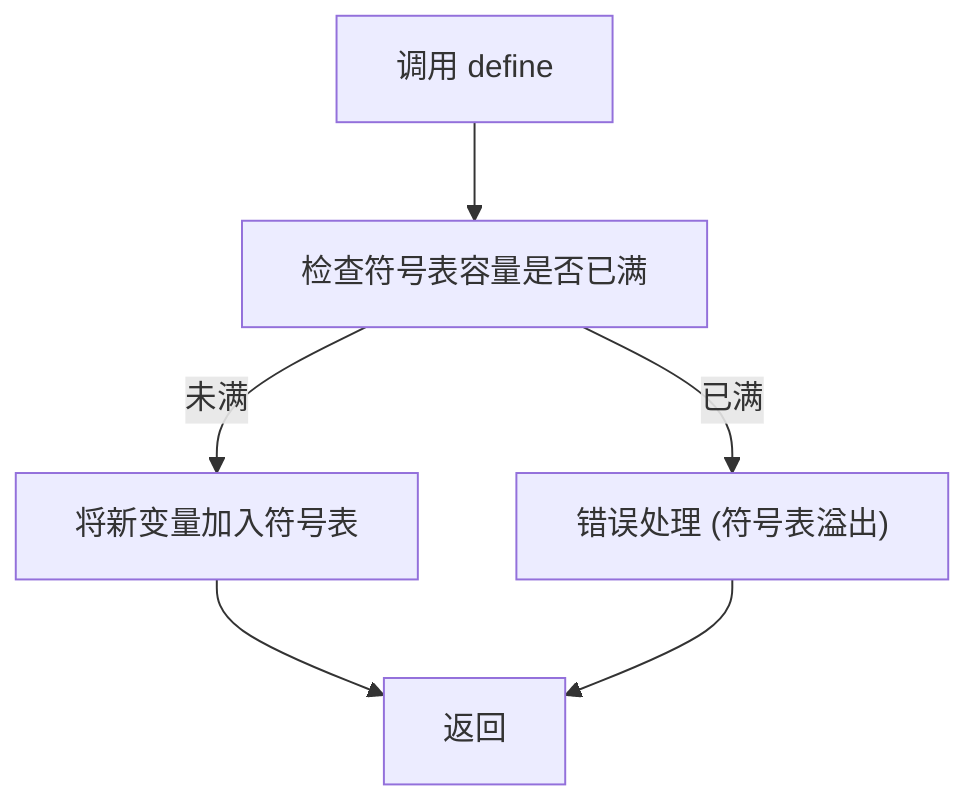


------

## 五、结果分析

1. 基本语法测试

```
begin x := 1; end#
```

预期输出：成功，生成赋值四元式

2. 多语句测试

```
begin x := 3 + 5; y := x * 2; end#
```

预期输出：成功，生成四则运算和赋值的四元式

3. 复杂表达式测试

```
begin x := (3 + 5) * 2; end#
```

预期输出：成功，生成带括号的四则运算四元式

4. 错误情况测试：

a. 缺少 begin

```
x := 1; end#
```

预期输出：Error: Missing 'begin'!

b. 缺少 end

```
begin x := 1;#
```

预期输出：Error: Missing 'end'!

c. 未定义变量

```
begin x := y + 1; end#
```

预期输出：Error: Variable 'y' is not defined!

d. 语法错误 - 不完整表达式

```
begin x := 3 + ; end#
```

预期输出：Error: Syntax error in factor!

e. 语法错误 - 缺少赋值符号

```
begin x = 1; end#
```

预期输出：Error: Missing ':='!

f. 括号不匹配

```
begin x := (1 + 2; end#
```

预期输出：Error: Missing ')'!

5. 连续变量定义和使用

```
begin 
    x := 1; 
    y := x + 2; 
    z := x * y; 
end#
```

预期输出：成功，生成多个相关联的四元式

6. 退出测试

```
exit#
```

预期输出：Exiting...

------

## 六、课程设计总结

通过本实验，我加深了对编译原理中语法制导翻译的理解，掌握了以下技能：

1. **语法制导翻译的基本实现**：将语法分析与语义分析结合，完成简单编译器的前端开发。
2. **中间代码生成**：通过四元式表示复杂的表达式计算。
3. **错误处理机制**：在词法、语法和语义分析阶段均能准确定位和报告错误。

实验过程中遇到的主要问题包括：

1. 对不同语法规则的处理优先级不够明确，导致初始版本生成的语法树错误。
2. 在标识符定义检查中，符号表操作逻辑不完善，初期出现重复定义的问题。

改进建议：

1. 增加对复杂语句（如 `if-then-else` 结构）的支持。
2. 实现更优化的符号表查找算法，提高效率。
3. 在生成四元式时加入类型检查和类型转换的支持。


