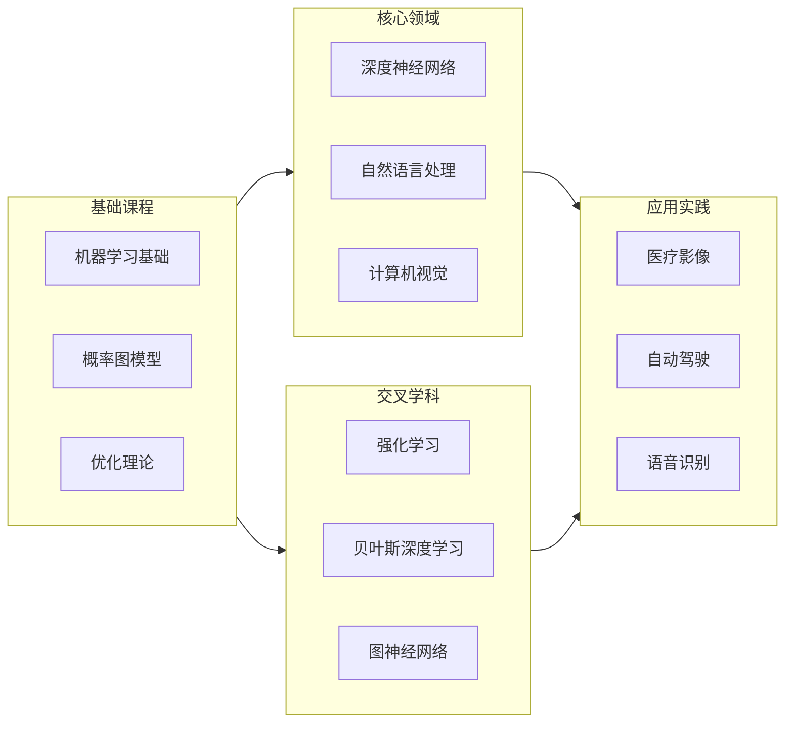
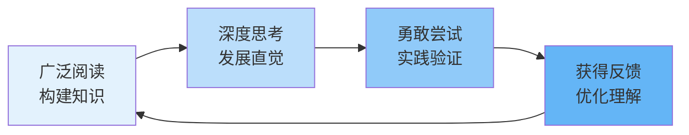

# 深度学习大师的智慧：如何培养并相信你的直觉
> “读得足够多，这样你就会开始发展直觉，然后相信你的直觉并去做！”——Geoffrey Hinton，多伦多大学教授
> 在人工智能飞速发展的今天，我们不断追问：**是什么造就了顶尖的创新者？** 多伦多大学著名教授、深度学习先驱Geoffrey Hinton给出了一个看似简单却深刻的答案：**阅读、直觉与行动**。这句话不仅是他个人科研历程的写照，更揭示了深度学习乃至许多创造性领域的成长密码。
## 一、从“读得足够多”开始：构建知识的基础
Hinton教授的第一步是“读得足够多”。这里的“阅读”远非泛泛而览，而是**系统性地构建知识体系**。这正是“Deep Learning Drizzle”这类资源库存在的价值。
### 知识图谱：深度学习的全景地图
“Deep Learning Drizzle”是一个精心整理的课程资源库，它像一张全景地图，为学习者指明了方向。图中展示了从基础到前沿的完整课程体系，涵盖了：

这个资源库收录了来自全球顶尖学府的**60多门课程**，从Geoffrey Hinton本人的《Neural Networks for Machine Learning》到斯坦福大学的CS231n、CS224n，再到MIT、CMU、UC Berkeley等名校课程，构建了一个完整的深度学习知识生态系统。
### 为什么要“读得足够多”？
1. **建立知识连接**：不同的课程从不同角度解释同一概念，帮助你形成立体的理解
2. **发现领域脉络**：通过对比不同讲师的阐述，你能把握领域发展的内在逻辑
3. **识别关键问题**：广泛阅读能让你发现哪些问题是反复出现、尚未解决的
Hinton教授本人正是通过长期、深入的阅读，在神经网络领域建立了深厚的知识积淀，这为他后续的突破性创新奠定了坚实基础。
## 二、发展直觉：从知识到洞察的飞跃
“读得足够多”之后，关键在于**将知识内化为直觉**。这需要经历一个从量变到质变的转化过程。
### 直觉形成的三个阶段
📊 深度学习直觉发展的阶段模型
基于认知科学和专家学习理论，深度学习直觉的发展可以划分为三个阶段：
| 阶段           | 特征       | 表现                     | 关键活动                         |
| -------------- | ---------- | ------------------------ | -------------------------------- |
| **知识积累期** | 信息碎片化 | 能记住概念但无法关联     | 系统学习基础课程，阅读经典论文   |
| **模式识别期** | 建立连接   | 能发现不同概念的相似性   | 对比不同课程，参与讨论，实践应用 |
| **直觉生成期** | 洞察涌现   | 能预判结果，提出创新想法 | 解决复杂问题，进行原创研究       |

这个过程类似于“深度学习”本身：通过大量数据（知识）训练，最终形成能够泛化的模型（直觉）。

### 如何加速直觉发展？
1. **交叉验证学习**：同一主题在不同课程中的讲解方式，往往能揭示其本质
2. **实践验证**：通过代码实现、项目应用，将抽象概念转化为具体经验
3. **教学相长**：尝试向他人解释概念，这是检验理解程度的有效方法
Hinton教授在神经网络领域的许多突破，并非来自传统的逻辑推理，而是基于长期积累形成的“直觉”——一种对问题本质的敏锐感知。这种直觉让他能够看到别人看不到的连接和可能性。
## 三、相信并追随直觉：创新的勇气
最困难的一步在于：**相信你的直觉并去做**。在科学探索中，直觉往往是创新的先导，但需要勇气去追随它。
### Hinton的直觉之旅
Geoffrey Hinton的科研生涯就是“相信直觉”的典范：
- 在神经网络被主流AI社区冷落的时期，他坚信其潜力并持续研究
- 提出的反向传播算法等概念，最初基于直觉，后来被证明是革命性的
- 在深度学习浪潮兴起前，基于直觉的坚持最终带来了回报
### 如何培养相信直觉的勇气？
1. **小步试错**：先在小项目中验证直觉，积累成功经验
2. **寻找同频者**：与理解你研究思路的人交流，获得反馈和支持
3. **接受不确定性**：创新本质上是对未知的探索，需要容忍风险
## 四、实践指南：如何将智慧转化为行动
理解原理后，更重要的是付诸实践。以下是一个循序渐进的行动路线：
### 第一步：构建个性化学习路径
利用“Deep Learning Drizzle”资源库，根据你的基础和目标制定学习计划：

🎯 不同学习者的路径推荐
| 学习者类型     | 推荐起点         | 核心课程          | 实践项目               |
| -------------- | ---------------- | ----------------- | ---------------------- |
| **零基础入门** | CS231n或CS224n   | 机器学习基础课程  | 图像分类或文本情感分析 |
| **有一定基础** | 深度学习专项课程 | 高级课程+专题课程 | 小型研究项目或竞赛     |
| **研究人员**   | 高级专题课程     | 研讨会+前沿论文   | 复现论文+原创改进      |
| **应用开发者** | 应用导向课程     | 特定领域应用课程  | 完整应用开发流程       |

**关键提示**：不要贪多，选择2-3门核心课程深入学习，比泛泛浏览10门课程更有价值。

### 第二步：建立直觉实验室
创造培养直觉的环境：
1. **定期“思维漫步”**：每周花时间思考不同概念间的联系
2. **预测-验证循环**：对模型结果、论文方法先做预测，再验证
3. **保持研究日志**：记录那些“突然想到”的时刻和思路
### 第三步：构建支持系统
1. **学习伙伴**：找到同样认真学习的伙伴，定期讨论
2. **导师指导**：如果可能，寻找有经验的研究者指点
3. **社区参与**：参与相关论坛、研讨会，获取反馈
## 五、从学习到创造：形成正循环
最终目标是建立一个**“学习-直觉-创造-反馈”的正循环**：

这个循环的核心在于：
- **阅读不是终点，而是起点**
- **直觉需要实践检验和打磨**
- **每一次创造都反过来丰富知识库**
## 结语：在知识的海洋中航行
Geoffrey Hinton的智慧告诉我们，深度学习的学习不是简单的知识累积，而是**培养一种思维方式**——在广阔知识海洋中航行，依靠直觉的罗盘，勇敢地探索未知的领域。
“Deep Learning Drizzle”这样的资源库为我们提供了船只和导航图，但航行的方向和勇气，来自于我们内心深处的直觉和坚持。
正如Hinton所言，相信你的直觉并去做。在深度学习的道路上，愿你既能读得足够多，又能勇敢地追随内心的声音，创造出属于自己的价值。
> **最终，深度学习的真谛不在于记住多少公式，而在于培养那种能够洞察问题本质、预见创新方向的直觉。** 这种直觉，需要你用知识的砖块、实践的砂浆，一砖一瓦地建造起来。开始阅读吧，开始思考吧，开始相信吧，然后——去做。
