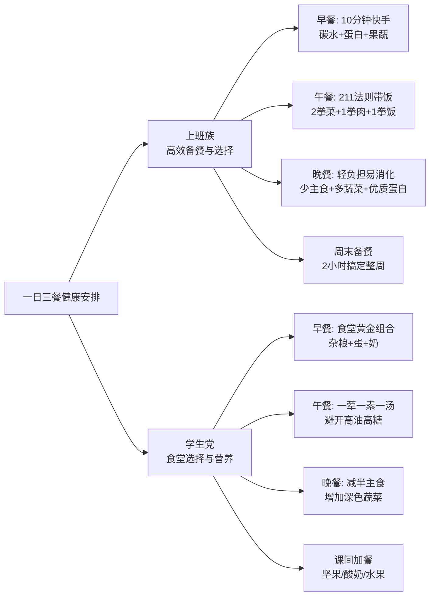

# 购物清单

## 吃的-油盐酱醋米面

### 食用油

#### **高油酸花生油** （必备）

> **高油酸花生油**的油酸含量**≥75%**。
> 油酸是一种单不饱和脂肪酸（Omega-9），也就是橄榄油中最核心的健康成分。有效降低血液中的“坏胆固醇”（LDL），同时不降低“好胆固醇”（HDL），对预防心脑血管疾病非常有利。
>
> **超级稳定，耐煎炒**  具有浓郁的花生香味
>
> 高油酸花生油相当于**“中国版的橄榄油”**。
>
> 选购：易感染黄曲霉素，买大品牌、有品质保障的

品牌推荐：

1. 鲁花-**行业标杆，香味浓郁**
2. **胡姬花 —— 古法传承，风味醇厚**
3. **金龙鱼 —— 性价比之选，大厂背书**
4. 福临门
5. **龙大 —— 区域强牌，品质稳定**

#### **低芥酸菜籽油** （必备）

> 芥酸分子较大，人体难以代谢，长期大量摄入可能在心肌和肝脏中沉积，对心脏不利（这也是欧洲曾限制菜籽油的原因）
>
> **低芥酸菜籽油**（又称双低菜籽油：低芥酸、低硫苷），其芥酸含量**≤3%**（我国标准），甚至很多优质产品≤1%，彻底消除了这一健康隐患。
>
> 饱和脂肪酸含量极低 **能自己凑齐Omega-3、6、9**
>
> **性价比极高** **烟点高，用途广**  气味清淡
>
> 选购：**明确写有“低芥酸”或“双低”字样**

品牌推荐： 

1. **道道全 —— 菜籽油专家，纯正清淡**
2. **金龙鱼 / 鲤鱼 —— 国民首选，闭眼入**
3.  **鲁花 —— 压榨工艺，香味足**
4. **长康 / 洪湖等区域品牌 —— 就近选择**

#### 选购防坑指南

1. **看标签，不要只看名字**：
   - 买花生油，没写“高油酸”三个字的，就是普通花生油。
   - 买菜籽油，没写“低芥酸”或“双低”的，很大可能就是传统高芥酸菜籽油（尤其是农村小作坊自己榨的，虽然香，但芥酸极易超标，不建议长期吃）。
2. **看工艺：首选“压榨”，避开“浸出”**：
   - 同等价位下，买标注**“物理压榨”**的油，不含化学溶剂残留，营养保留更好，风味更自然。浸出油虽然便宜且出油率高，但风味和营养略逊一筹。
3. **看等级：首选“一级”**：
   - 无论花生油还是菜籽油，**一级**代表杂质最少、烟点最高、油烟最少，最适合中式爆炒。虽然三级/四级保留了更多风味，但也意味着杂质多，炒菜油烟大，对呼吸道不友好。
4. **换着吃**：

---

####  猪油

（中式炒菜、拌饭、酥皮天花板）

**最好的猪油是自家买板油熬**。菜市场的鲜猪板油洗干净，加一点点水小火慢熬，加两片姜和一撮花椒，熬出来的猪油又白又香，秒杀一切市售成品。

#### 牛油（四川火锅底料灵魂、西式煎烤）

**1. 张兵兵 / 名扬（中式火锅牛油）**

- **推荐理由**：如果你在家自己炒火锅底料、做毛血旺、水煮牛肉，这两家是四川当地的牛油巨头。张兵兵专门做原味纯牛油，熔点高，香气霸道，凉了也不容易凝固发白；名扬的火锅底料本身就是牛油王者，它家的纯牛油块也很靠谱。
- **避坑**：买火锅牛油，认准“纯牛油”，别买成“牛油底料”。

**2. 银宝（Lurpak）牛油块 / 总统牌草饲牛油**

- **推荐理由**：如果你是买来**煎牛排**或者做法式料理，需要那种淡淡的奶香而不是火锅味，选这两款。它们其实是黄油的一种（Butter），中文俗称牛油，奶香纯正，煎出来的牛排焦香四溢。

*(注意：南方人叫黄油为牛油，北方人说的牛油是火锅牛油。买的时候看英文，Butter是奶制黄油，Beef Tallow是动物牛油。)*


---

很多调味品标榜“薄盐”“轻盐”“减盐”，但实际上钠含量依然很高。
**唯一判断标准：看包装背面的【营养成分表】，找到【钠】这一栏，看NRV%（营养素参考值百分比）。**

- **NRV%的含义**：吃100g/ml该产品，摄入的钠占了你全天建议摄入量（2000mg）的百分之几。
- **对比基准**：普通酱油的钠含量NRV%通常在 **40%~50%** 之间（即吃两勺就占了一天一半的钠配额）。
- **真正的减盐标准**：**钠的NRV%必须≤25%**，或者在同类产品中钠含量确实低了一半左右，才算及格。

### 低钠食盐

- **原理**：用约30%的氯化钾替换了氯化钠。咸度差不多，但钠减少了20%-30%，同时补充了钾（钾能帮助降血压）。
- **避坑**：**肾功能不全者、正在吃保钾利尿药的高血压患者，绝对不能吃低钠盐！**（因为排钾困难，吃低钠盐容易高钾血症，有心脏骤停风险）。健康人群和普通高血压老人吃很好。

品牌推荐：

1. **中盐（低钠盐）**：国家队出品，品质最稳。便宜大碗，各大商超都有，闭眼入。
2. **雪天（低钠盐）**：湖南品牌，近年来品质很好，纯度高，也是性价比之选。
3. **粤盐（低钠盐）**：广东品牌，在华南地区市占率极高，品控优秀。
4. **鲁信/沧海**：山东的盐业品牌，海盐低钠盐做得不错。


### 减盐酱油

- **避坑**：有些牌子原来钠是45%，现在降到38%，就敢叫“减盐酱油”，其实还是很咸。必须买钠NRV%在**25%以下**的。
- **工艺**：好的减盐酱油是“原汁减盐”（用技术抽走钠），差的是“掺水减盐”（加水稀释，导致鲜味全无，甚至加更多谷氨酸钠来提鲜，又把钠补回去了）。

品牌推荐：

1. **千禾（强烈推荐）**

   **推荐型号**：**千禾零添加减盐生抽 380天**

   **理由**：千禾是做零添加起家的，这款减盐酱油没有加防腐剂和提鲜剂，靠长时间发酵的氨基酸提鲜，**钠的NRV%大概在23%左右**，真正做到了减盐且鲜味足，是目前市面上口碑最好的减盐酱油之一。

2. **海天**

   **推荐型号**：**海天薄盐生抽 / 海天减盐0添加酱油**

   **理由**：海天的工艺确实牛，它的“薄盐生抽”虽然减盐幅度不如千禾那么极致，但胜在味道最接近普通生抽，家里老人如果吃不惯太淡的，海天薄盐是最好的过渡选择。

3. **厨邦**

   **推荐型号**：**厨邦减盐特级生抽**

   **理由**：厨邦一直主打“晒足180天”，鲜度很高。它的减盐款保留了原有的鲜甜感，适合做蘸料和凉拌。

4. **李锦记**

   **推荐型号**：**李锦记薄盐醇味鲜 / 薄盐生抽**

   **理由**：李锦记的高端线做得很精致，薄盐系列口感醇厚，没有死咸感，非常适合炒菜提鲜。

###  减盐烹饪技巧（比买减盐调料更重要）

1. **出锅再放盐/酱油**：不要在炒菜中间放盐，等菜快熟了、要出锅时再放。这样盐分会附着在食物表面，舌头一碰就感觉到咸，用一半的盐量就能达到同样的咸度。
2. **加点酸/甜**：酸味可以强化咸味。炒菜时滴两滴醋或挤点柠檬汁，即使盐放得少，吃起来也不会觉得寡淡。同理，微甜也能提鲜（如红烧菜）。
3. **用葱/姜/蒜/花椒/辣椒增香**：用香料丰富味觉层次，大脑就不会只依赖“咸味”来满足口感。
4. **总量控制**：用了低钠盐和减盐酱油后，**千万别觉得“既然减盐了就可以多放点”**，那等于白减！手依然要少抖。

---

### 食醋

买食用醋，最核心的避坑原则就一条：**必须买“酿造醋”，绝对不买“配制醋”（勾兑醋）**

勾兑醋是用冰醋酸加水香精兑出来的，只有酸味没有营养；酿造醋是粮食发酵的，含有多种氨基酸和有机酸，酸味柔和且有回甘。

以下按不同的烹饪需求和口感，推荐硬核好醋：

#### 凉拌、蘸料（吃的是原汁原味，要求酸味柔和、不涩）
凉拌菜对醋的要求最高，不能有刺鼻的酸味，要回味甘甜。

**1. 恒顺香醋（江苏镇江）—— 凉拌绝对王者**

* **推荐理由**：镇江香醋是“黑醋/陈醋”里的另类，它是以糯米为主要原料酿造的。**最大的特点就是“酸而不涩、香而微甜”**。拌黄瓜、拌海蜇、吃大闸蟹蘸料，用恒顺香醋最提味，它的甜鲜味能完美托出食材的本味。

* **选购避坑**：认准瓶身上有**“固态发酵”**和**“镇江香醋”**地理标志。买**3年陈**或**5年陈**的，日常用3年陈性价比最高。千万别买它家便宜的“配置食醋”。

**2. 宁化府老陈醋（山西太原）—— 纯粮醇厚派**

* **推荐理由**：说到山西醋，很多人知道水塔，但老太原人只认宁化府。它是真正的高粱纯粮酿造，没有乱七八糟的添加剂。比起镇江醋的微甜，宁化府的味道更纯粹、更冲、醇厚感极强，适合拌凉菜或吃饺子蘸料，一口下去非常解腻。

*   **选购避坑**：宁化府的“手工老醋”系列最好，看配料表只有水、高粱、大麦、豌豆。
---
#### 炒菜、红烧、炖肉（需要高温烹饪，要求不易挥发、上色好）
炒菜用醋，一方面是去腥解腻，另一方面是遇热后能激发出酯香味。

**1. 东湖老陈醋（山西）—— 红烧炖肉去腥首选**

* **推荐理由**：东湖是山西老陈醋的国家标准起草单位。老陈醋经过“夏伏晒、冬捞冰”的浓缩，水分少，氨基酸含量极高。**它最大的优势是“遇热不挥发，越熬越香”**。做糖醋排骨、红烧肉、炖鱼时，顺着锅边淋入东湖老陈醋，醋香会瞬间融进肉里，而不是只留在汤汁里。

* **选购避坑**：炒菜买**3年陈**即可，5年陈以上太贵且酸度太高，炒菜有点浪费。

**2. 保宁醋（四川阆中）—— 川菜灵魂，吃火锅必备**

*   **推荐理由**：保宁醋是**药醋**，用中药制曲，麸皮为主料酿造。它的酸味带有一股独特的药香和醇厚感。如果你爱吃川菜、火锅、肥肠这类重口味的食材，保宁醋的解腻和去腥能力是全国最强的。吃重庆小面、酸辣粉，必须放保宁醋才对味。
---
#### 清淡解腻、减脂养生（要求酸度低、清爽）
**1. 千禾糯米白醋 —— 日常炒青菜、泡黑豆/泡姜**
*   **推荐理由**：前面都是黑醋（红醋），如果你做清淡的菜（比如醋溜土豆丝、炒豆芽），不想菜变黑，就需要白醋。千禾这款是用纯糯米酿造的，**没有刺鼻的工业酸味，带有淡淡的米香**。而且千禾主打“零添加”，配料表干干净净（水、糯米、白砂糖），用来泡黑豆、泡姜、泡蒜最安全放心。
*   **避坑**：买白醋千万看配料表，市面上很多白醋是“食用酒精+醋酸”配制的，那种只能用来打扫卫生，不能吃！

**2. 水塔老陈醋（山西）—— 平价口粮炒菜醋**

*   **推荐理由**：水塔是山西醋产量最大的品牌，性价比极高。日常家里炒大锅菜、做酸辣汤，用水塔最划算，酸味足，2年陈的价格非常亲民。
---
#### 买醋必看的“3秒钟避坑法”：
下次去超市，拿起一瓶醋，看三个地方：
1.  **看产品标准号**：
    *   **GB/T 18187** = 固态发酵酿造醋（**最好，买这个！**）
    *   **GB/T 18187** = 液态发酵酿造醋（也算真醋，但风味不如固态）
    *   **SB/T 10337** = 配制食醋（**勾兑醋，放下！**）
2.  **看配料表**：
    *   好醋配料表第一位是水，后面跟着高粱/糯米/麸皮等粮食，以及麸皮/大麦（制曲用）。
    *   差醋配料表里有“冰醋酸”、“食用醋酸”、“焦糖色”（好陈醋的颜色是熬出来的，不需要加焦糖色）、“苯甲酸钠”（防腐剂，好醋酸度高自己就能防腐，不需要加）。
3.  **看总酸度**：
    *   包装上会标“总酸≥ x.x g/100mL”。
    *   老陈醋/香醋：**≥4.5g**算及格，**≥5.0g**算好醋，**≥6.0g**属于极品（不需要放防腐剂）。
    *   白醋：**≥3.5g**算及格。
    **总结推荐清单**：
*   凉拌蘸料：**恒顺3年陈香醋**
*   红烧炖肉：**东湖3年陈老陈醋**
*   吃火锅/重口：**保宁醋**
*   炒青菜/泡食材：**千禾糯米白醋**

---

### 大米

究地域口味，所谓“南籼北粳”，南方人爱吃细长松散的籼米（丝苗米），北方人爱吃圆润软糯的粳米（东北米）。

**买大米的核心避坑原则只有一个：必须买“GB/T 1354”开头的执行标准，这只是普通合格大米！**要想吃好米，得认准**地理标志保护产品的专属执行标准**。

买大米其实比买油买醋更讲究地域口味，所谓“南籼北粳”，南方人爱吃细长松散的籼米（丝苗米），北方人爱吃圆润软糯的粳米（东北米）。
但不管你爱吃什么米，**买大米的核心避坑原则只有一个：必须买“GB/T 1354”开头的执行标准，这只是普通合格大米！**要想吃好米，得认准**地理标志保护产品的专属执行标准**。

以下按不同口感和需求，为你推荐目前市面上最硬核的好米：

#### 东北粳米派：软糯油润、饭香四溢
*适合：喜欢米饭软糯、油亮亮、单吃白米饭都很香的人。*
**1. 五常大米 —— 东北米的天花板**
* **核心推荐**：乔府大院 / 葵花阳光 / 十月稻田（高端线）

* **推荐理由**：五常大米（稻花香2号）是中国最好吃的大米之一，没有之一。煮熟后满屋飘香，米饭油光发亮，吃起来软糯微甜，放凉了也不回生。

* **避坑必看**：市面上90%的五常大米都是假的！**必须认准包装上的执行标准号：GB/T 19266**。只要没有这串数字，哪怕包装上写了“五常”俩字也是调和米。另外，纯正五常米很贵（通常6元/斤以上），太便宜的绝对买不到真货。

  

**2. 盘锦大米 —— 性价比之王，日常口粮首选**

* **核心推荐**：北纬42度 / 认臻 / 太子河

* **推荐理由**：同在东北，盘锦大米的口碑极好，属于“越嚼越香”的类型。它没有五常那么浓的香味，但口感扎实，软硬适中，不粘牙，配菜吃特别爽口。最关键的是，**它是高端米里的性价比之王**，三四十块钱就能买到很好的正宗盘锦米。

* **避坑必看**：认准执行标准号：**GB/T 18824**。

  

**3. 延边朝鲜族大米 —— 东北米里的“小透明”但惊艳**

* **核心推荐**：海兰江 / 延边本地品牌

* **推荐理由**：很多老饕私藏的宝藏米。因为延边昼夜温差更大，这里的米比普通东北米更Q弹、更甜糯，用来做日式饭团、韩式拌饭简直一绝。

*   **避坑必看**：认准执行标准号：**GB/T 22438**。
---
#### 南方籼米派：粒粒分明、松散干爽
*适合：喜欢吃扬州炒饭、煲仔饭、咖喱饭，要求米饭不粘连、吸汤汁的人。*

**1. 增城丝苗米 —— 籼米界的“米中之王”**

*   **核心推荐**：挂绿 / 朱村 / 太粮
*   **推荐理由**：正宗的增城丝苗米，米粒细长苗条，泛着丝光。煮熟后饭粒分明，互不粘连，吃起来柔韧有嚼劲，吸水性极强。做煲仔饭能吸满腊味的油脂，底部还能结出完美的锅巴！
*   **避坑必看**：认准执行标准号：**GB/T 23402**（增城丝苗米）。

**2. 鄱阳湖/江西籼米 —— 南方人的实惠口粮**

*   **核心推荐**：金佳 / 狗牯脑（周边品牌）
*   **推荐理由**：江西是南方产粮大省，这里的晚籼米品质极好，出饭率高，口感清爽不腻，是南方家庭日常干饭、做炒饭的最实在选择，价格非常亲民。
---
#### 杂粮/特色米：减脂控糖必备
*适合：糖友、减脂人群、孕产妇。*

**1. 燕之坊 七色糙米**

* **推荐理由**：买糙米最怕的是煮不烂、伤胃。燕之坊是国内做杂粮的大品牌，它这款七色糙米经过了一定的预处理（部分发芽或轻度破壁），比生硬的糙米好煮熟得多，口感有嚼劲但不费牙，升糖指数低，和白米按1:3的比例混煮最健康。

  

**2. 十月稻田 胚芽米 / 鲜米**

*   **推荐理由**：如果家里有宝宝，强烈推荐吃胚芽米。保留了米粒最营养的胚芽部分（普通白米都磨掉了），口感比糙米细腻得多，比精白米营养高得多。十月稻田的鲜米系列包装很好，锁鲜做得不错。
---
#### 买大米防坑指南：
1.  **看执行标准号（最关键）**：
    *   `GB/T 1354` = 普通合格大米（凑合吃）
    *   `GB/T 19266` = 五常大米（好吃但贵）
    *   `GB/T 18824` = 盘锦大米（性价比高）
    *   `GB/T 22438` = 延边大米（Q弹软糯）
    *   `GB/T 23402` = 增城丝苗米（干爽粒明）
2.  **看等级**：大米分一级、二级、三级、四级。**买一级！**一级米留皮留胚最少，外观最漂亮，口感最好。
3.  **买小包装**：大米开封后超过一个月，风味就会断崖式下降，还容易长米虫。建议**一次只买5斤或10斤装**，吃完再买，别贪便宜买50斤的大编织袋。
4.  **新米vs陈米**：看米粒腹部有没有白色的“腹白”，有腹白的一般是新米；闻起来有清香的是新米，有陈放味的是陈米。


### 小米

买小米和买大米一样，最怕买到“陈米”和“染色米”。小米一旦放久了，不仅米油熬不出来，营养流失，还容易有一股子捂过的陈味。

买小米的核心口诀是：**认准地理标志，买新不买陈，首选沁州黄。**

买小米和买大米一样，最怕买到“陈米”和“染色米”。小米一旦放久了，不仅米油熬不出来，营养流失，还容易有一股子捂过的陈味。
买小米的核心口诀是：**认准地理标志，买新不买陈，首选沁州黄。**

#### 熬粥神器：米油厚、最养胃（粳性小米）
如果你买小米就是为了熬出那层厚厚的“米油”（米皮），给老人、孕妇、宝宝养胃喝，必须买北方干旱温差大地区产的粳性小米。

**1. 沁州黄小米（山西长治）—— 小米中的“软黄金”**

* **核心推荐品牌**：沁州牌 / 谷之旗 / 万里

* **推荐理由**：中国最顶级的小米品种，清朝康熙皇帝御赐的“沁州黄”。这种小米生长在干旱的黄土高原，昼夜温差极大，淀粉和蛋白质积累极多。**它最大的特点就是非常容易出米油**，熬出来的粥金黄透亮，放凉了表面能挑起一层厚厚的皮，口感软糯微甜。

* **避坑必看**：认准包装上的国家地理标志保护产品标识，以及执行标准号：**GB/T 19503**。

**2. 敖汉小米（内蒙古赤峰）—— 世界级产地，性价比之王**

* **核心推荐品牌**：孟克河 / 敖汉旗本地品牌 / 十月稻田（敖汉产）

* **推荐理由**：敖汉被称为“世界旱作农业发源地”，这里的小米被联合国粮农组织列为全球重要农业文化遗产。因为光照更足，敖汉小米的颗粒比沁州黄稍微大一点点，非常饱满，熬粥也很粘稠，但**价格比沁州黄更亲民**，是日常口粮的首选。

* **避坑必看**：认准执行标准号：**GB/T 24902**（或地方标准）。

  

**3. 陕北小米（陕西延安/米脂）—— 历史名米，熬粥最浓**

* **核心推荐品牌**：陕果集团 / 米脂本地品牌

* **推荐理由**：“米脂县”就是因为盛产小米（米汁如脂）而得名的。陕北小米颗粒圆润，色泽鲜黄，熬出来的粥黏糊度极高，带有浓郁的粮食原香。

*   **避坑必看**：真正的米脂小米产量有限，价格不会太便宜。
---
#### 煮饭煮粥两相宜：粒粒分明（糯性小米）
普通小米（粳性）如果直接煮饭，口感会比较粗糙发干。如果你想吃“小米饭”或者二米饭（大米+小米），需要买**糯性小米**。
**1. 济农糯小米 / 沁州黄糯小米**
*   **推荐理由**：这是近年来培育的新品种，支链淀粉含量极高。它的口感像糯米一样黏软，没有普通小米那种糙感。用来蒸小米饭、包小米粽子、做小米糕点，或者给刚加辅食的宝宝吃，口感最细腻顺滑。
---
#### 买小米踩坑！
1.  **别买“染色黄”小米**：
    *   有些陈年小米发白发灰，无良商家会用姜黄素或合成色素染色。**鉴别方法**：拿一张湿纸巾，抓一把小米在上面搓几下，如果纸巾明显变黄，就是染色米！正常小米搓完只会留下点点碎屑，不会严重掉色。
2.  **别买“闻着霉”的小米**：
    *   新鲜小米有一股淡淡的粮食清香；陈小米闻起来有股**捂味、酸味或霉味**。如果闻不到味道，抓一把放在手心哈口热气再闻，陈味立刻暴露。
3.  **别买“光泽暗”的小米**：
    *   新小米表面有一层自然的光泽（因为富含米油）；陈小米看起来像蒙了一层灰，干瘪无光。有些商家为了给陈米提亮，会**给小米抹矿物油**。用手搓一搓，如果手指摸起来滑腻腻的有油感，千万别买。
---
#### 熬出“厚米油”的终极秘籍
好米也要配好方法，否则米油出不来：
1.  **千万不要冷水下锅！** 水烧开后，再倒小米。
2.  **滴两滴食用油**：开水里滴2滴花生油或香油，不仅防止溢锅，还能让米油更厚更亮。
3.  **大火转小火，绝不揭盖**：大火煮5分钟后，转最小火熬30-40分钟，期间**绝对不要揭开锅盖**（跑气了米油就出不来了）。
4.  **别加碱**：很多人为了让粥粘稠加食用碱，这会彻底破坏小米里的维生素B族，等于白吃了！
**总结推荐清单**：
*   **追求极致养胃/送孕妇宝宝** ➡️ 买正宗 **沁州黄**（GB/T 19503）
*   **日常高性价比熬粥** ➡️ 买 **敖汉小米**
*   **想做小米饭/糕点** ➡️ 买 **糯性小米**

---

### 面粉

买面粉比买大米简单，因为大米看产地，而**面粉只看“筋度”（蛋白质含量）**。
买面粉的核心避坑原则：**不要看包装正面花里胡哨的名字（什么雪花粉、麦芯粉、富强粉），直接翻到背面看【营养成分表】，找【蛋白质】含量！**

蛋白质含量决定了面粉的筋度，筋度决定了你能拿它做什么。以下是按需求分类的硬核购买指南：

#### 低筋面粉（蛋白质 8.0% - 9.5%）
**用途：做蛋糕、饼干、马卡龙等蓬松酥脆的西点。**
如果你用高筋面粉做蛋糕，出来的就是一块死面疙瘩，绝对发不起来。

**1. 美玫牌低筋面粉**

*   **推荐理由**：烘焙圈公认的“蛋糕神粉”。美国产，粉质极其细腻洁白，吸水性稳定。做戚风蛋糕、海绵蛋糕，打发后不易消泡，烤出来组织细腻松软，几乎是烘焙新手的必买粉。
*   **注意**：市面上假美玫很多，一定要认准正规的代理商或自营店。

**2. 新良低筋面粉**
*   **推荐理由**：国产老牌，性价比极高。粉质也很细腻，日常做饼干、小蛋糕完全够用，价格比美玫便宜一大截，适合烘焙消耗量大的家庭。
---
#### 高筋面粉（蛋白质 12.0% 以上）
**用途：做面包、吐司、披萨饼底、油条。**需要强韧的面筋来包裹气体，才能膨胀拉丝。

**1. 白燕高筋面粉**
*   **推荐理由**：国产面粉里的“做面包天花板”。很多私房烘焙店都在用，吸水率极高（能加更多水，面包更软），面筋延展性极好，做吐司能拉出完美的“手套膜”，放两三天也不容易变硬。

**2. 金象牌高筋面粉**
*   **推荐理由**：泰国老牌，老烘焙人都知道。稳定性极强，不容易翻车，做出来的面包麦香味很足。但近年代理比较乱，注意别买到假货。

**3. 新良黑袋（日式吐司粉）**

*   **推荐理由**：新良的高端线，专门针对日式软面包研发。比普通高筋粉更白更细，做出来的吐司极其绵软，适合喜欢那种入口即化的日式口感。
---
#### 中筋面粉（蛋白质 9.5% - 11.5%）
**用途：做馒头、包子、饺子、面条、煎饼等一切中式面食。**这是中国家庭最常用的面粉。
中筋面粉的选购最不需要焦虑，因为国内大厂的技术非常成熟，几十块钱一袋（5kg）的口粮面，品质都很稳定。

**1. 五得利（强烈推荐）**
*   **推荐理由**：全球最大的面粉企业，河北老牌。它家的面粉性价比无敌，麦香味浓郁，做馒头个头大、不塌陷；擀饺子皮劲道不易破。
*   **怎么选**：五得利按星级分类（1星到9星）。**家庭日常吃，买6星或8星（特精粉/雪花粉）最好**，白度细度适中。9星太贵，1-3星偏黑适合做烙饼。

**2. 香雪面粉**
*   **推荐理由**：东北老大哥，沈阳品牌。因为东北小麦生长周期长，香雪的面粉吃起来有一股淡淡的甜味，做出来的馒头面条特别有“面味”，东北家庭首选。

**3. 古船 / 河套**

*   **推荐理由**：古船是北京人的心头肉，河套（内蒙古）是西北人的白月光。都是地域霸主，品质极硬，买当地最顺手的就行。
---
#### 面粉包装“文字游戏”
去超市你会看到很多奇怪的名字，其实它们都是中筋面粉的变种：
*   **麦芯粉**：用小麦最中心的部分磨的粉。**最白、最细、最没味**。适合做白面馒头、水晶饺子皮。但营养相对单一，麦香淡。
*   **雪花粉/特精粉**：加工精度很高的中筋粉，非常白，做出来的面食卖相极好。
*   **全麦粉**：保留了麸皮和胚芽，营养最全，但口感粗糙，做出来的馒头偏硬偏黑。**买全麦一定要看配料表，有些是“白粉+麸皮”回添的，最好买“整粒小麦研磨”的。**
*   **自发粉**：中筋粉+泡打粉。适合懒人做炸糊、快手松饼，**绝对不能用来包饺子或做面条**（因为加热后会膨胀发泡，饺子皮会变成小面包皮）。
---
#### 买面粉细节
1.  **看执行标准号**：
    *   `GB/T 1355` = 最基础的通用小麦粉（中筋为主）
    *   `GB/T 8607` = 高筋小麦粉
    *   `GB/T 8608` = 低筋小麦粉
    *   如果是这仨国标，基本不会踩雷。如果是`LS`（粮食行业标准）或`Q`（企业标准），品质参差不齐，需谨慎。
2.  **看生产日期**：面粉的保质期通常只有6-12个月。**面粉越新越好！**陈面粉不仅麦香全无，还容易生虫（面虫）或产生哈喇味（脂肪氧化）。
3.  **手感判断**：抓一把面粉攥紧，松开手如果面粉自然散开，说明含水量正常；如果结成硬块，说明受潮了，别买。
**总结推荐清单**：
*   **做蛋糕/饼干** ➡️ 美玫低筋粉
*   **做面包/吐司** ➡️ 白燕高筋粉 / 新良黑袋
*   **做馒头/饺子/面条** ➡️ 五得利6星/8星 / 香雪

---

## 蛋奶-肉类

### 蛋


### 奶

从营养核心来看，**奶粉就是经过脱水处理的液态奶**。现代奶粉生产工艺（主要是喷雾干燥法）能够在去除水分的同时，极大程度地保留牛奶中的蛋白质、钙和脂肪等核心营养。

#### 奶粉 VS 鲜奶：核心差异对比

| 对比维度       | 鲜奶（巴氏奶/常温奶）     | 奶粉                                           | 结论                                              |
| :------------- | :------------------------ | :--------------------------------------------- | :------------------------------------------------ |
| **核心营养**   | 蛋白质、钙、脂肪          | 蛋白质、钙、脂肪（基础营养几乎无差）           | **平局**                                          |
| **维生素**     | 保留较好                  | 部分热敏性维生素（如维C、部分B族）流失约10-20% | **鲜奶小胜**（但奶本来就不是维C主要来源，可忽略） |
| **吸收消化**   | 乳糖天然存在              | 乳糖浓缩，**乳糖不耐受者喝了更容易拉肚子**     | **鲜奶胜**（除非选脱乳糖奶粉/舒化奶）             |
| **便携与储存** | 笨重、重、需冷藏/保质期短 | 轻便、常温保存、保质期长达1-2年                | **奶粉完胜**                                      |
| **性价比**     | 单盒购买，价格较高        | 批量购买，单杯成本通常更低                     | **奶粉胜**                                        |
| **浓度自由度** | 固定                      | **可自行调整粉水比例**（想补钙多放一勺）       | **奶粉胜**                                        |

#### 不同人群的替换建议


##### 1. 普通健康成年人 / 学生 / 上班族：**完美替代**

- 奶粉是极其高效的蛋白质和钙来源，尤其适合早晚各冲一杯，比囤鲜奶更省事。

##### 2. 乳糖不耐受人群（喝奶拉肚子/胀气）：**需挑种类**

- **不能用普通全脂/脱脂奶粉直接替代！** 因为奶粉中的乳糖是被浓缩的，喝了反应可能更剧烈。
- **替代方案**：必须选择**“无乳糖奶粉”**或**“舒化奶”**，或者选择**酸奶**。

##### 3. 减脂 / 健身人群：**脱脂/低脂奶粉是利器**

- 鲜奶中的全脂奶脂肪不低，脱脂鲜奶又往往不好买且贵。
- **替代方案**：直接买**脱脂奶粉**，低卡高蛋白，冲泡时还可以故意冲浓一点增加蛋白质摄入，非常方便。

##### 4. 中老年人：**中老年专属奶粉更优**

- 鲜奶就是单纯的奶，而**中老年奶粉是“强化营养”**。
- **替代方案**：市面上的中老年奶粉通常会额外添加**钙、维生素D（促钙吸收）、益生菌（护肠胃）、低聚糖（防便秘）**，甚至有些会降低乳糖，比纯鲜奶更适合长辈。

##### 5. 婴幼儿：**绝对不能互换！**

- **1岁以内**：只能喝配方奶粉，绝不能喝鲜奶或普通奶粉（肾脏负担过重，营养不均衡）。
- **1-3岁**：仍建议以配方奶为主，鲜奶为辅。


----

买肉别只看哪个牌子“大”，**部位选对、做法匹配**，比盲目追品牌更重要。把“部位怎么选”和“品牌怎么挑”说清楚，买得明白、吃得香。

### 牛肉
牛肉常被视为高蛋白肉类，但**不同部位差异很大，烹饪方式不匹配很容易变柴**。先确定做法，再选部位。
| 部位              | 特点与推荐做法                           | 品牌推荐（按需求）                                           |
| :---------------- | :--------------------------------------- | :----------------------------------------------------------- |
| **牛腱子**        | 肉筋相间，久煮不柴。**卤牛肉、酱牛肉**。 | **日常性价比**：恒都、大庄园<br>**高端草饲**：春禾秋牧、科尔沁 |
| **牛腩** ✕        | 肥瘦相间，有筋膜。**炖牛腩、番茄牛腩**。 | **日常性价比**：鲜京采、恒都<br>**有机/高端**：科尔沁、大庄园 |
| **牛里脊/菲力** ✓ | 最嫩，纯瘦肉。**煎牛排、炒牛柳**。       | **原切牛排**：西捷、肉管家<br>**健身轻食**：恒都、正大食品   |
| **牛霖/黄瓜条** ✓ | 瘦肉为主，略有嫩筋。**爆炒、烤肉**。     | **日常炒肉**：正大食品、泰森                                 |
> 💡 **选购核心**：新鲜牛肉**呈均匀深红色、有光泽、脂肪乳白或微黄、表面微干不粘手、指压后凹陷能立即恢复**。买原切牛排看配料表，只有“牛肉”才是真原切。
### 羊肉：偶尔吃冬季
羊肉香味和膻味都更明显，<u>温补佳品</u>适合冬季炖汤、火锅、烧烤。**是否接受膻味是选择的关键**。
| 部位/类型       | 特点与推荐做法                                   | 品牌推荐（按需求）                                           |
| :-------------- | :----------------------------------------------- | :----------------------------------------------------------- |
| **羊腿/羊排** ✕ | 肉质紧实，有肥有瘦。**烤羊排、手抓肉、炖萝卜**。 | **日常性价比**：东来顺、大庄园、草原宏宝<br>**宁夏滩羊**：涝河桥 |
| **羊肉卷/肥牛** | 薄片，速熟。**火锅、涮羊肉**。                   | **火锅必备**：东来顺、大庄园、草原峰煌                       |
| **羊里脊** ✓    | 极嫩，纯瘦。**烤串、爆炒**。                     | **高端羔羊**：春禾秋牧、蒙羊                                 |
> 💡 **选购核心**：新鲜羊肉**红润均匀、脂肪洁白、有羊膻味（但无酸臭）、肉质坚而细、有弹性**。**膻味重通常意味着肉可能不新鲜或处理不好**。
### 鱼肉：鲜活优先，看眼鳃
鱼肉是优质蛋白，**挑选核心是“鲜活”**，冷冻品则需注意包装和冰霜。
| 类型             | 选购要点                                                   | 品牌推荐                                                     |
| :--------------- | :--------------------------------------------------------- | :----------------------------------------------------------- |
| **鲜活鱼**       | **鱼眼饱满透明、鱼鳃鲜红、鱼鳞完整紧贴、按压鱼身有弹性**。 | 当地菜市场或盒马、七鲜等生鲜超市的活鱼档口。                 |
| **冷冻鱼片**     | 选择包装完好、无冰霜结块、肉质无发黏无异味的产品。         | **海产**：星龙港（海鲜礼盒）<br>**淡水鱼**：各大品牌冷冻鱼片（注意看产地和检测报告）。 |
| **三文鱼等刺身** | 必须选择可生食级别，全程冷链。                             | **进口**：挪威、法罗群岛等地品牌（需正规渠道购买）。         |
> ⚠️ **重要提示**：切勿购买死河蟹、死虾等，死后细菌会快速滋生，可能产生组胺等有毒物质。
### 鸡鸭肉：新鲜度和冷链是关键
鸡肉适合家庭高频使用，**不同部位对应不同做法**。鸭肉则需注意体表和气味。
| 部位/类型       | 特点与推荐做法                         | 品牌推荐                                                     |
| :-------------- | :------------------------------------- | :----------------------------------------------------------- |
| **鸡胸肉**      | 纯瘦肉，低脂。**轻食、沙拉、炒鸡丁**。 | **健身/日常**：圣农、正大食品（CP）、泰森                    |
| **鸡腿/琵琶腿** | 肉质紧实，多汁。**炖、煎、烤、炸**。   | **日常性价比**：圣农、正大、大成（姐妹厨房）<br>**土鸡风味**：河田鸡、温氏天露 |
| **鸡翅中**      | 皮嫩肉滑。**可乐鸡翅、烤鸡翅**。       | **畅销品牌**：圣农、正大、泰森                               |
| **整鸡/老母鸡** | 炖汤首选。**清炖、药膳**。             | **土鸡**：河田鸡、温氏土鸡<br>**乌鸡**：草原兴发绿鸟乌鸡     |
| **鸭肉**        | 体表光滑、切面玫瑰色、香味四溢为佳。   | **鸭肉**：华英、益客                                         |
> 💡 **选购核心**：新鲜鸡鸭肉**白里透红有亮度、手感光滑、肉质紧实**。**注水肉弹性异常、皮上有红色针点**，要小心。冷链配送的冷冻产品，到货后应立即冷藏。
---
### 买肉通用法则
无论买什么肉，记住这三点，基本不踩坑：
1.  **渠道为王**：优先选择**证照齐全的商超、农贸市场规范摊位或信誉良好的电商平台**。购买时**查看《动物检疫合格证明》和检疫验讫印章**。
2.  **眼手鼻并用**：
    *   **看**：颜色是否自然（猪肉淡红、牛肉深红、羊肉鲜红、鸡鸭粉嫩带光泽），脂肪是否洁白。
    *   **摸**：表面微干或微湿润，不粘手；指压后凹陷能立即恢复。
    *   **闻**：只有淡淡肉香或轻微腥味，**有酸味、臭味、刺鼻药水味绝对不要**。
3.  **理性看待“品牌”与“价格”**：
    *   **日常高频**（猪腿肉、鸡胸肉）：选择**性价比高**的大众品牌（如双汇、金锣、圣农、正大）即可。
    *   **追求风味/品质**（黑猪、草饲牛、土鸡）：为**养殖周期、品种和口感**买单，选择专业品牌（如壹号土猪、科尔沁、河田鸡）。
    *   **警惕低价陷阱**：价格远低于市场价的肉，来源和质量存疑，务必小心。
    希望这份指南能帮你买到最对味的肉！

----

## 谷物-果蔬-豆类-坚果

### 全谷物


### 蔬菜

蔬菜最大的痛点是“嚼不烂”和“塞牙”。要避开粗纤维多的大叶子（如老芹菜、大白菜帮），选择纤维细嫩、好消化的。

**1. 深色叶菜类：营养密度之王（补钙、叶酸、维K）**

- **菠菜**：叶酸、维K极高，强骨骼。**必须焯水去草酸**，否则影响钙吸收。
- **西兰花/菜花**：萝卜硫素（抗癌明星）。切小朵，焯水再炒，软烂易嚼。
- **圆白菜（卷心菜/甘蓝）**：富含维生素U，修复胃黏膜，对老胃病很友好。爆炒时加点醋，能变软。
- **茼蒿/蒿子秆**：独特芳香开胃，钾钠比例好，利水消肿。涮锅、清炒皆宜。
- **紫甘蓝**：花青素大户，凉拌或快炒，久煮营养流失且变黑。
- **油菜/小白菜**：钙含量比牛奶高，且好吸收，老幼皆宜。

**2. 瓜茄豆类：补水、稳糖、提鲜**

- **西红柿**：熟吃番茄红素释放多，抗氧化、保护前列腺（男性老人必吃）。去皮后软烂如泥。
- **冬瓜 / 丝瓜 / 南瓜**：几乎没有粗纤维，煮汤、炖烂后入口即化。南瓜还富含胡萝卜素；冬瓜含钾高，对高血压老人极好，且利水消肿。
- **西葫芦**：水分足，热量极低，易消化，适合减脂和胃弱人群。
- **毛豆/嫩蚕豆**：植物蛋白优质来源。水煮当零食，替代部分主食。

**3. 根茎类 既是菜也是饭（稳糖、补纤维）**

- **山药（铁棍山药）**：健脾养胃的王者。蒸熟后软面，适合消化功能弱的老人。
- **红薯 / 紫薯**：富含膳食纤维和花青素，润肠通便。
- **注意**：这类根茎菜淀粉高，如果这顿吃了红薯山药，**米饭/馒头必须减半**，否则血糖飙升。
- **胡萝卜**：β-胡萝卜素护眼。**用油炒熟吃**营养才释放，生吃等于白吃。
- **莲藕**：维C高，熟吃健脾胃。切片后容易发黑，可泡醋水防氧化。
- **洋葱（尤推紫皮）**：前列腺素A，扩张血管降血压。凉拌或快炒保留营养。

**4. 菌菇类（提鲜又补钾）**

- **香菇 / 平菇 / 金针菇**：鲜味足，可以代替盐提鲜（老人要控盐）；钾含量高，平稳血压。
- **⚠️ 必看警告**：金针菇等长条菌菇，**一定要切碎再给老人吃**！否则整根吞咽极易卡在咽喉或造成肠梗阻（see you tomorrow 并不好笑，对老人很危险）。
- **木耳（黑木耳）**：“肠道清道夫”，抗凝血防血栓。**一定要切碎再给老人吃**，整片易卡喉。
- **海带/裙带菜**：补碘补钙，降血脂。炖排骨或做汤，味鲜且软烂。

*(💡 小妙招：所有绿叶菜（菠菜、油菜），下锅前**先焯水1分钟**，能溶解大部分草酸（防结石），同时让菜梗变软，老人吃下去不塞牙。)*

蔬菜是维生素、矿物质、膳食纤维和植物化学物的最重要来源，推荐每天摄入**300-500克**，**深色蔬菜应占一半**3zhijk.com+1。


| 类别         | 营养特点与推荐品种                                           | 选购与食用提示                                               |
| :----------- | :----------------------------------------------------------- | :----------------------------------------------------------- |
| **深色叶菜** | **营养密度之王**。富含维生素K、叶酸、钙、镁及多种抗氧化物。 • **菠菜**：叶酸、维生素K含量高，骨骼与血液健康。 • **西兰花**：萝卜硫素前体，抗癌潜力大。 • **茼蒿**：独特芳香，开胃消食。 | 叶片**挺括、鲜绿、无黄叶**。烹饪前**焯水**可去除草酸，促进钙吸收。 |
| **根茎类**   | **“双面手”**：可做蔬菜也可替代部分主食，富含β-胡萝卜素、钾及膳食纤维。 • **胡萝卜**：β-胡萝卜素极佳来源，护眼。 • **红薯/紫薯**：膳食纤维丰富，紫薯花青素高，可替代部分精米白面。 | 胡萝卜选**表面光滑、芯柱细**的。红薯选**表面无软烂、黑斑**的。 |
| **茄果瓜类** | **补水与风味担当**。含番茄红素、维生素C等。 • **番茄**：番茄红素抗氧化，熟吃更易吸收。 • **南瓜**：β-胡萝卜素丰富，软糯易消化。 | 番茄选**颜色鲜红、手感紧实**的，自然成熟的更好。南瓜选**指甲掐不进去、老结**的。 |
| **菌藻类**   | **免疫调节与微量元素库**。富含多糖、碘、硒等。 • **香菇**：多糖增强免疫。 • **海带/紫菜**：富含碘，对甲状腺有益。 | 干品选**干燥无霉点**的；鲜品选**干爽无黏液**的。             |

> 💡 **小贴士**：践行 **“321”蔬菜模式**：每餐3两（150克）叶菜、2两（100克）其他蔬菜（不含土豆等）、1两（50克）菌藻类，轻松实现种类与量的达标。


### 豆类


### 水果

老年人吃水果最怕两样：一是咬不动（如苹果、生梨直接啃），二是糖太高（引发血糖波动）。**核心策略：选软糯的，高糖的要控量。**

**1. 浆果类：抗氧化/花青素天花板（抗衰、护眼、健脑**

- **蓝莓**：花青素王者，护眼首选。对老年人视力退化（老花眼、白内障）和心脑血管保护极好。买带白霜的（新鲜标志）。表皮难清洗，用面粉/淀粉泡一下清洗。
- **草莓**：维C大户，酸甜开胃。挑红透的，没熟透的酸且不易储存。
- **黑莓/树莓**：膳食纤维极高，糖分极低，适合控糖人群，但不易保存，建议鲜买鲜吃。
- **车厘子（樱桃）**：铁元素和花青素双高，补血抗炎。挑果柄绿、果肉硬挺的。

**2. 柑橘类：维C与类黄酮宝库（增强免疫、保护血管**

- **橙子**：维C经典款。挑沉手的（汁水足）。
- **柚子（尤推红心柚）**：低糖高钾，含番茄红素，糖友首选。
- **橘子/柑子**：方便吃，但吃多易上火（糖分高），一天别超3个。
- **柠檬**：泡水提鲜补维C，但胃酸多者少喝。
- *⚠️ 避雷警告*：**西柚（葡萄柚）**！吃降压药、降脂药、抗凝药的老人**绝对禁食**，会引发严重的药物中毒反应！普通白心/红心柚子相对安全，但也要适量。

**3. 核果类：果胶与纤维担当（通便、稳糖）**

- **苹果**：果胶（可溶性纤维）丰富，双向调节肠胃（生吃通便，熟吃止泻）。挑有果香、表皮无磕碰的。
- **梨**：水分足，润肺清热。熟吃（冰糖炖雪梨）更软糯，适合牙口不好的老人。
- **桃子（尤推黄桃/水蜜桃）**：果肉软烂，膳食纤维温和，老人小孩都易嚼。
- **李子/杏**：促消化，但**千万别空腹吃**，也别吃太多，伤胃。

**4. 热带/瓜果类：能量、酶与矿物质补给（助消化、补钾**

- **香蕉（带黑斑的）**：润肠通便，快速补能量。没熟透的（发绿）反而致便秘！
- **木瓜**：木瓜蛋白酶还能帮助消化蛋白质，缓解老人饭后腹胀，肉质如泥，没牙老人福音。
- **芒果**：胡萝卜素极高，护眼明目。切小块吃，防过敏汁液沾嘴边。
- **猕猴桃（奇异果）**：维C之王。能增强血管弹性，预防老年人常见的毛细血管脆弱。软熟后一捏就破，可以直接用勺子挖着吃。和苹果放塑料袋里催熟，软了再吃，不酸不刺激胃。
- **葡萄（尤推紫葡萄/提子）**：皮和籽里白藜芦醇高（抗氧化），建议“吃葡萄不吐葡萄皮”。

*(💡 小妙招：如果老人牙口实在太差，苹果、梨这类脆硬水果，可以切块加水煮成“熟果茶”，软化纤维后既暖胃又易嚼。)*

水果主要提供维生素C、钾、膳食纤维及多种抗氧化物质。根据营养特点，可分为以下几类，建议多样化摄入，每天**200-350克**

| 类别         | 营养特点与推荐品种                                           | 选购与食用提示                                               |
| :----------- | :----------------------------------------------------------- | :----------------------------------------------------------- |
| **浆果类**   | **抗氧化明星**。富含花青素、维生素C等，抗炎、延缓衰老、改善记忆力。 • **蓝莓**：花青素之王，护眼健脑。 • **草莓**：维生素C丰富，酸甜多汁。 | 选择**果粒饱满、颜色均匀、无白霜或霉斑**的。不易储存，尽快食用。 |
| **柑橘类**   | **维生素C宝库**。增强免疫力，促进铁吸收，保护心血管。 • **橙子**：维C代表，汁水充沛。 • **柚子**（尤其红心）：低糖高钾，富含番茄红素，适合糖友。 | 挑**表皮光滑、沉重感足**的，汁水多。**服药期间（如降压药、他汀类）慎食西柚**，有交互风险。 |
| **核果类**   | **纤维与果胶来源**。有助于调节血糖、改善肠道菌群。 • **苹果**：果胶丰富，一天一苹果医生远离我。 • **梨**：水分足，润肺清热。 | 选**形状匀称、果香浓郁**的。苹果、梨较耐储存。               |
| **热带水果** | **能量与酶类提供者**。富含钾、维生素A及蛋白酶，助消化。 • **香蕉**：快速能量补给，润肠通便（需熟透带黑斑）。 | 香蕉选**带黑斑**的，润肠效果最好。芒果、木瓜等选**微软有香气**的。 |

> 💡 **小贴士**：果汁不能替代完整水果，且糖分更高。血糖偏高者优选低GI水果，如柚子、苹果、蓝莓

### 坚果

坚果是好东西 护心补脑 控量，富含不饱和脂肪酸（血管清道夫）和维生素E（抗衰老），但老年人吃坚果有三大痛点：**咬不动、呛嗓子、油脂高拉肚子。**核心：**原味、控量、防呛**

**1. 油脂类坚果：心脑卫士（不饱和脂肪酸、维E）**

- **核桃**：α-亚麻酸（植物ω-3）最高，补脑益智。买纸皮核桃，捏开即食。如果还嫌硬，把核桃仁放进烤箱或微波炉稍微加热，或者煮粥、打米糊吃。
- **巴旦木**：维E含量极高，抗氧化保皮肤。选原味无盐的。
- **开心果**：叶黄素和玉米黄素护眼，B6丰实。选自然裂开、果肉绿、壳发黄的（太白可能漂白）。
- **花生**：性价比之王，脂肪酸构成优秀；胆碱含量高，增强记忆。**水煮花生**最健康，油炸/盐焗是心血管杀手。
- **松子**：润肠通便，含皮诺敛酸降胆固醇。油性极大，一天吃一小把足矣，多则滑肠腹泻。
- **夏威夷果**：油脂最高，单不饱和脂肪酸降血脂。极度软糯，没牙老人也能吃，但一天3-5颗足矣。

**2. 淀粉类坚果：能量坚果（碳水为主，脂肪极低）**

- **板栗**：**吃栗子必须减主食**。唯一脂肪低、淀粉高的，饱腹感强，维生素C含量极高。健肾强骨，对老人腰腿酸软有好处。
- **莲子**：养心安神，补脾止泻。炖银耳、煮粥绝佳。
- **芡实**：健脾祛湿，固肾涩精。煮水或炖肉，口感Q弹。

> **🛒 买坚果的终极底线**：坚决不吃有**“哈喇味”**（油脂氧化变质）或**发苦发霉**（含黄曲霉素，剧毒伤肝）的坚果！吃到苦味立刻吐掉并漱口！

坚果富含不饱和脂肪酸、蛋白质、维生素E及矿物质，是优质零食和营养补充。推荐平均每天摄入**10克左右（可食部分）**，每周约50-70克。

| 类别                                 | 营养特点与推荐品种                                           | 选购与食用提示                                               |
| :----------------------------------- | :----------------------------------------------------------- | :----------------------------------------------------------- |
| **油脂类坚果** （脂肪含量40%以上）   | **心脑健康卫士**。以不饱和脂肪酸为主，维生素E含量高。 • **核桃**：α-亚麻酸（ω-3）植物来源最高，健脑益智。 • **巴旦木**：维生素E含量突出，抗氧化。 • **开心果**：维生素B6、叶黄素玉米黄素丰富，护眼。 | **首选原味、无添加**。避免盐焗、糖渍、油炸款，减少额外盐、糖、油摄入。注意**控量**，一小把即可。 |
| **淀粉类坚果** （碳水化合物70%左右） | **能量坚果**。脂肪含量低，淀粉含量高。 • **板栗**：维生素C含量极高，但淀粉高，需替代主食。 | 淀粉类坚果可部分替代主食，但需相应减少米饭馒头。             |

> ⚠️ **重要提醒**：坚决不吃有**哈喇味**（油脂氧化）或**霉味**（可能含黄曲霉毒素）的坚果，有害健康。


### 选购与食用原则

1. **新鲜应季，深色多样**：优先选择当季、本地的新鲜蔬果，营养更优bohe.cn+1。每天吃够**5种蔬果**，颜色越丰富越好，确保营养素互补cjn.cn+1。
2. **原味控量，科学搭配**：坚果选原味，蔬果少加工（少榨汁、少做水果干）3zhijk.com+1。坚果虽好，热量高，务必**每天一小把**thepaper.cn。
3. **合理烹调，营养锁住**：蔬菜先洗后切、急火快炒，减少营养流失renrendoc.com。根茎类蔬菜（如土豆、藕）淀粉高，要**当主食吃**，相应减少米面sohu.com。
4. **特殊人群，注意选择**：
   - **糖尿病患者**：优选低GI水果（如柚子、苹果、蓝莓）和淀粉类蔬菜（山药、芋头），替代部分主食baidu.com。
   - **痛风患者**：急性期限制香菇、紫菜等高嘌呤蔬菜bohe.cn。
   - **服药人群**：服用降压药、他汀类降脂药等，**避免西柚（葡萄柚）**baidu.com。


----

## 怎么吃

**能量分配比例**：一日三餐的能量分配，推荐遵循 **“3:4:3”** 的原则，即早餐占30%，午餐占40%，晚餐占30%。这符合“早上吃好，中午吃饱，晚上吃少”的传统智慧。

遵循“早好、午饱、晚少”的原则，定时定量是健康的基础




| 餐次     | 建议时间         | 能量占比 | 核心任务                                           |
| :------- | :--------------- | :------- | :------------------------------------------------- |
| **早餐** | 7:00-8:30        | 30%      | 唤醒代谢，提供持久能量，避免上午犯困               |
| **午餐** | 12:00-13:30      | 40%      | 补充消耗，支撑下午工作或学习，是营养密度最高的一餐 |
| **晚餐** | 18:00-19:30      | 30%      | 助力修复，不增加代谢负担，避免影响睡眠             |
| **加餐** | 上午10点/下午3点 | 5-10%    | 缓解饥饿，维持血糖稳定，补充营养缺口               |

==最怕“早餐不吃、午餐凑合、晚餐过量”的恶性循环==

### 复合碳水

精制碳水（白米、白面、白糖）消化快，易导致血糖波动。**非精制碳水（复合碳水）富含膳食纤维，升糖指数低，能提供更稳定、持久的能量**。

| 类别           | 推荐食物                                                     | 特点与优势                                                   |
| :------------- | :----------------------------------------------------------- | :----------------------------------------------------------- |
| **全谷物**     | **燕麦**、**糙米**、**藜麦**、黑米、玉米、荞麦、薏米、**全麦面包/面条** | 保留了麸皮和胚芽，富含B族维生素、矿物质和膳食纤维，升糖慢，饱腹感强。 |
| **杂豆类**     | **红豆**、**绿豆**、**鹰嘴豆**、**芸豆**、豌豆               | 既是优质碳水，又含植物蛋白和矿物质，GI值普遍较低。           |
| **根茎类蔬菜** | **红薯**、**紫薯**、**山药**、**南瓜**、土豆、莲藕、芋头     | 可替代部分主食，富含膳食纤维、β-胡萝卜素（红薯/南瓜）等，纤维含量是白米饭的数倍。 |

> ⚠️ **关键提醒**：即使是非精制碳水，也需**控制总量**，过量摄入仍可能引起血糖波动。对于糖尿病患者，需将其计入每日碳水总量并选择低GI品种。


#### 精制碳水避免

| 类别                   | 具体食物举例                                                 | 避坑要点                                                     |
| :--------------------- | :----------------------------------------------------------- | :----------------------------------------------------------- |
| **精白米面制品**       | **白米饭**、**白馒头**、**白面条**（包括挂面、拉面）、**白面包**、**包子**、**饺子皮**、**馄饨皮**kedaifu.com+3 | 这是日常最容易踩坑的类别。它们去除了麸皮和胚芽，主要只剩淀粉，营养单一，升糖极快thepaper.cn。 |
| **添加糖及含糖食品**   | **蛋糕**、**饼干**、**甜甜圈**、**糕点**、**月饼**、**糖果**、**巧克力**kedaifu.com+3 | 这类食品是精制糖和精制面粉的“糖油混合物”，热量密度极高，营养价值极低，是典型的“空热量”thepaper.cn+1。 |
| **含糖饮料及加工果汁** | **碳酸饮料**、**果汁饮料**、**奶茶**、**运动饮料**、**加工果汁**thepaper.cn+2 | 液体糖分吸收更快，对血糖冲击更大。加工果汁去除了膳食纤维，营养价值远低于完整水果thepaper.cn。 |
| **其他加工食品**       | **薯片**、**虾条**、**膨化米饼**、**方便面**、**部分速冻面点**3zhijk.com+2 | 这些不仅是精制碳水，往往还含有大量不健康的脂肪、盐和添加剂。 |

> ⚠️ **特别警惕“伪健康”碳水**：一些标榜“全麦”、“杂粮”的食品，如**部分全麦面包**、**玉米糊**、**芝麻糊**、**速溶燕麦片**，可能原料被加工得非常精细，淀粉高度糊化，升糖速度同样很快cfsn.cn+1。购买时务必看配料表，选择全谷物排在第一位、添加剂少的产品。

### 维生素

维生素和矿物质虽不提供能量，却是维持生命活动、增强免疫、抗氧化不可或缺的微量营养素。**水果和蔬菜是最主要的来源，且不同颜色往往对应不同的营养优势**baidu.com。

#### **1. 维生素C：免疫与胶原蛋白的守护者**

- **明星蔬果**：**鲜枣**（维C之王，约243mg/100g）、**猕猴桃**（约92mg/100g）、**草莓**、**橙子**、**彩椒**（红/黄彩椒含量高达128mg/100g，是橙子的3倍）、**西兰花**。
- **核心功能**：增强免疫力，促进铁吸收，抗氧化，合成胶原蛋白。

#### **2. 维生素A（β-胡萝卜素）：视力与皮肤的捍卫者**

- **明星蔬果**：**胡萝卜**（β-胡萝卜素极佳来源）、**菠菜**、**红薯**、**芒果**、**南瓜**。
- **核心功能**：维护视力和皮肤黏膜健康，抗氧化。**注意**：其是脂溶性维生素，用油烹调或与含脂肪食物同食更利于吸收。

#### **3. 维生素K与B族：骨骼与代谢的支撑者**

- **维生素K**：**羽衣甘蓝**、**菠菜**是超级来源，对骨骼健康和凝血功能至关重要。
- **B族维生素**：广泛存在于全谷物、豆类、瘦肉和深绿色蔬菜中，是能量代谢的“辅酶”。

> 💡 **食用建议**：**深色蔬菜应占一半**，每天摄入5种以上颜色的蔬果。维生素C易被热破坏，建议生吃或快炒；维生素A、K为脂溶性，搭配油脂更易吸收。

### 优质蛋白质

> 肉 蛋 奶

蛋白质是肌肉、骨骼、皮肤、激素和抗体的核心成分。**“优质”的关键在于其必需氨基酸组成与人体需求是否接近，以及消化吸收率**。

| 类别                      | 推荐食物                                                     | 特点与建议                                                   |
| :------------------------ | :----------------------------------------------------------- | :----------------------------------------------------------- |
| **动物蛋白** （完全蛋白） | **鸡蛋**：被誉为“完美蛋白”，氨基酸模式与人体最接近，吸收率极高。 **鱼肉**（如三文鱼、鳕鱼）：高蛋白、低脂肪，富含对心脑有益的Omega-3脂肪酸。 **鸡胸肉/去皮鸡肉**：高蛋白低脂肪，健身减脂首选。 **瘦牛肉**：富含铁和锌，有助于增肌和提高免疫力。 | **优先选择**。动物蛋白的生物利用率通常更高。但需注意，红肉摄入应适量，选择瘦肉部位。 |
| **植物蛋白** （需搭配）   | **大豆及制品**（黄豆、黑豆、豆腐）：植物蛋白中唯一可与动物蛋白媲美的优质来源，但缺乏蛋氨酸，需与谷物搭配食用提高利用率。 **藜麦**：全蛋白谷物，含9种必需氨基酸，是素食者的优质选择。 | **重要补充**。对于素食者，**豆类+谷物**（如红豆饭、豆浆配全麦面包）是保证蛋白质营养的关键。 |

> 💡 **每日建议**：普通成年人每日每公斤体重需0.8-1.2克蛋白质35jk.com。例如，60公斤的人每天约需50-70克。可优先从上述食物中获取，并动植物搭配。

```wiki
避坑：排骨、五花肉、梅花肉、猪蹄全部是脂肪重灾区！哪怕是瘦肉，也要切掉边缘的白色肥肉和肉皮。
避坑：羊肉的膻味往往来自脂肪，所以肥羊肉不仅脂肪高，味道也重。坚决避开羊排、肥羊卷。
避坑：绝对不要吃牛腩、肥牛卷、雪花牛肉！那些白色的“大理石纹路”全是饱和脂肪，吃一口等于喝油。
拒绝加工肉：火腿、香肠、腊肉、培根、午餐肉，这些都是1类致癌物，含有亚硝酸盐和多环芳烃，能不吃就不吃！
健康烹饪：多用炖、煮、蒸、快炒。少吃烤肉、炸肉。高温炭烤会产生大量致癌物（杂环胺和多环芳烃）。炖煮可以软化肉质，也能让部分脂肪溶入汤中（汤不喝，吃肉）。
```


---

## 卫生间

### 肥皂

> 用任何香皂洗澡，建议搭配**沐浴起泡网**，揉出丰富泡沫再往身上抹，不仅洗得更干净，还能减少皂体直接摩擦皮肤带来的干燥感。

市面上的沐浴皂按配方和功效，主要分为“传统皂基”和“新型植物冷皂/氨基酸皂”，以下按不同需求为你推荐硬核好物：

####  清爽控油、洗得最干净（传统经典款）
*适合：大油皮、夏季出汗多、男士、讨厌洗完身上滑溜溜（假滑）的人。*

**1. 舒肤佳经典纯白清香香皂**

*   **推荐理由**：别觉得它普通，它是传统皂基皂的标杆。清洁力极强，洗完那种“搓盘子”的干爽感是沐浴露给不了的。除菌抑菌效果经过市场几十年验证，夏天洗完一天都不容易有汗臭味。
*   **避坑**：干皮秋冬用会拔干。

**2. 保洁丽（Dettol）除菌香皂**

*   **推荐理由**：比起舒肤佳的香味，滴露的气味更有“医院级别的安心感”，消毒除菌更专业。如果后背容易长红疹、毛囊炎，或者去公共泳池/健身房后，用它洗澡非常踏实，洗得很透彻。
**3. 奥地利 DATA 香皂（达塔皂）**
*   **推荐理由**：欧洲百年老牌，以**强劲的清洁力和除臭力**闻名。里面含有硫矿提取物，对腋下汗臭、脚臭、后背出油长痘有奇效。属于功能型猛药，油痘皮夏天必备。
*   **避坑**：味道是一股淡淡的硫磺/矿物味，干皮慎用。
---
#### 后背长痘、除螨止痒（功能型）
*适合：后背爱长粉刺痘痘、胸口出油、皮肤容易瘙痒的人。*

**1. 上海药皂（硫磺液体香皂/固体硫磺皂）**

*   **推荐理由**：国货之光，最便宜有效的除螨抑菌皂。硫磺成分能杀灭螨虫和真菌，对后背的马拉色菌毛囊炎效果立竿见影。现在出了**液体版本（泡沫型）**，比固体好冲水，没那么干，非常推荐。
*   **避坑**：味道有股淡淡的臭鸡蛋味（硫磺味），洗完皮肤会偏干。

**2. 上海家化 硼酸皂 / 硼酸沐浴露**
*   **推荐理由**：如果不喜欢硫磺皂的味道，可以试这款。硼酸有温和的抑菌和收敛作用，对皮肤瘙痒、红疹很有效，刺激性比硫磺小一点。
**3. 满婷（Manting）除螨青花椒皂**
*   **推荐理由**：国内做除螨最专业的品牌。用植物提取的青花椒精油代替传统化学杀螨剂，气味是清新的植物香，除螨抑菌效果不错，比硫磺皂温和，适合日常防痘使用。
---
#### 高级质感、天然温和不干皮（植物/精油皂）
*适合：干皮、敏感肌、追求天然成分、对香味有要求的人。*

**1. 澳洲 Goat Soap 山羊奶皂（非羊脂皂！）**
*   **推荐理由**：既然你排除了羊脂皂，那一定要试试山羊奶皂。羊脂是脂肪，偏闷；而山羊奶是小分子蛋白，主打**温和清洁+强效滋润**。它不是皂基，是植物油冷制皂，洗完皮肤软软的，完全不干，婴儿孕妇都能用。香味是很淡的奶香。

**2. 阿米娅 Amiya 手工植物精油皂**
*   **推荐理由**：泰国非常火的天然皂。成分干净，都是植物油基底+天然精油。推荐它的**大米皂**（提亮去黄）或**竹炭皂**（深层清洁）。泡沫极其绵密像奶油，洗完不紧绷，精油留香很高级。

**3. 欧舒丹 蔷薇/乳木果沐浴皂**

*   **推荐理由**：预算充足选它。虽然是皂，但加入了大量乳木果油和植物精华，做到了“皂基的清洁感+精油的滋润度”。蔷薇味是那种很高级的玫瑰原香，洗完浴室都是香的，生活仪式感拉满。
---
#### 懒人便捷、不伤皮肤（新型氨基酸皂）
*适合：喜欢皂的清爽，但又怕皂基伤皮肤的人。*

**1. 半亩花田 氨基酸沐浴皂**

- **推荐理由**：市面上大部分香皂都是皂基（偏碱性），这款是**氨基酸表活+皂基复配**。既有香皂的清爽感，又保留了氨基酸的温和不伤肤，洗完水一冲就干净，0假滑，0紧绷。玫瑰味很好闻。

**2. 适乐肤 洁面沐浴两用皂**

- **推荐理由**：敏感肌巨头的产物。无香精、无皂基，用温和表活清洁，还添加了神经酰胺修护屏障。如果你后背容易长闭口又皮肤敏感，用它洗澡洗脸都很安心。

---
#### 选购建议：
1.  **大油皮/追求极致清爽** ➡️ 舒肤佳纯白 / DATA皂
2.  **后背长痘/瘙痒/去健身房** ➡️ 上海药皂（液体硫磺皂）/ 满婷青花椒皂
3.  **干皮/温和滋润派** ➡️ Goat山羊奶皂 / 欧舒丹
4.  **想要清爽又怕干皮** ➡️ 半亩花田氨基酸皂
**小贴士**：用任何香皂洗澡，建议搭配**沐浴起泡网**，揉出丰富泡沫再往身上抹，不仅洗得更干净，还能减少皂体直接摩擦皮肤带来的干燥感。

### 洗发水


### 洗衣粉


