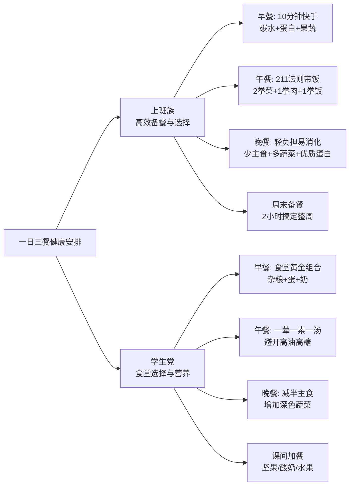

# 购物清单

## 吃的-油盐酱醋米面

### 食用油

#### **高油酸花生油** （必备）

> **高油酸花生油**的油酸含量**≥75%**。
> 油酸是一种单不饱和脂肪酸（Omega-9），也就是橄榄油中最核心的健康成分。有效降低血液中的“坏胆固醇”（LDL），同时不降低“好胆固醇”（HDL），对预防心脑血管疾病非常有利。
>
> **超级稳定，耐煎炒**  具有浓郁的花生香味
>
> 高油酸花生油相当于**“中国版的橄榄油”**。
>
> 选购：易感染黄曲霉素，买大品牌、有品质保障的

品牌推荐：

1. 鲁花-**行业标杆，香味浓郁**
2. **胡姬花 —— 古法传承，风味醇厚**
3. **金龙鱼 —— 性价比之选，大厂背书**
4. 福临门
5. **龙大 —— 区域强牌，品质稳定**

#### **低芥酸菜籽油** （必备）

> 芥酸分子较大，人体难以代谢，长期大量摄入可能在心肌和肝脏中沉积，对心脏不利（这也是欧洲曾限制菜籽油的原因）
>
> **低芥酸菜籽油**（又称双低菜籽油：低芥酸、低硫苷），其芥酸含量**≤3%**（我国标准），甚至很多优质产品≤1%，彻底消除了这一健康隐患。
>
> 饱和脂肪酸含量极低 **能自己凑齐Omega-3、6、9**
>
> **性价比极高** **烟点高，用途广**  气味清淡
>
> 选购：**明确写有“低芥酸”或“双低”字样**

品牌推荐： 

1. **道道全 —— 菜籽油专家，纯正清淡**
2. **金龙鱼 / 鲤鱼 —— 国民首选，闭眼入**
3.  **鲁花 —— 压榨工艺，香味足**
4. **长康 / 洪湖等区域品牌 —— 就近选择**

#### 选购防坑

1. **看标签，不要只看名字**：
   - 买花生油，没写“高油酸”三个字的，就是普通花生油。
   - 买菜籽油，没写“低芥酸”或“双低”的，很大可能就是传统高芥酸菜籽油（尤其是农村小作坊自己榨的，虽然香，但芥酸极易超标，不建议长期吃）。
2. **看工艺：首选“压榨”，避开“浸出”**：
   - 同等价位下，买标注**“物理压榨”**的油，不含化学溶剂残留，营养保留更好，风味更自然。浸出油虽然便宜且出油率高，但风味和营养略逊一筹。
3. **看等级：首选“一级”**：
   - 无论花生油还是菜籽油，**一级**代表杂质最少、烟点最高、油烟最少，最适合中式爆炒。虽然三级/四级保留了更多风味，但也意味着杂质多，炒菜油烟大，对呼吸道不友好。
4. **换着吃**：

#### 其它油

| **山茶油（茶籽油）** | **“东方橄榄油”**，油酸含量高达80%以上，烟点极高（约252℃）。 | **中式厨房的全能王**，煎炒烹炸凉拌皆宜，性价比高。           |
| -------------------- | ----------------------------------------------------------- | ------------------------------------------------------------ |
| **特级初榨橄榄油**   | 油酸高，富含抗氧化多酚，心血管益处证据最充分。              | **凉拌、出锅淋油、低温快炒**。精炼橄榄油烟点高可炒菜，但失去了多酚营养。 |
| **牛油果油**         | 油酸高，烟点极高（约270℃），含叶黄素。                      | **高温煎炒首选**，味道中性，不抢食材本味。                   |

#### 凉拌与低温油

这类油是补充人体必需脂肪酸α-亚麻酸（ALA）的优质来源，但**严禁高温加热**，否则营养尽失并产生有害物质

| 油脂         | 核心营养与特点                                              | 使用建议                                                |
| :----------- | :---------------------------------------------------------- | :------------------------------------------------------ |
| **亚麻籽油** | **ALA含量冠军**（约50-60%），调节血脂、抗炎。               | **仅限凉拌、调酸奶或淋汤**。需冷藏，开封后1个月内用完。 |
| **紫苏籽油** | ALA含量极高（约60-70%），抗氧化能力强，有助于改善过敏体质。 | 同亚麻籽油，**仅限低温食用**。每日5-10ml即可。          |
| **核桃油**   | 含ALA（约10-14%）、磷脂和维生素E，有益大脑和神经发育。      | 适合儿童、孕产妇辅食添加及凉拌。口感温和，易被接受。    |

#### 拉黑

**核心逻辑**：这些油要么是工业制造的真正毒药，要么是导致现代炎症大爆发的元凶。

| 油脂                       | 核心特点与简单说明                                           | 处理建议                                                     |
| :------------------------- | :----------------------------------------------------------- | :----------------------------------------------------------- |
| **反式脂肪（氢化植物油）** | 人造奶油、植脂末、起酥油、代可可脂。破坏细胞膜，明确致癌、致心血管病。 | **绝对禁忌！** 看配料表有“氢化/代可可脂/植脂末”直接扔掉。    |
| **高Omega-6精炼植物油**    | **大豆油、玉米油、葵花籽油、普通花生油**。Omega-6严重超标促发炎，且精炼过程易产生反式脂肪，极不耐高温。 | **逐步清退**。不要用来高温炒炸，尽量减少外出就餐（重灾区）。 |

---

####  猪油

（中式炒菜、拌饭、酥皮天花板）

**最好的猪油是自家买板油熬**。菜市场的鲜猪板油洗干净，加一点点水小火慢熬，加两片姜和一撮花椒，熬出来的猪油又白又香，秒杀一切市售成品。

#### 牛油

（四川火锅底料灵魂、西式煎烤）

**1. 张兵兵 / 名扬（中式火锅牛油）**

- **推荐理由**：如果你在家自己炒火锅底料、做毛血旺、水煮牛肉，这两家是四川当地的牛油巨头。张兵兵专门做原味纯牛油，熔点高，香气霸道，凉了也不容易凝固发白；名扬的火锅底料本身就是牛油王者，它家的纯牛油块也很靠谱。
- **避坑**：买火锅牛油，认准“纯牛油”，别买成“牛油底料”。

**2. 银宝（Lurpak）牛油块 / 总统牌草饲牛油**

- **推荐理由**：如果你是买来**煎牛排**或者做法式料理，需要那种淡淡的奶香而不是火锅味，选这两款。它们其实是黄油的一种（Butter），中文俗称牛油，奶香纯正，煎出来的牛排焦香四溢。

*(注意：南方人叫黄油为牛油，北方人说的牛油是火锅牛油。买的时候看英文，Butter是奶制黄油，Beef Tallow是动物牛油。)*


---

很多调味品标榜“薄盐”“轻盐”“减盐”，但实际上钠含量依然很高。
**唯一判断标准：看包装背面的【营养成分表】，找到【钠】这一栏，看NRV%（营养素参考值百分比）。**

- **NRV%的含义**：吃100g/ml该产品，摄入的钠占了你全天建议摄入量（2000mg）的百分之几。
- **对比基准**：普通酱油的钠含量NRV%通常在 **40%~50%** 之间（即吃两勺就占了一天一半的钠配额）。
- **真正的减盐标准**：**钠的NRV%必须≤25%**，或者在同类产品中钠含量确实低了一半左右，才算及格。

### 低钠食盐

- **原理**：用约30%的氯化钾替换了氯化钠。咸度差不多，但钠减少了20%-30%，同时补充了钾（钾能帮助降血压）。
- **避坑**：**肾功能不全者、正在吃保钾利尿药的高血压患者，绝对不能吃低钠盐！**（因为排钾困难，吃低钠盐容易高钾血症，有心脏骤停风险）。健康人群和普通高血压老人吃很好。

品牌推荐：

1. **中盐（低钠盐）**：国家队出品，品质最稳。便宜大碗，各大商超都有，闭眼入。
2. **雪天（低钠盐）**：湖南品牌，近年来品质很好，纯度高，也是性价比之选。
3. **粤盐（低钠盐）**：广东品牌，在华南地区市占率极高，品控优秀。
4. **鲁信/沧海**：山东的盐业品牌，海盐低钠盐做得不错。


### 减盐酱油

- **避坑**：有些牌子原来钠是45%，现在降到38%，就敢叫“减盐酱油”，其实还是很咸。必须买钠NRV%在**25%以下**的。
- **工艺**：好的减盐酱油是“原汁减盐”（用技术抽走钠），差的是“掺水减盐”（加水稀释，导致鲜味全无，甚至加更多谷氨酸钠来提鲜，又把钠补回去了）。

品牌推荐：

1. **千禾（强烈推荐）**

   **推荐型号**：**千禾零添加减盐生抽 380天**

   **理由**：千禾是做零添加起家的，这款减盐酱油没有加防腐剂和提鲜剂，靠长时间发酵的氨基酸提鲜，**钠的NRV%大概在23%左右**，真正做到了减盐且鲜味足，是目前市面上口碑最好的减盐酱油之一。

2. **海天**

   **推荐型号**：**海天薄盐生抽 / 海天减盐0添加酱油**

   **理由**：海天的工艺确实牛，它的“薄盐生抽”虽然减盐幅度不如千禾那么极致，但胜在味道最接近普通生抽，家里老人如果吃不惯太淡的，海天薄盐是最好的过渡选择。

3. **厨邦**

   **推荐型号**：**厨邦减盐特级生抽**

   **理由**：厨邦一直主打“晒足180天”，鲜度很高。它的减盐款保留了原有的鲜甜感，适合做蘸料和凉拌。

4. **李锦记**

   **推荐型号**：**李锦记薄盐醇味鲜 / 薄盐生抽**

   **理由**：李锦记的高端线做得很精致，薄盐系列口感醇厚，没有死咸感，非常适合炒菜提鲜。

###  减盐技巧

1. **出锅再放盐/酱油**：不要在炒菜中间放盐，等菜快熟了、要出锅时再放。这样盐分会附着在食物表面，舌头一碰就感觉到咸，用一半的盐量就能达到同样的咸度。
2. **加点酸/甜**：酸味可以强化咸味。炒菜时滴两滴醋或挤点柠檬汁，即使盐放得少，吃起来也不会觉得寡淡。同理，微甜也能提鲜（如红烧菜）。
3. **用葱/姜/蒜/花椒/辣椒增香**：用香料丰富味觉层次，大脑就不会只依赖“咸味”来满足口感。
4. **总量控制**：用了低钠盐和减盐酱油后，**千万别觉得“既然减盐了就可以多放点”**，那等于白减！手依然要少抖。

---

### 食醋

买食用醋，最核心的避坑原则就一条：**必须买“酿造醋”，绝对不买“配制醋”（勾兑醋）**

勾兑醋是用冰醋酸加水香精兑出来的，只有酸味没有营养；酿造醋是粮食发酵的，含有多种氨基酸和有机酸，酸味柔和且有回甘。

以下按不同的烹饪需求和口感，推荐硬核好醋：

#### 凉拌、蘸料

>  （吃的是原汁原味，要求酸味柔和、不涩）
>
> 凉拌菜对醋的要求最高，不能有刺鼻的酸味，要回味甘甜。

**1. 恒顺香醋（江苏镇江）—— 凉拌绝对王者**

* **推荐理由**：镇江香醋是“黑醋/陈醋”里的另类，它是以糯米为主要原料酿造的。**最大的特点就是“酸而不涩、香而微甜”**。拌黄瓜、拌海蜇、吃大闸蟹蘸料，用恒顺香醋最提味，它的甜鲜味能完美托出食材的本味。

* **选购避坑**：认准瓶身上有**“固态发酵”**和**“镇江香醋”**地理标志。买**3年陈**或**5年陈**的，日常用3年陈性价比最高。千万别买它家便宜的“配置食醋”。

**2. 宁化府老陈醋（山西太原）—— 纯粮醇厚派**

* **推荐理由**：说到山西醋，很多人知道水塔，但老太原人只认宁化府。它是真正的高粱纯粮酿造，没有乱七八糟的添加剂。比起镇江醋的微甜，宁化府的味道更纯粹、更冲、醇厚感极强，适合拌凉菜或吃饺子蘸料，一口下去非常解腻。

*   **选购避坑**：宁化府的“手工老醋”系列最好，看配料表只有水、高粱、大麦、豌豆。
---
#### 炒菜、红烧、炖肉

>  （需要高温烹饪，要求不易挥发、上色好）
>
> 炒菜用醋，一方面是去腥解腻，另一方面是遇热后能激发出酯香味。

**1. 东湖老陈醋（山西）—— 红烧炖肉去腥首选**

* **推荐理由**：东湖是山西老陈醋的国家标准起草单位。老陈醋经过“夏伏晒、冬捞冰”的浓缩，水分少，氨基酸含量极高。**它最大的优势是“遇热不挥发，越熬越香”**。做糖醋排骨、红烧肉、炖鱼时，顺着锅边淋入东湖老陈醋，醋香会瞬间融进肉里，而不是只留在汤汁里。

* **选购避坑**：炒菜买**3年陈**即可，5年陈以上太贵且酸度太高，炒菜有点浪费。

**2. 保宁醋（四川阆中）—— 川菜灵魂，吃火锅必备**

*   **推荐理由**：保宁醋是**药醋**，用中药制曲，麸皮为主料酿造。它的酸味带有一股独特的药香和醇厚感。如果你爱吃川菜、火锅、肥肠这类重口味的食材，保宁醋的解腻和去腥能力是全国最强的。吃重庆小面、酸辣粉，必须放保宁醋才对味。
---
#### 清淡解腻、减脂养生

> （要求酸度低、清爽）

**1. 千禾糯米白醋 —— 日常炒青菜、泡黑豆/泡姜**
*   **推荐理由**：前面都是黑醋（红醋），如果你做清淡的菜（比如醋溜土豆丝、炒豆芽），不想菜变黑，就需要白醋。千禾这款是用纯糯米酿造的，**没有刺鼻的工业酸味，带有淡淡的米香**。而且千禾主打“零添加”，配料表干干净净（水、糯米、白砂糖），用来泡黑豆、泡姜、泡蒜最安全放心。
*   **避坑**：买白醋千万看配料表，市面上很多白醋是“食用酒精+醋酸”配制的，那种只能用来打扫卫生，不能吃！

**2. 水塔老陈醋（山西）—— 平价口粮炒菜醋**

*   **推荐理由**：水塔是山西醋产量最大的品牌，性价比极高。日常家里炒大锅菜、做酸辣汤，用水塔最划算，酸味足，2年陈的价格非常亲民。
---
#### 买醋避坑
下次去超市，拿起一瓶醋，看三个地方：
1.  **看产品标准号**：
    *   **GB/T 18187** = 固态发酵酿造醋（**最好，买这个！**）
    *   **GB/T 18187** = 液态发酵酿造醋（也算真醋，但风味不如固态）
    *   **SB/T 10337** = 配制食醋（**勾兑醋，放下！**）
2.  **看配料表**：
    *   好醋配料表第一位是水，后面跟着高粱/糯米/麸皮等粮食，以及麸皮/大麦（制曲用）。
    *   差醋配料表里有“冰醋酸”、“食用醋酸”、“焦糖色”（好陈醋的颜色是熬出来的，不需要加焦糖色）、“苯甲酸钠”（防腐剂，好醋酸度高自己就能防腐，不需要加）。
3.  **看总酸度**：
    *   包装上会标“总酸≥ x.x g/100mL”。
    *   老陈醋/香醋：**≥4.5g**算及格，**≥5.0g**算好醋，**≥6.0g**属于极品（不需要放防腐剂）。
    *   白醋：**≥3.5g**算及格。
    **总结推荐清单**：
*   凉拌蘸料：**恒顺3年陈香醋**
*   红烧炖肉：**东湖3年陈老陈醋**
*   吃火锅/重口：**保宁醋**
*   炒青菜/泡食材：**千禾糯米白醋**

---


### 蚝油

蚝油不是油，而是用生蚝（牡蛎）熬煮后的汁液浓缩而成的调味品，核心作用是**提鲜增香**。但市面上几十块的廉价蚝油，往往是用味精、焦糖色和增稠剂勾兑出来的“假鲜水”。
**核心避坑原则：看配料表，蚝汁含量是灵魂，别为增稠剂和水买单！**
#### 蚝油配料表
1. **看第一成分**：必须是**蚝汁**（或水、蚝汁排在最前面）。如果配料表第一位是“水”，后面跟着“白砂糖、黄原胶（增稠剂）、焦糖色、谷氨酸钠（味精）”，那就是一瓶加了蚝味的酱汁，纯纯的勾兑蚝油。
2. **看颜色**：纯正的优质蚝油颜色偏红棕色，光泽自然；劣质蚝油往往靠焦糖色调成黑褐色，看起来浓稠发暗。
3. **看级别**：蚝油行业标准分为一级、二级、三级。**买一级！** 一级蚝油的氨基酸态氮含量更高（鲜味来源），汁浓味正。
#### 品牌推荐
**1. 李锦记旧庄蚝油 —— 蚝油界的天花板**
* **推荐理由**：李锦记就是靠卖蚝油起家的，旧庄蚝油是其高端线。配料表第一位是鲜蚝汁，不加味精提鲜，全靠生蚝本身的氨基酸，味道极其醇厚鲜美，腥味极低。

* **避坑**：价格较贵，适合做蘸料（如白灼虾蘸料）或出锅提鲜，拿来做大锅菜有点奢侈。

**2. 海天上等蚝油 / 财神蚝油 —— 国民性价比首选**

* **推荐理由**：超市出货量最大。虽然配料表里也有增稠剂和焦糖色，但海天的鲜味调配技术确实牛，日常炒青菜、腌肉、做红烧，用海天闭眼入不会出错，性价比极高。

* **避坑**：买“上等蚝油”或“财神蚝油”即可，太便宜的“金标”或杂牌蚝汁含量更低。

**3. 沙井蚝油 / 珠江桥牌 —— 地道广式风味**

* **推荐理由**：广东老字号品牌。广东人做煲仔饭、肠粉酱油、啫啫煲的灵魂调料。沙井是蚝油的发源地，它家的老字号蚝油汁水浓稠，蚝香浓郁，喜欢广式风味的首选。
#### 蚝油使用误区
1. **常温存放（极其危险）**：
   * 很多人习惯把开封的蚝油跟酱油放一起常温存放，这是大错特错！
   * 蚝油营养丰富，常温下极易滋生霉菌，甚至产生黄曲霉素。
   * **正确做法**：**开封后必须立刻放进冰箱冷藏！** 仔细看蚝油瓶身上，基本都印着一行小字：“开封后请冷藏”。
2. **高温久煮（毁掉鲜味）**：
   * 蚝油的提鲜成分在高温下容易流失，久煮还会让汤汁发黑、有腥味。
   * **正确做法**：**出锅前再放**。菜快熟准备装盘时，顺着锅边淋入蚝油翻炒均匀即可；或者用来腌制生肉、直接做凉拌蘸料。
3. **倒不出来 / 甩出半瓶**：
   * 蚝油太浓稠，倒不出来用力甩又容易倒多。
   * **小妙招**：买按压泵头的蚝油（现在很多品牌有出按压装）；或者倒之前用筷子在瓶口稍微搅动一下引入空气，就容易倒出来了。
   **总结推荐清单**：
* **追求极致鲜味/做蘸料** ➡️ 李锦记旧庄蚝油
* **日常高频炒菜/性价比** ➡️ 海天上等蚝油
* **广式风味爱好者** ➡️ 沙井蚝油
* **铁律**：配料表认准“蚝汁”，开封后**必须冷藏**，出锅前再放！

### 料酒
料酒的核心作用是**去腥解腻、增香提鲜**。肉类去腥解腻的刚需，但超市里几十块甚至十几块一大桶的料酒，往往是“食用酒精+水+焦糖色”勾兑的，去腥没用反而毁菜。其去腥的原理是：酒精（乙醇）能溶解肉类的腥味物质（三甲胺、氨基酸等），并在受热挥发时把腥味一起带走；同时料酒中的氨基酸与糖分结合，能产生酯类香味。
**核心避坑原则：料酒的本质是“黄酒”！认准“酿造料酒”，拉黑“配制料酒”（酒精勾兑水）！**

#### 料酒配料表
1. **看第一成分**：
   * ✅ **好料酒**：配料表第一位是**水、糯米（或大米/黍米）、麦曲**，这是正宗的黄酒酿造原料。
   * ❌ **劣质料酒**：配料表第一位是**水**，紧跟着是**食用酒精**。这种是用酒精和水勾兑出来的，去腥效果极差，还会留下刺鼻的酒精味。
2. **看酒精度数**：
   * 酒精度（%vol）必须**≥10%**！低于10度的料酒，酒精浓度不够，根本无法有效溶解和带走腥味物质。优质料酒通常在10%-15%之间。
3. **看添加剂**：
   * **盐**：大部分料酒里会加盐（防止变质），这没问题，但腌肉时要注意减盐。
   * **焦糖色/香精**：好料酒的颜色是粮食发酵自然形成的琥珀色，不需要加焦糖色。加了焦糖色和食用香精的，都是为了掩盖酒精勾兑的寡淡味。
#### 推荐
**1. 老恒和 / 王致和 —— 纯正黄酒底，去腥王者**
* **推荐理由**：老恒和是浙江百年老字号，做黄酒起家，它的料酒是用酿黄酒的工艺直接做的，酒香醇厚，氨基酸含量高。王致和的“特级料酒”也是黄酒打底，去腥增香效果极其稳定。
* **适合**：炖肉、红烧、腌制腥味较重的鱼羊肉，能最大程度激发酯香。

**2. 千禾零添加料酒 —— 干净配料，健康之选**
* **推荐理由**：千禾依然贯彻“零添加”路线。配料表只有水、糯米、麦曲、食用盐，没有焦糖色和香精，酒精度也达标。适合追求配料干净、给家人做健康餐的家庭。

**3. 海天 / 厨邦料酒 —— 日常性价比首选**

* **推荐理由**：国民大厂，虽然是配制料酒（含食用酒精），但调味技术成熟，日常炒青菜、简单爆炒去腥用足够了，价格便宜大碗。**避坑**：别买它家十几块钱一大桶的最基础款，尽量买“精制料酒”或“姜葱料酒”系列，黄酒汁含量稍高。
#### 使用误区
1. **“锅边淋入”用错时机**：
   * 很多人炒菜喜欢沿着高温锅边淋入料酒，听到“哧”的一声觉得很爽。但这只适合**爆炒**快速去腥。如果你是**炖肉、红烧**，直接淋在锅边，酒精瞬间挥发，香味根本没渗进肉里，等于白放。
   * **正确做法**：炖煮肉类时，料酒应该在**加水炖煮前**直接倒在肉块上，随着温度缓慢升高，酒精慢慢渗透并带走腥味。
2. **调肉馅/包饺子乱加料酒**：
   * **大忌！** 肉馅包在面皮里，料酒的酒精无法挥发出去，会被捂在饺子里，吃起来有一股怪异的发酵酸味。
   * **替代方案**：调肉馅去腥，用**花椒水、葱姜水**代替料酒，既能去腥又增香，还不留异味。
3. **绿叶菜加料酒**：
   * 蔬菜本身没有腥味，炒青菜加料酒纯属画蛇添足，不仅破坏蔬菜清香，料酒里的盐分还会让蔬菜出水变蔫。

**总结推荐清单**：

* **追求纯正去腥/炖红烧肉** ➡️ 老恒和料酒 / 王致和特级料酒
* **配料干净/健康烹饪** ➡️ 千禾零添加料酒
* **铁律**：酒精度必须≥10%，第一位必须是黄酒原料，**包饺子绝对不能放料酒**！


### 糖与代糖
精制糖是导致肥胖、血糖波动和皮肤糖化（长痘、衰老）的元凶，而代糖市场鱼龙混杂。

糖是厨房调味的刚需（提鲜、上色、发酵），但也是健康杀手。减脂期、糖友或日常控糖人群往往需要用代糖（甜味剂）来解馋。**核心避坑原则：天然糖选黄冰糖和真红糖，代糖首选赤藓糖醇和罗汉果苷，坚决拉黑“赤砂糖”和廉价人工合成甜味剂！**

#### 天然糖

> （传统调味用）

1. **白砂糖 / 绵白糖**
   * **特点**：精制白糖，纯度高，提供甜味和热量。绵白糖水分稍高、易融化，适合凉拌或蘸食；白砂糖颗粒分明，适合烘焙和炒糖色。
   * **建议**：日常炒菜“提鲜”尽量少放，不健康的烹饪习惯。
2. **冰糖（推荐黄冰糖）**
   * **特点**：白冰糖是白糖结晶，多晶老黄冰糖未经脱色，保留了甘蔗的微量元素，中医认为其润肺生津效果更好。
   * **建议**：做冰糖雪梨、红烧肉炒糖色，首选**多晶老黄冰糖**。
3. **红糖 / 黑糖（避坑重灾区）**
   * **致命避坑**：超市里十几块钱一大包的便宜“红糖”，配料表往往写着“**赤砂糖**”。这是白砂糖生产过程中的工业尾料，杂质多，毫无补血养生功效！
   * **怎么买**：真正的红糖是甘蔗榨汁直接熬制，未高度精炼。**配料表必须只有“甘蔗”或“甘蔗汁”**。黑糖只是熬制时间更长、颜色更深的红糖。
   * **品牌推荐**：古方红糖、太古红糖。
#### 代糖 / 甜味剂

> （控糖减脂用）代糖种类繁多，安全性参差不齐，按优先级排序如下：
>

**1. 糖醇类（首选，安全性较高）**

* **赤藓糖醇**：目前最火的代糖。热量极低（接近0），升糖指数（GI）为0，不引起血糖波动，耐受量较高，口感带一点清凉感。是冲咖啡、做无糖饮料的首选。
* **木糖醇**：甜度与白糖相当，有防龋齿效果。但GI值不为0（约7），热量是白糖的60%。**警告**：吃多极易引起腹胀、腹泻（渗透性腹泻）；且对狗有剧毒，养宠家庭绝对不能碰。
* **麦芽糖醇**：常用于无糖糕点、巧克力。口感最像真糖，但GI值比前两者高，且非常容易引起肠胃产气胀气。
**2. 天然提取甜味剂（第二选择，热量极低）**
* **罗汉果甜苷**：从罗汉果提取，甜度极高但热量为0，口感纯正无异味，耐高温，适合中式冲饮和烘焙。
* **甜菊糖苷**：从甜叶菊提取，热量为0。**缺点**：有明显的草腥味和微苦的后味，一般不单独使用，常与赤藓糖醇复配掩盖苦味。
**3. 人工合成甜味剂（尽量避开）**
* **代表成分**：阿斯巴甜、三氯蔗糖（蔗糖素）、安赛蜜、糖精钠。
* **避坑理由**：虽然热量为0且国标允许，但长期大量摄入可能干扰肠道菌群，影响胰岛素敏感性。市面上几块钱的廉价“无糖饮料”和“无糖零食”多用这类成分，能不吃就不吃。
* **品牌推荐（代糖）**：太古/展艺赤藓糖醇（烘焙用）；零卡糖复配粉（罗汉果+赤藓糖醇，如各家出的0卡糖）。
#### 使用误区
1. **“无糖食品”敞开吃**：
   * 很多无糖饼干、无糖糕点，虽然没加白砂糖，但配料表里全是**精制面粉（精制碳水）**，升糖速度依然极快！糖尿病人千万别以为标了“无糖”就能当饭吃。
2. **代糖能减肥**：
   * 代糖只是“不额外增加热量”，它本身不燃烧脂肪。部分人工代糖还会欺骗大脑的奖赏机制，让你产生“补偿性食欲”，反而吃得更多。减肥的根本依然是制造热量缺口。
3. **烘焙1:1替换白糖**：
   * 赤藓糖醇的甜度只有白糖的70%左右，若想达到同等甜度需增加用量。更关键的是，赤藓糖醇**无法像白糖那样发生焦糖化反应**，也提供不了保湿和蓬松度，直接替换会导致烤出的蛋糕发干、偏硬。
   **总结推荐清单**：
* **日常炖煮/泡水** ➡️ 多晶老黄冰糖 / 真红糖（配料表只有甘蔗）
* **冲饮/轻度烘焙** ➡️ 赤藓糖醇 或 罗汉果代糖
* **铁律**：配料表看到“赤砂糖”直接放下；看到“阿斯巴甜/三氯蔗糖”能避就避！

---

### 大米

究地域口味，所谓“南籼北粳”，南方人爱吃细长松散的籼米（丝苗米），北方人爱吃圆润软糯的粳米（东北米）。

**买大米的核心避坑原则只有一个：必须买“GB/T 1354”开头的执行标准，这只是普通合格大米！**要想吃好米，得认准**地理标志保护产品的专属执行标准**。

买大米其实比买油买醋更讲究地域口味，所谓“南籼北粳”，南方人爱吃细长松散的籼米（丝苗米），北方人爱吃圆润软糯的粳米（东北米）。
但不管你爱吃什么米，**买大米的核心避坑原则只有一个：必须买“GB/T 1354”开头的执行标准，这只是普通合格大米！**要想吃好米，得认准**地理标志保护产品的专属执行标准**。

以下按不同口感和需求，为你推荐目前市面上最硬核的好米：

#### 东北粳米派：软糯油润、饭香四溢
*适合：喜欢米饭软糯、油亮亮、单吃白米饭都很香的人。*
**1. 五常大米 —— 东北米的天花板**
* **核心推荐**：乔府大院 / 葵花阳光 / 十月稻田（高端线）

* **推荐理由**：五常大米（稻花香2号）是中国最好吃的大米之一，没有之一。煮熟后满屋飘香，米饭油光发亮，吃起来软糯微甜，放凉了也不回生。

* **避坑必看**：市面上90%的五常大米都是假的！**必须认准包装上的执行标准号：GB/T 19266**。只要没有这串数字，哪怕包装上写了“五常”俩字也是调和米。另外，纯正五常米很贵（通常6元/斤以上），太便宜的绝对买不到真货。

  

**2. 盘锦大米 —— 性价比之王，日常口粮首选**

* **核心推荐**：北纬42度 / 认臻 / 太子河

* **推荐理由**：同在东北，盘锦大米的口碑极好，属于“越嚼越香”的类型。它没有五常那么浓的香味，但口感扎实，软硬适中，不粘牙，配菜吃特别爽口。最关键的是，**它是高端米里的性价比之王**，三四十块钱就能买到很好的正宗盘锦米。

* **避坑必看**：认准执行标准号：**GB/T 18824**。

  

**3. 延边朝鲜族大米 —— 东北米里的“小透明”但惊艳**

* **核心推荐**：海兰江 / 延边本地品牌

* **推荐理由**：很多老饕私藏的宝藏米。因为延边昼夜温差更大，这里的米比普通东北米更Q弹、更甜糯，用来做日式饭团、韩式拌饭简直一绝。

*   **避坑必看**：认准执行标准号：**GB/T 22438**。
---
#### 南方籼米派：粒粒分明、松散干爽
*适合：喜欢吃扬州炒饭、煲仔饭、咖喱饭，要求米饭不粘连、吸汤汁的人。*

**1. 增城丝苗米 —— 籼米界的“米中之王”**

*   **核心推荐**：挂绿 / 朱村 / 太粮
*   **推荐理由**：正宗的增城丝苗米，米粒细长苗条，泛着丝光。煮熟后饭粒分明，互不粘连，吃起来柔韧有嚼劲，吸水性极强。做煲仔饭能吸满腊味的油脂，底部还能结出完美的锅巴！
*   **避坑必看**：认准执行标准号：**GB/T 23402**（增城丝苗米）。

**2. 鄱阳湖/江西籼米 —— 南方人的实惠口粮**

*   **核心推荐**：金佳 / 狗牯脑（周边品牌）
*   **推荐理由**：江西是南方产粮大省，这里的晚籼米品质极好，出饭率高，口感清爽不腻，是南方家庭日常干饭、做炒饭的最实在选择，价格非常亲民。
---
#### 杂粮/特色米：减脂控糖必备
*适合：糖友、减脂人群、孕产妇。*

**1. 燕之坊 七色糙米**

* **推荐理由**：买糙米最怕的是煮不烂、伤胃。燕之坊是国内做杂粮的大品牌，它这款七色糙米经过了一定的预处理（部分发芽或轻度破壁），比生硬的糙米好煮熟得多，口感有嚼劲但不费牙，升糖指数低，和白米按1:3的比例混煮最健康。

  

**2. 十月稻田 胚芽米 / 鲜米**

*   **推荐理由**：如果家里有宝宝，强烈推荐吃胚芽米。保留了米粒最营养的胚芽部分（普通白米都磨掉了），口感比糙米细腻得多，比精白米营养高得多。十月稻田的鲜米系列包装很好，锁鲜做得不错。
---
#### 买大米防坑指南：
1.  **看执行标准号（最关键）**：
    *   `GB/T 1354` = 普通合格大米（凑合吃）
    *   `GB/T 19266` = 五常大米（好吃但贵）
    *   `GB/T 18824` = 盘锦大米（性价比高）
    *   `GB/T 22438` = 延边大米（Q弹软糯）
    *   `GB/T 23402` = 增城丝苗米（干爽粒明）
2.  **看等级**：大米分一级、二级、三级、四级。**买一级！**一级米留皮留胚最少，外观最漂亮，口感最好。
3.  **买小包装**：大米开封后超过一个月，风味就会断崖式下降，还容易长米虫。建议**一次只买5斤或10斤装**，吃完再买，别贪便宜买50斤的大编织袋。
4.  **新米vs陈米**：看米粒腹部有没有白色的“腹白”，有腹白的一般是新米；闻起来有清香的是新米，有陈放味的是陈米。


### 小米

买小米和买大米一样，最怕买到“陈米”和“染色米”。小米一旦放久了，不仅米油熬不出来，营养流失，还容易有一股子捂过的陈味。

买小米的核心口诀是：**认准地理标志，买新不买陈，首选沁州黄。**

买小米和买大米一样，最怕买到“陈米”和“染色米”。小米一旦放久了，不仅米油熬不出来，营养流失，还容易有一股子捂过的陈味。
买小米的核心口诀是：**认准地理标志，买新不买陈，首选沁州黄。**

#### 熬粥神器：米油厚、最养胃（粳性小米）
如果你买小米就是为了熬出那层厚厚的“米油”（米皮），给老人、孕妇、宝宝养胃喝，必须买北方干旱温差大地区产的粳性小米。

**1. 沁州黄小米（山西长治）—— 小米中的“软黄金”**

* **核心推荐品牌**：沁州牌 / 谷之旗 / 万里

* **推荐理由**：中国最顶级的小米品种，清朝康熙皇帝御赐的“沁州黄”。这种小米生长在干旱的黄土高原，昼夜温差极大，淀粉和蛋白质积累极多。**它最大的特点就是非常容易出米油**，熬出来的粥金黄透亮，放凉了表面能挑起一层厚厚的皮，口感软糯微甜。

* **避坑必看**：认准包装上的国家地理标志保护产品标识，以及执行标准号：**GB/T 19503**。

**2. 敖汉小米（内蒙古赤峰）—— 世界级产地，性价比之王**

* **核心推荐品牌**：孟克河 / 敖汉旗本地品牌 / 十月稻田（敖汉产）

* **推荐理由**：敖汉被称为“世界旱作农业发源地”，这里的小米被联合国粮农组织列为全球重要农业文化遗产。因为光照更足，敖汉小米的颗粒比沁州黄稍微大一点点，非常饱满，熬粥也很粘稠，但**价格比沁州黄更亲民**，是日常口粮的首选。

* **避坑必看**：认准执行标准号：**GB/T 24902**（或地方标准）。

  

**3. 陕北小米（陕西延安/米脂）—— 历史名米，熬粥最浓**

* **核心推荐品牌**：陕果集团 / 米脂本地品牌

* **推荐理由**：“米脂县”就是因为盛产小米（米汁如脂）而得名的。陕北小米颗粒圆润，色泽鲜黄，熬出来的粥黏糊度极高，带有浓郁的粮食原香。

*   **避坑必看**：真正的米脂小米产量有限，价格不会太便宜。
---
#### 煮饭煮粥两相宜：粒粒分明（糯性小米）
普通小米（粳性）如果直接煮饭，口感会比较粗糙发干。如果你想吃“小米饭”或者二米饭（大米+小米），需要买**糯性小米**。
**1. 济农糯小米 / 沁州黄糯小米**
*   **推荐理由**：这是近年来培育的新品种，支链淀粉含量极高。它的口感像糯米一样黏软，没有普通小米那种糙感。用来蒸小米饭、包小米粽子、做小米糕点，或者给刚加辅食的宝宝吃，口感最细腻顺滑。
---
#### 买小米踩坑！
1.  **别买“染色黄”小米**：
    *   有些陈年小米发白发灰，无良商家会用姜黄素或合成色素染色。**鉴别方法**：拿一张湿纸巾，抓一把小米在上面搓几下，如果纸巾明显变黄，就是染色米！正常小米搓完只会留下点点碎屑，不会严重掉色。
2.  **别买“闻着霉”的小米**：
    *   新鲜小米有一股淡淡的粮食清香；陈小米闻起来有股**捂味、酸味或霉味**。如果闻不到味道，抓一把放在手心哈口热气再闻，陈味立刻暴露。
3.  **别买“光泽暗”的小米**：
    *   新小米表面有一层自然的光泽（因为富含米油）；陈小米看起来像蒙了一层灰，干瘪无光。有些商家为了给陈米提亮，会**给小米抹矿物油**。用手搓一搓，如果手指摸起来滑腻腻的有油感，千万别买。
---
#### 熬出“厚米油”的终极秘籍
好米也要配好方法，否则米油出不来：
1.  **千万不要冷水下锅！** 水烧开后，再倒小米。
2.  **滴两滴食用油**：开水里滴2滴花生油或香油，不仅防止溢锅，还能让米油更厚更亮。
3.  **大火转小火，绝不揭盖**：大火煮5分钟后，转最小火熬30-40分钟，期间**绝对不要揭开锅盖**（跑气了米油就出不来了）。
4.  **别加碱**：很多人为了让粥粘稠加食用碱，这会彻底破坏小米里的维生素B族，等于白吃了！
**总结推荐清单**：
*   **追求极致养胃/送孕妇宝宝** ➡️ 买正宗 **沁州黄**（GB/T 19503）
*   **日常高性价比熬粥** ➡️ 买 **敖汉小米**
*   **想做小米饭/糕点** ➡️ 买 **糯性小米**

---

### 面粉

买面粉比买大米简单，因为大米看产地，而**面粉只看“筋度”（蛋白质含量）**。
买面粉的核心避坑原则：**不要看包装正面花里胡哨的名字（什么雪花粉、麦芯粉、富强粉），直接翻到背面看【营养成分表】，找【蛋白质】含量！**

蛋白质含量决定了面粉的筋度，筋度决定了你能拿它做什么。以下是按需求分类的硬核购买指南：

#### 低筋面粉（蛋白质 8.0% - 9.5%）
**用途：做蛋糕、饼干、马卡龙等蓬松酥脆的西点。**
如果你用高筋面粉做蛋糕，出来的就是一块死面疙瘩，绝对发不起来。

**1. 美玫牌低筋面粉**

*   **推荐理由**：烘焙圈公认的“蛋糕神粉”。美国产，粉质极其细腻洁白，吸水性稳定。做戚风蛋糕、海绵蛋糕，打发后不易消泡，烤出来组织细腻松软，几乎是烘焙新手的必买粉。
*   **注意**：市面上假美玫很多，一定要认准正规的代理商或自营店。

**2. 新良低筋面粉**
*   **推荐理由**：国产老牌，性价比极高。粉质也很细腻，日常做饼干、小蛋糕完全够用，价格比美玫便宜一大截，适合烘焙消耗量大的家庭。
---
#### 高筋面粉（蛋白质 12.0% 以上）
**用途：做面包、吐司、披萨饼底、油条。**需要强韧的面筋来包裹气体，才能膨胀拉丝。

**1. 白燕高筋面粉**
*   **推荐理由**：国产面粉里的“做面包天花板”。很多私房烘焙店都在用，吸水率极高（能加更多水，面包更软），面筋延展性极好，做吐司能拉出完美的“手套膜”，放两三天也不容易变硬。

**2. 金象牌高筋面粉**
*   **推荐理由**：泰国老牌，老烘焙人都知道。稳定性极强，不容易翻车，做出来的面包麦香味很足。但近年代理比较乱，注意别买到假货。

**3. 新良黑袋（日式吐司粉）**

*   **推荐理由**：新良的高端线，专门针对日式软面包研发。比普通高筋粉更白更细，做出来的吐司极其绵软，适合喜欢那种入口即化的日式口感。
---
#### 中筋面粉（蛋白质 9.5% - 11.5%）
**用途：做馒头、包子、饺子、面条、煎饼等一切中式面食。**这是中国家庭最常用的面粉。
中筋面粉的选购最不需要焦虑，因为国内大厂的技术非常成熟，几十块钱一袋（5kg）的口粮面，品质都很稳定。

**1. 五得利（强烈推荐）**
*   **推荐理由**：全球最大的面粉企业，河北老牌。它家的面粉性价比无敌，麦香味浓郁，做馒头个头大、不塌陷；擀饺子皮劲道不易破。
*   **怎么选**：五得利按星级分类（1星到9星）。**家庭日常吃，买6星或8星（特精粉/雪花粉）最好**，白度细度适中。9星太贵，1-3星偏黑适合做烙饼。

**2. 香雪面粉**
*   **推荐理由**：东北老大哥，沈阳品牌。因为东北小麦生长周期长，香雪的面粉吃起来有一股淡淡的甜味，做出来的馒头面条特别有“面味”，东北家庭首选。

**3. 古船 / 河套**

*   **推荐理由**：古船是北京人的心头肉，河套（内蒙古）是西北人的白月光。都是地域霸主，品质极硬，买当地最顺手的就行。
---
#### 面粉包装“文字游戏”
去超市你会看到很多奇怪的名字，其实它们都是中筋面粉的变种：
*   **麦芯粉**：用小麦最中心的部分磨的粉。**最白、最细、最没味**。适合做白面馒头、水晶饺子皮。但营养相对单一，麦香淡。
*   **雪花粉/特精粉**：加工精度很高的中筋粉，非常白，做出来的面食卖相极好。
*   **全麦粉**：保留了麸皮和胚芽，营养最全，但口感粗糙，做出来的馒头偏硬偏黑。**买全麦一定要看配料表，有些是“白粉+麸皮”回添的，最好买“整粒小麦研磨”的。**
*   **自发粉**：中筋粉+泡打粉。适合懒人做炸糊、快手松饼，**绝对不能用来包饺子或做面条**（因为加热后会膨胀发泡，饺子皮会变成小面包皮）。
---
#### 买面粉细节
1.  **看执行标准号**：
    *   `GB/T 1355` = 最基础的通用小麦粉（中筋为主）
    *   `GB/T 8607` = 高筋小麦粉
    *   `GB/T 8608` = 低筋小麦粉
    *   如果是这仨国标，基本不会踩雷。如果是`LS`（粮食行业标准）或`Q`（企业标准），品质参差不齐，需谨慎。
2.  **看生产日期**：面粉的保质期通常只有6-12个月。**面粉越新越好！**陈面粉不仅麦香全无，还容易生虫（面虫）或产生哈喇味（脂肪氧化）。
3.  **手感判断**：抓一把面粉攥紧，松开手如果面粉自然散开，说明含水量正常；如果结成硬块，说明受潮了，别买。
**总结推荐清单**：
*   **做蛋糕/饼干** ➡️ 美玫低筋粉
*   **做面包/吐司** ➡️ 白燕高筋粉 / 新良黑袋
*   **做馒头/饺子/面条** ➡️ 五得利6星/8星 / 香雪

---

## 蛋奶-肉类

### 蛋

蛋类是名副其实的“全营养食品”，不仅富含最优质的蛋白质，还含有卵磷脂、维生素A、D、E以及多种矿物质。

虽然市面上蛋的种类繁多，但**从核心营养角度来看，所有蛋类的差异其实并不大**。

#### 日常首选：鸡蛋
无论从性价比、营养密度还是氨基酸结构来看，鸡蛋都是当之无愧的No.1。
*   **核心优势**：氨基酸比例与人体需求极为接近，吸收率极高；蛋黄中富含卵磷脂（益脑）和叶黄素（护眼）。
*   **颜色选择（红壳 vs 白壳）**：
    *   **营养几乎无差**！蛋壳颜色由母鸡品种决定，与营养无关。
    *   选哪个？**看哪个新鲜买哪个，或者看哪个便宜买哪个**。
*   **饲养方式（普通 vs 土鸡蛋）**：
    *   土鸡蛋（散养）口感可能更香，脂质比例可能略有不同，但**蛋白质和核心矿物质含量与普通笼养鸡蛋基本一致**。
    *   选哪个？追求口感和风味选土鸡蛋；追求高性价比和稳定品控选普通鲜蛋。
---
#### 其他禽蛋
如果你吃腻了鸡蛋，或者想换换口味，可以尝试以下蛋类，它们在某些细微营养上各有千秋：
| 蛋类        | 特点与营养偏向                                               | 推荐吃法/人群                                                |
| :---------- | :----------------------------------------------------------- | :----------------------------------------------------------- |
| **鸭蛋**    | 体积大，脂肪含量高于鸡蛋，性偏凉。                           | **最适合做咸鸭蛋/皮蛋**。因为脂肪多，腌制后出油多，口感沙软。 |
| **咸鸭蛋**  | 含盐量极高！但**铁和钙含量**在加工中显著提升。               | 偶尔解馋，**高血压、孕妇需严格控量**（一天最多半个）。       |
| **鹅蛋**    | 体积最大，脂肪和胆固醇含量最高，质地相对粗糙。               | 孕晚期常被推荐（民俗去胎毒），但医学上无此依据，**心血管人群少吃**。 |
| **鹌鹑蛋**✓ | 营养密度高，**维生素B2和铁含量**略优于鸡蛋，胆固醇与鸡蛋相当。 | 适合老人小孩，一口一个方便进食；卤制做零食极佳。             |
| **鸽子蛋**  | 产量低价格贵，但**营养指标与鸡蛋高度重合**，并无特殊奇效。   | 适合追求口感细嫩的群体，**不建议为了“大补”花冤枉钱**。       |
---
#### 市场上的“概念蛋”？
超市里经常看到高钙蛋、富硒蛋、初生蛋等，价格往往翻倍。
*   **富硒蛋 / Omega-3强化蛋**：✅ **可以买**。这是通过在鸡饲料中添加特定营养素（如亚麻籽、海藻）产生的，确实能显著提升蛋中硒或Omega-3脂肪酸的含量，对心血管和大脑有益。
*   **初生蛋（开窝蛋）**：❌ **智商税**。只是母鸡下的头几个蛋，个头小，但营养浓度并不比普通鸡蛋高。
*   **无菌蛋**：✅ **做溏心蛋/生食推荐**。经过严格杀菌，不含沙门氏菌。但**做全熟蛋没必要买**，因为普通鸡蛋煮熟后也绝对安全。
---
#### 怎么吃最健康？
吃什么蛋是次要的，**怎么烹饪才是决定健康的关键**！
1.  **最佳烹饪排名**：
    *   🥇 **水煮蛋**（带壳）：营养保留100%，好消化。
    *   🥈 **蒸蛋羹/水波蛋**：好消化，适合老人小孩。
    *   🥉 **嫩煎蛋/炒蛋**：少油快炒，营养流失少。
    *   ❌ **避雷：煎荷包蛋/炸蛋**：高温油炸会破坏维生素，产生致癌物，且吸满油脂，热量炸弹。
2.  **蛋黄必须吃**：鸡蛋90%的营养（铁、卵磷脂、维生素）都在蛋黄里，只吃蛋白等于丢了西瓜捡芝麻。
3.  **熟度问题**：**坚决不吃生鸡蛋/半熟普通蛋**。生蛋清含抗生物素蛋白，会阻碍生物素吸收，且易感染沙门氏菌。除非是标明“可生食”的无菌蛋。
4.  **每天吃多少？**
    *   健康成年人：**每天1个全蛋**，或一周5-7个。
    *   血脂异常/心血管疾病：**每天半个蛋黄，或每两天1个全蛋**（蛋白可随意吃）。
    *   增肌/健身人群：可多吃蛋白，适度控制蛋黄摄入量。

**闭眼买新鲜鸡蛋，红壳白壳营养一样；别为了“大补”买贵价蛋；带壳水煮是最完美的吃法，蛋黄千万别扔！**

### 奶

从营养核心来看，**奶粉就是经过脱水处理的液态奶**。现代奶粉生产工艺（主要是喷雾干燥法）能够在去除水分的同时，极大程度地保留牛奶中的蛋白质、钙和脂肪等核心营养。

#### 奶粉 VS 鲜奶

| 对比维度       | 鲜奶（巴氏奶/常温奶）     | 奶粉                                           | 结论                                              |
| :------------- | :------------------------ | :--------------------------------------------- | :------------------------------------------------ |
| **核心营养**   | 蛋白质、钙、脂肪          | 蛋白质、钙、脂肪（基础营养几乎无差）           | **平局**                                          |
| **维生素**     | 保留较好                  | 部分热敏性维生素（如维C、部分B族）流失约10-20% | **鲜奶小胜**（但奶本来就不是维C主要来源，可忽略） |
| **吸收消化**   | 乳糖天然存在              | 乳糖浓缩，**乳糖不耐受者喝了更容易拉肚子**     | **鲜奶胜**（除非选脱乳糖奶粉/舒化奶）             |
| **便携与储存** | 笨重、重、需冷藏/保质期短 | 轻便、常温保存、保质期长达1-2年                | **奶粉完胜**                                      |
| **性价比**     | 单盒购买，价格较高        | 批量购买，单杯成本通常更低                     | **奶粉胜**                                        |
| **浓度自由度** | 固定                      | **可自行调整粉水比例**（想补钙多放一勺）       | **奶粉胜**                                        |

#### 不同人群建议

**1. 普通健康成年人 / 学生 / 上班族：完美替代 **

- 奶粉是极其高效的蛋白质和钙来源，尤其适合早晚各冲一杯，比囤鲜奶更省事。

**2. 乳糖不耐受人群（喝奶拉肚子/胀气）：需挑种类**

- **不能用普通全脂/脱脂奶粉直接替代！** 因为奶粉中的乳糖是被浓缩的，喝了反应可能更剧烈。
- **替代方案**：必须选择**“无乳糖奶粉”**或**“舒化奶”**，或者选择**酸奶**。

**3. 减脂 / 健身人群：脱脂/低脂奶粉是利器**

- 鲜奶中的全脂奶脂肪不低，脱脂鲜奶又往往不好买且贵。
- **替代方案**：直接买**脱脂奶粉**，低卡高蛋白，冲泡时还可以故意冲浓一点增加蛋白质摄入，非常方便。

**4. 中老年人：中老年专属奶粉更优**

- 鲜奶就是单纯的奶，而**中老年奶粉是“强化营养”**。
- **替代方案**：市面上的中老年奶粉通常会额外添加**钙、维生素D（促钙吸收）、益生菌（护肠胃）、低聚糖（防便秘）**，甚至有些会降低乳糖，比纯鲜奶更适合长辈。

**5. 婴幼儿：绝对不能互换！**

- **1岁以内**：只能喝配方奶粉，绝不能喝鲜奶或普通奶粉（肾脏负担过重，营养不均衡）。
- **1-3岁**：仍建议以配方奶为主，鲜奶为辅。

#### 购买指南


**1. 警惕“假奶粉”——学会看配料表**
这是最重要的一点！市面上很多叫“奶”的，其实是“饮料”。

- ✅ **真奶粉（纯奶粉）**：配料表只有三个字——**“生牛乳”**。
- ❌ **假奶粉（调制乳粉）**：配料表第一位是生牛乳，但后面跟着一长串：**白砂糖、麦芽糊精、香精、植脂末**。这等于在喝加糖的奶，完全背离了健康初衷。
- 🌟 **功能型奶粉（可接受）**：配料表是生牛乳+营养强化剂（如碳酸钙、维生素D等），没有加糖，这种是好的。

**2. 冲泡的水温有讲究**

- **千万别用沸水冲！** 沸水会破坏奶粉中残存的维生素，还会让蛋白质变性结块，影响消化。
- **正确做法**：用 **40℃-50℃ 的温水** 冲泡，先加水，再加粉，搅拌均匀。

**3. 浓度要适中**

- 别为了“多补营养”就加很多粉，浓度过高会增加肾脏负担，甚至导致渗透性腹泻。
- 按照包装上的推荐比例冲泡即可（通常是1平勺奶粉配30ml或50ml水）。


### 酸奶
很多人觉得酸奶促消化、能减肥，其实市面上80%的“酸奶”都是披着健康外衣的“糖水”。买酸奶的核心原则只有一条：**必须买“纯酸乳”或“无添加酸奶”，坚决拉黑“乳酸菌饮料”和加了大量糖的“风味发酵乳”！**
#### 3秒钟看懂酸奶配料表（避坑核心）
1. **看第一成分**：必须是**生牛乳**（且含量≥80%）。如果配料表第一位是“水”，那它就是饮料，不是酸奶！
2. **看配料长短**：越短越好。真正的好酸奶配料表只有两样：**生牛乳 + 发酵菌**（如保加利亚乳杆菌、嗜热链球菌）。
3. **拉黑名单成分**：看到配料表里有“白砂糖、果葡糖浆、稀奶油、明胶、琼脂、果胶”，尽量放下。加了糖和增稠剂的叫“风味发酵乳”，本质是甜品。
4. **看营养成分表**：
   - **蛋白质**：必须 **≥2.9g/100g**（纯酸乳国标）。低于2.3g的通常是饮料。
   - **碳水化合物（糖）**：纯酸奶天然含有约5g左右的乳糖。营养成分表里碳水高于6g的部分，基本都是额外加的白砂糖！买无糖酸奶，碳水越低越好（最好在4-5g左右）。
#### 需求选酸奶
##### 纯正无添加酸奶（健康首选，全家适宜）
配料表只有生牛乳和菌种，无糖无代糖，口感偏酸。这是最推荐的酸奶类型。
* **品牌推荐**：
  * **光明 如实**：无糖酸奶的标杆，配料极其干净，附赠一小包蜂蜜可自己调味，新手友好。
  * **简爱 0%蔗糖原味酸奶**：主打“无糖无代糖”，口感醇厚，市场接受度较高。
  * **和润 纯酸奶**：极其纯粹的生牛乳发酵，质地偏稀，适合做酸奶碗或拌沙拉。
##### 高蛋白希腊酸奶（减脂/健身党首选）
通过过滤乳清，把蛋白质浓缩到极高（通常≥6g/100g），碳水极低，口感浓稠如奶酪。
* **品牌推荐**：
  * **乐纯 滤乳清酸奶**：蛋白质极高，口感扎实，是市售希腊酸奶的代表。
  * **DIY希腊酸奶（终极性价比）**：买普通的“如实”或“简爱”无糖酸奶，用纱布包住吊起来放冰箱过滤一晚。析出乳清后，留下的就是完美的希腊酸奶，成本减半！
##### 乳糖不耐受/便携首选（常温酸奶）
经过后期高温杀菌处理，没有活菌，但乳糖已被分解，喝了不拉肚子。无需冷藏，适合出门携带或肠胃极其脆弱者。
* **品牌推荐**：
  * **莫斯利安 / 安慕希 / 纯甄（选无糖或低糖款）**：常温酸奶三巨头。**注意**：它们的标准款含糖量极高，一定要认准包装上写着“0蔗糖”或“无添加蔗糖”的系列购买。
##### 风味酸奶（实在受不了纯酸的妥协之选）
如果实在吃不惯无糖酸奶，必须买调味的，也要选相对健康的底线款。
* **选购底线**：配料表第一位仍是生牛乳，糖排在靠后位置，最好用代糖（如赤藓糖醇）代替白砂糖。
* **品牌推荐**：**简爱 超级桶（代糖款）**、**卡仕 鲜酪乳**（口感极好，但需注意看含糖量，适合做过渡）。
#### 喝酸奶的致命误区
1. **误区一：乳酸菌饮料能促消化**。养乐多、优酸乳这类配料表第一位是水的产品，本质是糖水+少量菌，喝多了只会长胖，对消化无益。
2. **误区二：酸奶能减肥**。超市里那些好喝的甜酸奶，为了掩盖酸味加了极多的糖，热量比可乐还高！只有“无糖纯酸奶”才能辅助减脂。
3. **食用建议**：低温活菌酸奶从冰箱拿出来后，最好在室温放一会儿再喝，避免刺激肠胃；**绝对不要加热**（超40℃益生菌会全军覆没）。饭后半小时喝，有助于活菌在胃酸较少时进入肠道。


----


> 买肉别只看哪个牌子“大”，**部位选对、做法匹配**，比盲目追品牌更重要。把“部位怎么选”和“品牌怎么挑”说清楚，买得明白、吃得香。

### 牛肉


牛肉常被视为高蛋白肉类，但**不同部位差异很大，烹饪方式不匹配很容易变柴**。先确定做法，再选部位。
| 部位              | 特点与推荐做法                           | 品牌推荐（按需求）                                           |
| :---------------- | :--------------------------------------- | :----------------------------------------------------------- |
| **牛腱子**        | 肉筋相间，久煮不柴。**卤牛肉、酱牛肉**。 | **日常性价比**：恒都、大庄园<br>**高端草饲**：春禾秋牧、科尔沁 |
| **牛腩** ✕        | 肥瘦相间，有筋膜。**炖牛腩、番茄牛腩**。 | **日常性价比**：鲜京采、恒都<br>**有机/高端**：科尔沁、大庄园 |
| **牛里脊/菲力** ✓ | 最嫩，纯瘦肉。**煎牛排、炒牛柳**。       | **原切牛排**：西捷、肉管家<br>**健身轻食**：恒都、正大食品   |
| **牛霖/黄瓜条** ✓ | 瘦肉为主，略有嫩筋。**爆炒、烤肉**。     | **日常炒肉**：正大食品、泰森                                 |
> 💡 **选购核心**：新鲜牛肉**呈均匀深红色、有光泽、脂肪乳白或微黄、表面微干不粘手、指压后凹陷能立即恢复**。买原切牛排看配料表，只有“牛肉”才是真原切。
### 羊肉：偶尔吃冬季
羊肉香味和膻味都更明显，<u>温补佳品</u>适合冬季炖汤、火锅、烧烤。**是否接受膻味是选择的关键**。
| 部位/类型       | 特点与推荐做法                                   | 品牌推荐（按需求）                                           |
| :-------------- | :----------------------------------------------- | :----------------------------------------------------------- |
| **羊腿/羊排** ✕ | 肉质紧实，有肥有瘦。**烤羊排、手抓肉、炖萝卜**。 | **日常性价比**：东来顺、大庄园、草原宏宝<br>**宁夏滩羊**：涝河桥 |
| **羊肉卷/肥牛** | 薄片，速熟。**火锅、涮羊肉**。                   | **火锅必备**：东来顺、大庄园、草原峰煌                       |
| **羊里脊** ✓    | 极嫩，纯瘦。**烤串、爆炒**。                     | **高端羔羊**：春禾秋牧、蒙羊                                 |
> 💡 **选购核心**：新鲜羊肉**红润均匀、脂肪洁白、有羊膻味（但无酸臭）、肉质坚而细、有弹性**。**膻味重通常意味着肉可能不新鲜或处理不好**。
### **鱼肉**
鱼肉是优质蛋白，**挑选核心是“鲜活”**，鲜活优先，看眼鳃；冷冻品则需注意包装和冰霜。
| 类型             | 选购要点                                                   | 品牌推荐                                                     |
| :--------------- | :--------------------------------------------------------- | :----------------------------------------------------------- |
| **鲜活鱼**       | **鱼眼饱满透明、鱼鳃鲜红、鱼鳞完整紧贴、按压鱼身有弹性**。 | 当地菜市场或盒马、七鲜等生鲜超市的活鱼档口。                 |
| **冷冻鱼片**     | 选择包装完好、无冰霜结块、肉质无发黏无异味的产品。         | **海产**：星龙港（海鲜礼盒）<br>**淡水鱼**：各大品牌冷冻鱼片（注意看产地和检测报告）。 |
| **三文鱼等刺身** | 必须选择可生食级别，全程冷链。                             | **进口**：挪威、法罗群岛等地品牌（需正规渠道购买）。         |
> ⚠️ **重要提示**：切勿购买死河蟹、死虾等，死后细菌会快速滋生，可能产生组胺等有毒物质。
#### 顶级推荐
（高Omega-3 + 低汞 + 易得）**这类鱼是心脑血管的“守护神”，DHA和EPA含量极高，非常适合孕妇、儿童和脑力劳动者，且刺少味美。**
| 鱼类                      | 核心优势                                                     | 适合人群/做法                                                | 购买贴士                                                |
| :------------------------ | :----------------------------------------------------------- | :----------------------------------------------------------- | :------------------------------------------------------ |
| **三文鱼**                | **Omega-3王者**，富含DHA/EPA和维生素D。                      | 刺身、香煎、烤。全年龄段。                                   | 买冰鲜或冷冻即可，生吃需买“可生食级”。                  |
| **鲭鱼（青花鱼）**        | 平民版三文鱼，**Omega-3含量甚至不输三文鱼**，性价比极高，肉质肥美。 | 香煎、盐烤、红烧。极其推荐！                                 | 市场常卖冷冻品，解冻后煎烤非常香。                      |
| **沙丁鱼**                | 整条小鱼，营养零流失（连骨吃补钙），富含CoQ10，污染极小。    | 油炸、番茄炖煮、罐头。                                       | 新鲜难买，买水浸/橄榄油浸的**无添加罐头**也是绝佳选择。 |
| **海鲈鱼**✓               | 相比淡水鲈鱼，海鲈鱼Omega-3更高，肉质呈“蒜瓣肉”，**几乎只有主刺**。 | 清蒸、红烧。老人小孩绝佳。                                   | 挑选时看鱼眼是否透亮，鱼身是否有弹性。                  |
| **秋刀鱼**✕               | **平民DHA王者**，营养价值极高，且价格非常便宜。              | 肠胃苦味重、腥味大，部分人吃不惯；**细刺较多**。             | 盐烤（日式）、红烧（中式重口味去腥）。                  |
| **黄鱼（大黄鱼/小黄鱼）** | 国民级优质海鱼！**蒜瓣肉、刺极少**，富含微量元素。野生极贵，养殖性价比高。 | 大黄鱼肉厚，小黄鱼极鲜。==假黄鱼多（涂色）==，买时擦一下看掉不掉色。 | 清蒸（大黄鱼）、干炸/红烧（小黄鱼）。                   |
| **多春鱼**                | **连骨带籽一起吃**，补钙极佳，Omega-3丰富，一口爆籽。        | **鱼籽胆固醇偏高**，高血脂少吃；细小软刺多。                 | 香煎、椒盐（外酥里嫩）。                                |
| **刀鱼（海刀/湖刀）**✕    | 极度鲜美，脂肪丰厚，长江刀鱼天价，但海刀性价比尚可。         | **刺极多极细**，                                             |                                                         |
---
#### 日常主力
（高蛋白 + 刺少 + 平价）**虽然Omega-3不如海鱼丰富，但蛋白质极高，刺少好收拾，性价比绝绝子。**

| 鱼类                 | 核心优势                                                    | 适合人群/做法                            | 购买贴士                                                     |
| :------------------- | :---------------------------------------------------------- | :--------------------------------------- | :----------------------------------------------------------- |
| **淡水鲈鱼**✓        | **淡水鱼中DHA相对较高**，肉质极嫩，土腥味弱，只有一根主刺。 | 清蒸（最经典）。老人小孩必备。           | 买鲜活的，一斤左右的肉质最嫩。                               |
| **罗非鱼**           | 生存能力强，养殖污染小，**全身上下没有小刺**，肉质紧实。    | 红烧、煎烤、酸菜鱼。                     | 超市冰鲜或冷冻鱼排为主，便宜大碗。                           |
| **巴沙鱼（龙利鱼）** | 纯肉无刺，价格低廉，口感滑嫩。                              | 水煮鱼、番茄鱼、给宝宝做鱼丸。           | **⚠️不是龙利鱼！是鲶鱼的一种。营养一般，但胜在方便安全。**    |
| **鳕鱼**✓            | 肉质白皙细嫩（蒜瓣肉），高蛋白低脂肪，富含维生素A/D。       | 香煎、蒸蛋羹。辅食期宝宝首选。           | **⚠️避坑：不要买“银鳕鱼”（油鱼/裸盖鱼），脂肪极高且易拉肚子，买“真鳕鱼”或“狭鳕鱼”。** |
| **龙利鱼**✓          | 比目鱼一类，真正的扁平海鱼                                  | **纯纯的一块肉，半根刺都没有**，肉质滑嫩 | 切片煮粥、番茄龙利鱼                                         |
---
#### 适量食用
（美味但有小缺点）**这类鱼要么刺多，要么属于食物链顶端有重金属富集风险，要么是养殖环境需留意，建议每周吃1次左右。**
| 鱼类           | 需要注意的缺点                                               | 建议                                                         |
| :------------- | :----------------------------------------------------------- | :----------------------------------------------------------- |
| **金枪鱼**✕    | 食物链顶端，**汞含量偏高**；大型深海鱼，新鲜度难保证。       | 偶尔吃罐头或刺身解馋，孕妇儿童尽量不吃。                     |
| 鲅鱼           | 食物链中端，**保存不当**问题**易产生组胺（必须买新鲜/速冻的）** | 一周一次，鱼肉刮下来，加入**猪肥肉膘（增香）、韭菜（提鲜）、花椒水（去腥增嫩**可以做饺子馅 |
| **带鱼**       | 肉质细嫩极鲜美，但**细碎小刺多**。                           | 适合干炸或糖醋，吃时需极小心卡刺。                           |
| **鲫鱼**✕      | 淡水鱼，肉质鲜甜，但**刺极多极碎**。                         | 适合熬奶白鱼汤（只喝汤不吃肉），或给老手做酥鱼。             |
| **草鱼/鲤鱼**✕ | 便宜大碗，但**小刺多、土腥味重**，养殖水质影响大。           | 重口味烹饪（水煮鱼、糖醋鱼），去腥要到位。                   |
---
#### 坚决避雷

这几种鱼尽量少吃或不吃

1.  **大型食肉鱼**：鲨鱼、剑鱼、旗鱼、马林鱼。**汞超标重灾区**，影响神经系统。
2.  **“假鳕鱼”（油鱼/蛇鲭）**：含有人体无法消化的蜡酯，吃完极易**排油性腹泻**（内裤漏油，极其尴尬），常被无良商家当鳕鱼卖。
3.  **腌制成鱼/咸鱼**：制作过程中会产生大量**亚硝酸盐**，属于1类致癌物，能不吃就不吃。

#### 买鱼的法则
1.  **吃鱼要“小”不吃“大”**：同一种鱼，买小不买大。小鱼处于食物链底端，富集的重金属少；且小鱼肉质更嫩。
2.  **看眼睛和鱼鳃**：新鲜的海鱼/淡水鱼，**眼睛是清亮凸起的**，鱼鳃是**鲜红色**的。如果眼睛发灰凹陷，鱼鳃发暗，再便宜也别买。
3.  **冻鱼不一定比鲜鱼差**：远洋海鱼（如三文鱼、鳕鱼）在捕捞后会立刻“船冻”，营养流失比反复解冻的“冰鲜鱼”还要少。
#### 健康的烹饪
**清蒸 > 水煮/炖汤 > 香煎 > 红烧/干炸**

鱼类最大的价值在于不饱和脂肪酸，高温油炸不仅会破坏Omega-3，还会引入大量劣质油脂，让健康鱼变成“热量炸弹”。

#### 吃鱼建议
*   **吃多少**：每周建议吃鱼 **2-3次**，总量约 **300-500克**（半斤到一斤）。
*   **怎么搭配**：**1次深海高Omega-3鱼**（三文鱼/青花鱼） + **1次无刺高蛋白鱼**（鲈鱼/真鳕鱼/罗非鱼） + **1次换口味**（带鱼/罐头沙丁鱼）。
*   **一句话口诀**：**多海少淡，多小少大，坚决不吃咸鱼和油鱼！**

### 虾类

**特点：无刺，肉质纤维短好消化，虾壳富含甲壳素和钙。**

1. **鲜基围虾/明虾**：白灼之王，捞出剥虾仁，Q弹鲜甜。
2. **活河虾**：个头小但**钙含量极高**，水煮后连壳嚼碎吃（注意必须嚼碎），补钙神器。
3. **小白虾（脊尾白虾）**：壳薄如纸，肉质极嫩，水煮后壳都能直接吃下去，不卡嗓子。
4. **阿根廷红虾**：个头巨大，颜色红润，蒜蓉开背烤或黄油煎，视觉和味觉双享受。
5. **北极甜虾**：熟冻虾，解冻即食，自带微甜味，做沙拉或直接吃最方便。
6. **海白虾**：比河虾个头大，比基围虾腥一点，但鲜味更足，油焖或红烧最入味。
7. **干虾皮**：**含钙量王者**（但要买淡干的！），煮汤、炒鸡蛋、做馅料时抓一把，补钙于无形。

---

懒人/囤货组（极长保质期，随时补营养）

1. **水浸金枪鱼罐头**：减脂期高蛋白利器，拌沙拉、夹全麦面包。
2. **水浸/油浸沙丁鱼罐头**：连骨带肉已酥烂，补钙补脑，配法棍或拌饭。
3. **茄汁鲅鱼罐头**：骨刺全软，酸甜开胃，拌面条一绝（注意钠稍高）。
4. **淡干海米（虾米）**：天然味精，补钙补蛋白，煮馄饨、熬白菜豆腐必放。
5. **干贝（瑶柱）**：提鲜神器，熬粥或煮汤放几粒，鲜味提升三个档次。

### 贝类

抗衰补虚 + 补锌补铁（贝壳/软体类）。这类海鲜被称为“海中牛奶”，微量元素极其丰富，对提升老年人免疫力很有帮助，且大多无需担心刺的问题。

| 推荐             | 核心优势                             | 为什么适合老人                                     | 最佳做法                     |
| :--------------- | :----------------------------------- | :------------------------------------------------- | :--------------------------- |
| **生蚝（牡蛎）** | **含锌量王者**，富含牛磺酸，护肝抗衰 | 软烂多汁，极易消化；锌能改善老人味觉减退           | 清蒸、做蚝烙、煮汤（少放油） |
| **扇贝（带子）** | 高蛋白极低脂肪，味道鲜美             | 贝柱部分肉质软嫩好嚼                               | 蒜蓉粉丝蒸（少油）、扇贝煮粥 |
| **花蛤/文蛤**    | 富含铁和硒，价格便宜                 | 肉小鲜嫩，**但必须吐净沙子**，否则老人牙口不好硌牙 | 蛤蜊蒸蛋、冬瓜蛤蜊汤（极鲜） |
| **鱿鱼/章鱼**    | 富含多肽和硒，抗疲劳                 | **注意：肉质有韧性，牙口极差的老人慎吃**           | 必须煮烂或剁碎做丸子         |


----

### 鸡鸭肉
鸡肉适合家庭高频使用，**不同部位对应不同做法**。鸭肉则需注意体表和气味。**新鲜度和冷链**是关键
| 部位/类型       | 特点与推荐做法                         | 品牌推荐                                                     |
| :-------------- | :------------------------------------- | :----------------------------------------------------------- |
| **鸡胸肉**      | 纯瘦肉，低脂。**轻食、沙拉、炒鸡丁**。 | **健身/日常**：圣农、正大食品（CP）、泰森                    |
| **鸡腿/琵琶腿** | 肉质紧实，多汁。**炖、煎、烤、炸**。   | **日常性价比**：圣农、正大、大成（姐妹厨房）<br>**土鸡风味**：河田鸡、温氏天露 |
| **鸡翅中**      | 皮嫩肉滑。**可乐鸡翅、烤鸡翅**。       | **畅销品牌**：圣农、正大、泰森                               |
| **整鸡/老母鸡** | 炖汤首选。**清炖、药膳**。             | **土鸡**：河田鸡、温氏土鸡<br>**乌鸡**：草原兴发绿鸟乌鸡     |
| **鸭肉**        | 体表光滑、切面玫瑰色、香味四溢为佳。   | **鸭肉**：华英、益客                                         |
> 💡 **选购核心**：新鲜鸡鸭肉**白里透红有亮度、手感光滑、肉质紧实**。**注水肉弹性异常、皮上有红色针点**，要小心。冷链配送的冷冻产品，到货后应立即冷藏。
---
### 买肉通用法则
无论买什么肉，记住这三点，基本不踩坑：
1.  **渠道为王**：优先选择**证照齐全的商超、农贸市场规范摊位或信誉良好的电商平台**。购买时**查看《动物检疫合格证明》和检疫验讫印章**。
2.  **眼手鼻并用**：
    *   **看**：颜色是否自然（猪肉淡红、牛肉深红、羊肉鲜红、鸡鸭粉嫩带光泽），脂肪是否洁白。
    *   **摸**：表面微干或微湿润，不粘手；指压后凹陷能立即恢复。
    *   **闻**：只有淡淡肉香或轻微腥味，**有酸味、臭味、刺鼻药水味绝对不要**。
3.  **理性看待“品牌”与“价格”**：
    *   **日常高频**（猪腿肉、鸡胸肉）：选择**性价比高**的大众品牌（如双汇、金锣、圣农、正大）即可。
    *   **追求风味/品质**（黑猪、草饲牛、土鸡）：为**养殖周期、品种和口感**买单，选择专业品牌（如壹号土猪、科尔沁、河田鸡）。
    *   **警惕低价陷阱**：价格远低于市场价的肉，来源和质量存疑，务必小心。
    希望这份指南能帮你买到最对味的肉！

----

## 谷物-果蔬-豆类-坚果

### 全谷物

全谷物是指完整、碾碎、破碎或压片的谷物，其基本组成包括淀粉质胚乳、胚芽与麸皮。相比于精白米面，全谷物保留了全部的天然营养成分，富含B族维生素、矿物质和膳食纤维，升糖指数（GI）低，饱腹感强，是控制血糖、体重和预防心脑血管疾病的核心主食。
**核心避坑原则**：警惕“伪全谷物”！市面上很多标榜“全麦”、“杂粮”的产品，其实是在白面粉里加了一点麸皮，或者把全谷物磨得极细（高度糊化），升糖速度依然和白糖差不多。**买全谷物，唯一标准是看配料表：全谷物必须排在第一位，且配料越少越好。**
####  燕麦

>  （β-葡聚糖之王，降脂稳糖首选）

燕麦富含水溶性膳食纤维β-葡聚糖，能在肠道内形成黏稠物质，延缓葡萄糖吸收，平稳血糖，降低胆固醇。
按加工程度，燕麦分为三种，选购时差别极大：
* **钢切燕麦（Steel-cut）**：将整粒燕麦切成几块，几乎没加工。营养保留最全，口感有嚼劲，升糖最慢。缺点是需要煮较长时间（20-30分钟）。
* **传统压片燕麦（Rolled oats）**：燕麦粒蒸熟后压扁。营养保留好，开水煮或泡5-10分钟即可，性价比最高，**是日常家庭的首选**。
* **即食燕麦片（速溶燕麦）**：经过深度熟化和薄压，开水一冲就能吃。**严重避坑**：加工程度极深，淀粉高度糊化，升糖指数飙升，接近白米饭！尤其是那些加了糖、奶精（植脂末）的“营养麦片”，纯属糖油混合物。
> **品牌推荐**：桂格（传统大燕麦片）、西麦、鲍勃红磨坊（Bob's Red Mill，钢切/传统均有，烘焙圈最爱）。
#### 糙米

> （大米的全营养形态）

只去掉了稻谷最外层的硬壳，保留了富含营养的糠层和胚芽。富含B族维生素和膳食纤维。红糙米、黑糙米、紫米等有色糙米营养更丰富（富含花青素）。
* **食用痛点**：口感粗糙发硬，不易煮烂。
* **烹饪技巧**：必须提前浸泡2-4小时（或冷藏浸泡过夜），或者用高压锅煮。推荐与白米按 1:2 或 1:3 的比例混合煮“二米饭”。
#### 藜麦

> （植物界的“全营养食品”）

唯一的全蛋白植物（含9种人体必需氨基酸），不含麸质，GI值极低（约35），是减脂人群、糖友、麸质过敏者的完美主食。
* **分类**：白藜麦（口感软，最常见）、红藜麦（口感有嚼劲）、黑藜麦（营养最高）、三色藜麦（混合，口感层次丰富）。
* **食用痛点**：表面有皂苷，处理不好有苦涩味。
* **烹饪技巧**：煮前清水淘洗2-3遍。水开后下锅煮12-15分钟，看到出芽（胚芽呈白色小圈圈）即可捞出。
* **选购避坑**：太便宜的藜麦可能杂质多、未清洗皂苷。推荐品牌：三江沃土、努卡西。
#### 其他杂粮
* **玉米**：直接买鲜玉米蒸煮代替部分主食。**注意**：糖友少吃糯玉米（支链淀粉高，升糖极快），普通老玉米或甜玉米（适量）更稳糖。
* **荞麦面**：买纯荞麦面看配料表！很多超市的“荞麦挂面”第一成分是小麦粉，荞麦粉只占百分之十几。认准荞麦粉排在第一位的。
* **薏米**：祛湿佳品，但性微寒，煮前最好在干锅微炒至微黄，减弱寒性。
#### 全麦面粉与全麦面包
全谷物烘焙的重灾区。
* **买全麦粉**：看配料表，必须是“整粒小麦研磨”，而不是“小麦粉+麸皮”回添的。
* **买全麦面包**：市面上90%的“全麦面包”是假的！商家为了口感和卖相，用白面粉+少量麸皮+焦糖色（调棕色）制作，还加了糖和黄油。**选购必看**：配料表第一位必须是“全麦粉”（占比>50%最好），真正的全麦面包口感粗糙、微酸、有饱腹感。
> **品牌推荐**：七年五季、田园主义、舌里（注意看营养成分表选无糖/低糖款）。
#### 全谷物食用原则
1. **粗细搭配，循序渐进**：肠胃不好的人不要突然全吃粗粮，容易胀气消化不良。建议从“白米:糙米 = 3:1”开始，逐渐增加全谷物比例。
2. **多喝水**：全谷物富含膳食纤维，需要吸水膨胀才能促进肠道蠕动，吃粗粮不喝水反而容易导致便秘！
3. **根茎类蔬菜当主食吃**：吃红薯、紫薯、山药、土豆、莲藕等淀粉类蔬菜时，必须相应减少米饭/馒头的量，否则等于吃了双份主食，血糖飙升。


### 蔬菜

蔬菜最大的痛点是“嚼不烂”和“塞牙”。要避开粗纤维多的大叶子（如老芹菜、大白菜帮），选择纤维细嫩、好消化的。

**1. 深色叶菜类：营养密度之王（补钙、叶酸、维K）**

- **菠菜**：叶酸、维K极高，强骨骼。**必须焯水去草酸**，否则影响钙吸收。
- **西兰花/菜花**：萝卜硫素（抗癌明星）。切小朵，焯水再炒，软烂易嚼。
- **圆白菜（卷心菜/甘蓝）**：富含维生素U，修复胃黏膜，对老胃病很友好。爆炒时加点醋，能变软。
- **茼蒿/蒿子秆**：独特芳香开胃，钾钠比例好，利水消肿。涮锅、清炒皆宜。
- **紫甘蓝**：花青素大户，凉拌或快炒，久煮营养流失且变黑。
- **油菜/小白菜**：钙含量比牛奶高，且好吸收，老幼皆宜。

**2. 瓜茄豆类：补水、稳糖、提鲜**

- **西红柿**：熟吃番茄红素释放多，抗氧化、保护前列腺（男性老人必吃）。去皮后软烂如泥。
- **冬瓜 / 丝瓜 / 南瓜**：几乎没有粗纤维，煮汤、炖烂后入口即化。南瓜还富含胡萝卜素；冬瓜含钾高，对高血压老人极好，且利水消肿。
- **西葫芦**：水分足，热量极低，易消化，适合减脂和胃弱人群。
- **毛豆/嫩蚕豆**：植物蛋白优质来源。水煮当零食，替代部分主食。

**3. 根茎类 既是菜也是饭（稳糖、补纤维）**

- **山药（铁棍山药）**：健脾养胃的王者。蒸熟后软面，适合消化功能弱的老人。
- **红薯 / 紫薯**：富含膳食纤维和花青素，润肠通便。
- **注意**：这类根茎菜淀粉高，如果这顿吃了红薯山药，**米饭/馒头必须减半**，否则血糖飙升。
- **胡萝卜**：β-胡萝卜素护眼。**用油炒熟吃**营养才释放，生吃等于白吃。
- **莲藕**：维C高，熟吃健脾胃。切片后容易发黑，可泡醋水防氧化。
- **洋葱（尤推紫皮）**：前列腺素A，扩张血管降血压。凉拌或快炒保留营养。

**4. 菌菇类（提鲜又补钾）**

- **香菇 / 平菇 / 金针菇**：鲜味足，可以代替盐提鲜（老人要控盐）；钾含量高，平稳血压。
- **⚠️ 必看警告**：金针菇等长条菌菇，**一定要切碎再给老人吃**！否则整根吞咽极易卡在咽喉或造成肠梗阻（see you tomorrow 并不好笑，对老人很危险）。
- **木耳（黑木耳）**：“肠道清道夫”，抗凝血防血栓。**一定要切碎再给老人吃**，整片易卡喉。
- **海带/裙带菜**：补碘补钙，降血脂。炖排骨或做汤，味鲜且软烂。

*(💡 小妙招：所有绿叶菜（菠菜、油菜），下锅前**先焯水1分钟**，能溶解大部分草酸（防结石），同时让菜梗变软，老人吃下去不塞牙。)*

蔬菜是维生素、矿物质、膳食纤维和植物化学物的最重要来源，推荐每天摄入**300-500克**，**深色蔬菜应占一半**3zhijk.com+1。


| 类别         | 营养特点与推荐品种                                           | 选购与食用提示                                               |
| :----------- | :----------------------------------------------------------- | :----------------------------------------------------------- |
| **深色叶菜** | **营养密度之王**。富含维生素K、叶酸、钙、镁及多种抗氧化物。 • **菠菜**：叶酸、维生素K含量高，骨骼与血液健康。 • **西兰花**：萝卜硫素前体，抗癌潜力大。 • **茼蒿**：独特芳香，开胃消食。 | 叶片**挺括、鲜绿、无黄叶**。烹饪前**焯水**可去除草酸，促进钙吸收。 |
| **根茎类**   | **“双面手”**：可做蔬菜也可替代部分主食，富含β-胡萝卜素、钾及膳食纤维。 • **胡萝卜**：β-胡萝卜素极佳来源，护眼。 • **红薯/紫薯**：膳食纤维丰富，紫薯花青素高，可替代部分精米白面。 | 胡萝卜选**表面光滑、芯柱细**的。红薯选**表面无软烂、黑斑**的。 |
| **茄果瓜类** | **补水与风味担当**。含番茄红素、维生素C等。 • **番茄**：番茄红素抗氧化，熟吃更易吸收。 • **南瓜**：β-胡萝卜素丰富，软糯易消化。 | 番茄选**颜色鲜红、手感紧实**的，自然成熟的更好。南瓜选**指甲掐不进去、老结**的。 |
| **菌藻类**   | **免疫调节与微量元素库**。富含多糖、碘、硒等。 • **香菇**：多糖增强免疫。 • **海带/紫菜**：富含碘，对甲状腺有益。 | 干品选**干燥无霉点**的；鲜品选**干爽无黏液**的。             |

> 💡 **小贴士**：践行 **“321”蔬菜模式**：每餐3两（150克）叶菜、2两（100克）其他蔬菜（不含土豆等）、1两（50克）菌藻类，轻松实现种类与量的达标。


### 豆类

豆类根据营养特点可分为大豆类、杂豆类和鲜豆类，是日常饮食中优质植物蛋白和低GI（血糖生成指数）碳水的重要来源。

1.  大豆及豆制品（优质植物蛋白来源）

* **核心品种**：黄豆、黑豆、豆腐等。

* **营养特点**：是植物蛋白中唯一可与动物蛋白媲美的优质来源。

* **食用建议**：大豆缺乏蛋氨酸，**需与谷物搭配食用**（如红豆饭、豆浆配全麦面包）以提高蛋白质利用率，是素食者保证蛋白质营养的关键。

2. 杂豆类（优质碳水与低GI主食）

* **核心品种**：红豆、绿豆、鹰嘴豆、芸豆、豌豆。

* **营养特点**：既是优质碳水，又含植物蛋白和矿物质，GI值普遍较低，富含膳食纤维，升糖慢，饱腹感强。

* **食用建议**：适合糖尿病患者作为部分主食替代精米白面，有助于调节血糖、改善肠道菌群。
  **3. 鲜豆类（兼具蔬菜与植物蛋白特点）**

* **核心品种**：毛豆、嫩蚕豆。

* **营养特点**：植物蛋白优质来源。

* **食用建议**：水煮当零食，或替代部分主食食用，营养且健康。

### 水果

老年人吃水果最怕两样：一是咬不动（如苹果、生梨直接啃），二是糖太高（引发血糖波动）。**核心策略：选软糯的，高糖的要控量。**

**1. 浆果类：抗氧化/花青素天花板（抗衰、护眼、健脑**

- **蓝莓**：花青素王者，护眼首选。对老年人视力退化（老花眼、白内障）和心脑血管保护极好。买带白霜的（新鲜标志）。表皮难清洗，用面粉/淀粉泡一下清洗。
- **草莓**：维C大户，酸甜开胃。挑红透的，没熟透的酸且不易储存。
- **黑莓/树莓**：膳食纤维极高，糖分极低，适合控糖人群，但不易保存，建议鲜买鲜吃。
- **车厘子（樱桃）**：铁元素和花青素双高，补血抗炎。挑果柄绿、果肉硬挺的。

**2. 柑橘类：维C与类黄酮宝库（增强免疫、保护血管**

- **橙子**：维C经典款。挑沉手的（汁水足）。
- **柚子（尤推红心柚）**：低糖高钾，含番茄红素，糖友首选。
- **橘子/柑子**：方便吃，但吃多易上火（糖分高），一天别超3个。
- **柠檬**：泡水提鲜补维C，但胃酸多者少喝。
- *⚠️ 避雷警告*：**西柚（葡萄柚）**！吃降压药、降脂药、抗凝药的老人**绝对禁食**，会引发严重的药物中毒反应！普通白心/红心柚子相对安全，但也要适量。

**3. 核果类：果胶与纤维担当（通便、稳糖）**

- **苹果**：果胶（可溶性纤维）丰富，双向调节肠胃（生吃通便，熟吃止泻）。挑有果香、表皮无磕碰的。
- **梨**：水分足，润肺清热。熟吃（冰糖炖雪梨）更软糯，适合牙口不好的老人。
- **桃子（尤推黄桃/水蜜桃）**：果肉软烂，膳食纤维温和，老人小孩都易嚼。
- **李子/杏**：促消化，但**千万别空腹吃**，也别吃太多，伤胃。

**4. 热带/瓜果类：能量、酶与矿物质补给（助消化、补钾**

- **香蕉（带黑斑的）**：润肠通便，快速补能量。没熟透的（发绿）反而致便秘！
- **木瓜**：木瓜蛋白酶还能帮助消化蛋白质，缓解老人饭后腹胀，肉质如泥，没牙老人福音。
- **芒果**：胡萝卜素极高，护眼明目。切小块吃，防过敏汁液沾嘴边。
- **猕猴桃（奇异果）**：维C之王。能增强血管弹性，预防老年人常见的毛细血管脆弱。软熟后一捏就破，可以直接用勺子挖着吃。和苹果放塑料袋里催熟，软了再吃，不酸不刺激胃。
- **葡萄（尤推紫葡萄/提子）**：皮和籽里白藜芦醇高（抗氧化），建议“吃葡萄不吐葡萄皮”。

*(💡 小妙招：如果老人牙口实在太差，苹果、梨这类脆硬水果，可以切块加水煮成“熟果茶”，软化纤维后既暖胃又易嚼。)*

水果主要提供维生素C、钾、膳食纤维及多种抗氧化物质。根据营养特点，可分为以下几类，建议多样化摄入，每天**200-350克**

| 类别         | 营养特点与推荐品种                                           | 选购与食用提示                                               |
| :----------- | :----------------------------------------------------------- | :----------------------------------------------------------- |
| **浆果类**   | **抗氧化明星**。富含花青素、维生素C等，抗炎、延缓衰老、改善记忆力。 • **蓝莓**：花青素之王，护眼健脑。 • **草莓**：维生素C丰富，酸甜多汁。 | 选择**果粒饱满、颜色均匀、无白霜或霉斑**的。不易储存，尽快食用。 |
| **柑橘类**   | **维生素C宝库**。增强免疫力，促进铁吸收，保护心血管。 • **橙子**：维C代表，汁水充沛。 • **柚子**（尤其红心）：低糖高钾，富含番茄红素，适合糖友。 | 挑**表皮光滑、沉重感足**的，汁水多。**服药期间（如降压药、他汀类）慎食西柚**，有交互风险。 |
| **核果类**   | **纤维与果胶来源**。有助于调节血糖、改善肠道菌群。 • **苹果**：果胶丰富，一天一苹果医生远离我。 • **梨**：水分足，润肺清热。 | 选**形状匀称、果香浓郁**的。苹果、梨较耐储存。               |
| **热带水果** | **能量与酶类提供者**。富含钾、维生素A及蛋白酶，助消化。 • **香蕉**：快速能量补给，润肠通便（需熟透带黑斑）。 | 香蕉选**带黑斑**的，润肠效果最好。芒果、木瓜等选**微软有香气**的。 |

> 💡 **小贴士**：果汁不能替代完整水果，且糖分更高。血糖偏高者优选低GI水果，如柚子、苹果、蓝莓

### 坚果

坚果是好东西 护心补脑 控量，富含不饱和脂肪酸（血管清道夫）和维生素E（抗衰老），但老年人吃坚果有三大痛点：**咬不动、呛嗓子、油脂高拉肚子。**核心：**原味、控量、防呛**

**1. 油脂类坚果：心脑卫士（不饱和脂肪酸、维E）**

- **核桃**：α-亚麻酸（植物ω-3）最高，补脑益智。买纸皮核桃，捏开即食。如果还嫌硬，把核桃仁放进烤箱或微波炉稍微加热，或者煮粥、打米糊吃。
- **巴旦木**：维E含量极高，抗氧化保皮肤。选原味无盐的。
- **开心果**：叶黄素和玉米黄素护眼，B6丰实。选自然裂开、果肉绿、壳发黄的（太白可能漂白）。
- **花生**：性价比之王，脂肪酸构成优秀；胆碱含量高，增强记忆。**水煮花生**最健康，油炸/盐焗是心血管杀手。
- **松子**：润肠通便，含皮诺敛酸降胆固醇。油性极大，一天吃一小把足矣，多则滑肠腹泻。
- **夏威夷果**：油脂最高，单不饱和脂肪酸降血脂。极度软糯，没牙老人也能吃，但一天3-5颗足矣。

**2. 淀粉类坚果：能量坚果（碳水为主，脂肪极低）**

- **板栗**：**吃栗子必须减主食**。唯一脂肪低、淀粉高的，饱腹感强，维生素C含量极高。健肾强骨，对老人腰腿酸软有好处。
- **莲子**：养心安神，补脾止泻。炖银耳、煮粥绝佳。
- **芡实**：健脾祛湿，固肾涩精。煮水或炖肉，口感Q弹。

> **🛒 买坚果的终极底线**：坚决不吃有**“哈喇味”**（油脂氧化变质）或**发苦发霉**（含黄曲霉素，剧毒伤肝）的坚果！吃到苦味立刻吐掉并漱口！

坚果富含不饱和脂肪酸、蛋白质、维生素E及矿物质，是优质零食和营养补充。推荐平均每天摄入**10克左右（可食部分）**，每周约50-70克。

| 类别                                 | 营养特点与推荐品种                                           | 选购与食用提示                                               |
| :----------------------------------- | :----------------------------------------------------------- | :----------------------------------------------------------- |
| **油脂类坚果** （脂肪含量40%以上）   | **心脑健康卫士**。以不饱和脂肪酸为主，维生素E含量高。 • **核桃**：α-亚麻酸（ω-3）植物来源最高，健脑益智。 • **巴旦木**：维生素E含量突出，抗氧化。 • **开心果**：维生素B6、叶黄素玉米黄素丰富，护眼。 | **首选原味、无添加**。避免盐焗、糖渍、油炸款，减少额外盐、糖、油摄入。注意**控量**，一小把即可。 |
| **淀粉类坚果** （碳水化合物70%左右） | **能量坚果**。脂肪含量低，淀粉含量高。 • **板栗**：维生素C含量极高，但淀粉高，需替代主食。 | 淀粉类坚果可部分替代主食，但需相应减少米饭馒头。             |

> ⚠️ **重要提醒**：坚决不吃有**哈喇味**（油脂氧化）或**霉味**（可能含黄曲霉毒素）的坚果，有害健康。


### 选购与食用原则

1. **新鲜应季，深色多样**：优先选择当季、本地的新鲜蔬果，营养更优bohe.cn+1。每天吃够**5种蔬果**，颜色越丰富越好，确保营养素互补cjn.cn+1。
2. **原味控量，科学搭配**：坚果选原味，蔬果少加工（少榨汁、少做水果干）3zhijk.com+1。坚果虽好，热量高，务必**每天一小把**thepaper.cn。
3. **合理烹调，营养锁住**：蔬菜先洗后切、急火快炒，减少营养流失renrendoc.com。根茎类蔬菜（如土豆、藕）淀粉高，要**当主食吃**，相应减少米面sohu.com。
4. **特殊人群，注意选择**：
   - **糖尿病患者**：优选低GI水果（如柚子、苹果、蓝莓）和淀粉类蔬菜（山药、芋头），替代部分主食baidu.com。
   - **痛风患者**：急性期限制香菇、紫菜等高嘌呤蔬菜bohe.cn。
   - **服药人群**：服用降压药、他汀类降脂药等，**避免西柚（葡萄柚）**baidu.com。


----

## 健康饮品与零食

零食和饮品是日常解馋、加餐的刚需，但也是添加剂和隐形糖的重灾区。

很多人觉得“吃零食、喝饮料”就是不健康，其实只要选对配料表，它们完全可以成为两餐之间的优质能量补充。
**核心避坑原则：买任何饮品和零食，翻到背面看【配料表】和【营养成分表】。配料表越短越好，看到“白砂糖、果葡糖浆、代可可脂、植脂末”直接放下！**
### 健康饮品

> （提神、抗氧化、0热量）

**1. 黑咖啡（提神消肿、促代谢）**
* **核心优势**：热量几乎为0，富含抗氧化多酚，能提高基础代谢，运动前喝有助燃脂。
* **避坑**：坚决拉黑“三合一速溶咖啡”！配料表里的植脂末（反式脂肪）和白砂糖完全抵消了咖啡的健康益处。
* **怎么选**：配料表必须只有“咖啡豆”或“咖啡粉”。
  * **冻干粉/冷萃液**：方便快捷，冷水即溶。推荐：隅田川、永璞、三顿半。
  * **挂耳咖啡**：口感最接近现磨，无添加。推荐：UCC、瑞幸挂耳。

**2. 纯茶（抗氧化、0糖0脂）**

* **核心优势**：绿茶（儿茶素）、红茶（茶黄素）、白茶（茶多酚）都有极佳的抗氧化效果，且完全无热量。
* **避坑**：超市里的“XX冰红茶”、“XX柠檬茶”本质是糖水！一瓶含糖量往往高达40-50克，远超每日添加糖建议上限。
* **怎么选**：买瓶装茶，配料表必须只有“水、茶叶（或茶粉）、维生素C（抗氧化剂）”，碳水化合必须为0。
* **品牌推荐**：
  * **东方树叶 / 三得利乌龙茶**：无糖纯茶的国民标杆，闭眼入。
  * **茶里（CHALI）/ 甘味常安**：喜欢喝热茶的可以买原叶茶包，无碎茶末。
### 健康零食

> （抗饿、护心、解馋）

**1. 黑巧克力（护心抗衰，但极易踩坑）**
* **核心优势**：富含黄酮类抗氧化物，对心血管极好；还能促进多巴胺分泌，缓解情绪性进食。
* **致命避坑**：**绝对不能买“代可可脂”巧克力！** 代可可脂含反式脂肪，破坏心血管。另外，所谓“牛奶巧克力”含糖量极高，吃等于吃糖。
* **怎么选**：
  * 配料表第一位必须是“可可液块”或“可可粉”，不能是白砂糖。
  * 必须明确写“可可脂”，**坚决不含“代可可脂”**。
  * 可可含量（黑度）**≥70%** 才有健康意义，减脂期建议选85%以上。
* **品牌推荐**：每日黑巧（无糖系列）、瑞士莲（85%以上款）、诺梵（纯可可脂平价款）。

**2. 纯海苔 / 海苔脆（低卡补碘、解馋神器）**
* **核心优势**：热量极低，富含碘、膳食纤维和B族维生素，酥脆口感完美替代薯片。
* **避坑**：调味海苔往往加了大量的白砂糖、酱油粉和味精，钠含量极高；夹心海苔如果夹的是劣质瓜子仁，油脂容易氧化产生哈喇味。
* **怎么选**：买原味烤海苔，配料表只有“干紫菜”和少许食用盐/植物油。
* **品牌推荐**：四洲原味紫菜、波力原味海苔、美好时光海苔（看配料表选低糖款）。

**3. 冻干水果 / 纯果干（无添加补纤维）**
* **核心优势**：保留了水果的纤维和矿物质，口感酥脆或软糯，方便携带。
* **避坑**：
  * **果蔬脆**：看配料表，如果“植物油”排在前面，说明是**低温油炸**的，吸满了油脂，热量堪比薯条！
  * **蜜饯**（话梅、芒果干）：用大量糖水和甜味剂泡制，糖和钠双双超标。
* **怎么选**：买“冻干”工艺的，配料表只有水果本身，无额外加糖、无油炸。
* **品牌推荐**：东北农嫂（冻干草莓/玉米）、各类纯无花果干/红枣干（看配料无糖）。

**4. 高蛋白肉脯（减脂期抗饿）**

* **核心优势**：补充优质蛋白，饱腹感极强。
* **怎么选**：
  * **风干牛肉干**：配料表只有“牛肉、食用盐、香辛料”，不加糖和防腐剂。
  * **即食鸡胸肉/鸡肉肠**：看蛋白质含量（越高越好），看钠含量（NRV%≤20%较好）。
* **品牌推荐**：科尔沁风干牛肉、圣农/中粮的即食鸡胸肉肠。
### 饮品零食误区
1. **“0脂肪”陷阱**：很多乳酸菌饮料、饼干标榜“0脂肪”，但为了弥补口感，加了极多的糖，热量照样爆炸。长胖的元凶往往不是脂肪而是糖！
2. **“非油炸”陷阱**：非油炸不等于低脂！很多非油炸薯片是高温烘烤，为了不粘锅和口感，表面喷了大量油脂，脂肪含量依然很高。
3. **果汁不能代替水果**：即使是100%纯果汁（甚至自己鲜榨的），去除了膳食纤维后，果糖吸收极快，对肝脏和血糖冲击很大。吃完整水果永远比喝果汁好。


---

## 怎么吃

**能量分配比例**：一日三餐的能量分配，推荐遵循 **“3:4:3”** 的原则，即早餐占30%，午餐占40%，晚餐占30%。这符合“早上吃好，中午吃饱，晚上吃少”的传统智慧。

遵循“早好、午饱、晚少”的原则，定时定量是健康的基础




| 餐次     | 建议时间         | 能量占比 | 核心任务                                           |
| :------- | :--------------- | :------- | :------------------------------------------------- |
| **早餐** | 7:00-8:30        | 30%      | 唤醒代谢，提供持久能量，避免上午犯困               |
| **午餐** | 12:00-13:30      | 40%      | 补充消耗，支撑下午工作或学习，是营养密度最高的一餐 |
| **晚餐** | 18:00-19:30      | 30%      | 助力修复，不增加代谢负担，避免影响睡眠             |
| **加餐** | 上午10点/下午3点 | 5-10%    | 缓解饥饿，维持血糖稳定，补充营养缺口               |

==最怕“早餐不吃、午餐凑合、晚餐过量”的恶性循环==

### 复合碳水

精制碳水（白米、白面、白糖）消化快，易导致血糖波动。**非精制碳水（复合碳水）富含膳食纤维，升糖指数低，能提供更稳定、持久的能量**。

| 类别           | 推荐食物                                                     | 特点与优势                                                   |
| :------------- | :----------------------------------------------------------- | :----------------------------------------------------------- |
| **全谷物**     | **燕麦**、**糙米**、**藜麦**、黑米、玉米、荞麦、薏米、**全麦面包/面条** | 保留了麸皮和胚芽，富含B族维生素、矿物质和膳食纤维，升糖慢，饱腹感强。 |
| **杂豆类**     | **红豆**、**绿豆**、**鹰嘴豆**、**芸豆**、豌豆               | 既是优质碳水，又含植物蛋白和矿物质，GI值普遍较低。           |
| **根茎类蔬菜** | **红薯**、**紫薯**、**山药**、**南瓜**、土豆、莲藕、芋头     | 可替代部分主食，富含膳食纤维、β-胡萝卜素（红薯/南瓜）等，纤维含量是白米饭的数倍。 |

> ⚠️ **关键提醒**：即使是非精制碳水，也需**控制总量**，过量摄入仍可能引起血糖波动。对于糖尿病患者，需将其计入每日碳水总量并选择低GI品种。


#### 精制碳水避免

| 类别                   | 具体食物举例                                                 | 避坑要点                                                     |
| :--------------------- | :----------------------------------------------------------- | :----------------------------------------------------------- |
| **精白米面制品**       | **白米饭**、**白馒头**、**白面条**（包括挂面、拉面）、**白面包**、**包子**、**饺子皮**、**馄饨皮**kedaifu.com+3 | 这是日常最容易踩坑的类别。它们去除了麸皮和胚芽，主要只剩淀粉，营养单一，升糖极快thepaper.cn。 |
| **添加糖及含糖食品**   | **蛋糕**、**饼干**、**甜甜圈**、**糕点**、**月饼**、**糖果**、**巧克力**kedaifu.com+3 | 这类食品是精制糖和精制面粉的“糖油混合物”，热量密度极高，营养价值极低，是典型的“空热量”thepaper.cn+1。 |
| **含糖饮料及加工果汁** | **碳酸饮料**、**果汁饮料**、**奶茶**、**运动饮料**、**加工果汁**thepaper.cn+2 | 液体糖分吸收更快，对血糖冲击更大。加工果汁去除了膳食纤维，营养价值远低于完整水果thepaper.cn。 |
| **其他加工食品**       | **薯片**、**虾条**、**膨化米饼**、**方便面**、**部分速冻面点**3zhijk.com+2 | 这些不仅是精制碳水，往往还含有大量不健康的脂肪、盐和添加剂。 |

> ⚠️ **特别警惕“伪健康”碳水**：一些标榜“全麦”、“杂粮”的食品，如**部分全麦面包**、**玉米糊**、**芝麻糊**、**速溶燕麦片**，可能原料被加工得非常精细，淀粉高度糊化，升糖速度同样很快cfsn.cn+1。购买时务必看配料表，选择全谷物排在第一位、添加剂少的产品。

### 维生素

维生素和矿物质虽不提供能量，却是维持生命活动、增强免疫、抗氧化不可或缺的微量营养素。**水果和蔬菜是最主要的来源，且不同颜色往往对应不同的营养优势**baidu.com。

#### **1. 维生素C：免疫与胶原蛋白的守护者**

- **明星蔬果**：**鲜枣**（维C之王，约243mg/100g）、**猕猴桃**（约92mg/100g）、**草莓**、**橙子**、**彩椒**（红/黄彩椒含量高达128mg/100g，是橙子的3倍）、**西兰花**。
- **核心功能**：增强免疫力，促进铁吸收，抗氧化，合成胶原蛋白。

#### **2. 维生素A（β-胡萝卜素）：视力与皮肤的捍卫者**

- **明星蔬果**：**胡萝卜**（β-胡萝卜素极佳来源）、**菠菜**、**红薯**、**芒果**、**南瓜**。
- **核心功能**：维护视力和皮肤黏膜健康，抗氧化。**注意**：其是脂溶性维生素，用油烹调或与含脂肪食物同食更利于吸收。

#### **3. 维生素K与B族：骨骼与代谢的支撑者**

- **维生素K**：**羽衣甘蓝**、**菠菜**是超级来源，对骨骼健康和凝血功能至关重要。
- **B族维生素**：广泛存在于全谷物、豆类、瘦肉和深绿色蔬菜中，是能量代谢的“辅酶”。

> 💡 **食用建议**：**深色蔬菜应占一半**，每天摄入5种以上颜色的蔬果。维生素C易被热破坏，建议生吃或快炒；维生素A、K为脂溶性，搭配油脂更易吸收。

### 优质蛋白质

> 肉 蛋 奶

蛋白质是肌肉、骨骼、皮肤、激素和抗体的核心成分。**“优质”的关键在于其必需氨基酸组成与人体需求是否接近，以及消化吸收率**。

| 类别                      | 推荐食物                                                     | 特点与建议                                                   |
| :------------------------ | :----------------------------------------------------------- | :----------------------------------------------------------- |
| **动物蛋白** （完全蛋白） | **鸡蛋**：被誉为“完美蛋白”，氨基酸模式与人体最接近，吸收率极高。 **鱼肉**（如三文鱼、鳕鱼）：高蛋白、低脂肪，富含对心脑有益的Omega-3脂肪酸。 **鸡胸肉/去皮鸡肉**：高蛋白低脂肪，健身减脂首选。 **瘦牛肉**：富含铁和锌，有助于增肌和提高免疫力。 | **优先选择**。动物蛋白的生物利用率通常更高。但需注意，红肉摄入应适量，选择瘦肉部位。 |
| **植物蛋白** （需搭配）   | **大豆及制品**（黄豆、黑豆、豆腐）：植物蛋白中唯一可与动物蛋白媲美的优质来源，但缺乏蛋氨酸，需与谷物搭配食用提高利用率。 **藜麦**：全蛋白谷物，含9种必需氨基酸，是素食者的优质选择。 | **重要补充**。对于素食者，**豆类+谷物**（如红豆饭、豆浆配全麦面包）是保证蛋白质营养的关键。 |

> 💡 **每日建议**：普通成年人每日每公斤体重需0.8-1.2克蛋白质35jk.com。例如，60公斤的人每天约需50-70克。可优先从上述食物中获取，并动植物搭配。

```wiki
避坑：排骨、五花肉、梅花肉、猪蹄全部是脂肪重灾区！哪怕是瘦肉，也要切掉边缘的白色肥肉和肉皮。
避坑：羊肉的膻味往往来自脂肪，所以肥羊肉不仅脂肪高，味道也重。坚决避开羊排、肥羊卷。
避坑：绝对不要吃牛腩、肥牛卷、雪花牛肉！那些白色的“大理石纹路”全是饱和脂肪，吃一口等于喝油。
拒绝加工肉：火腿、香肠、腊肉、培根、午餐肉，这些都是1类致癌物，含有亚硝酸盐和多环芳烃，能不吃就不吃！
健康烹饪：多用炖、煮、蒸、快炒。少吃烤肉、炸肉。高温炭烤会产生大量致癌物（杂环胺和多环芳烃）。炖煮可以软化肉质，也能让部分脂肪溶入汤中（汤不喝，吃肉）。
```

---

## 厨房

> 需要一个厨具置物架


碗筷锅铲这些每天入口的东西，看似普通，其实藏着不少健康隐患（比如重金属析出、霉菌、微塑料等）。

买餐具，**“材质的安全”永远排在“颜值”前面**。

> 铁律：凡是入口接触高温的东西，越素越安全，越花哨越危险！


在“厨房”这一大板块下，为您补充“砧板与刀具”的内容。结合原文档硬核避坑的风格，重点强调防霉防癌、材质安全以及生熟分开的原则：
### 砧板

> （防霉除菌重灾区）
>
> 
>
> 砧板是厨房里最容易藏匿黄曲霉素（1类致癌物）和大肠杆菌的地方。刀痕是细菌的温床，发霉的砧板切出来的菜，等于在吃毒药。**买砧板的核心铁律：必须生熟分开，材质必须不发霉、不藏菌！**

🥇 **首选：合成橡胶/合成纤维砧板（一劳永逸，不发霉不伤刀）**

* **优势**：采用 TPU 或合成纤维材质，密度极高，**绝对不吸水、不发霉**。刀感接近实木，且有一定“自愈性”（刀痕不明显），对刀具磨损小。
* **品牌推荐**：**长谷川**（日本专业砧板品牌，烘焙和料理圈天花板，极其好洗）、**Joseph Joseph**（双面防滑，生熟分色设计极佳）。
* **避坑**：价格较贵，且不能用来大力剁骨头。

🥈 **备选：不锈钢砧板（防霉天花板，适合切熟食/水果）**
* **优势**：医用级 304/316 不锈钢，绝对不发霉，一冲就干净，细菌无法残留。
* **避坑**：极其伤刀刃（刀容易钝），且切菜时金属摩擦声刺耳，食物容易打滑。**强烈建议只买一块用来切熟食、水果和面点，绝对不要用来剁肉剁骨头。**
* **品牌推荐**：苏泊尔、双立人等大牌的 304 不锈钢砧板。

🥉 **平价之选：PE/PP 塑料砧板（轻便，适合切肉）**
* **优势**：便宜轻便，不伤刀，不易发霉，可以扔进洗碗机。
* **避坑**：用久了会有很深的刀痕，塑料微颗粒可能混入食物。建议作为“消耗品”，刀痕严重或变色时及时更换。
❌ **坚决避雷：竹砧板 / 稻壳砧板**
* **竹砧板**：竹子是拼接的，**必定含有大量胶水（甲醛隐患）**！且竹子硬且滑，极伤刀刃，切肉容易打滑切到手。
* **稻壳砧板**：号称环保，实际是用稻壳粉+**脲醛树脂（释放甲醛的胶水）**高压而成，遇热或切酸性食物极易释放甲醛，绝对不要买！
> 💡 **使用法则**：
> 1. **至少备两块砧板**：一块专切生肉生鱼（用完立刻洗洁精+热水烫洗），一块专切熟食/水果。
> 2. **洗完必须悬挂晾干**：千万别平放在台面上，底部潮湿不见光，一天就能长满霉菌。
> 3. **老式实木砧板**（如乌檀木、铁木）：手感好，但必须每天刷洗并竖立通风。一旦发黑长毛，立刻扔掉换新，不要用刀刮（刮掉表面霉菌，深层的黄曲霉素依然存在）。
```markdown
个人：可以一个TPU的砧板-日常用
一个实木砧板-剁肉
```


---
### 刀具

> （认准钢材，拒绝生锈）
>
> 买刀不需要成套买（大部分套装里的刀都用不上），普通家庭一把中式菜刀 + 一把水果刀足矣。买刀核心看钢材和硬度，**拒绝会生锈、易卷刃的廉价铁刀。**

🥇 **首选：高碳不锈钢刀（日常全能王）**

* **优势**：不易生锈，硬度高，保持锋利的时间长。
* **怎么看钢材**：刀身上通常印有钢材标号，如 3Cr13、5Cr15Mov、9Cr15Mov。**数字越高代表碳含量越高，越锋利越耐用。** 家用直接买 **5Cr15Mov** 或更高标号的，是性价比和硬度的最佳平衡点。
* **品牌推荐**：
  * **十八子作**：广东阳江老牌，中国刀具性价比之王，闭眼买其 5Cr 系列的桑刀或文武刀。
  * **邓家刀**：专门做夹钢刀（刃口硬好切，刀身软不脆），9Cr 系列切片极快。
  * **双立人 / WMF**：预算充足选德国大牌，钢材工艺极好，但中式菜刀的设计未必有国产品牌顺手。

🥈 **备选：陶瓷刀（切水果/熟食神器）**
* **优势**：极其锋利，切番茄不留汁；永不生锈，且**绝对不会串味**（切完大蒜切苹果，苹果没有蒜味）。
* **避坑**：极其易碎！**绝对不能用来切骨头、冻肉、硬壳食物，也不能用来拍蒜（侧面受力必断）**。只能用来切软质的蔬果和熟肉。
* **品牌推荐**：京瓷、十八子作。
❌ **坚决避雷：廉价碳钢刀 / 老铁刀**
* **缺点**：虽然好磨，但切完菜必须立刻擦干，稍微沾水放一会就生锈。且切酸性食物（如番茄、柠檬）容易发生化学反应，导致食物发黑、有铁锈味。
> 💡 **使用法则**：
> 1. **专刀专用**：切水果的刀绝不能切生肉，避免交叉污染。
> 2. **及时清洗擦干**：切完带盐或酸性的食物，立刻洗净擦干，防止腐蚀刀刃。
> 3. **定期磨刀**：钝刀比快刀更危险（容易打滑切到手）。备一块磨刀石或陶瓷底部的杯子，每个月顺拉磨几次。


根据参考信息中的硬核避坑风格和已有的“不粘锅”内容，为您在厨房大类下补充完善**“锅具”**的选购与避坑指南。
### 锅具
买锅不需要买整套（大部分套装里的锅都闲置积灰），普通家庭备齐“一口铁锅爆炒 + 一口不粘锅煎蛋 + 一口不锈钢锅炖煮”就足以应对99%的烹饪需求。买锅核心看材质和工艺，**拒绝劣质重金属锅和脱落涂层锅。**

1. **首选：熟铁锅（中式爆炒全能王）**

* **优势**：无任何化学涂层，锅体轻薄导热极快，适合中式大火爆炒，锅气十足。只要养护得当会形成天然油膜，越用越不粘。
* **避坑**：
  1. 买“熟铁”（精铁）别买“生铁”（铸铁，太重且脆）。
  2. 廉价的几十块钱“精铸铁锅”可能是废钢回炉，杂质多易生锈。买时看钢材标号或认准大厂。
  3. 新锅必须“开锅”（烤蓝烤出氧化膜+润锅），用完必须擦干或抹油，否则一夜就生锈。
* **品牌推荐**：陈枝枝（平价经典）、王麻子、苏泊尔/双立人（高端熟铁款）。

2. **备选：不锈钢锅（炖煮、煮奶、熬汤神器）**
* **优势**：材质极其稳定，耐酸耐腐蚀，不管煮多酸的食物都不会析出有害物质，是做番茄炖牛腩、熬果酱的绝对首选。
* **避坑**：
  1. **必须认准 304 或 316 食品级不锈钢**，警惕几十块的劣质锅使用 201 工业钢（遇盐易生锈析出重金属）。
  2. 单层不锈钢导热极差，极易糊底。必须买**复合底（底部加铝层）**或多层钢，受热才均匀。
* **品牌推荐**：双立人、WMF、凌丰（国产性价比之选）。

3. **特殊刚需：砂锅/陶瓷锅（煲汤炖肉天花板）**
* **优势**：透气保温，受热均匀，小火慢炖能让肉质酥烂、汤味浓郁，且无金属离子影响食物本味。
* **避坑**：
  1. 劣质彩釉砂锅遇高温和酸性食物，极易析出铅、镉等重金属。**只买内壁纯白无花纹（釉下彩）的！**
  2. 传统砂锅骤冷骤热极易炸裂。
* **品牌推荐**：买添加了**锂辉石**的耐高温陶瓷砂锅（可干烧不易裂）。如：康巴赫、苏泊尔、爱仕达。
❌ **坚决避雷：铝锅 / 劣质麦饭石锅**
* **铝锅**：长期使用铝制锅具烹调酸性食物，铝离子易析出，长期蓄积在体内会损伤神经系统和肾脏（增加老年痴呆风险），早就该被淘汰。
* **“麦饭石锅”/“大理石锅”**：这是彻头彻尾的营销噱头！它本质就是特氟龙不粘锅加了花纹涂层，和真麦饭石毫无关系。不仅不具备所谓的“养生补微量元素”功效，反而涂层脱落后基材暴露风险更高。

4. **不粘锅**

* **核心安全逻辑**：特氟龙（PTFE）在260℃以下绝对稳定，正常炒菜（油温一般不超200℃）安全。
* **致命避坑**：
  1. **干烧是大忌**：空锅干烧3分钟，锅温可飙升至400℃以上，涂层分解释放有毒气体。
  2. **别用金属铲**：会加速划伤涂层。
  3. **PFOA已被禁用**：认准“PFOA-Free”标识。
  4. **涂层脱落即换**：脱落后铝或铁基材暴露，析出风险陡增，别心疼钱。
* **更安全的替代**：陶瓷涂层不粘锅（无PTFE，但寿命较短）、铸铁锅（养锅后自然不粘，且能补铁，但重且需保养）。
> 💡 **使用法则**：
> 1. 不粘锅是“消耗品”，寿命通常1-2年，别指望用一辈子。
> 2. 炒菜用铁锅，煎蛋/煎牛排用不粘锅，炖汤用不锈钢锅/砂锅，专锅专用，不要一口锅走天下。


### 洗洁精

GB 14930.1-2022 A类，烷基糖苷 (APG)，氨基酸类表面活性剂，脂肪醇聚氧乙烯醚硫酸钠 (AES)


### 清洗工具

1. 木浆棉海绵，
2. 木柄植物鬃毛刷（如猪鬃刷、椰棕刷


### 硬表面清洁剂

硬表面清洁剂是覆盖厨房、卫浴、玻璃、金属台面等场景的"全能选手"，但它也是最容易用错、用混出事的一类。核心铁律一句话：**按污垢类型选清洁剂——油污配碱性、水垢配酸性、玻璃配醇类溶剂，看材质再下手，酸性清洁剂绝对不能碰大理石，84消毒液和酸性清洁剂绝对不能混用！**
先把四类硬表面清洁剂的核心差异给你一张总表：

| 类别                   | 适用场景                 | 核心去污成分                          | 作用机理                 | 避雷材质               | 代表品牌                      |
| :--------------------- | :----------------------- | :------------------------------------ | :----------------------- | :--------------------- | :---------------------------- |
| 厨房油污清洁剂（碱性） | 油烟机、灶台、瓷砖油污   | 氢氧化钠/碳酸钠+表面活性剂+乙二醇丁醚 | 碱皂化油脂，表活乳化分散 | 铝、漆面、实木         | 威猛先生、大公鸡管家、水卫士  |
| 浴室水垢清洁剂（酸性） | 花洒、玻璃门、水龙头水垢 | 柠檬酸/氨基磺酸+表面活性剂            | 酸溶碳酸钙、碳酸镁水垢   | 大理石、天然石材、铜件 | 绿伞、老管家、威猛先生浴室款  |
| 玻璃清洁剂（溶剂型）   | 镜子、玻璃窗、淋浴室     | 异丙醇/乙二醇丁醚+少量表活            | 溶剂挥发带走油膜，无残留 | 塑料亚克力（易雾化）   | 花王、asabath、威猛先生玻璃款 |
| 不锈钢/金属专用清洁剂  | 冰箱、水槽、电梯门       | 矿物油/硅油+温和研磨剂                | 物理抛光+成膜保护        | 哑光拉丝不锈钢慎用     | 安速、大公鸡管家不锈钢膏      |
---
#### 厨房油污清洁剂
厨房油污主要是动植物油脂（甘油三酯），靠"皂化反应"分解——油脂在强碱（氢氧化钠、碳酸钠）作用下，变成水溶性的脂肪酸盐（就是肥皂的原理），再由非离子表面活性剂（如AEO-9）乳化成小颗粒冲走。所以厨房去油产品pH普遍在10-12之间，属于强碱性。
工业级配方通常含氢氧化钠5%-15%+硅酸钠3%-8%+乙二醇丁醚1%-5%+复配表面活性剂，家用喷雾款则更温和，常改用三乙醇胺等有机碱+D-柠檬烯（橙油）来降低刺激性和腐蚀性。
**选购与使用**：
- **认准"厨房重油污"专用标识**，别拿中性全能清洁剂去对付陈年老油，效果差还费力。
- **喷上后必须静置3-5分钟**，让碱和溶剂有时间渗透皂化，一喷就擦等于白擦。
- **重油污可覆盖保鲜膜延长作用时间**，油垢会自动软化脱落。
- **常见品牌**：威猛先生（国民首选，性价比高）、大公鸡管家（意大利进口，泡沫附着力强，去重油口碑好）、水卫士、老管家。
**避雷材质**：铝制品、漆面、吸水性实木、天然石材——强碱会腐蚀铝、咬掉漆面、让石材发黄。
---
#### 浴室水垢清洁剂
水垢的主要成分是碳酸钙、碳酸镁，是硬水中的钙镁离子受热或蒸发后沉积的结晶，只有酸能溶解它——柠檬酸、氨基磺酸、羟基乙酸等有机酸与水垢反应，生成可溶性的钙盐冲走。威猛先生浴室款用的就是柠檬酸+氨基磺酸复合体系，pH约3.8。
**为什么不能用厨房油污清洁剂代替**：厨房油污剂是碱性，对水垢（碳酸钙）几乎无效；同样，浴室酸性清洁剂对油脂也无能为力。两者方向完全相反，混用还会酸碱中和失效。
**选购与使用**：
- **花洒堵塞、水龙头水渍**：用柠檬酸除垢剂浸泡，食品级柠檬酸安全且不伤金属镀层。老管家、绿伞的柠檬酸除垢剂是性价比之选。
- **玻璃门白雾水垢**：选含有机酸的玻璃专用清洁剂，如花王玻璃清洁剂（含防雾因子）、芬兰asabath（无研磨剂不伤玻璃）。
- **重度水垢**：喷上后覆盖保鲜膜静置30分钟再擦，比用力刷更有效。
- **不锈钢龙头除水锈**：确认产品标注"对不锈钢腐蚀0级"，避免酸性过强损伤镀层。
**致命避雷**：**大理石、花岗岩、人造石台面绝对不能用酸性水垢清洁剂！** 酸会与碳酸钙基的大理石发生反应，表面瞬间发乌、失去光泽、甚至被腐蚀出坑洞，且不可逆。石材台面只能用中性清洁剂。
---
#### 玻璃清洁剂
玻璃清洁剂的核心不是"洗"，而是"不留痕"。配方通常是水+异丙醇或乙二醇丁醚（溶剂）+少量非离子表面活性剂+防雾剂，溶剂快速挥发带走油膜和灰尘，表面活性剂防止水滴残留。
**选购与使用**：
- **看是否含"防雾因子"**：花王、威猛先生玻璃款都添加防雾成分，擦完玻璃不易再起雾。
- **搭配超细纤维布或刮水板收尾**：边角水痕用刮水板一次刮净，比反复擦更透亮。
- **常见品牌**：花王玻璃清洁剂、asabath（芬兰）、威猛先生玻璃款。
**避雷**：塑料亚克力面板（如部分浴房门）慎用含高浓度醇类溶剂的玻璃清洁剂，可能导致塑料雾化开裂。
---
#### 不锈钢/金属专用清洁剂
不锈钢表面的指纹、水痕、氧化层，靠普通清洁剂很难彻底去除，需要专用清洁膏——成分多为矿物油/硅油+极细研磨剂（如硅藻土），通过物理研磨去除氧化层，再留下一层油膜防指纹。
**选购与使用**：
- **不锈钢膏/不锈钢油**：安速、大公鸡管家、Brasso（铜器抛光）是常见选择。
- **哑光拉丝不锈钢慎用研磨剂**：会破坏拉丝纹理，只建议用含油无研磨的护理剂。
- **冰箱、电梯门**：用不锈钢油薄薄涂一层，用软布顺拉丝方向擦，指纹半个月不沾。
---
#### 混用禁忌
1. **绝对禁忌：84消毒液（次氯酸钠）+ 酸性水垢清洁剂 = 剧毒氯气！**
   84是强氧化剂，遇酸会释放氯气（Cl₂），吸入可致命。卫生间清洁时，先用84消毒再用酸性除垢剂，或两者混倒在地漏里，都有中毒风险。两者必须分开使用，间隔至少30分钟并充分冲洗。
2. **84消毒液 + 洁厕灵（盐酸）同样产生氯气**，原理相同。
3. **碱性油污剂 + 酸性水垢剂混用 = 酸碱中和失效**，等于白干。
4. **使用安全通则**：
   - 戴橡胶手套，避免碱/酸腐蚀皮肤。
   - 保持通风，喷剂型产品避免吸入气雾。
   - 不慎入眼立即用大量清水冲洗15分钟。
   - 存放于儿童接触不到处，避免误食。
5. **先小面积试用**：任何清洁剂用于新材质前，先在不显眼处测试，确认无变色、无腐蚀再大面积使用。

### 碗盘

🥇 首选：纯白/浅色 陶瓷碗盘（最安全、最通用）

陶瓷经上千度高温烧制，性质极其稳定，耐酸耐热，不管装多烫的菜、多酸的醋都不会析出有害物质。
**⚠️ 致命避坑：釉上彩（花纹摸起来有凸起感的）**

*   **危险**：釉上彩的颜料在陶瓷表面，如果工艺不过关，颜料中的**铅、镉等重金属**遇到热汤或酸性食物就会析出，长期使用会损害神经和肾脏！
*   **怎么买**：
    1.  **首选纯白无花纹**，或者只有边缘少许花纹的。
    2.  买带花纹的，用手摸，**花纹必须是在釉面下面（摸起来光滑无凹凸感）**，这叫“釉下彩”或“釉中彩”，花纹被釉面封死，绝对安全。
    3.  买回家用白醋泡几个小时，如果不褪色不变色，基本安全。

🥈 备选：玻璃碗盘（微波炉最友好）

*   **推荐**：高硼硅玻璃（耐冷热温差，放进微波炉、烤箱不会炸）。
*   **避坑**：别买普通钠钙玻璃（倒开水可能炸裂）；别买带彩色涂层的玻璃（可能掉色析出重金属）。

❌ 坚决避雷：仿瓷碗（密胺餐具）

*   **危险**：市面上很多廉价仿瓷碗，用的是尿素甲醛树脂！遇到高温（超80℃）或酸性食物，会析出**甲醛**！尤其不要给小孩用！
*   **识别**：碗底印着“MF”的是真密胺（相对安全但仍不建议微波），印着“UF”的坚决别买。
---
### 筷子
筷子是霉菌（黄曲霉素）和微塑料的重灾区！

🥇 首选：PPS合金筷 / 纯钛筷（一劳永逸，绝对不发霉）

*   **优势**：PPS合金筷（不是金属，是高分子材料+玻璃纤维），**密度极高，不吸水，绝对不发霉**，重量适中，夹菜很滑溜。纯钛筷更轻，抑菌且绝对安全。
*   **注意**：别买成“塑料筷”（尼龙材质遇高温会变软变形，PPS合金耐200℃+高温）。

🥈 平价首选：无漆无蜡的 竹/木筷子

*   **优势**：天然，手感好，便宜。
*   **致命缺点**：极易吸水发霉！
*   **买/用法则**：
    1.  一定买**原木/原竹色，表面无任何油漆和生漆**的（漆脱落吃进肚子里有害）。
    2.  **3-6个月必须换新**！只要发黑、长斑点，立刻扔，那是致癌的黄曲霉素。

❌ 坚决避雷：彩绘漆筷 / 不合格不锈钢筷

*   彩绘漆筷：油漆易脱落，含有害重金属。
*   不锈钢筷：认准**SUS304或SUS316**！市面上几十块一大把的“合金不锈钢筷”可能是废钢回炉，重金属超标。

### 勺子/铲子/漏勺

> （接触高温翻炒）

🥇 首选：食品级硅胶 + 纯钛/304不锈钢组合

*   **硅胶铲/勺**：不伤不粘锅涂层，耐高温（选纯白无色的，彩色可能有挥发物），一定要看是否有**FDA或国标食品级认证**。
*   **不锈钢汤勺/漏勺**：认准**304或316不锈钢**，一体成型（没有焊接点最好），好清洗不易藏污纳垢。

❌ 坚决避雷：尼龙（PA/PP）材质的铲勺

*   很多黑心商家把尼龙铲当硅胶铲卖。尼龙耐热差，炒菜时铲子头部软塌，**高温下会释放微塑料和有毒气体**！买之前一定要看材质说明。
---
### 塑料饭盒/水杯
如果必须用塑料，请死记硬背底部三角形里的数字：
*   ✅ **买 5号（PP材质）**：唯一可以放进微波炉加热的塑料！耐高温120℃，常用于微波炉饭盒、婴儿奶瓶。
*   玻璃的
*   ✅ **买 Tritan（改性PCT）**：常用于水杯，不含双酚A（BPA-Free），装冷水温水很安全。
*   ❌ **避雷 3号（PVC）**：遇高温释放塑化剂，坚决不碰。
*   ❌ **避雷 6号（PS）**：耐热极差，70℃就变形释毒，泡面盒常见，别放微波炉！
*   ❌ **避雷 7号（PC材质）**：常用于老式水杯，遇高温会释放双酚A（影响内分泌），不要装开水！
---
### 闭眼买清单
如果你不想研究那么多，照着下面这套买，安全省心：
1.  **碗盘**：超市买**纯白无花纹的陶瓷碗盘**（最便宜的最安全）。
2.  **筷子**：网购**PPS合金筷**（买纯色无花纹的），一劳永逸不发霉。
3.  **锅铲汤勺**：**纯白硅胶铲**（带认证） + **316不锈钢汤勺**。
4.  **饭盒/水杯**：加热只用**5号PP塑料**或**玻璃**，喝水用**Tritan水杯**或**316不锈钢**。
5.  **铁律**：凡是入口接触高温的东西，**越素越安全，越花哨越危险**！


###  厨房家电

厨房小家电直接和食物、饮水接触，材质选错等于每天在慢性"服毒"。核心铁律一句话：**电饭煲看内胆涂层、电水壶认准304/316不锈钢国标、空气炸锅盯紧炸篮涂层和塑料件，凡高温接触食物的部件，一律拒绝劣质塑料和脱落涂层！**
下面按家电分项拆解，先把核心安全结论给你一张总表：

| 家电     | 核心安全风险                   | 安全材质首选               | 避雷材质                              | 必看标识                 |
| :------- | :----------------------------- | :------------------------- | :------------------------------------ | :----------------------- |
| 电饭煲   | 涂层脱落后铝基材析出铝离子     | 304/316L不锈钢内胆、陶瓷釉 | 涂层大面积脱落的铝合金内胆            | GB 4806.9-2023、3C认证   |
| 电热水壶 | 劣质不锈钢析出重金属（锰、铬） | 304或316L无缝不锈钢        | 201不锈钢、高锰钢、仅标"食品级"无标号 | GB 4806.9-2023、钢号钢印 |
| 空气炸锅 | 涂层高温脱落+劣质塑料释毒      | 不锈钢炸篮、陶瓷涂层       | 特氟龙涂层+劣质塑料外壳、可视窗塑料   | 3C认证、食品接触用标识   |
| 不粘锅   | 特氟龙超260℃分解、PFOA残留     | 陶瓷涂层、铸铁             | 代可可脂一样"代"字号的劣质涂层、干烧  | PFOA-Free标识            |
---
#### 电饭煲内胆
电饭煲内胆最常见的是"铝合金基材+特氟龙（聚四氟乙烯PTFE）涂层"组合。特氟龙本身化学性质极稳定，央视实验证实它在**260℃以下不会分解**，而煮饭温度最高也就130-180℃，正常使用完全安全。
真正危险的是涂层脱落后暴露的铝基材。香港消委会检测发现，涂层破损后铝向食物的迁移量是完好涂层的**4.2倍**，长期摄入铝元素会损伤神经系统和肾脏。
**选购建议**：
- **首选0涂层不锈钢内胆**：采用304或316L不锈钢，从根源杜绝涂层脱落隐患，代表品牌九阳40N1U（钛钢复合0涂层）、苏泊尔球釜不锈钢款。
- **陶瓷釉内胆**：耐酸碱、耐腐蚀，适合煲粥炖汤，但煮饭口感一般且易碎。
- **特氟龙内胆**：价格亲民，只要涂层完好就用着没问题，但属于"消耗品"，刮花就换。
**使用铁律**：
1. 只用木铲或硅胶铲，**绝对不用金属铲**。
2. 清洗用软海绵，**钢丝球是涂层的死敌**。
3. 出现这三种情况果断换：涂层大面积剥落露金属底色、内胆生锈变色、出现异味。
4. 别用内胆直接盛酸性食物（番茄、柠檬、醋）长时间浸泡。
---
#### 电热水壶
电热水壶的内胆材质直接决定饮水安全。市面上主流是304和316两种不锈钢，区别在于316多了2-3%的钼元素，耐腐蚀性更强，尤其抗氯离子腐蚀（沿海地区、煮茶、煮中药更合适）。
但**比纠结304还是316更重要的一件事：必须认准国标GB 4806.9-2023**。这个标准不仅管成分，还严格限制了重金属迁移量。仅标注"不锈钢""食品级"而**不标具体钢号**的产品，很可能是用工业级201不锈钢甚至高锰钢冒充，长期烧水会析出锰、铬等重金属，损伤神经系统。
**316L的"L"是什么意思**：L代表低碳（Low），碳含量更低，抗晶间腐蚀能力更强，但材质更脆。内胆可以用316L，外壳不建议（太脆不耐用）。
**选购清单**：
- **认准钢号钢印**：壶身内壁必须有"SUS304"或"SUS316"钢印，且标注"GB 4806.9-2023"。
- **选无缝一体成型内胆**：没有焊缝，不藏污纳垢，清洁无死角。
- **避雷信号**：价格异常低廉（200元以下号称316L的要高度警惕）、无3C认证、有刺鼻塑料味、内壁有明显焊缝。
- **品牌参考**：苏泊尔SW-17E05L（316L无缝）、九阳WP980（316L大容量）、美的MK-SH60系列（316L恒温）。
**使用提示**：每月用白醋浸泡除垢一次；别长时间干烧；壶口残留水渍及时擦干。
---
#### 空气炸锅
空气炸锅的工作温度通常在160-200℃，看似在特氟龙安全线（260℃）以下，但隐患藏在这几处：
1. **涂层脱落+铝基材暴露**：和电饭煲同理，特氟龙涂层破损后，铝合金基材直接接触食物，尤其烹饪番茄、柠檬等酸性食材时，铝会析出迁移到食物中。
2. **劣质塑料外壳和可视窗**：低价产品用不耐高温的劣质塑料，高温下释放有毒刺激性气体附着在食物上，且隔热差易烫伤。
3. **干烧超温风险**：空锅干烧或长期超温使用，涂层可能突破260℃分解线。
4. **火灾隐患**：轻质烘焙纸被热风吹起接触发热管数分钟即可起火；带壳鸡蛋、板栗密闭加热可能爆炸喷射。
**选购铁律**：
- **炸篮首选不锈钢材质**：304/316不锈钢炸篮耐高温、不脱落、无涂层隐患，是安全天花板。
- **次选陶瓷涂层**：比特氟龙更耐高温、更稳定，但耐磨性稍差。
- **认准3C认证+食品接触用标识**，拒绝三无杂牌。
- **优先选抽屉式**（比翻盖稳定）、带过热保护、童锁功能。
**使用禁忌**：
1. 绝不空锅干烧，预热不超过3分钟。
2. 带壳食材（鸡蛋、板栗）必须切口或剥壳。
3. 用锡纸碗替代轻质烘焙纸，防止被吹起起火。
4. 涂层一旦发现划痕或脱落，立即停用换炸篮。
5. 温度控制：肉类≤180℃、蔬菜≤160℃，以金黄色为标准，焦黑部分含丙烯酰胺（2A类致癌物）。
---
#### 不粘锅（补充
不粘锅的核心涂层也是特氟龙（PTFE），安全性逻辑和电饭煲一样：260℃以下稳定，正常炒菜（油温一般不超过200℃）安全。
**关键避坑**：
- **PFOA（全氟辛酸）已被全球禁用**，2015年后正规品牌产品均不含PFOA，买时认准"PFOA-Free"标识。
- **干烧是大忌**：空锅干烧3分钟，锅温可飙升至400℃以上，涂层分解释放有毒气体。
- **别用金属铲**：哪怕涂层号称耐磨，金属铲也会加速划伤。
- **涂层脱落即换**：和电饭煲一样，脱落后基材暴露，铝或铁析出风险陡增。
- **"麦饭石不粘锅""大理石不粘锅"是营销噱头**：本质还是特氟龙涂层加了花纹，和真麦饭石、大理石毫无关系。
**更安全的替代**：陶瓷涂层不粘锅（无PTFE，但寿命较短）、铸铁锅（养锅后自然不粘，且能补铁，但重且需保养）。
---
#### 安全使用
1. **凡是高温接触食物的部件，塑料件能免则免**，认准不锈钢或陶瓷。
2. **涂层类产品都是消耗品**，别指望用一辈子，发现划痕、脱落、变色立即换。
3. **认准三个标识**：3C认证、GB 4806.9-2023（金属食品接触材料）、"食品接触用"字样。
4. **拒绝三无产品和异常低价**：几十块的"316"水壶、百元内的空气炸锅，材质安全性没有保障。
5. **干烧是所有涂层类电器的共同敌人**，养成用完断电的习惯。

----

## 卫生间

> 起泡网


### 牙膏

普通人日常选**含氟牙膏**即可，氟含量认准成人 0.1%–0.15%（约 1000–1500ppm）、儿童 0.05%–0.11%（约 500–1100ppm），氟源以**氟化钠、单氟磷酸钠**为佳。
#### 牙膏选购表
| 人群 / 需求              | 推荐牙膏类型    | 关键成分                             | 注意事项                                   |
| ------------------------ | --------------- | ------------------------------------ | ------------------------------------------ |
| 健康成人（日常防蛀）     | 含氟牙膏        | 氟化钠 0.1%–0.15%                    | 含氟浓度 ≥0.1% 才有可靠防蛀效果            |
| 易蛀牙 / 正畸人群        | 高氟 + 抑菌配方 | 氟化钠 0.12%–0.15%、柠檬酸锌         | 高氟款仅限成人，勿给儿童                   |
| 牙齿敏感（冷热酸甜刺痛） | 抗敏牙膏        | 硝酸钾、氯化锶、生物活性玻璃、精氨酸 | 需连续使用 4 周以上见效，无效则就医        |
| 牙龈出血 / 红肿          | 护龈抑菌型      | 柠檬酸锌、亚锡氟化物                 | 牙膏仅辅助，出血本质是菌斑/牙石，需洗牙    |
| 牙黄 / 茶渍烟渍          | 低磨损美白型    | 水合硅石、植酸钠                     | 仅去外源性着色，间歇使用避免磨损釉质       |
| 6 岁以下儿童             | 儿童含氟牙膏    | 氟化钠 0.05%–0.11%                   | 3 岁以下米粒大小、3–6 岁豌豆大小，成人监督 |
| 孕妇 / 黏膜敏感者        | 温和低泡含氟款  | 无酒精、无 SLS、低摩擦值             | 避开强刺激成分                             |
#### 常见误区
- **"无氟更安全"**：除 3 岁以下易吞咽幼儿及高氟饮水区外，普通人长期用无氟牙膏会显著增加蛀牙风险。
- **"氟越高越好"**：过量氟会导致氟斑牙甚至损骨，儿童必须按年龄段选对应浓度，不盲目追高氟。
- **"止血牙膏能治牙龈炎"**：含氨甲环酸等止血成分只会掩盖出血，炎症根源仍在，需专业洁治。
- **"牙膏能治蛀牙"**：含氟牙膏仅能促进早期脱矿再矿化，已形成黑洞/牙疼必须就医补牙。
- **长期用同一支**：建议每 3 个月左右更换功效类型，避免菌群耐受；开封后 6 个月内用完，氟离子会随时间衰减。
- **用力漱口**：刷完只需轻漱，保留少量氟离子在牙面，持续发挥防蛀作用。
**一句话原则：含氟打底、按需加效、儿童减量、有病就医。**


### 肥皂

> 用任何香皂洗澡，建议搭配**沐浴起泡网**，揉出丰富泡沫再往身上抹，不仅洗得更干净，还能减少皂体直接摩擦皮肤带来的干燥感。

市面上的沐浴皂按配方和功效，主要分为“传统皂基”和“新型植物冷皂/氨基酸皂”，以下按不同需求为你推荐硬核好物：

####  清爽控油、洗得最干净（传统经典款）
*适合：大油皮、夏季出汗多、男士、讨厌洗完身上滑溜溜（假滑）的人。*

**1. 舒肤佳经典纯白清香香皂**

*   **推荐理由**：别觉得它普通，它是传统皂基皂的标杆。清洁力极强，洗完那种“搓盘子”的干爽感是沐浴露给不了的。除菌抑菌效果经过市场几十年验证，夏天洗完一天都不容易有汗臭味。
*   **避坑**：干皮秋冬用会拔干。

**2. 保洁丽（Dettol）除菌香皂**

*   **推荐理由**：比起舒肤佳的香味，滴露的气味更有“医院级别的安心感”，消毒除菌更专业。如果后背容易长红疹、毛囊炎，或者去公共泳池/健身房后，用它洗澡非常踏实，洗得很透彻。
**3. 奥地利 DATA 香皂（达塔皂）**
*   **推荐理由**：欧洲百年老牌，以**强劲的清洁力和除臭力**闻名。里面含有硫矿提取物，对腋下汗臭、脚臭、后背出油长痘有奇效。属于功能型猛药，油痘皮夏天必备。
*   **避坑**：味道是一股淡淡的硫磺/矿物味，干皮慎用。
---
#### 后背长痘、除螨止痒（功能型）
*适合：后背爱长粉刺痘痘、胸口出油、皮肤容易瘙痒的人。*

**1. 上海药皂（硫磺液体香皂/固体硫磺皂）**

*   **推荐理由**：国货之光，最便宜有效的除螨抑菌皂。硫磺成分能杀灭螨虫和真菌，对后背的马拉色菌毛囊炎效果立竿见影。现在出了**液体版本（泡沫型）**，比固体好冲水，没那么干，非常推荐。
*   **避坑**：味道有股淡淡的臭鸡蛋味（硫磺味），洗完皮肤会偏干。

**2. 上海家化 硼酸皂 / 硼酸沐浴露**
*   **推荐理由**：如果不喜欢硫磺皂的味道，可以试这款。硼酸有温和的抑菌和收敛作用，对皮肤瘙痒、红疹很有效，刺激性比硫磺小一点。
**3. 满婷（Manting）除螨青花椒皂**
*   **推荐理由**：国内做除螨最专业的品牌。用植物提取的青花椒精油代替传统化学杀螨剂，气味是清新的植物香，除螨抑菌效果不错，比硫磺皂温和，适合日常防痘使用。
---
#### 高级质感、天然温和不干皮（植物/精油皂）
*适合：干皮、敏感肌、追求天然成分、对香味有要求的人。*

**1. 澳洲 Goat Soap 山羊奶皂（非羊脂皂！）**
*   **推荐理由**：既然你排除了羊脂皂，那一定要试试山羊奶皂。羊脂是脂肪，偏闷；而山羊奶是小分子蛋白，主打**温和清洁+强效滋润**。它不是皂基，是植物油冷制皂，洗完皮肤软软的，完全不干，婴儿孕妇都能用。香味是很淡的奶香。

**2. 阿米娅 Amiya 手工植物精油皂**
*   **推荐理由**：泰国非常火的天然皂。成分干净，都是植物油基底+天然精油。推荐它的**大米皂**（提亮去黄）或**竹炭皂**（深层清洁）。泡沫极其绵密像奶油，洗完不紧绷，精油留香很高级。

**3. 欧舒丹 蔷薇/乳木果沐浴皂**

*   **推荐理由**：预算充足选它。虽然是皂，但加入了大量乳木果油和植物精华，做到了“皂基的清洁感+精油的滋润度”。蔷薇味是那种很高级的玫瑰原香，洗完浴室都是香的，生活仪式感拉满。
---
#### 懒人便捷、不伤皮肤（新型氨基酸皂）
*适合：喜欢皂的清爽，但又怕皂基伤皮肤的人。*

**1. 半亩花田 氨基酸沐浴皂**

- **推荐理由**：市面上大部分香皂都是皂基（偏碱性），这款是**氨基酸表活+皂基复配**。既有香皂的清爽感，又保留了氨基酸的温和不伤肤，洗完水一冲就干净，0假滑，0紧绷。玫瑰味很好闻。

**2. 适乐肤 洁面沐浴两用皂**

- **推荐理由**：敏感肌巨头的产物。无香精、无皂基，用温和表活清洁，还添加了神经酰胺修护屏障。如果你后背容易长闭口又皮肤敏感，用它洗澡洗脸都很安心。

---
#### 选购建议：
1.  **大油皮/追求极致清爽** ➡️ 舒肤佳纯白 / DATA皂
2.  **后背长痘/瘙痒/去健身房** ➡️ 上海药皂（液体硫磺皂）/ 满婷青花椒皂
3.  **干皮/温和滋润派** ➡️ Goat山羊奶皂 / 欧舒丹
4.  **想要清爽又怕干皮** ➡️ 半亩花田氨基酸皂
**小贴士**：用任何香皂洗澡，建议搭配**沐浴起泡网**，揉出丰富泡沫再往身上抹，不仅洗得更干净，还能减少皂体直接摩擦皮肤带来的干燥感。

### 洗发水

洗发水的核心任务是“清洁头皮”，而非“护理头发”。头皮和面部皮肤一样，分为不同类型，**选错洗发水不仅越洗越油、越洗越痒，还可能堵塞毛囊、加重脱发**。买洗发水，核心记住一句话：**看头皮类型选表活，看具体问题选功效成分，别被“植物精华”“防脱生发”的营销话术忽悠。**
#### 表面活性剂
洗发水 90% 的功效取决于表活，决定了清洁力和温和度。目前主流表活分三大类：
| 表活类型                 | 清洁力 | 温和度           | 代表成分                                      | 适合人群                             |
| :----------------------- | :----- | :--------------- | :-------------------------------------------- | :----------------------------------- |
| **硫酸盐类（SLS/SLES）** | 极强   | 较弱，易过度清洁 | 月桂醇硫酸酯钠(SLS)、月桂醇聚醚硫酸酯钠(SLES) | 大油皮、重油垢，**不建议长期天天用** |
| **氨基酸类**             | 中等   | 极高，弱酸性     | 椰油酰谷氨酸钠、月桂酰谷氨酸钾                | 敏感头皮、干性头皮、日常高频使用首选 |
| **APG 糖苷类**           | 温和   | 高               | 癸基葡糖苷、月桂基葡糖苷                      | 婴幼儿、敏感肌、常与氨基酸复配       |
> ⚠️ **避坑**：超市里几十块的大桶洗发水，配料表前几位常见“月桂醇聚醚硫酸酯钠（SLES）”，清洁力强成本低，但长期用会破坏头皮屏障，导致越洗越油、头皮发紧发痒。
---
#### 头皮类型选购
##### 1. 油性头皮（一天不洗就贴头皮、有油垢味）
* **核心诉求**：清洁力强但不刺激，控油持久。
* **推荐表活**：SLES 复配氨基酸，或主打氨基酸但清洁力较强的款。
* **避坑**：别迷信“强力控油”的磨砂款或强碱皂基款，过度清洁反而刺激皮脂腺分泌更多油脂（代偿性出油）。
* **品牌推荐**：
  * **紫吕（韩国）**：针对油性头皮的经典款，控油力强，含松叶、侧柏叶提取物。
  * **馥绿德雅（René Furterer）复合精油强效洁净洗发露**：法国头皮护理品牌，清洁力强，适合周期性深层清洁。
  * **阿道夫控油蓬松款**：国货中清洁力较强的代表，性价比高（注意买正装避假货）。
##### 2. 干性头皮（头皮紧绷、易起屑、发丝干枯毛躁）
* **核心诉求**：温和清洁 + 适度滋润，避免清洁过度带走头皮油脂。
* **推荐表活**：氨基酸表活为主，避免 SLS/SLES。
* **避坑**：干性头皮常伴随“干性头屑”（细小白色粉末状），这时用去屑洗发水（强效清洁）反而越洗越干、屑越洗越多！应该用温和保湿款。
* **品牌推荐**：
  * **施巴 5.5 温和洗发液**：德国药妆，pH5.5 弱酸性，温和不刺激，干敏头皮闭眼入。
  * **科颜氏氨基椰香洗发水**：氨基酸表活，含椰子油保湿，洗完不干涩。
  * **且初（KIMTRUE）氨基酸洗发水**：国货新锐，氨基酸+APG 复配，温和且性价比高。
##### 3. 敏感性头皮 / 头皮发痒发红
* **核心诉求**：极致温和，无刺激成分，修护头皮屏障。
* **推荐表活**：纯氨基酸或 APG 表活。
* **避坑**：避开含强香精、色素、强防腐剂（如甲基异噻唑啉酮 MIT）的产品。
* **品牌推荐**：
  * **珂润润浸保湿洗发水**：花王旗下敏感肌品牌，无香无色，氨基酸表活，敏感头皮首选。
  * **适乐肤（CeraVe）洗发水**：含神经酰胺修护屏障，无香配方，皮肤科医生常推荐。
  * **艾维诺（Aveeno）燕麦洗发水**：天然燕麦成分舒缓止痒，温和安全。
##### 4. 头屑 / 头皮屑问题
* **核心诉求**：抑菌抗真菌（头屑主因是马拉色菌过度繁殖）。
* **核心成分**：去屑洗发水必须含抗真菌成分，常见有三类：
  1. **酮康唑**（药用级，效果最强，如康王、采乐，需按疗程用，不作为日常款）。
  2. **二硫化硒**（如希尔生，适合油性头屑+头皮出油多）。
  3. **水杨酸 / 吡罗克酮乙醇胺盐（OCT）**（温和日常款，适合轻度头屑）。
* **避坑**：去屑洗发水需在头皮停留 3-5 分钟再冲洗，让有效成分起效；用完头屑没了应及时换回日常温和款，避免长期用强效款破坏菌群平衡。
* **品牌推荐**：
  * **海飞丝去屑款**：国民去屑，含 OCT，适合轻度日常去屑。
  * **清扬男士/女士去屑款**：含咪唑烷基脲等抑菌成分，控油+去屑二合一。
  * **康王酮康唑洗剂**：药用级，头屑严重时按说明书周期使用。
##### 5. 防脱 / 掉发严重
* **核心诉求**：先查明脱发原因（雄激素性脱发、压力性脱发、产后脱发等），洗发水只能辅助。
* **避坑（重要！）**：**没有任何洗发水能真正“生发”！** 头发一旦从毛囊脱落，毛囊要重新长出头发需要数月周期，洗发水在头皮停留几分钟就被冲走，不可能有生发功效。能起效的只有药物（米诺地尔、非那雄胺）。
* **能做的**：
  1. 选用含**咖啡因**成分的洗发水（如阿尔卑斯 Alpecin），有研究表明可延长毛囊生长期，辅助固发。
  2. 含**侧柏叶、何首乌、生姜提取物**的国货洗发水（如霸王、章光 101），有一定中医理论基础，但效果因人而异，重在改善头皮环境。
  3. 控油 + 温和清洁，减少毛囊堵塞，间接保护现有头发。
* **品牌推荐****：德国咖啡因洗发水代表，固发辅助款。
  * **霸王防脱洗发水**：国货经典，含中草药提取物，适合压力性脱发辅助。
  * **卡诗（Kérastase）防脱红管**：高端专业线，含氨基普林，改善头皮环境，适合预算充足者。
---
#### 避坑指南
1. **“无硅油”不一定好**：
   硅油（聚二甲基硅氧烷）的作用是顺滑发丝、填补毛鳞片空隙。**油性头皮**确实应选无硅油（避免堵塞毛囊），但**干性、受损发质**反而需要硅油来顺滑，盲目追求无硅油会让头发越洗越毛躁。
2. **警惕“洗发护发二合一”**：
   清洁（洗发）和滋润（护发）是相反的作用，二合一产品两头不讨好。建议洗发水和护发素分开使用，护发素只涂发梢，不接触头皮。
3. **正确洗头方法**：
   * 先用温水（37℃左右，过热刺激出油）充分打湿头发和头皮。
   * 洗发水先在手心搓出泡沫，再涂到头皮上（别直接挤头皮上，局部浓度过高刺激头皮）。
   * 用指腹（不是指甲！）按摩头皮 2-3 分钟，重点清洗发根。
   * 彻底冲洗干净，残留的表活会导致头皮发痒。
4. **定期更换洗发水**：
   长期用同一款洗发水，头皮可能产生耐受（菌群适应），建议每 2-3 个月换一款不同表活或功效的洗发水交替使用。
5. **避开这些“智商税”成分**：
   * **“生姜防脱”**：目前没有可靠研究证明生姜提取物能防脱，反而姜辣素可能刺激头皮。
   * **“一洗黑”染发洗发水**：含对苯二胺等染发剂，极易过敏，且染发剂直接接触头皮风险大。
   * **过分浓烈的香精味**：持续强烈的香味往往靠大量定香剂，对敏感头皮是负担。

> 💡 **一句话总结**：洗发水看表活选头皮类型，功效成分看具体问题（去屑看抗真菌成分，防脱靠药物而非洗发水），无硅油只适合油头，定期更换比迷信一款神品更管用。

### 洗衣粉

> 【成分越简单越好，添加剂越少越好】--大桶-无香/无荧光增白剂///日常所有衣物；除菌除螨洗衣液（加料：杀菌剂/// 适合人群：家有螨虫过敏者、皮肤易痒人群、梅雨季节地区。；“爆炸盐”适合人群：衣服发黄、有顽固霉渍、奶渍的；

洗衣机建议：波轮洗衣机

从健康角度（特别是皮肤健康、呼吸健康和激素影响）来看，**洗衣液在绝大多数情况下是优于洗衣粉的。**

简单来说：洗衣粉像一把“强力刷子”，去污强但伤手、有残留、粉尘飞扬；洗衣液像“温和洗面奶”，溶解快、残留少、对皮肤刺激小。

| 维度           | 洗衣粉                         | 洗衣液                   | 胜出者   |
| :------------- | :----------------------------- | :----------------------- | :------- |
| **对皮肤伤害** | 高（强碱性，易干燥起皮）       | 低（中性，温和）         | 🏆 洗衣液 |
| **漂洗难度**   | 难（泡沫多，易有白色粉末残留） | 易（溶解快，易漂洗）     | 🏆 洗衣液 |
| **呼吸道影响** | 有粉尘刺激                     | 无粉尘                   | 🏆 洗衣液 |
| **去污力**     | **极强**（适合重油污、工作服） | **较强**（满足日常需求） | 🏆 洗衣粉 |
| **溶解速度**   | 慢（冬天难溶，易粘在衣服上）   | 快（水温高低都溶解）     | 🏆 洗衣液 |

#### 选购与使用建议

1. **日常家庭衣物（内衣、童装、睡衣）**：
   - **必须用洗衣液**！
   - 首选**“抑菌型”**或**“无香型”**。浓烈的工业香精虽然闻着香，但对敏感肌和呼吸道是负担。
   - 如果家里有皮炎患者或新生儿，最好选**“除菌除螨液”+“无残留洗衣液”**组合。
2. **重油污衣物（脏工作服、厨师服、窗帘、沙发套）**：
   - 可以偶尔用**洗衣粉**，或者**洗衣液配合衣领净**局部去污。
   - **注意**：用了洗衣粉洗的衣服，一定要多漂洗两遍，不要和内衣一起混洗。
3. **一个省钱又健康的折中方案**：
   - **主洗涤**：用**洗衣液**。
   - **杀菌**：衣物洗完后，加入**衣物消毒液**（如滴露、威露士，按比例稀释）进行杀菌漂洗。因为大部分细菌靠机械水洗是洗不掉的，用消毒液可以弥补洗衣液“力道”的不足，且比漂白剂温和。

#### 选购原则

> **成分越简单越好，添加剂越少越好。**大桶-无香/无荧光增白剂

#### 家庭必备款

**1. 标准洗衣液（核心成分：表面活性剂）**

- **适合人群**：全家人，日常所有衣物。
- **推荐**：**无香型 / 淡香型** + **无荧光增白剂**。
- **为什么选**：
  - **无荧光剂**：虽然国标允许添加，但长期贴身接触，最好买无添加的，皮肤更安心。
  - **无香/淡香**：很多工业香精是过敏原，洗完衣服那股冲鼻的香味其实对呼吸道不好。
- **推荐成分（背标看）**：**氨基酸表活**（最温和）、**APG表活**（绿色环保）。

**2. 除菌除螨洗衣液（加料：杀菌剂）**

- **适合人群**：家有螨虫过敏者、皮肤易痒人群、梅雨季节地区。
- **推荐**：含**PCMX（氯间二甲苯酚）**、**苯扎氯铵**或**银离子**成分的正规大品牌。
- **注意**：这通常是“洗+杀”二合一，省去了额外买消毒液的麻烦，但一定要漂洗干净，以免残留刺激皮肤。

#### 特殊场景款

**3. 婴幼儿专用洗衣液（核心：极致温和）**

- **适合人群**：新生儿、幼儿，或皮肤极度敏感的成年人。
- **推荐**：**“零添加”系列**（无色素、无香精、无荧光剂、无防腐剂）。
- **特点**：价格较贵，但去污力相对温和（适合洗奶渍、口水渍），不伤宝宝稚嫩皮肤屏障。

**4. 净护/柔顺二合一洗衣液（加料：柔顺剂）**

- **适合人群**：经常穿毛料、真丝、针织衫，怕衣服变硬的人。
- **特点**：省了买柔顺剂的钱，洗完衣服不静电、不发硬。
- **避坑**：这种洗衣液通常会在衣服上留一层保护膜，如果你是纯运动棉质T恤（需要吸汗），不太建议用这个，吸汗性会变差。

**5. 羽绒服/专用洗衣液（核心：护绒）**

- **适合人群**：羽绒服、冲锋衣、运动服。
- **特点**：去油去污力强，但呈中性或弱酸性，**不会破坏羽绒服绒毛表面的油脂层**（那是保暖的关键），防止洗完羽绒服结块、不保暖。

#### 特定人群款

**6. 浓缩洗衣液（核心：高倍去污）**

- **适合人群**：追求效率、手劲大、或者配合**滚筒洗衣机**使用。
- **特点**：只有普通洗衣液体积的1/3，但用量极少（盖子很浅）。去污力强，更环保。
- **注意**：千万别倒多了！浓缩液泡沫少，容易让你误以为没洗干净而一直加，结果漂洗不干净。

**7. “爆炸盐”彩漂粉（虽然不是液，但必须推荐）**

- **适合人群**：衣服发黄、有顽固霉渍、奶渍的。
- **推荐**：**过碳酸钠（SPC）**。
- **用法**：不替代洗衣液，而是**辅助洗衣液**。先溶解彩漂粉，泡衣服30分钟再洗。
- **功效**：释放活性氧，把细菌和顽固污渍氧化分解掉，还能让白衣服变白，且不伤纤维。

#### 建议

如果你家里只买两款洗衣液，怎么搭配最科学？

1. **主力军（买大桶装）**：
   - **类型**：**含除菌功能的普通洗衣液**（无香/淡香）。
   - **用途**：洗床单被罩、外衣、裤子。
2. **特种兵（买小瓶装）**：
   - **类型**：**婴儿专用洗衣液** 或 **内衣专用皂**。
   - **用途**：专门洗**内衣内裤**。这部分衣物最贴身，最娇嫩，值得用最好的单独洗。

> 💡 **一个省钱小妙招**：
> 如果你不想买很贵的内衣液，平时洗完衣服漂洗时，倒一点**白醋**进去！
> 白醋能中和残留的碱性洗衣液，起到天然的柔顺和杀菌作用，比买昂贵的柔顺剂还健康！


#### 避雷提醒

无论用洗衣粉还是洗衣液，**千万不要把洗衣液倒在衣服上直接洗**！一定要先在水中溶解再放衣服。高浓度的洗衣液长时间接触皮肤，会导致化学烧伤或严重的接触性皮炎。

1. **“香氛留珠”洗衣凝珠/洗衣液**：
   - 那些号称“留香7天”、“吸引异性”的洗衣液，通常含有大量的**定香剂**和**塑化微粒**。这些成分粘在衣服上，对皮肤和呼吸道的刺激是最大的，尽量少用。
2. **号称“抗菌率99.999%”的杂牌**：
   - 过度杀菌会破坏人体皮肤表面的微生态平衡。**正常清洁+阳光暴晒**足以满足绝大多数杀菌需求，除非在医院工作，否则不需要追求神一般的杀菌率。

### 卫生纸

卫生纸这件小事，每天都要和身体最私密的部位接触，但很多人买纸只看“够不够厚”、“便不便宜”，完全忽略了**材质、菌群和化学添加剂**的风险。劣质卫生纸不仅擦不干净，还可能是阴道炎、肛周瘙痒甚至皮炎的元凶！

买卫生纸，核心记住一句话：**“擦嘴擦脸用纸巾纸，上厕所用卫生纸，坚决不买三无散装纸！”**

#### 认准国标
买纸第一步，翻到包装背面看执行标准。国家对此有严格区分，买错用错很伤身！
| 种类       | 执行标准       | 核心区别                                                     | 用途建议                                               |
| :--------- | :------------- | :----------------------------------------------------------- | :----------------------------------------------------- |
| **纸巾纸** | **GB/T 20808** | **允许擦嘴、擦脸**。菌落总数极严（≤200 CFU/g），必须使用原生纤维，不许用废纸。 | 餐巾纸、面巾纸、手帕纸。**用于面部、嘴部、擦拭水渍。** |
| **卫生纸** | **GB/T 20810** | **仅限如厕使用**。菌落标准宽松（≤600 CFU/g），允许使用回用浆（废纸回收打浆），且允许有一定量荧光增白剂。 | 厕所用纸。**遇水易碎（不易堵马桶），但不能用来擦嘴！** |

⚠️ **致命误区**：很多人把卷筒卫生纸抽出来当餐巾纸用，或者在路边小餐馆用劣质卷纸擦嘴，这等于把废纸和细菌往嘴里送！

#### 看原料

包装上写的原料成分，直接决定了纸的来源和安全性。
✅ **首选：原生木浆 / 原生竹浆 / 原生草浆**
*   **“原生”**两个字是灵魂！意思是**纯天然新原料，没经过任何回收再利用**。这种纸最纯净，无化学残留。
❌ **避雷：纯木浆 / 混合浆 / 回用浆**
*   看到“纯木浆”千万别觉得好！没有“原生”两个字，就意味着里面**掺杂了回收的废纸、旧书报、边角料**。为了让废纸变白，厂家必须加大漂白剂和荧光剂的用量。
#### 质量等级
纸巾纸和卫生纸都分这三个等级。等级越高，柔软度、吸水性、韧性越好，尘埃度（黑点杂质）越少。：优等品 > 一等品 > 合格品
*   **建议**：直接买**优等品**或**一等品**。合格品虽然便宜，但往往薄、脆、易破，擦拭体验差，还容易掉纸屑。
#### 隐形杀手
1.  **荧光增白剂**：废旧纤维发黄发灰，为了让纸看起来“雪白”，劣质纸会大量添加。这是一种潜在的致癌物，长期接触私处和面部，极易引发过敏和皮炎。
    *   **怎么避**：买**“本色纸”（黄纸/原色纸）**，也就是不漂白的纸，最安全！如果买白纸，颜色**不要选惨白发亮的，选自然柔和的象牙白**。
2.  **漂白剂残留（氯漂）**：传统漂白用氯，容易产生二噁英等有毒残留。现在大厂多采用氧漂（过氧化氢），更环保安全。
    *   **怎么避**：大品牌基本已淘汰氯漂，最省事的办法还是**买不漂白的本色纸**。
#### 遇水易碎（速溶）
很多人嫌弃卫生纸薄、一擦就破，其实这是它**最伟大的设计**！
卫生纸的设计初衷就是**“擦完就冲走，绝不堵马桶”**。它的湿强度很低，丢进水里搅几下就会散开。
*   **反例**：有些人上厕所喜欢用纸巾纸（抽纸），觉得厚实有面子。但抽纸湿强度高，遇水不烂，丢进马桶极易导致管道堵塞，花钱通马桶得不偿失！

#### 闭眼买
1.  **如厕用纸（卫生纸）**：
    *   看标准：**GB/T 20810**
    *   看原料：**原生木浆** 或 **原生竹浆**
    *   看等级：**优等品**
    *   避坑：不买散装无包装的“三无”大卷纸（极大概率是废纸翻做，细菌和荧光剂双超标）。
2.  **日常擦嘴擦手（纸巾纸/抽纸）**：
    *   看标准：**GB/T 20808**
    *   看原料：**原生木浆**（最柔软）
    *   特殊推荐：**母婴/食品级纸巾**（标准更高，甚至可以直接包裹食物）。
3.  **极致安全党（怕荧光剂、怕漂白）**：
    *   直接买**原色竹浆本色纸**（微微发黄发绿）。竹子含竹琨，天然抑菌，且无需漂白，孕妇和婴儿强烈推荐！

> 💡 **最后提醒**：卫生纸虽然是消耗品，但绝对不是省钱的地方。一包劣质纸里藏着的细菌和化学物质，带来的健康隐患，远比省下的几块钱昂贵得多！


### 杀虫剂
> 家里进虫子是常态，但盲目使用杀虫剂不仅污染室内空气，用错甚至可能危害孕婴和宠物生命。核心铁律：**看有效成分，杀蟑首选胶饵，驱蚊认准DEET/派卡瑞丁，灭蝇靠物理，壁虎靠驱赶，养猫家庭绝对禁用菊酯！**
#### 1. 蚊子
* **皮肤驱蚊液（涂抹用）**：
  * **避坑**：别迷信廉价“纯植物精油驱蚊水”，不仅无效还易过敏。
  * **首选成分**：认准**避蚊胺（DEET，浓度20%-30%最佳）**或**派卡瑞丁（Picaridin，浓度20%）**。这两种是国际公认最确切的成分。2个月以下婴儿禁用。
* **环境驱蚊（室内空间）**：
  * **首选**：电热蚊香液（无烟无灰，相对安全）。
  * **坚决避雷**：传统燃烧式盘香。一盘蚊香燃烧释放的PM2.5相当于数十根香烟，含多环芳烃等致癌物，呼吸道脆弱者绝对不要用。
* **物理绝杀**：蚊帐（最安全）+ 电蚊拍。**治本之法**：清理家里一切死水（花盆底托、地漏、废弃容器），从源头断绝蚊子产卵。
#### 2. 苍蝇
* **特点**：飞行轨迹不规律，气雾杀虫剂极难喷中，且满屋喷洒极易污染餐具和食物。
* **首选物理灭杀**：
  * **粘蝇板/捕蝇笼**：放在垃圾桶附近或厨房角落，利用诱饵（腥味或甜味）吸引并粘住。
  * **电击式灭蝇灯**：利用苍蝇的趋光性，适合餐饮区或开放式厨房，无毒无味。
* **源头控制**：厨余垃圾必须“日产日清”不过夜；厨房、阳台安装纱窗；灭蝇核心永远是**搞好卫生，断绝其孳生地**。
#### 3. 壁虎
* **认知纠偏（非常重要）**：壁虎是名副其实的**益虫**！它专吃蚊子、苍蝇和飞蛾，不咬人、不破坏家具。家里有壁虎说明你家飞虫多。
* **铁律：绝对不要用杀虫剂喷壁虎！**
  * 杀虫剂对壁虎杀伤力有限，且喷死后的壁虎如果掉进隐蔽角落（柜顶、缝隙），尸体腐烂发臭、生蛆，极其恶心。
* **温和驱赶法**：如果你实在害怕它的样子或嫌弃它的排泄物，可以这样做：
  1. **封堵入口**：用玻璃胶或发泡胶封死空调管洞、窗户缝隙、纱窗破洞，切断它进屋的通道。
  2. **气味驱赶**：壁虎嗅觉敏感，讨厌刺激性气味。在它常出没的角落放几个**樟脑丸、大蒜瓣或切开的洋葱**，它闻到就会自动搬家。
  3. **断绝食物**：配合上面的灭蚊、灭蝇措施，家里没有飞虫了，壁虎没东西吃，自然会离开。
#### 4. 蟑螂
* **首选：杀蟑胶饵**（点施于缝隙）
  * **推荐成分**：**吡虫啉** 或 **氟蚁腙**。
  * **优势**：不用满屋喷药，只需在厨房角落、抽屉缝隙点“绿豆大小”的药饵。蟑螂吃后回窝死亡，利用其“吃同伴尸体和粪便”的习性，实现连环杀灭，安全且根治。
* **坚决避雷：气雾杀虫剂**
  * **缺点**：气味刺鼻，只能杀死眼前的蟑螂，无法灭巢，且污染环境。
#### 致命避坑
1. **养猫家庭绝对禁忌（致死警告！）**：
   * **猫咪体内缺乏代谢“菊酯”的酶**！几乎所有常见的蚊香液、气雾杀虫剂中的核心成分都是拟除虫菊酯。猫咪接触或吸入后无法排出，极易引起神经中毒、抽搐甚至死亡。
   * **替代方案**：养猫家庭只能使用物理驱蚊（蚊帐、电蚊拍），或确认完全不含菊酯的宠物专用驱蚊产品。
2. **厨房使用禁忌**：
   * 任何喷洒型杀虫剂**绝对不能直接喷在厨房台面、餐具和开放食物上**！如需在厨房灭虫，只能使用杀蟑胶饵点施于隐蔽缝隙。

> 💡 **一句话总结**：驱蚊认准DEET，灭蟑只用胶饵，灭蝇靠物理陷阱，壁虎是益虫只需气味驱赶；**家里有猫，对一切“菊酯”杀虫剂说不！**


----

## 日常注意

梳理了一份**居家环境与日用品的安全隐患与避坑指南**。核心结论是：**家中并非绝对安全，许多“习以为常”的物品和习惯，可能正悄悄威胁健康，关键要识别“隐形杀手”，并掌握科学选购与使用方法。**

---
### 室内空气污染
这是家中最隐蔽、接触时间最长的风险。甲醛、苯系物、氡气等并非新装修房屋的专利，老旧房翻新、新添置的板式家具、厚窗帘、地毯等，都可能是持续污染源。
| 污染物                         | 主要来源                                                 | 健康危害                                                     | 防控关键                                                     |
| :----------------------------- | :------------------------------------------------------- | :----------------------------------------------------------- | :----------------------------------------------------------- |
| **甲醛**                       | 人造板材（胶合板、密度板）、家具粘合剂、部分窗帘、地毯。 | **1类致癌物**，刺激眼鼻喉，引发过敏、哮喘，长期接触增加鼻咽癌、白血病风险。 | **源头控制**：选环保材料（E0级板材）；**通风稀释**：每天开窗2次，每次15-20分钟；**辅助净化**：活性炭、空气净化器有助吸附，但需定期更换。 |
| **苯系物**（苯、甲苯、二甲苯） | 油漆、涂料、粘合剂、防水材料。                           | **抑制造血功能**，导致贫血、白血病；损害神经系统，导致记忆力衰退。 | **装修后**：充分通风至少半年再入住；**日常**：少用油漆稀释剂等含苯溶剂，保持室内通风。 |
| **氡气**                       | 建筑材料（如花岗岩、大理石）、土壤、地下水。             | **世卫组织宣布的第二大致肺癌物质**，长期吸入显著增加肺癌风险。 | **检测是关键**：可请专业机构检测室内氡浓度；**密封地面**：填平裂缝和孔洞，减少氡气渗出；**加强通风**：尤其地下室和底层房间。 |
| **厨房油烟**                   | 高温煎、炒、炸、烤食物时产生。                           | 含苯并芘、丙烯醛等**1类致癌物**，长期吸入是女性非吸烟肺癌的重要诱因。 | **早开晚关**：点火前开抽油烟机，烹饪后继续运行5分钟；**热锅冷油**：避免油冒烟下菜；**定期清洗**：每月清洗油烟机滤网。 |
---
### 饮食与食材安全
1.  **黄曲霉毒素：霉变食物的“致命毒素”**
    *   **来源**：霉变的花生、玉米、坚果；**土榨花生油**是重灾区（工艺简陋、储存不当）。
    *   **危害**：**1类致癌物**，毒性是砒霜的68倍，1毫克即达致癌剂量，可致肝癌，耐高温，烹饪无法破坏。
    *   **对策**：霉变食物**整包丢弃**，勿切掉坏的部分继续吃；购买正规品牌食用油，远离散装土榨油。
2.  **生食淡水产品：寄生虫的“免费车票”**
    *   **风险**：淡水鱼虾可能携带肝吸虫（华支睾吸虫），生食或半生食（醉蟹、鱼生）易感染。
    *   **危害**：肝吸虫是**1类致癌物**，可诱发胆管癌。
    *   **对策**：**彻底煮熟**淡水鱼虾；生熟案板、刀具分开使用，防止交叉污染。
3.  **加工与腌制食品：隐形盐与致癌物**
    *   **风险**：中式咸鱼含亚硝基化合物；香肠、腊肉等加工肉类含亚硝酸盐；隔夜菜易产生亚硝酸盐。
    *   **危害**：增加胃癌、食管癌等风险。
    *   **对策**：减少食用频率和量；多吃新鲜蔬果，补充维生素C，有助于阻断亚硝胺形成。
---
### 日用品与材质安全
1.  **纸巾/卫生纸：废纸与荧光剂的温床**
    *   **风险**：劣质纸巾可能使用废纸、废纸盒生产，添加大量漂白剂、荧光增白剂，细菌超标。
    *   **选购**：擦嘴擦脸认准 **GB/T 20808**；如厕用纸认准 **GB/T 20810**。优先选择“原生木浆”、“优等品”，拒绝“三无”产品。
2.  **塑料容器：高温下的“析出危机”**
    *   **风险**：PC材质（瓶底标“7”）遇高温易释放双酚A（BPA），干扰内分泌；非食品级塑料遇热、油易释放塑化剂。
    *   **选购与使用**：
        *   **装热水/加热**：只选 **5号PP**（聚丙烯），耐高温100℃。
        *   **水杯**：选择 **7号Tritan** 或 **7号PPSU**，明确标注“不含BPA”。
        *   **保鲜膜**：不包裹高油食物进微波炉，优先选PE材质。
3.  **仿瓷餐具（密胺）：廉价品的“甲醛释放器”**
    *   **风险**：劣质品用尿素甲醛树脂（UF）制作，遇高温（>80℃）或酸性食物易释放甲醛。
    *   **选购**：认准底部 **“MF”** 标识（三聚氰胺-甲醛树脂），**“UF”** 的坚决不买。勿用于盛热汤、醋，勿进微波炉。
4.  **不锈钢保温杯：工业钢的“重金属隐患”**
    *   **风险**：廉价杯可能用201、202等工业级不锈钢，耐腐蚀性差，装热水、酸性饮品易生锈、析出重金属。
    *   **选购**：必须同时满足：①杯身或内胆标注 **“304”或“316”**；②包装标明 **“食品接触用”**；③查看执行标准 **GB 4806.9-2016**。
5.  **清洁用品：混合使用的“致命反应”**
    *   **风险**：洁厕灵（盐酸）与84消毒液（次氯酸钠）混合，会瞬间产生剧毒**氯气**，可致人中毒死亡。
    *   **对策**：**绝对分开存放和使用**，使用间隔至少1小时，并保持通风。
---
### 综合防护建议
1.  **源头控制优先**：装修和购买家具、用品时，**选择符合国标的环保产品**，从源头减少污染物引入。
2.  **通风换气是王道**：每天开窗通风2次，每次15-20分钟，是降低室内甲醛、苯系物等浓度最简单有效的方法。
3.  **勤清洗与更换**：
    *   空调滤网、抽油烟机滤网定期清洗。
    *   木质砧板、筷子出现裂纹或发霉，及时更换，防止黄曲霉毒素滋生。
    *   冰箱密封条定期用酒精棉片擦拭，防李斯特菌。
4.  **理性消费，拒绝“三无”**：购买任何用品，**优先查看执行标准、认证标志（如3C）、厂名厂址**，拒绝价格异常低廉、信息不全的产品。
5.  **警惕特殊人群风险**：儿童、孕妇、老人对污染物更敏感，需格外注意其用品材质和居住环境安全。

> 💡 **一句话总结**：守护居家健康，核心在于**“源头上把关、通风上勤快、使用上小心、更换上及时”**。对任何入口、贴身、长期接触的物品，都多一份警惕，多一份核实，就能为家人筑起一道坚实的健康防线。


## 生活技巧

| 场景         | 核心要点          | 具体操作                                           | 常见误区/偏方                            |
| :----------- | :---------------- | :------------------------------------------------- | :--------------------------------------- |
| **除水垢**   | 酸溶碳酸钙        | 白醋或柠檬酸与水1:2混合，喷洒静置15分钟后擦洗      | 用钢丝球硬刷会损伤表面                   |
| **除油污**   | 碱+表活乳化       | 小苏打调成糊+白醋，静置10分钟擦拭                  | 一喷就擦效果差，需静置3-5分钟            |
| **除霉斑**   | 含氯消毒氧化      | 84消毒液1:50稀释，浸湿纸巾湿敷30分钟               | 84与白醋/洁厕灵混用会产生剧毒氯气        |
| **冰箱除味** | 物理吸附+定期清洁 | 活性炭包、咖啡渣、小苏打敞口放置；每月彻底清洁一次 | 只放除味剂不清理过期食物，治标不治本     |
| **衣物防霉** | 彻底晾干+吸湿     | 厨房纸/小苏打/茶叶包放收纳箱角落；箱底垫高离地     | 带潮气收纳必发霉；密封塑料袋闷着更易霉   |
| **食材保鲜** | 控温+隔绝乙烯     | 香蕉根部裹保鲜膜；绿叶菜裹厨房纸；葱姜蒜锡纸包     | 香蕉放冰箱会加速发黑；番茄冷藏会丧失风味 |
| **家电省电** | 断待机+调温度     | 空调26℃、冰箱八分满、热水器55-60℃；用带开关插线板  | 空调频繁开关机比恒温更费电               |
| **烫伤急救** | 冲脱泡盖送        | 流动冷水冲洗15-30分钟，干净纱布覆盖后就医          | 抹牙膏、酱油、冰块会加重损伤             |
---
### 空气清新与除味

- **室内通风**：每天开窗通风2次，每次15-20分钟，是降低室内甲醛、苯系物等浓度最简单有效的方法。
- **辅助净化**：可使用活性炭、空气净化器吸附有害气体，但需定期更换。
- **冰箱除味**：采用“物理吸附+定期清洁”的方法。可将活性炭包、咖啡渣、小苏打敞口放置在冰箱内吸附异味；同时每月彻底清洁一次冰箱，清理过期食物，治标又治本。


### 清洁除垢类

**1. 水垢（水龙头、花洒、电水壶）**
水垢主要成分是碳酸钙，靠酸性物质溶解。电水壶除垢：倒入白醋和水1:2混合液，烧开后浸泡1-2小时，水垢自动脱落；花洒堵塞：拆下浸泡在白醋中1小时，出水孔疏通。大理石台面禁用酸性除垢剂，会腐蚀表面。

**2. 厨房油污（油烟机、灶台）**
小苏打+白醋调成糊状涂抹，静置10分钟，油脂被皂化和乳化后轻松擦掉。微波炉内壁油污：一碗水加几片柠檬，高火加热3-5分钟，蒸汽软化污渍后一擦即净。

**3. 霉斑（瓷砖缝、玻璃胶、冰箱密封条）**

84消毒液1:50稀释，浸湿厨房纸湿敷在霉斑处30分钟-1小时，次氯酸钠的强氧化性分解色素并杀灭霉菌本体。**绝对禁忌**：84消毒液与白醋、洁厕灵等任何酸性产品混用，会产生致命氯气。

**冰箱收纳与卫生**：

- 生熟分层原则（上熟下生），冰箱不要塞太满（影响冷气循环）。
- 冰箱密封条的李斯特菌隐患及定期酒精擦拭法。

### 衣物收纳与异味去除
**1. 换季衣物防霉三件套**
- 收纳前必须彻底洗净+完全晾干，汗渍和潮气是发霉生虫的根源。
- 厨房纸揉蓬松分散放在衣物缝隙和收纳箱角落，吸湿效果可替代除湿袋。
- 收纳箱底部垫高几厘米离开地面，不紧贴墙面，梅雨季也不返潮。
- 可折叠厚衣服用快递纸箱+旧报纸铺底铺面，报纸油墨防虫、纸质吸潮。

**2. 衣物异味急救**
- 久置霉味：吹风机冷风档近距离吹10-15分钟，强风带走异味分子。
- 阴干臭味：白醋+牛奶浸泡10分钟后正常清洗，醋杀菌、牛奶吸附异味。
- 衣柜除味：干茶叶装纱布袋放入衣柜，吸附闷味散发清香。
---
### 食材保鲜

**1. 香蕉延缓发黑**
用保鲜膜紧紧包裹香蕉根茎部位，阻断乙烯气体释放，可多放3-5天；悬挂存放减少受压面积，避免局部变黑。香蕉放冰箱会加速表皮发黑，适宜保存温度8-23℃。
**2. 绿叶菜保鲜**
菜叶喷少量清水，用厨房纸包裹后装入保鲜袋，竖放冰箱冷藏，可保鲜3-5天。
**3. 葱姜蒜不发芽**
大蒜装网袋通风存放；生姜埋进干燥沙土或用锡纸包裹严实，阴凉处存放，半个月不发芽干瘪。土豆和苹果放一起，苹果释放的气体抑制土豆发芽。
**4. 切开水果防氧化**

苹果、梨切面涂抹淡盐水或柠檬汁，隔绝空气防止氧化发黑。

- **肉类分装法**：买回来的大块肉切分冷冻，避免反复解冻滋生细菌。
- **防虫防潮**：米面豆类如何防米象（如放入花椒包、大蒜，或密封罐冷冻杀虫卵）。

### 家电省电技巧
**1. 空调**
- 夏季设定26℃，每调高1℃可省电7%-10%。
- 每月清洗滤网一次，积尘会增加10%-15%耗电。
- 制冷时风向朝上，冷空气由上而下循环更节能。
- 避免频繁开关机，恒温运行比反复启停更省电。

**2. 冰箱**
- 摆放远离热源，两侧及背面留10cm散热空间。
- 存放八分满，食物间留空隙保证冷气循环。
- 减少开门次数，每开门1分钟需额外运行5分钟恢复温度。
- 霜层超过5mm会增加30%耗电，定期除霜。

**3. 待机功耗**
电视、机顶盒、路由器待机功耗约占家庭用电10%，机顶盒24小时待机一个月耗电约10度。用带独立开关的插线板，离开时一键断电。

**4. 热水器**

设定55-60℃即可，长期不用关闭电源；峰谷电价地区设定谷电时段加热，节省30%-50%电费。

### 家庭应急处理
**1. 烫伤——"冲脱泡盖送"五字诀**
- 冲：流动冷水（15-25℃，非冰水）冲洗15-30分钟，降温止痛。
- 脱：小心脱去衣物，粘连皮肤处用剪刀剪开，勿硬撕。
- 泡：疼痛明显者冷水浸泡10-30分钟。
- 盖：无菌纱布或干净毛巾覆盖，不用棉花卫生纸。
- 送：大面积、深度烫伤、面部手足关节部位立即就医。
- **错误偏方**：涂牙膏、酱油、蛋清、白酒、冰块直接敷，会加重感染、阻碍散热、影响医生判断伤情。

**2. 切割伤**
小伤口用清水冲洗，干净纱布按压5-10分钟止血，碘伏消毒后创可贴包扎；大伤口直接压迫止血、抬高伤肢，尽快就医。**不要用面粉、香灰、牙膏敷伤口**，会增加感染风险。酒精直接倒伤口刺激性强，会损伤组织细胞，不推荐。

**3. 鼻出血**
身体前倾（非仰头），用拇指食指捏住鼻翼柔软处持续按压10-15分钟，冷敷鼻根促进血管收缩。**仰头会导致血液倒流咽喉，可能呛咳窒息**。

**4. 鱼刺卡喉**
低头弯腰轻轻咳嗽尝试咳出；肉眼可见用干净小镊子夹出；看不见立即就医。**吞饭团、喝醋是危险做法**，可能导致鱼刺扎穿食管，喝醋无法软化鱼刺反而刺激黏膜。

**5. 扭伤——RICE原则**

休息（停止活动）→ 冷敷（毛巾包裹冰袋敷15分钟，不直接接触皮肤）→ 加压（弹性绷带包扎）→ 抬高（高于心脏）。扭伤后48小时内禁热敷、禁揉搓按摩。

### 偏方辟谣
| 流传偏方              | 实际危害                                       |
| :-------------------- | :--------------------------------------------- |
| 烫伤涂牙膏/酱油       | 污染伤口、阻碍散热、影响医生判断，增加感染风险 |
| 鼻出血仰头            | 血液倒流咽喉，可能呛咳窒息                     |
| 鱼刺卡喉吞饭团/喝醋   | 推动鱼刺扎穿食管大血管，醋无法软化鱼刺         |
| 84消毒液+洁厕灵混用   | 产生剧毒氯气，可致命                           |
| 伤口撒面粉/香灰       | 非无菌物质污染伤口，增加感染和破伤风风险       |
| 癫痫发作塞筷子/掐人中 | 塞物品可能阻塞气道、损伤牙齿；掐人中无效       |
| 中暑喝藿香正气水      | 含酒精，可能加重脱水                           |
| 香蕉放冰箱保鲜        | 低温加速表皮细胞破裂氧化发黑，适宜8-23℃常温    |

生活技巧的本质是少走弯路、少花冤枉钱，但任何偏方在安全性上都要打个问号——尤其是涉及急救和清洁剂混用的场景，宁可信权威科普，也别轻信网络流传。
