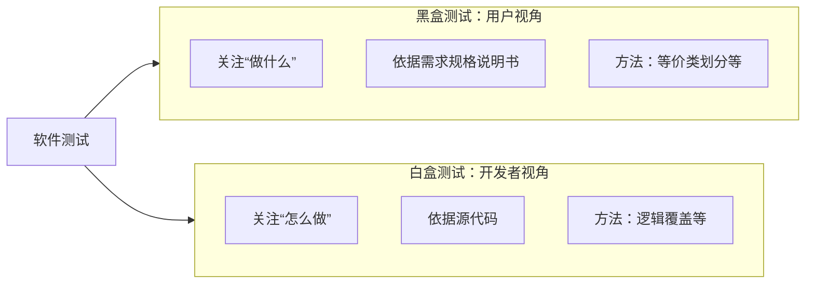
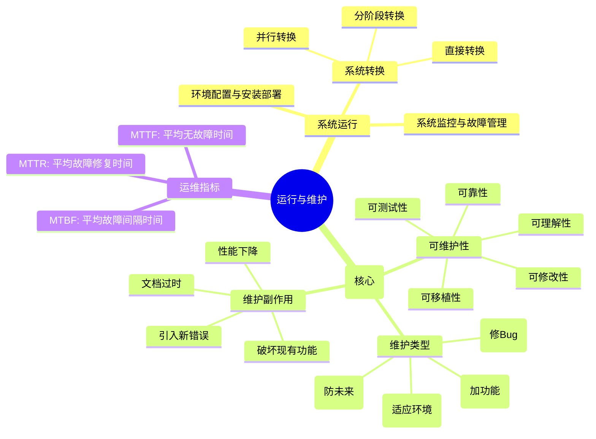

## 计算机系统

### 浮点数运算，

是计算机组成原理和软考中的**“终极BOSS”**。它之所以难，是因为它不仅涉及数学逻辑，还涉及底层的二进制表示和硬件规格（IEEE 754标准）。

💡 核心基础：浮点数长什么样？

在计算机中，浮点数的数学模型是：
**$N = M \times R^E$**
*   **$M$ (Mantissa/尾数)**：决定了数的**精度**（有效数字是多少）。
*   **$E$ (Exponent/阶码)**：决定了数的**范围**（小数点在哪，能表示多大/多小的数）。
*   **$R$ (基数/底)**：隐含的，计算机里默认 $R=2$。
**🚨 考场第一准则：规格化**
运算前后，尾数必须**规格化**。就像科学计数法要求整数位必须有数字（如 $1.23 \times 10^3$，不能是 $0.0123 \times 10^5$）。
*   **原码规格化**：尾数最高数值位必须为 1（如 `0.1xxxx` 或 `1.1xxxx`）。
*   **补码规格化**：尾数最高数值位必须与符号位**相反**（正数 `0.1xxxx`，负数 `1.0xxxx`）。

⚙️ 五步走：浮点数加减法运算全流程

这是核心考点，无论题目怎么变，永远遵循这五步：
**对阶 → 尾数运算 → 规格化 → 舍入 → 溢出判断**
我们用一个通俗的例子来理解：计算 $1.23 \times 10^2 + 4.56 \times 10^3$

第一步：对阶—— 小阶向大阶看齐

*   **原则**：阶码小的向阶码大的对齐。**（为什么？因为小阶变大，尾数右移，右边多出的位数被舍弃，丢失的精度小；大阶变小，尾数左移，左边高位被舍弃，数据直接就错乱了！）**
*   **操作**：看阶差 $E = E_大 - E_小$。小阶的阶码加上 $E$，同时其尾数右移 $E$ 位。
*   **示例**：$1.23 \times 10^2$ 变成 $0.123 \times 10^3$。

第二步：尾数运算

*   **操作**：对阶后，阶码统一了，直接把两个尾数进行加减运算。
*   **示例**：$0.123 + 4.56 = 4.683$。

第三步：规格化

*   **操作**：运算结果可能不是规格化形式，需要调整。
*   **左规**：如果尾数出现 `00.1xxxx` 或 `11.0xxxx`（补码），说明小了，尾数左移1位，阶码减1，直到规格化为止。
*   **右规**：如果尾数出现溢出（如 `01.xxxx` 正溢出，`10.xxxx` 负溢出），说明大了，尾数右移1位，阶码加1。
*   **示例**：$4.683 \times 10^3$ 已经是规格化，无需调整。

第四步：舍入

*   **操作**：右规和对阶时，尾数右移会把最右边的位挤出去，需要舍入。
*   **0舍1入法**：类似十进制的四舍五入。右移丢掉的位如果是1，就在尾数末尾加1。
*   **恒置1法**：不管丢掉什么，尾数末尾直接置为1（简单粗暴，硬件快）。

第五步：溢出判断

*   **操作**：看**阶码**是否溢出（与尾数溢出无关！）。
*   **上溢**：阶码大于最大阶码，报异常（溢出错误，如除以0或数太大）。
*   **下溢**：阶码小于最小阶码，按机器零处理（通常直接置为0）。

🚨 IEEE 754 标准：真实世界的规则

软考和考研常结合 IEEE 754 出题。这是现代计算机浮点数的统一标准。
| 格式                     | 符号位(S) | 阶码(E) | 尾数(M) | 总位数 | 阶码偏移量        |
| :----------------------- | :-------- | :------ | :------ | :----- | :---------------- |
| **短实数(单精度)**       | 1位       | 8位     | 23位    | 32位   | **127** (0x7FH)   |
| **长实数(双精度)**       | 1位       | 11位    | 52位    | 64位   | **1023** (0x3FFH) |
| **极其重要的两个考点：** |           |         |         |        |                   |
1.  **隐藏的1**：规格化时，尾数最高位总是1，IEEE 754规定这个1**不存储**，23位的尾数实际有效数字是24位（1.M），多了一位白嫖的精度！
2.  **阶码的真值**：IEEE 754的阶码用**移码**表示，但偏移量是 $127$（不是128）。
    *   **真值 = 阶码无符号数 - 127**
    *   例如：阶码存储为 `10000000` (128)，真值 = 128 - 127 = 1。

📝 真题实战演练

**题目**：设浮点数格式为：1位符号位，5位阶码（补码），10位尾数（补码）。计算 $X - Y$。
$X = 2^{011} \times 0.1100000000$
$Y = 2^{010} \times (-0.1110000000)$
**解答流程**：
1.  **对阶**：
    *   阶差 $\Delta E = X_阶 - Y_阶 = 011 - 010 = 001$ (十进制1)
    *   小阶向大阶看齐：$Y$ 的阶码变成 $011$，$Y$ 的尾数右移1位。
    *   $Y_{新尾数} = 1.0111000000$ （负数补码右移，高位补1，这里采用0舍1入，原尾数1.001000...右移变1.000100...？**注意：原码负数右移高位补0，补码负数右移高位补1**。$Y$原尾数是$1.001000$，右移一位变成$1.100100$，变补码为$1.011100$）。
2.  **尾数运算** ($X - Y$ 即 $X + [-Y]_补$)：
    *   $X_尾数 = 0.1100000000$
    *   $[-Y]_补 = 0.1001000000$ （$Y$新尾数1.011100变原码为1.100100，取负加1得0.100100）
    *   相加：`00.1100000000 + 00.1001000000 = 01.0101000000`
3.  **规格化**：
    *   结果 `01.0101000000` 出现了 `01` ，尾数溢出（正溢出），需要**右规**。
    *   尾数右移1位：`00.1010100000` （0舍1入）
    *   阶码加1：`011 + 1 = 100`
4.  **舍入**：
    *   右规时移出的0，直接舍去。
5.  **溢出判断**：
    *   阶码为 `100`（补码），转换为十进制是 4，未超出5位补码表示范围（-16~15），无溢出。
    **最终结果**：$2^{100} \times 0.1010100000$

🎯 选择题秒杀技巧归纳

1.  **问浮点数精度由谁决定？** 答：尾数位数。
2.  **问浮点数范围由谁决定？** 答：阶码位数。
3.  **对阶方向？** 答：小向大看齐（尾数右移）。
4.  **判断运算是否溢出看哪里？** 答：只看**阶码**是否溢出，尾数溢出可以通过右规挽救！
5.  **IEEE 754 中 阶码全0和全1是特权阶码**：
    *   阶码全0：表示非规格化数（极小的数，隐藏的1不再加上）或正负0。
    *   阶码全1：表示无穷大或 NaN（Not a Number，如0/0）。
    *   这意味着单精度真正的阶码范围是 -126 到 +127。

----

### 校验与纠错

在计算机系统中，数据在内存、磁盘或网络传输时，由于外界干扰（如电磁干扰、宇宙射线等），可能会发生位翻转（0变1，1变0）。**校验**就是发现错误，**纠错**就是不仅能发现错误，还能把错误改回来。

🟢 一、 奇偶校验—— 只能查错，不能纠错

这是最基础的校验，原理是在数据位旁加1位校验位。
*   **奇校验**：数据位 + 校验位 中，`1` 的个数必须是**奇数**。
*   **偶校验**：数据位 + 校验位 中，`1` 的个数必须是**偶数**。
**🚨 致命缺点：**
1.  **只能发现奇数个错误**：如果同时跳变了2位、4位，`1`的总数奇偶性不变，系统认为没出错！
2.  **无法定位错误**：即便发现出错了（1个位错了），也不知道是哪一位错了，所以**无法纠错**。

二、 海明码—— 既能查错，又能纠错（核心考点！）

海明码的核心思想是**“多重奇偶校验”**，它通过巧妙地分组，不仅能发现错误，还能精确定位到是哪一位错了，把它翻转过来就是纠错。

1. 核心公式（求校验位长度）

假设数据位有 $k$ 位，校验位有 $r$ 位。要能发现并纠正1位错误，必须满足：
**$2^r \ge k + r + 1$**
*解题技巧*：题目给 $k$，让你求 $r$，直接代入试数。
若 $k=4$，则 $2^r \ge 4 + r + 1 \rightarrow 2^r \ge 5 + r$。当 $r=3$ 时，$8 \ge 8$ 成立。所以需要3位校验位。

2. 海明码的放置规则（放哪？）

海明码把所有位从左到右编号为 $1, 2, 3, 4, 5...$。
**规定：校验位必须放在编号为 $2^n$ 的位置上**（即第1, 2, 4, 8, 16...位），剩下的位置放数据位。
举例：数据位 $D_1, D_2, D_3, D_4$，校验位 $P_1, P_2, P_3$。
| 位置 | 1         | 2         | 3     | 4         | 5     | 6     | 7     |
| :--- | :-------- | :-------- | :---- | :-------- | :---- | :---- | :---- |
| 内容 | **$P_1$** | **$P_2$** | $D_1$ | **$P_3$** | $D_2$ | $D_3$ | $D_4$ |
3. 校验位怎么算？（管谁？）

每个校验位 $P_i$ 负责校验那些**位置编号的二进制表示中，第 $i$ 位为1的数据位**。
这叫“归属关系”，考试常考！
*   **$P_1$ (位置1，二进制001)**：负责所有**奇数位**（第1位为1的位）。即负责 3, 5, 7 位（$D_1, D_2, D_4$）。$P_1 = D_1 \oplus D_2 \oplus D_4$ （异或：同0异1）
*   **$P_2$ (位置2，二进制010)**：负责第2位为1的位。即负责 3, 6, 7 位（$D_1, D_3, D_4$）。$P_2 = D_1 \oplus D_3 \oplus D_4$
*   **$P_3$ (位置4，二进制100)**：负责第3位为1的位。即负责 5, 6, 7 位（$D_2, D_3, D_4$）。$P_3 = D_2 \oplus D_3 \oplus D_4$

4. 纠错原理（指误字）

接收方收到数据后，用同样的规则计算 $S_1 = P_1 \oplus D_1 \oplus D_2 \oplus D_4$，$S_2, S_3$ 同理。
把 $S_3 S_2 S_1$ 拼成一个二进制数：
*   如果是 `000`：没有错误。
*   如果是 `101`（十进制5）：说明**第5位错了**！把第5位取反，纠错完成。
**🚨 考场升华：海明码的纠错极限**
*   标准海明码（上述公式）**只能纠正1位错误**。
*   如果要能**检测2位错误**，必须增加一个“总校验位”（放在最高位，对所有位进行偶校验），这叫**扩展海明码**。

三、 循环冗余校验码 (CRC)—— 网络与磁盘的王者

CRC主要用于大批量数据（如网络帧、磁盘扇区）的传输校验，极其高效，但**只能查错，不能纠错**。

核心概念：模2运算

CRC的计算基于**模2除法**（其实就是异或运算：不考虑进位和借位，上下相同为0，不同为1）。

计算步骤（3步走）：

1.  **定多项式**：题目给一个生成多项式 $G(x)$，比如 $G(x) = x^3 + x + 1$。
    *   转为二进制串：有 $x$ 的位是1，没有的是0。$x^3(1) + x^2(0) + x^1(1) + x^0(1) = \mathbf{1011}$。
    *   这个串的长度 $r+1 = 4$，所以校验位长度 $r = 3$。
2.  **移位**：假设要发送的数据 $M = 1100$。在 $M$ 后面补 $r$ 个0，变成 $1100\mathbf{000}$。
3.  **模2除法**：用 $1100000$ 除以 $1011$。**只取余数**！
    *   算出来的余数一定是 $r$ 位的（不够前补0），这就是校验码（FCS）。
4.  **发送/校验**：将校验码拼在数据后面发送（$1100 + FCS$）。
    *   接收方收到后，用收到的整体除以 $1011$，**如果能除尽（余数为0），说明数据正确；除不尽，说明出错**。

📝 考场秒杀总结表

| 校验方法       | 核心能力             | 考点痛点                                     | 适用场景           |
| :------------- | :------------------- | :------------------------------------------- | :----------------- |
| **奇偶校验**   | 只能查**奇数**位错   | 无法查偶数位错，无法纠错                     | 内存条基本校验     |
| **海明码**     | 查1位错，**纠1位错** | 公式 $2^r \ge k+r+1$，校验位位置，指误字计算 | ECC内存（服务器）  |
| **CRC**        | 查错能力极强         | 模2除法计算，**不能纠错**                    | 网络传输、磁盘存储 |
| **终极口诀**： |                      |                                              |                    |
*   问“发现几位错、纠正几位错”找谁？找**海明码**。
*   海明码求校验位个数？背公式 **$2^r \ge k+r+1$**。
*   海明码校验位放哪？放 **1, 2, 4, 8**（$2^n$）位置。
*   纠错看什么？看**指误字**（转十进制就是出错位置）。
*   大批量数据只查错不纠错用什么？**CRC**。

----

### 码制--原码反码补码移码

这四种码是计算机组成原理中最基础、最核心的考点，没有之一。软考/考研必考。

💡 一、 为什么要有这四种码？（底层逻辑）

假设我们用 8 位（8 bit）来表示一个数字：
1. 原码—— 人类最容易看懂的码

*   **规则**：最高位当符号位（0代表正，1代表负），其余位是绝对值。
*   **痛点**：**0的表示不唯一**！`00000000` 和 `10000000` 都是0，计算机判断起来很麻烦；而且**不能直接做减法**，比如 `+1 (00000001) + (-1 (10000001))` 直接相加等于 `-2 (10000010)`，算错了！

2. 反码—— 过渡产物

*   **规则**：正数不变；负数的符号位不变，其余位**0变1，1变0**（按位取反）。
*   **痛点**：它解决了部分加减法问题，但**0的表示依然不唯一**！`00000000` 和 `11111111` 都是0。

3. 补码—— 计算机内部的“王者”

*   **规则**：正数不变；负数在反码的基础上 **+1**。
*   **伟大意义**：
    1.  **0的表示唯一了**！`10000000` 不再是 -0，被重新定义为 **-128**。
    2.  **减法变加法**！`+1 + (-1)` 在补码下运算：`00000001 + 11111111 = 1 00000000`，最高位1溢出丢弃，剩下 `00000000`（0），完美！**计算机内部所有整数全都是以补码形式存储和运算的。**

4. 移码—— 专用于浮点数的阶码

*   **规则**：补码的**符号位取反**（其他位不变）。
*   **伟大意义**：移码全是正数！从 `00000000` 到 `11111111` 依次递增，**非常方便计算机快速比较大小**（就像看十进制一样直观），所以专门用在浮点数的指数部分（阶码）。

📊 二、 核心范围速查表（以 8位 为例，必须刻在脑子里）

| 码制                                                         | 符号位 | 整数范围 (8位)  | 绝对值最小负数 | 绝对值最大负数 | 最大正数 | 特殊说明             |
| :----------------------------------------------------------- | :----- | :-------------- | :------------- | :------------- | :------- | :------------------- |
| **原码**                                                     | 1位    | -127 ~ +127     | -0             | -127           | +127     | **±0 重复占位**      |
| **反码**                                                     | 1位    | -127 ~ +127     | -0             | -127           | +127     | **±0 重复占位**      |
| **补码**                                                     | 1位    | **-128 ~ +127** | -1             | **-128**       | +127     | **无-0，多一个负数** |
| **移码**                                                     | 1位    | **-128 ~ +127** | -1             | **-128**       | +127     | 与补码范围完全一致   |
| *(如果题目是 n位，把 127 换成 $2^{n-1}-1$，128 换成 $2^{n-1}$ 即可)* |        |                 |                |                |          |                      |
🎯 三、 考场三大必考规律与秒杀技巧

规律一：范围大小的终极结论（选择题秒杀）

1.  **原码和反码**：表示范围一样，且关于0对称。
2.  **补码和移码**：表示范围一样！且多表示一个负数（最低位为 $-2^{n-1}$）。
3.  **谁的范围最大？** 补码 = 移码 > 原码 = 反码。

规律二：-128 的特例（极易考坑点）

在8位环境下，**-128 没有原码，也没有反码！只有补码和移码！**
*   为什么？8位原码的极限是 `11111111` (-127)。要表示 -128，需要9位原码 `1 10000000`，8位装不下。
*   -128 的8位补码是 `10000000`（硬性规定，原本这是 -0 的位置）。
*   -128 的8位移码是 `00000000`（补码符号位取反）。

规律三：码制转换的快捷方式

*   **正数**：原码 = 反码 = 补码（正数三码合一，千万别去加1！）
*   **负数**：
    *   原码 $\leftrightarrow$ 反码：符号位不变，数值位按位取反。
    *   反码 $\rightarrow$ 补码：末位 +1。
    *   **⭐终极捷径：原码 $\leftrightarrow$ 补码**：符号位不变，**从右往左数，遇到第一个1，这个1及其右边的0保持不变，这个1左边的数值位全部按位取反。**
        *(例：原码 `1 0110100` $\rightarrow$ 补码 `1 1001100`。右边遇1前不变，前面0变1，1变0。双向适用！比反码+1快得多)*
*   **移码**：只和补码有关系，**符号位取反**即可互转。

📝 真题实战演练

**题目1**：某计算机字长8位，其CPU中有一个8位寄存器，若其内容为 `FFH`（即11111111），当它分别代表原码、反码、补码和移码时，对应的十进制真值分别是多少？
*   **原码** `11111111`：符号位1（负），数值位 `1111111` = 127。真值 = **-127**
*   **反码** `11111111`：符号位1（负），数值位取反 = `0000000` = 0。真值 = **-0**
*   **补码** `11111111`：符号位1（负），转原码（捷径：右边遇1不变，左边取反）= `10000001` = -1。真值 = **-1**
*   **移码** `11111111`：移码与补码符号位相反。移码是 `11111111`，说明补码是 `01111111`。补码 `01111111` 对应真值 = **+127**
**题目2**：8位定点整数，补码表示的范围是？移码表示的范围是？
*   **秒杀**：补码范围 $-2^7 \sim 2^7-1$ = **-128 ~ +127**。移码范围与补码相同 = **-128 ~ +127**。
**题目3**：以下关于校验/纠错的叙述中，正确的是（_）。（结合前面知识）
A. 奇偶校验能发现并纠正1位错误
B. 海明码能发现并纠正1位错误
C. CRC能发现并纠正多位错误
D. 海明码只能发现1位错误
*   **秒杀**：奇偶校验只能查不能纠，A错；CRC只能查不能纠，C错；海明码能查1位也能纠1位，D错。答案选 **B**。

----


## 程序设计


## 数据结构与算法


### 八大排序算法（必考重头戏）

| 算法         | 原理核心（人话版）                       | 稳定性     | 平均时间      | 最坏时间      | 最好时间      | 空间复杂度  | 适用场景/考点                               |
| :----------- | :--------------------------------------- | :--------- | :------------ | :------------ | :------------ | :---------- | :------------------------------------------ |
| **直接插入** | 打扑克摸牌，新牌往左找合适位置插进去     | **稳定**   | $O(n^2)$      | $O(n^2)$      | $O(n)$        | $O(1)$      | 序列**基本有序**或数据量小                  |
| **希尔排序** | 加长版插入，按步长分组排，步长逐渐缩至1  | **不稳定** | $O(n^{1.3})$  | $O(n^2)$      | $O(n)$        | $O(1)$      | 考步长分组过程推演                          |
| **冒泡排序** | 相邻元素两两比较，逆序就交换，大泡泡沉底 | **稳定**   | $O(n^2)$      | $O(n^2)$      | $O(n)$        | $O(1)$      | 注意：若写成`>=`交换则不稳定                |
| **快速排序** | 找基准pivot，小的放左大的放右，递归      | **不稳定** | $O(n \log n)$ | $O(n^2)$      | $O(n \log n)$ | $O(\log n)$ | **综合最强**；最坏情况是原序列有序/逆序     |
| **简单选择** | 每次从剩下的挑最小值，和前面末尾交换     | **不稳定** | $O(n^2)$      | $O(n^2)$      | $O(n^2)$      | $O(1)$      | 比较次数与初始状态无关，永远是$n(n-1)/2$    |
| **堆排序**   | 建大根堆，堆顶最大值与末尾交换，向下调整 | **不稳定** | $O(n \log n)$ | $O(n \log n)$ | $O(n \log n)$ | $O(1)$      | 时空综合最优；**必考建堆/调整过程**         |
| **归并排序** | 一直对半拆，拆到单元素再两两合并成有序段 | **稳定**   | $O(n \log n)$ | $O(n \log n)$ | $O(n \log n)$ | $O(n)$      | 需要辅助数组；**外部排序**核心              |
| **基数排序** | 不比较！按个位、十位、百位依次入桶收集   | **稳定**   | $O(d(n+r))$   | $O(d(n+r))$   | $O(d(n+r))$   | $O(r+n)$    | 适合位数固定的整数/字符串；**不能排浮点数** |

---

### 四大查找算法

| 算法               | 原理核心（人话版）                         | 平均时间    | 最坏时间    | 空间复杂度 | 核心考点/避坑                                            |
| :----------------- | :----------------------------------------- | :---------- | :---------- | :--------- | :------------------------------------------------------- |
| **顺序查找**       | 从头到尾挨个遍历                           | $O(n)$      | $O(n)$      | $O(1)$     | 设置“哨兵”（放在0号位从后往前找），可省去越界判断        |
| **折半查找(二分)** | 每次和中间比，缩小一半范围                 | $O(\log n)$ | $O(\log n)$ | $O(1)$     | **必须有序顺序表**（链表不行！）；必考画**判定树**求ASL  |
| **分块查找**       | 块间有序，块内无序。先二分找块，再顺序找块 | 介于两者    | 介于两者    | $O(1)$     | 兼顾了折半的快和顺序的灵活                               |
| **B树/B+树**       | 多路平衡查找树，降低树高，减少磁盘I/O      | $O(\log n)$ | $O(\log n)$ | $O(n)$     | B+树数据全在叶子，叶子用链表串起；**数据库索引绝对霸主** |

---

###  图的三大核心算法

| 算法类别       | 算法名称       | 原理核心（人话版）                          | 时间复杂度    | 空间复杂度 | 核心考点/避坑                                |
| :------------- | :------------- | :------------------------------------------ | :------------ | :--------- | :------------------------------------------- |
| **最小生成树** | **普里姆**     | 从顶点扩张：每次找离当前树最近的顶点加入    | $O(V^2)$      | $O(V)$     | 适合**稠密图**（边多）；像城市扩张           |
|                | **克鲁斯卡尔** | 从边修建：边按权值排序，挑最小且不成环的边  | $O(E \log E)$ | $O(E)$     | 适合**稀疏图**（边少）；需并查集判环         |
| **最短路径**   | **迪杰斯特拉** | 单源最短：每次找距离最近的未访问节点加入    | $O(V^2)$      | $O(V)$     | **不能处理负权边！**；贪心算法               |
|                | **弗洛伊德**   | 所有点对：尝试把每个点作中转站看能否变短    | $O(V^3)$      | $O(V^2)$   | **可处理负权边**（不能有负权回路）；动态规划 |
| **拓扑排序**   | **AOV网**      | 找入度为0(无前置依赖)的输出，删其出边，循环 | $O(V+E)$      | $O(V+E)$   | 判定有向图是否有环；**拓扑排序不唯一**       |

---

### 补充：图的应用（关键路径 AOE网）

虽然不是传统意义上的算法代码，但必考概念推导：

| 核心概念         | 意义与公式                                             | 考点                                                |
| :--------------- | :----------------------------------------------------- | :-------------------------------------------------- |
| **Ve(最早发生)** | 从起点到该顶点的最长路径（前面全干完最早啥时候能开始） | 拓扑排序正向推：$Ve[j] = Max\{ Ve[i] + weight \}$   |
| **Vl(最晚发生)** | 不耽误总工期的前提下，最晚啥时候必须开始               | 逆拓扑排序反向推：$Vl[i] = Min\{ Vl[j] - weight \}$ |
| **松弛时间**     | **松弛时间 = Vl - Ve**（也叫机动时间/缓冲时间）        | 等于0的顶点/活动在**关键路径**上！                  |


## 操作系统


### 进程管理


### 存储管理


#### **“虚拟存储器与分页管理”**

>  本质上考的就是**逻辑地址如何映射到物理地址**。
> 不管题目怎么出（给十六进制地址、给十进制地址、页面大小变来变去），这类题统统可以套用**“一切、二查、三拼”**的万能三步法。

🌟 万能解题法：“一切、二查、三拼”

第一步：切 —— 切分逻辑地址（求页号和页内偏移）

把逻辑地址想象成一根甘蔗，我们要把它切成两段：**前半段是页号，后半段是页内偏移量**。
*   **核心原理**：页面大小决定了偏移量的位数。页面大小是 $2^N$ 字节，偏移量就是 $N$ 位二进制。
*   **实战技巧（根据进制选方法）**：
    *   **如果是十六进制地址（最常见！）**：
        *   $1KB = 2^{10}B$，偏移占 10位二进制 = **2.5位**十六进制（极少考）
        *   $4KB = 2^{12}B$，偏移占 12位二进制 = **3位**十六进制
        *   $16KB = 2^{14}B$，偏移占 14位二进制 = **3.5位**十六进制
        *   $1MB = 2^{20}B$，偏移占 20位二进制 = **5位**十六进制
        *   👉 **操作**：从右往左数，截取对应位数作为“偏移”，左边剩下的就是“页号”。
    *   **如果是十进制地址**：
        *   👉 **操作**：用逻辑地址除以页面大小，**商是页号，余数是页内偏移**。

第二步：查 —— 查页表（求物理块号）

拿着第一步切出来的**页号**，去题目给的页表中查，找到对应的**物理块号**（有的题叫页框号）。
*   **注意坑点**：如果查页表时发现该页的状态位是“不在内存中”或“有效位为0”，直接停止计算，答案就是**“产生缺页中断”**。

第三步：拼 —— 拼接物理地址

把查到的物理块号放在前面，第一步切出来的页内偏移放在后面，直接拼起来。
*   **十六进制拼法**：块号 + 偏移量 直接写字符串。
*   **十进制拼法**：物理块号 $\times$ 页面大小 + 页内偏移量。

📝 两大常见题型实战演示

题型一：十六进制地址（高频必考）

**题目**：页面大小4KB，逻辑地址 `3C20H`，页号3对应物理块号8。
1.  **切**：4KB对应3位十六进制偏移。`3C20H` 切成 `3`（页号）和 `C20`（偏移）。
2.  **查**：页号3对应块号8。
3.  **拼**：`8` + `C20` = **`8C20H`**。

题型二：十进制地址

**题目**：页面大小2KB，逻辑地址 `3000`，页号1对应物理块号5。
1.  **切**：用十进制除法。$3000 \div 2048(2KB)$ = 1 余 952。页号是 `1`，偏移是 `952`。
2.  **查**：页号1对应块号5。
3.  **拼**：十进制拼法：$5 \times 2048 + 952 = 10240 + 952 = $ **`11192`**。

🚨 考场三大避坑指南

1.  **进制混淆陷阱**：题目页面大小给KB（十进制/二进制），地址给H（十六进制）。**千万不要把十六进制转成十进制再去除以4096！** 算量极大且容易算错。必须直接按二进制位数的倍数切割十六进制。
2.  **页号从0开始陷阱**：页号和块号都是从0开始编号的。0号页对应0号块，不要惯性思维以为从1开始。
3.  **页面大小不是2的幂次**：极少见，但如果题目说“页面大小为3KB”，那二进制位就不整齐了，只能转成十进制老老实实做除法（逻辑地址 $\div$ 3072）。


#### 计算芯片数

这类题核心只考两件事：**1. 算总容量；2. 算芯片数。**

🌟 万能解题法：四步走

第一步：求内存地址区间长度（算出有多少个单元）

*   **公式**：末地址 - 首地址 + 1
*   *为什么+1？就像从1楼到5楼，5-1=4，但实际有1,2,3,4,5共5层楼，要加1。*

第二步：将长度转换为十进制（算出总字节数 Byte）

*   **技巧**：把十六进制转十进制太麻烦！一定要利用 **$1KB = 2^{10}B = 1024B$** 和 **$1MB = 2^{20}B = 1024KB$** 的特性。
*   **熟记十六进制对应关系**：
    *   `400H` = $4 \times 256$ = 1024 = **1KB**
    *   `1000H` = $1 \times 4096$ = 4096 = **4KB**
    *   `10000H` = 64KB
    *   `100000H` = 1024KB = **1MB**

第三步：求单个芯片的容量

*   **看懂芯片规格**：如 32K × 8bit。前面的 `32K` 是寻址单元数（字数），后面的 `8bit` 是每个单元的位数（字长）。
*   芯片容量 = 字数 × 字长。

第四步：求芯片总数（核心公式）

* **公式**：**总片数 = (总容量 ÷ 单片容量) = (总字数 ÷ 芯片字数) × (总位数 ÷ 芯片位数)**

* 通俗理解：如果位数不够，先并联扩位（位扩展）；如果字数不够，再串联扩容（字扩展）。

  

  📝 实战演练：本题详细拆解

**题目**：内存按字节编址。从 A0000H 到 DFFFFH，用 32K×8bit 芯片，需要几片？
**1. 算长度：**
DFFFFH - A0000H + 1H = **3FFFFH + 1H = 40000H**
**2. 算总容量（转十进制）：**
拆分 40000H = 4 × $10000H$
因为 $10000H$ = 64KB，所以 $4 \times 64KB$ = **256KB**
*（注意：题目说“按字节编址”，说明每个地址对应1个字节，所以总容量就是256KB）*
**3. 算芯片容量：**
32K × 8bit。8bit = 1Byte（1个字节），所以单片容量 = **32KB**
**4. 算片数：**
总片数 = 256KB ÷ 32KB = **8 片**
- ⚡ 考场极速秒杀法（进阶）

如果你对十六进制足够敏感，这题可以10秒口算出答案，连笔都不用动！
**口诀：末位凑零，数零算K**
1.  **算长度**：DFFFF - A0000 + 1 = 40000H。
2.  **数零算K**：
    *   40000H 末尾有 **4** 个0。
    *   在十六进制中，**每2个0代表1KB**，每4个0代表1MB。
    *   40000H 有4个0，所以它是 **4 × 1MB = 4MB** 吗？错！
    *   注意：40000H 开头的 4 是十六进制位，不是十进制！十六进制的 40 对应十进制的 64。
    *   所以 40000H = $64 \times 1000H$ = $64 \times 64KB$？太麻烦！
    **最正确的秒杀直觉**：
    十六进制的 `10000H` = 64KB。
    `40000H` = $4 \times 10000H$ = $4 \times 64KB$ = 256KB。（**这是必须刻在脑子里的常数！**）
    知道总容量 256KB 后，题目给 32K×8bit（即32KB），256 / 32 = 8，秒选 8。

🚨 三大常考变体与避坑指南

1. 变体一：位扩展（数据线不够长）

**题目**：内存按字节编址（8bit），总容量256KB，但给的芯片是 **32K×4bit**，需要几片？
*   **坑点**：位数不够！
*   **解法**：字数要够，位数也要够。
    *   字数比：256K / 32K = 8（字扩展）
    *   位数比：8bit / 4bit = 2（位扩展，两片4bit拼成一片8bit）
    *   总片数 = 8 × 2 = **16 片**

2. 变体二：非字节编址（按字编址）

**题目**：内存**按字编址**（16位/字），地址从 0000H 到 FFFFH，用 1K×4bit 的芯片，需要几片？
*   **坑点**：“按字编址”说明一个地址对应16bit，不是8bit！
*   **解法**：
    *   长度 = FFFFH + 1 = 10000H = 64K 个**字**
    *   总容量 = 64K字 × 16bit
    *   芯片容量 = 1K × 4bit
    *   总片数 = (64K / 1K) × (16bit / 4bit) = 64 × 4 = **256 片**

3. 变体三：奇怪的十六进制减法

**题目**：从 7A000H 到 BFFFFH。
* **减法技巧**：不会算十六进制减法没关系，可以拆分。

* BFFFFH - 7A000H + 1H = (BFFFFH + 1) - 7A000H = C0000H - 7A000H

  

  > **总结**：做此类题，**第一步必须把首尾地址差算对，第二步必须把十六进制转KB/MB转对**，这两步不错，后面的除法就是小学算术！


### 设备管理


#### 磁盘调度算法

磁盘调度算法是操作系统设备管理中的核心考点，主要考查**寻道时间（最耗时的部分）的计算**以及**不同算法的优缺点对比**。

💡 核心前置知识：磁盘访问时间

磁盘读取数据的时间由三部分组成：
**总访问时间 = 寻道时间 + 旋转延迟时间 + 数据传输时间**
*   **寻道时间（核心考点）**：磁头移动到目标磁道所需的时间。**这是最耗时的，磁盘调度算法就是为了减少这个时间！**（相当于外卖员骑车去你家楼下）
*   旋转延迟：磁盘转动，让目标扇区转到磁头下面所需的时间。（相当于你等电梯下来接外卖）
*   数据传输时间：读取数据的时间。（相当于外卖员把餐递给你）
**做题关键**：题目给出的磁道号序列，就是在计算**寻道时间**（通常简化为：移动跨过1个磁道耗时1ms）。

🏆 四大磁盘调度算法

假设当前磁头在 **53号磁道**，请求队列按到达顺序为：**98, 183, 37, 122, 14, 124, 65, 67**。

1. FCFS（先来先服务算法）

*   **原理**：按请求到达的顺序依次服务。
*   **比喻**：外卖员按下单顺序送餐，哪怕跨越大半个城市也不管。
*   **计算**：53 → 98 → 183 → 37 → 122 → 14 → 124 → 65 → 67
    寻道距离 = |98-53| + |183-98| + |37-183| + ... （极其麻烦，跨来跨去）
*   **优点**：公平，简单。
*   **缺点**：效率极低，寻道时间极长。

2. SSTF（最短寻道时间优先算法）

*   **原理**：每次都选择离当前磁头**最近**的请求去服务。
*   **比喻**：外卖员每次都挑离自己当前最近的单子送，不管谁先下单。
*   **计算**：53 → (找最近的) 65 → 67 → 37 → 14 → 98 → 122 → 124 → 183
*   **优点**：性能比FCFS好很多，总寻道距离缩短。
*   **致命缺点**：**“饥饿”现象**！如果远处一直有新请求进来，远处的请求可能永远得不到服务。
3. SCAN（电梯调度算法/扫描算法）⭐️⭐️⭐️

*   **原理**：磁头沿一个方向移动，途中处理所有请求，**直到该方向没有请求为止**，然后**反向**继续处理。
*   **比喻**：电梯从1楼往上开，上面有人按就停，一直开到最高层没人按了，再往下开。
*   **计算**（假设当前向磁道号增大方向移动）：
    53 → (往右走) 65 → 67 → 98 → 122 → 124 → 183 → (到最右端，折返) → 37 → 14
*   **优点**：避免了饥饿问题，性能较好。
*   **缺点**：对最近刚扫过的位置不公平（比如磁头刚从37往右走，37又来了新请求，必须等磁头跑到头再折返才能服务）。

4. C-SCAN（循环扫描算法）⭐️⭐️

*   **原理**：磁头只在一个方向上处理请求。走到头后，**直接快速返回起点**（返回途中不处理请求），然后再沿原方向扫描。
*   **比喻**：观光缆车，只能往上开，到山顶后空车直接滑回山脚，再往上开载客。
*   **计算**（假设向磁道号增大方向移动）：
    53 → (往右走) 65 → 67 → 98 → 122 → 124 → 183 → (直接空跑回最左端) → 14 → 37
*   **优点**：消除了SCAN对两端请求的不公平，使得各位置请求的响应时间更均匀。

📝 两大常考题型与秒杀技巧

1. 题型一：计算总寻道距离/平均寻道距离（计算题）

**做题套路**：
1.  确定算法和**磁头移动方向**（题目必给，如“向内/向外”或“向磁道号增大/减小方向”）。
2.  根据算法规则，将给定的请求序列**重新排序**，画出磁头移动轨迹。
3.  计算相邻两个磁道号的**绝对值差**，全部加起来。
**真题示范**：
磁头在100号，向磁道号增大方向移动，队列：55, 58, 39, 18, 90, 160, 150, 38, 184。用SCAN算法，总寻道距离是多少？
*   **排序（往右走，走到头折返往左）**：100 → 150 → 160 → 184 → 90 → 58 → 55 → 39 → 38 → 18
*   **计算**：
    |150-100| + |160-150| + |184-160| + |90-184| + |58-90| + |55-58| + |39-55| + |38-39| + |18-38|
    = 50 + 10 + 24 + 94 + 32 + 3 + 16 + 1 + 20 = **250**
    **⚡ 秒杀技巧**：遇到 SCAN/C-SCAN 算法，画图！在草稿纸上画一条数轴，标出当前磁头和所有请求点，用箭头画出移动轨迹，算距离极快且不易错！

2. 题型二：算法特性对比（选择题）

这种题不让你算数，专门考概念和“坑”。
1.  **“饥饿”问题考法**：
    *   问：哪个算法可能导致某些请求长时间得不到服务？答：**SSTF**。
    *   问：如何解决饥饿问题？答：改用 **SCAN 或 C-SCAN**。
2.  **“掉头”规则考法（极易错！）**：
    *   **SCAN**：只要**当前方向上没有请求了，就立刻掉头**。（不一定要走到磁盘的物理边界0或最大磁道！）
    *   **C-SCAN**：走到当前方向没有请求后，要**直接空跑回另一端的起始位置**（通常是0号磁道），再重新开始。
3.  **“公平性”考法**：
    *   问：哪个算法使得各磁道响应时间最均匀？答：**C-SCAN**。
    *   问：SCAN算法的缺点是什么？答：对刚扫过的磁道不公平（响应时间长）。

📊 考场速查对比表

| 算法       | 核心思想           | 优 点              | 缺 点              | 是否会饥饿 |
| :--------- | :----------------- | :----------------- | :----------------- | :--------- |
| **FCFS**   | 按顺序来           | 公平、简单         | 寻道距离长、效率低 | 不会       |
| **SSTF**   | 找最近的           | 寻道距离短、性能好 | **会产生饥饿**     | **会**     |
| **SCAN**   | 单向走，到头折返   | 避免饥饿，效率好   | 对刚扫过区域不友好 | 不会       |
| **C-SCAN** | 单向走，到头回起点 | 响应时间最均匀     | 空跑返回有开销     | 不会       |
|            |                    |                    |                    |            |

> **最后提醒**：做计算题时，**一定要看清题目给的磁头初始移动方向！** 方向看反了，SCAN和C-SCAN的结果将完全不同。

### 文件管理

#### 文件系统的多级索引

💡 核心痛点：为什么需要多级索引？

假设一个文件非常大（比如好几GB），我们要找到文件里的某个数据块，必须有一个“目录”来记录数据块在磁盘上的物理地址。这个“目录”就是**索引块**。
*   **直接索引**：索引块里直接放数据块的地址。
    *   **痛点**：一个索引块容量有限（比如1KB），一个地址占4B，那一个索引块只能存 1024/4 = 256 个地址。只能指向256个数据块，文件最大只能 256KB。这远远不够！
    为了让文件能更大，我们引入了**间接索引**，让索引块指向索引块，这就是**多级索引**。

🏗️ 多级索引的“俄罗斯套娃”结构

我们以最经典的 **UNIX 文件系统**为例，它采用的是**混合索引**结构（既有直接索引，又有间接索引）。假设：
*   **磁盘块大小** = $B$ 字节（通常是 4KB 或 1KB）
*   **一个地址占** = $A$ 字节（通常是 4B，因为逻辑块号最大可达 $2^{32}$）
*   **一个索引块能容纳的地址数** = $N = B / A$
一个文件的索引节点包含 13 个地址项，分为 4 种：

1. 直接索引（0~9项，共10项）

*   **指向**：直接指向数据块。
*   **逻辑块号**：0 ~ 9
*   **容纳数据**：$10$ 个数据块

2. 一次间接索引（第10项）

*   **指向**：指向一个**一级索引块**，一级索引块里再放数据块的地址。
*   **逻辑块号**：10 ~ (10 + N - 1)
*   **容纳数据**：$N$ 个数据块
3. 二次间接索引（第11项）

*   **指向**：指向二级索引块 -> 一级索引块 -> 数据块。
*   **逻辑块号**：接着一次间接的往后排
*   **容纳数据**：$N \times N = N^2$ 个数据块

4. 三次间接索引（第12项）

*   **指向**：三级索引块 -> 二级索引块 -> 一级索引块 -> 数据块。
*   **逻辑块号**：接着二次间接的往后排
*   **容纳数据**：$N \times N \times N = N^3$ 个数据块

**📝 两大核心题型与秒杀公式**

题型一：求文件最大可寻址范围（求文件最大容量）

**公式**：
最大容量 = $(10 + N + N^2 + N^3) \times \text{磁盘块大小}$
**真题实战**：
设磁盘块大小为 4KB，地址占 4B，求文件最大长度。

1.  算 $N$：$N = 4KB / 4B = 1K = 1024$
2.  套公式：$10 + 1024 + 1024^2 + 1024^3$ （单位：块）
3.  算容量：最大容量非常巨大，通常题目只需要算出块数，乘以 4KB 即可。

题型二：读取某个逻辑块号的地址，需要几次读磁盘？（核心考点！）

这是最爱考的题。**注意：读索引块也算读磁盘！**
**核心逻辑**：要找数据，必须一层一层把索引块读进内存，最后再读数据块。
*   直接索引：读 1 次索引 + 读 1 次数据 = **2 次**
*   一次间接：读 1 次间接索引 + 读 1 次直接索引 + 读 1 次数据 = **3 次**
*   二次间接：读 1 次二级索引 + 读 1 次一级索引 + 读 1 次直接索引 + 读 1 次数据 = **4 次**
*   三次间接：1+1+1+1+1 = **5 次**
**🚨 考场大坑：**题目问“访问该逻辑块需要启动磁盘几次？”
*   **千万不要忘记最后读数据块的那 1 次！**
*   如果题目问“除了读数据本身，还需要几次读磁盘操作？”，那就是 1次、2次、3次、4次。

🔥 高频变体：已知逻辑块号，判断属于哪种索引？

给你一个逻辑块号，让你算需要读几次磁盘。这就需要你判断它在哪一级索引里。
**速算区间表**（设 $N=1024$）：
| 索引类型       | 逻辑块号范围                                | 区间大小 |
| :------------- | :------------------------------------------ | :------- |
| **直接**       | 0 ~ 9                                       | 10       |
| **一次间接**   | 10 ~ (10+1024-1) 即 **10 ~ 1033**           | $N$      |
| **二次间接**   | 1034 ~ (1034+1024²-1) 即 **1034 ~ 1050697** | $N^2$    |
| **三次间接**   | 1050698 往后                                | $N^3$    |
| **做题技巧**： |                                             |          |
1.  先算 $N$。
2.  看逻辑块号是否 > 9。如果 <=9，直接索引（2次）。
3.  看逻辑块号是否 < 10 + $N$。如果是，一次间接（3次）。
4.  看逻辑块号是否 < 10 + $N$ + $N^2$。如果是，二次间接（4次）。
5.  否则，三次间接（5次）。

📊 终极实战演练

**题目**：某文件系统采用混合索引，磁盘块大小 1KB，地址占 4B。文件 F 的索引节点在第 50 号磁盘块，F 的第 5000 个逻辑块的数据在第 10000 号磁盘块。问：读取 F 的第 5000 个逻辑块，需要几次访问磁盘？
**解题步骤**：
1.  **算 $N$**：$1KB / 4B = 256$。
2.  **定区间**：逻辑块号 5000。
    *   直接索引最大到 9
    *   一次间接最大到 9 + 256 = 265
    *   二次间接最大到 265 + 256² = 265 + 65536 = 65801
    *   因为 265 < 5000 < 65801，所以第 5000 块属于**二次间接索引**。
3.  **算次数**：
    *   读文件索引节点（题目明确告诉了在 50 号块，必须先读它）：**1次**
    *   读二次间接索引块：**1次**
    *   读一次间接索引块：**1次**
    *   读直接索引块：**1次**
    *   读数据块：**1次**
4. **总次数**：1 + 1 + 1 + 1 + 1 = **5 次**。

   > **注意坑点**：有些简单题目默认文件索引节点已经在内存中了（不占读盘次数），那就只算后面找数据的次数（4次）。**一定要看清题目问法！**如果题目说“文件索引节点在磁盘上”，千万别忘了加这 1 次！

### 作业管理


## 软件工程

### 开发模型

（软件开发方法）是软考/软件设计师的**绝对高频考点**，每年必考1-2分（选择题）。考点主要集中在对各种模型**特点的识别**和**适用场景的判断**。

🟢 1. 瀑布模型—— “一往无前，绝不回头”

*   **核心思想**：将软件生命周期划分为需求、设计、编码、测试等阶段，**上一个阶段完成后才能进入下一个阶段**。
*   **致命缺点**：**缺乏灵活性**。需求必须在初期完全确定，一旦后期需求变更，返工代价极大。
*   **适用场景**：**需求非常明确、非常稳定**的项目（如银行传统核心系统、航天软件）。
*   **考点话术**：“阶段清晰”、“文档驱动”、“需求明确”、“难以应对变更”。

🟡 2. 快速原型模型—— “先打个样，确认再干”

*   **核心思想**：在开发真实系统前，先快速构建一个原型（界面或核心功能），让用户确认需求，**丢弃原型后**再进行正式开发。
*   **解决痛点**：解决了瀑布模型“需求难以一次说清”的问题。
*   **适用场景**：**需求模糊、用户不清楚自己想要什么**的项目。
*   **考点话术**：“明确需求”、“抛弃型原型”、“减少返工”。

🔴 3. 演化模型/增量模型—— “分批交付，逐步完善”

*   **核心思想**：不一次性交付全部功能，而是先开发核心功能交付给用户，然后根据用户反馈，**逐步增加新功能**（增量），像滚雪球一样越来越大。
*   **与原型的区别**：原型是“打个样就扔”，演化/增量是“每一版都是可用的正式产品”。
*   **适用场景**：**核心需求清晰，但整体需求庞大或易变**的项目。
*   **考点话术**：“分期交付”、“核心功能先行”、“逐步增加”。

🌊 4. 螺旋模型—— “加了风险分析的进化体”

*   **核心思想**：结合了瀑布和演化模型，但**加入了“风险分析”**。每转一圈（一个周期）都包含四个象限：制定计划、风险分析、实施工程、客户评估。
*   **核心考点**：**唯一强调风险分析的模型**！
*   **适用场景**：**规模庞大、复杂、高风险**的大型项目（如大型企业ERP）。
*   **考点话术**：“风险驱动”、“迭代”、“四个象限”。

⚡ 5. 喷泉模型—— “无间隙，面向对象”

*   **核心思想**：打破了瀑布模型严格的阶段划分，认为分析、设计、编码之间**没有明显的边界（无间隙）**，允许各阶段交叉、迭代进行。就像喷泉的水，可以随时上去随时下来。
*   **核心考点**：**专属于面向对象（OO）开发方法**的模型。
*   **适用场景**：面向对象的软件开发。
*   **考点话术**：“无间隙”、“迭代”、“面向对象”、“复用”。

🔥 6. 敏捷开发—— “拥抱变化，个体互动”

*   **核心思想**：轻文档、重沟通；轻流程、重快速交付。强调团队协作、客户反馈、响应变化。常见的框架有 Scrum、XP（极限编程）。
*   **核心考点**：与传统 heavyweight（重量级）模型对立，**拥抱需求变更**。
*   **适用场景**：需求快速变化、小型紧凑团队。
*   **考点话术**：“拥抱变化”、“迭代周期短”、“客户全程参与”、“工作软件高于详尽文档”。

📊 考场终极秒杀对比表

| 模型名称      | 考场“一眼识别”关键词               | 核心驱动力   | 需求状态           |
| :------------ | :--------------------------------- | :----------- | :----------------- |
| **瀑布**      | 阶段清晰、文档驱动、**返工代价大** | 文档         | 明确且稳定         |
| **原型**      | **打个样**、抛弃型、明确需求       | 需求启发     | 模糊不清           |
| **演化/增量** | **分期交付**、滚雪球、核心先行     | 用户反馈     | 核心清晰，整体易变 |
| **螺旋**      | **风险分析**、四个象限             | **风险驱动** | 复杂高风险         |
| **喷泉**      | **无间隙**、**面向对象**、复用     | 对象驱动     | 常与OO结合         |
| **敏捷**      | **拥抱变化**、轻文档、快速迭代     | 价值交付     | 极其易变           |
📝 真题实战演练

**题目1**：某软件开发项目在需求分析阶段发现了部分需求不明确，为了尽早获得用户反馈，适宜采用（ ）模型。
A. 瀑布
B. 螺旋
C. 快速原型
D. 喷泉
> **秒杀**：看到“需求不明确”+“尽早获得反馈/打样”，直接选原型。答案 **C**。
> **题目2**：在软件开发过程中，如果面对规模庞大、复杂度高且风险大的项目，最适宜采用的开发模型是（ ）。
> A. 瀑布模型
> B. 螺旋模型
> C. 增量模型
> D. 喷泉模型
> **秒杀**：看到“风险大”，直接条件反射选螺旋。答案 **B**。
> **题目3**：以下关于软件开发模型的描述，错误的是（ ）。
> A. 瀑布模型要求需求必须明确
> B. 喷泉模型是以面向对象技术为驱动的模型
> C. 增量模型要求一次性交付所有功能
> D. 敏捷开发强调能够快速响应需求的变化
> **秒杀**：增量模型就是分期交付的，不可能一次性交付（那是瀑布）。答案 **C**。
> **题目4**：某模型将开发过程划分为制定计划、风险分析、实施工程和客户评估等四个象限，该模型是（ ）。
> A. 瀑布模型
> B. 增量模型
> C. 螺旋模型
> D. 喷泉模型
> **秒杀**：四个象限+风险分析，永动机指向螺旋模型。答案 **C**。

---

### 统一过程UP

**统一过程（Unified Process，简称 UP）**，尤其是其最著名的实现**RUP（Rational Unified Process，瑞理统一过程）**，是软件工程模型中一个**重量级、极其系统化**的方法论。
如果说敏捷是“轻装上阵打游击”，瀑布是“按部就班修大楼”，那么**统一过程就是“造航母”——严谨、庞大、重文档，但极其规范。**

在软考/软件设计师考试中，UP/RUP 是常考的模型，核心考点集中在它的**“二维特征”**和**“用例驱动”**上。下面为你精准拆解：

💡 一、 统一过程的核心灵魂：三大基石

UP 的所有做法都建立在这三个关键词上，选择题经常直接考：
1.  **用例驱动**：
    *   **什么意思**：系统是给用户用的，所以**用户怎么用（用例），开发就怎么建**。用例是需求分析、设计、测试的贯穿线索。
    *   **考点**：只要看到“以用户场景/用例为核心驱动”，就是 UP。
2.  **以架构为中心**：
    *   **什么意思**：盖楼先搭框架，再砌墙装修。UP 强调在早期就建立一个稳定的、可扩展的软件架构（比如分层架构），后续所有开发都围绕这个骨架填充。
    *   **考点**：强调“软件骨架”、“系统顶层结构”，就是 UP。
3.  **迭代和增量**：
    *   **什么意思**：UP 不是瀑布那样一次性干完，而是把大项目拆成小循环，每次循环都走过一遍完整的软件生命周期，每次都会产出一点可用的增量。

📊 二、 统一过程的“二维特征”（最高频考点！）

传统模型（如瀑布）是**一维**的（时间轴），而 UP 是**二维**的！这是它最与众不同的地方，**考试必考其生命周期阶段划分**。
| 纵轴（动态结构/时间）           | 横轴（静态结构/活动）               |
| :------------------------------ | :---------------------------------- |
| 项目随时间推移经历的**4个阶段** | 每个阶段内需要做的**9个核心工作流** |
核心考点：4个阶段（时间轴）

每个阶段的结束都有一个**“里程碑”**，考试常考各阶段的目标和产出：
1.  **先启阶段/ 初始阶段**
    *   **目标**：搞清楚项目到底要干啥，值不值得做（建立业务案例）。
    *   **核心活动**：确定项目边界、识别关键用例、评估风险。
    *   **里程碑**：**生命周期目标**（项目立项通过）。
2.  **精化阶段/ 细化阶段（极其重要！）**
    *   **目标**：把需求搞清楚，**把架构搭起来**！
    *   **核心活动**：完成绝大多数需求分析，**构建出可执行的基础架构**（证明架构是跑得通的）。
    *   **里程碑**：**生命周期架构**（架构基线化，最关键的里程碑）。
3.  **构建阶段**
    *   **目标**：搬砖！往架构里填代码，把软件完整开发出来。
    *   **核心活动**：编码、测试、资源消耗最大（人月最多）。
    *   **里程碑**：**初始运作能力**（软件可以试运行了）。
4.  **移交阶段/ 产品化阶段**
    *   **目标**：把软件交给用户，确保用户能用起来。
    *   **核心活动**：Beta测试、修复缺陷、用户培训、打包部署。
    *   **里程碑**：**产品发布**。

⚠️ 易错大坑：阶段 vs 工作流

很多同学会误以为：先启阶段只做需求，构建阶段只做编码。**大错特错！**
UP 是迭代的，在**任何一个阶段里，需求、设计、编码、测试这9个工作流都在做**，只是**比重不同**：
*   先启/精化阶段：需求工作流占大头。
*   构建阶段：编码工作流占大头。
*   移交阶段：测试工作流占大头。

🆚 三、 统一过程 vs 其他模型（考场秒杀识别）

| 特征           | 瀑布模型         | 统一过程(UP)                 | 敏捷开发                 |
| :------------- | :--------------- | :--------------------------- | :----------------------- |
| **核心驱动力** | 文档驱动         | **用例驱动 + 架构为中心**    | 价值驱动                 |
| **结构特征**   | 一维（纯线性）   | **二维（阶段 + 工作流）**    | 无固定结构               |
| **迭代性**     | 无迭代（一次性） | 迭代增量（每阶段内多次迭代） | 高频迭代（每1-4周）      |
| **重量级**     | 轻（流程简单）   | **重（流程繁琐，重文档）**   | 极轻（工作软件高于文档） |
📝 真题实战演练

**题目1**：在RUP（统一过程）中，强调以（ ）为中心，通过多次迭代来逐步完善系统。
A. 数据流图
B. 用例
C. 模块
D. 程序流
> **秒杀**：统一过程三大基石：用例驱动、架构为中心、迭代增量。答案选 **B**。
> **题目2**：某软件开发项目采用RUP进行管理，目前项目已经完成了业务建模、需求获取和基础架构的验证，准备进入大规模编码阶段。该项目最有可能处于RUP的（ ）阶段。
> A. 先启阶段
> B. 精化阶段
> C. 构建阶段
> D. 移交阶段
> **秒杀**：题干说“基础架构验证完毕，准备大规模编码”，这意味着架构基线已经建立，里程碑“生命周期架构”已达到，即将进入“搬砖”期。答案选 **C**。
> **题目3**：以下关于统一过程（UP）的叙述中，错误的是（ ）。
> A. UP是一种二维的软件开发模型
> B. UP的四个阶段在每个项目中都必须完整执行，不能裁剪
> C. UP强调用例驱动
> D. UP的精化阶段的最重要目标是建立稳定的架构
> **秒杀**：UP是一个重量级框架，它的核心思想是**可裁剪性**。小项目可以裁剪掉部分工作流和制品，绝不是必须完整执行。答案选 **B**。
> **总结口诀**：
> **二维特征看四期，初精建移要牢记；用例驱动搭架构，迭代增量是真谛。**

----

### 敏捷开发

如果说瀑布和统一过程（UP）是正规军的重装装甲，那么**敏捷开发就是特种部队的轻装突击**。

1999年《敏捷宣言》的诞生，标志着软件工程从“重型方法论”向“轻型方法论”的彻底转变。在软考中，敏捷开发是绝对的高频考点，重点在于**识别不同的敏捷框架（Scrum、XP等）及其独特的名词术语**。

💡 一、 敏捷的核心灵魂：《敏捷宣言》

考试若问“敏捷的价值观/原则是什么”，全在这四句话里，且**左边的比右边的更重要**：
1.  **个体和互动** 高于 流程和工具
2.  **工作的软件** 高于 详尽的文档
3.  **客户合作** 高于 合同谈判
4.  **响应变化** 高于 遵循计划
**考点提炼**：敏捷不是不要右边的，而是当冲突发生时，**优先保证左边的**。

二、 敏捷双雄：Scrum 与 XP（核心重灾区）

敏捷是一类方法的总称，其中最出名的两个流派是 **Scrum（项目管理框架）** 和 **XP（技术实践指南）**，考试最爱把它们放在一起考区别。

1. Scrum —— 敏捷的“管理大脑”

Scrum 不讲究具体的技术怎么做，它只规定团队怎么配合、怎么开会。它有一套自己独特的“黑话”，必须牢记：
*   **3个角色**：
    *   **产品负责人**：决定做什么，维护产品待办列表（需求池），相当于甲方代表。
    *   **Scrum Master (SM，敏捷教练)**：消除团队障碍，保证Scrum流程被正确执行，**他是服务员，不是项目经理（没有指挥权）**。
    *   **开发团队**：跨职能、自组织，决定怎么做。
*   **3个工件**：
    *   **产品待办列表**：所有需求的总表，随时更新。
    *   **冲刺待办列表**：当前迭代要做的需求子集。
    *   **产品增量**：迭代结束交付的可工作软件。
*   **5个事件**：
    *   **迭代/冲刺**：一个开发周期，通常 **2~4周**，时间盒固定，绝不延长。
    *   **迭代计划会议**：迭代开始，决定这轮做什么、怎么做。
    *   **每日站会**：每天15分钟，只回答三个问题（昨天干了啥、今天打算干啥、遇到啥困难）。**不解决技术问题，只对齐进度！**
    *   **迭代评审会议**：迭代结束，向甲方演示成果（交付增量）。
    *   **迭代回顾会议**：团队内部复盘，总结流程改进方案（不谈技术，谈合作）。

2. 极限编程 —— 敏捷的“技术肌肉”

如果说Scrum管的是人，那XP管的就是**代码和技术实践**。XP认为，只有极致的工程纪律，才能承受需求的高频变化。
**必考的12个核心实践（不用全背，记住特征即可）**：
*   **测试驱动开发 (TDD)**：**先写测试代码，再写业务代码**。没测试就不写代码。
*   **结对编程**：两个人一个键盘，一人敲代码（驾驶员），一人思考审查（领航员）。
*   **持续集成 (CI)**：每天多次将代码合并到主干，自动构建和测试，尽早发现集成错误。
*   **小型发布**：每次迭代交付最小可用版本，快速获得反馈。
*   **计划游戏**：快速制定下一轮迭代计划。
*   **系统隐喻**：用通俗的比喻让所有人理解系统架构。
*   **简单设计**：不过度设计，满足当前需求即可（YAGNI原则）。
*   **重构**：在不改变软件行为的前提下，优化代码结构。
*   **集体代码所有权**：代码不属于个人，任何人都可以修改任何代码。
*   **编码标准**：团队必须遵守统一的代码规范。
*   **可持续的步伐**：**坚决反对加班**，保持精力充沛。
*   **现场客户**：客户必须全程跟团队坐在一起，随时解答疑问。

 三、 Scrum vs XP 终极对比表

| 对比维度     | Scrum                      | XP (极限编程)                      |
| :----------- | :------------------------- | :--------------------------------- |
| **侧重点**   | **管理与流程**             | **技术与工程实践**                 |
| **迭代长度** | 较长，通常 **2~4周**       | 较短，通常 **1~2周**               |
| **需求变更** | 迭代内需求**冻结**，不能改 | 迭代内**可以替换**同等工作量的需求 |
| **核心特征** | 每日站会、三个角色         | 结对编程、TDD、坚决不加班          |
📝 真题实战演练

**题目1**：在敏捷开发方法中，（ ）实践要求先写测试代码，再写业务代码。
A. 结对编程
B. 持续集成
C. 重构
D. 测试驱动开发

> **秒杀**：看到“先写测试”，直接选 TDD。答案选 **D**。
> **题目2**：Scrum开发方法中，负责消除团队开发障碍，确保Scrum流程被正确执行的角色是（ ）。
> A. 产品负责人
> B. 项目经理
> C. Scrum Master
> D. 开发团队
> **秒杀**：Scrum中没有项目经理，服务团队、消除障碍的是敏捷教练。答案选 **C**。
> **题目3**：以下关于敏捷开发的叙述中，错误的是（ ）。
> A. 敏捷开发提倡工作软件高于详尽的文档
> B. Scrum的每日站会主要用于解决团队遇到的技术难题
> C. 极限编程(XP)提倡结对编程和持续集成
> D. 敏捷开发强调能够快速响应需求的变化
> **秒杀**：每日站会只有15分钟，只对齐进度，**不解决技术难题**（会后单独讨论）。答案选 **B**。
> **题目4**：某敏捷团队采用Scrum框架进行开发，在迭代周期的中间，客户突然提出要更改该迭代内的一个需求，按照Scrum的原则，正确的做法是（ ）。
> A. 立即停止当前工作，按客户新需求修改
> B. 将新需求放入产品待办列表，等待下一个迭代讨论
> C. 团队必须在本迭代内加班完成新需求的替换
> D. 由Scrum Master决定是否接受该变更
> **秒杀**：Scrum的原则是“迭代内需求冻结”，迭代期间不接受变更，新需求只能进需求池排队。答案选 **B**。（注意：如果是XP，可以替换同量需求；但题目明确说是Scrum）

---

📊 敏捷家族终极秒杀连线表

| 方法论    | 考场一眼识别关键词                            |
| :-------- | :-------------------------------------------- |
| **Scrum** | 每日站会、冲刺、产品待办列表、无项目经理      |
| **XP**    | 结对编程、TDD(先写测试)、坚决不加班、重构     |
| **看板**  | **限制WIP(在制品)**、可视化、拉动式、无迭代   |
| **水晶**  | **因地制宜**、不同颜色、容忍度、频繁交付+反思 |
| **FDD**   | **特征驱动**、五步法、首席程序员、适合大型    |
| **AUP**   | **敏捷的RUP**、微型迭代、用例驱动+架构中心    |
当题目问你某种做法属于哪种敏捷方法时，按以下逻辑秒杀：

1. **看到“先写测试、结对编程、重构”** 👉 选 **XP**（它只认技术纪律）。
2. **看到“站会、冲刺、产品待办列表”** 👉 选 **Scrum**（它只管人和流程）。
3. **看到“根据项目大小选方法、不同颜色水晶”** 👉 选 **水晶法**（它讲究看人下菜碟）。
4. **看到“推测-协作-学习、不可预测、拥抱混沌”** 👉 选 **ASD**（它承认计划赶不上变化，干脆只做推测）

📝 真题实战演练

**题目1**：某敏捷团队为了提高工作效率，将工作流程可视化，并规定每个阶段最多只能有3个任务在进行，一旦某阶段满了，前序阶段必须停止推送任务。这最有可能采用了（ ）方法。
A. 水晶方法
B. 看板方法
C. 特征驱动开发
D. 极限编程

> **秒杀**：看到“可视化”+“限制任务数量（限制WIP）”，直接秒杀看板。答案选 **B**。
> **题目2**：强调软件开发应该根据项目规模、关键性和团队素质选择不同严格程度的方法论，并且认为每个迭代结束后必须进行反思改进。这描述的是（ ）。
> A. Scrum
> B. 水晶方法
> C. FDD
> D. AUP
> **秒杀**：看到“根据项目特征选择严格程度/因地制宜”，这是水晶方法的核心。答案选 **B**。
> **题目3**：在特征驱动开发（FDD）中，负责分解特征并指导团队开发的技术核心角色是（ ）。
> A. 产品负责人
> B. Scrum Master
> C. 首席程序员
> D. 敏捷教练
> **秒杀**：FDD 独有的角色是首席程序员。答案选 **C**。
> **题目4**：敏捷统一过程（AUP）保留了RUP的用例驱动和架构为中心，但在迭代方式上采用了（ ）。
> A. 瀑布模型
> B. 微型迭代
> C. 限制WIP
> D. 结对编程
> **秒杀**：AUP 在 RUP 基础上的敏捷化改造，核心就是引入了短周期的“微型迭代”。答案选 **B**。
>
> ----

### 系统设计架构

系统设计中的架构风格，是软件设计师/架构师考试的**“王炸考点”**。无论是上午的选择题，还是下午的架构设计大题，必然涉及。

为了让你不混淆，我们把常考的架构按照**“数据流”、“调用方式”、“控制流”和“现代分布式”**四大流派进行拆解，直接给你**考场识别词**。

🌊 一、 数据流风格—— “流水线与过滤器”

核心思想：数据像水一样，从一个处理步骤流向下一个处理步骤。

1. 管道-过滤器

*   **原理**：每个组件（过滤器）有输入和输出，数据从上一个过滤器的输出管（管道）流向下一个过滤器的输入。**前一步的输出，是后一步的输入**。
*   **考点特征**：
    *   **低耦合、高内聚**：过滤器之间不共享状态，只通过管道传数据。
    *   **可复用性强**：像乐高积木，换个顺序就能组成新系统。
    *   **并发性**：过滤器可以并行执行。
*   **🚨 秒杀关键词**：**顺序执行、增量转换、不共享状态、传统编译器（词法分析→语法分析→代码生成）**。
2. 批处理

*   **原理**：也是数据流，但必须是**一大块数据全部处理完，才能进入下一步**。
*   **考点特征**：**整体性、非交互式**。不像管道可以边收边处理，批处理必须等齐了再开工。
*   **🚨 秒杀关键词**：**整体处理、周期性、大量数据一次性处理（如银行日终结算）**。

📞 二、 调用/返回风格—— “主从与分层”

核心思想：通过显式的函数/方法调用机制来协同工作。
1. 主程序-子程序

*   **原理**：最传统的面向过程架构，单线程控制，主函数调用子函数，子函数执行完返回。
*   **🚨 秒杀关键词**：**单线程控制、自顶向下、面向过程**。

2. 层次化架构（C/S、B/S、MVC等）

*   **原理**：把系统分成若干层，**上层只能调用下层**，下层不能调用上层（单向依赖）。
*   **考点特征**：
    *   优点：支持系统升级扩展（只要接口不变，替换单层即可）。
    *   **致命缺点**：**性能瓶颈**（数据从最上层传到最底层，要经过中间所有层，哪怕底层根本不需要这数据）。
*   **🚨 秒杀关键词**：**分层隔离、单向调用、网络协议栈（OSI七层模型是典型代表）**。
3. 面向对象架构 (OO)

*   **原理**：系统由对象组成，对象之间通过方法调用（消息传递）交互。
*   **🚨 秒杀关键词**：**封装、继承、多态、对象间消息传递**。

🎭 三、 独立构件风格—— “事件驱动与解耦”

核心思想：构件之间**不直接调用**，而是通过事件或注册表间接通信，极度解耦。
1. 事件驱动系统（隐式调用）

*   **原理**：某个构件发布事件，其他关注该事件的构件自动响应。发布者不知道谁会处理，处理者也不知道谁发布了事件。
*   **考点特征**：极度灵活，但**调试困难**（不知道事件流去了哪里），且**无法保证执行顺序**。
*   **🚨 秒杀关键词**：**发布-订阅、观察者模式、回调函数、GUI图形界面**。

2. 进程通信

*   **原理**：独立进程通过消息传递（如RPC、消息队列）通信。
*   **🚨 秒杀关键词**：**消息队列、RPC、微服务间通信**。

⚙️ 四、 虚拟机风格—— “解释与规则”

核心思想：提供一个虚拟环境，让自定义的代码或规则运行。
1. 解释器架构

*   **原理**：系统包含一个解释引擎，把某种自定义的脚本/语言，逐行翻译成底层机器能懂的指令并执行。
*   **考点特征**：极度灵活，但**性能极低**（逐行翻译开销大）。
*   **🚨 秒杀关键词**：**自定义语法、脚本语言、虚拟机（如JVM）、业务规则多变**。

2. 规则系统（基于规则的系统）

*   **原理**：解释器的一种特化。把业务逻辑写成一条条规则（IF-THEN），输入数据去匹配规则库，触发动作。
*   **🚨 秒杀关键词**：**专家系统、推理机、IF-THEN、知识库**。

🏢 五、 现代架构（分布式/高并发）

1. C/S 与 B/S 架构

*   **C/S（客户端/服务器）**：胖客户端，性能好，但**维护升级极难**（每个客户端都得装）。
*   **B/S（浏览器/服务器）**：瘦客户端，**维护升级极简**（改服务器就行），但服务器压力极大，响应不如C/S快。
2. MVC 架构

*   **M (Model 模型)**：数据和业务逻辑。
*   **V (View 视图)**：用户界面。
*   **C (Controller 控制器)**：接收请求，调用模型，返回视图。
*   **🚨 秒杀关键词**：**解耦、视图与逻辑分离、Web应用标准架构**。

3. 微服务架构

*   **原理**：把单体大应用拆分成一个个独立的小服务，独立部署，独立数据库，用API通信。
*   **🚨 秒杀关键词**：**独立部署、细粒度、去中心化、单一职责、技术异构**。
4. 中台架构

*   **原理**：将公共的业务能力（如支付、用户中心）下沉，形成“业务中台”，避免各个系统重复造轮子。
*   **🚨 秒杀关键词**：**复用、大中台小前台、消除数据孤岛**。

📊 考场终极秒杀连线表

| 架构风格        | 看到这些词，直接选它！                       |
| :-------------- | :------------------------------------------- |
| **管道-过滤器** | 数据递进处理、顺序流、编译器、高内聚低耦合   |
| **层次架构**    | 分层、单向依赖、OSI协议栈、性能瓶颈          |
| **事件驱动**    | 发布-订阅、回调、GUI界面、隐式调用、解耦     |
| **解释器**      | 自定义语法、脚本、规则引擎、业务多变、性能差 |
| **规则系统**    | 专家系统、IF-THEN、推理机、知识库            |
| **微服务**      | 独立部署、细粒度、API通信、技术异构          |
📝 真题实战演练

**题目1**：某系统需要处理大量的图像数据，处理步骤包括灰度化、二值化、边缘提取等，每个步骤独立且前一步的输出是后一步的输入。最适合采用（ ）架构风格。
A. 层次化
B. 管道-过滤器
C. 事件驱动
D. 解释器
> **秒杀**：“前一步的输出是后一步的输入”，典型的流水线作业。选 **B**。
> **题目2**：某公司需要开发一个智能医疗诊断系统，系统需要根据医生输入的症状，匹配医学知识库中的规则，给出可能的疾病诊断。该系统最适合采用（ ）架构风格。
> A. 面向对象
> B. 管道-过滤器
> C. 规则系统
> D. 进程通信
> **秒杀**：“匹配规则”、“医学知识库”，这是专家系统的特征。选 **C**。
> **题目3**：以下关于架构风格的叙述中，错误的是（ ）。
> A. 管道-过滤器风格支持良好的并发性
> B. 层次化风格中，跨层调用可以提高系统性能
> C. 事件驱动风格降低了构件之间的耦合度
> D. 解释器风格适用于需要自定义执行逻辑的场景
> **秒杀**：层次化架构的规矩就是**严禁跨层调用**，虽然跨层能提性能，但破坏了架构的隔离性，属于违规操作。选 **B**。

----

### 高内聚

内聚和耦合是软件设计中衡量模块独立性的两大核心指标。软考中，**高内聚、低耦合**是铁律。
内聚讲究的是**“模块内部各元素结合的紧密程度”**。你可以把它想象成一个团队：团队成员是齐心协力干同一件事（高内聚），还是各怀鬼胎、勉强凑在一起（低内聚）？

按照内聚度**从低到高（从差到优）**，共有7种类型。不用死记硬背，我用**“一个糟糕团队的演变史”**带你秒懂，并给出考场识别词！

📉 低内聚区（垃圾代码重灾区）

1. 偶然内聚—— “纯属巧合”

*   **场景**：几个毫不相干的代码段，硬被塞进一个模块，仅仅是因为**“不想重复写”**，或者复制粘贴时顺手放一起了。
*   **通俗理解**：你和陌生人被关在一个电梯里，你们没有任何关系，只是恰好都在这。
*   **🚨 秒杀词**：**没任何关系、硬凑、不易修改**（改一个可能影响另一个）。
*   **内聚度**：最低！

2. 逻辑内聚—— “逻辑上沾点边”

*   **场景**：模块里放了一堆功能不同的函数，但它们**属于同一个逻辑分类**。调用时靠传进来的开关/参数来决定执行哪个。
*   **通俗理解**：一个“动物发声器”模块，传参数1就狗叫，传参数2就猫叫。狗叫和猫叫没实质联系，只是都是动物发声。
*   **🚨 秒杀词**：**靠参数/开关决定执行、同一逻辑分类**。

3. 时间内聚—— “同一时间发生”

*   **场景**：几个功能因为要在**同一时间执行**，被放到了一个模块。
*   **通俗理解**：系统的“初始化模块”，里面既读配置，又连数据库，还加载缓存。它们只是都在“开机时”执行，彼此没有调用关系。
*   **🚨 秒杀词**：**初始化、开始、结束、同时执行**。

📊 中内聚区（勉强及格）

4. 过程内聚—— “按步骤来”

*   **场景**：模块内的处理是**按特定顺序**进行的，前一个处理的输出不作为后一个处理的输入。
*   **通俗理解**：做饭，“先洗菜 -> 再切菜 -> 后炒菜”。有先后顺序，但洗菜的结果（干净的菜）并不直接传递给切菜的动作（你可能又放在了别处）。
*   **🚨 秒杀词**：**特定顺序、流程、步骤**。

5. 通信内聚—— “用同一份数据”

*   **场景**：模块内的所有功能都**操作同一组输入数据，或者产生同一组输出数据**，但执行顺序不重要。
*   **通俗理解**：“学生信息管理模块”，既能打印学生成绩，又能修改学生成绩。它们都用“学生成绩”这份数据，但先打印还是先修改无所谓。
*   **🚨 秒杀词**：**同一输入/输出数据、共用同一数据结构**。

📈 高内聚区（优秀代码的标杆）

6. 顺序内聚—— “流水线作业”

*   **场景**：模块内的处理**严格按顺序执行**，且**前一个功能的输出，直接是后一个功能的输入**。
*   **通俗理解**：真正的流水线。“提取数据 -> 计算数据 -> 保存数据”，提取出的数据直接丢给计算，算完直接存。
*   **🚨 秒杀词**：**顺序执行、输入作为输出、流水线、数据传递**。

7. 功能内聚—— “只干一件事”

*   **场景**：模块内的所有元素共同完成**一个且仅一个完整的功能**。不可再拆分。
*   **通俗理解**：“计算圆的面积”模块，只干这一件事，所有代码都为此服务。
*   **🚨 秒杀词**：**单一功能、不可分割、必考最优解**。
*   **内聚度**：最高！

🏆 考场终极排名与速记口诀

内聚度**从低到高**排序（必须背熟）：
**偶然 < 逻辑 < 时间 < 过程 < 通信 < 顺序 < 功能**
**🔥 速记口诀：偶逻时，过通顺功**

*(想象一个逻辑混乱的人，偶然间经过一条通畅的通道，顺利立了大功)*

📝 真题实战演练

**题目1**：模块内的各处理元素都在同一时间内执行完成，这种内聚类型属于（ ）。
A. 逻辑内聚
B. 时间内聚
C. 过程内聚
D. 通信内聚
> **秒杀**：看到“同一时间内执行”，直接选时间内聚。答案 **B**。
> **题目2**：某模块负责将输入的字符串进行解析、提取关键字、生成索引，前一步的输出直接作为后一步的输入，该模块的内聚类型为（ ）。
> A. 通信内聚
> B. 过程内聚
> C. 顺序内聚
> D. 功能内聚
> **秒杀**：看到“前一步输出作为后一步输入”，这是顺序内聚的核心特征。答案 **C**。（注意：如果只是同一组数据不同操作选通信，有数据流转关系选顺序）。
> **题目3**：以下关于内聚的叙述中，正确的是（ ）。
> A. 逻辑内聚是最高级别的内聚
> B. 偶然内聚的模块各元素之间没有任何联系
> C. 通信内聚的模块各处理元素必须按特定顺序执行
> D. 功能内聚的模块可拆分为多个子模块
> **秒杀**：A错，功能内聚最高；C错，通信内聚不讲究顺序（过程/顺序才讲究）；D错，功能内聚不可再分；B正确，偶然内聚就是硬凑的，没任何联系。答案 **B**。
> **题目4**：某模块内部包含多个功能，调用该模块时，需要根据传入的控制标志决定执行哪个功能，该模块的内聚类型是（ ）。
> A. 逻辑内聚
> B. 过程内聚
> C. 通信内聚
> D. 时间内聚
> **秒杀**：看到“控制标志/开关决定执行”，直接选逻辑内聚。答案 **A**。


----


### 低耦合

如果说**内聚**是看“模块内部多团结”，那么**耦合**就是看**“模块之间多纠缠”**。
软件设计的铁律是**“高内聚、低耦合”**。耦合度越低，模块独立性越强，修改一个模块时牵一发而动全身的概率就越小。

🔴 高耦合区（牵一发而动全身的灾难）

1. 内容耦合—— “直接改你家代码”

*   **场景**：一个模块**直接访问**另一个模块的内部数据，或者直接跳进另一个模块内部执行一段代码。
*   **通俗理解**：A团队不跟B团队打招呼，直接冲进B团队办公室，用B的电脑改代码。
*   **🚨 秒杀词**：**直接访问内部数据、GOTO跳转、最差/最高耦合**。
*   **耦合度**：最高！（现代高级语言如Java/C#已经通过语法限制杜绝了大部分内容耦合）

2. 公共耦合—— “共用一个大黑板”

*   **场景**：多个模块**共同访问同一个全局数据结构**（全局变量、公共数据区、共享内存）。
*   **通俗理解**：A、B、C团队都在同一个大白板上写数据，A不小心擦掉了B写的，C读取了错误的数据，互相甩锅。
*   **🚨 秒杀词**：**全局变量、公共数据区、共享环境**。

3. 外部耦合—— “连着同一根线”

*   **场景**：模块之间不是通过参数传递，而是**都绑定在同一外部环境/设备上**。
*   **通俗理解**：两个团队共用同一个打印机，或者两个模块都硬编码了同一个特定的外部文件路径。
*   **🚨 秒杀词**：**同一外部设备、同一外部文件/格式、通信格式绑定**。

🟡 中耦合区（最常见的妥协）

4. 控制耦合—— “你指挥我干活”

*   **场景**：模块A传递一个参数（控制信号/标志位）给模块B，**决定模块B的执行逻辑**。
*   **通俗理解**：A老板对B员工说：“如果标志是1，你就去写代码；如果是2，你就去测试。”B失去了自主权，成了A的提线木偶。
*   **🚨 秒杀词**：**传递控制参数、标志位/开关决定逻辑、调用下层模块**。

5. 标记耦合—— “递名片（传复杂数据）”

*   **场景**：模块A把**整个数据结构（对象/记录）**传给模块B，但模块B**只需要其中几个字段**。
*   **通俗理解**：A只需要B的身份证号，却把B的整个户口本都扔给了B。户口本里其他信息的变动，A也得跟着受影响。
*   **🚨 秒杀词**：**传递整个数据结构、传递对象/记录、传引用**。

🟢 低耦合区（优秀代码的标杆）

6. 数据耦合—— “只传必需的散装数据”

*   **场景**：模块之间**只通过简单的参数传递基本数据类型**（整数、字符串等），且只传对方需要的。
*   **通俗理解**：A买奶茶，只付钱（简单参数），店员只给奶茶（简单返回值），互不干涉内政。
*   **🚨 秒杀词**：**传简单参数、传值、只传必需数据**。
*   **耦合度**：**最低的健康耦合！**（系统必须有数据流动，所以这是最理想的状态）

7. 非直接耦合—— “互不相干”

*   **场景**：两个模块之间**没有直接关系**，它们各自独立工作，如果需要交互，只能通过主程序的控制和调用来间接完成。
*   **通俗理解**：A团队和B团队各自做项目，由大老板统一调度，A和B互相不认识、不通信。
*   **🚨 秒杀词**：**无直接联系、独立工作、通过主模块间接联系**。
*   **耦合度**：最低（但现实中，一个系统内所有模块都毫无联系是不可能的，所以**数据耦合才是实际追求的最低标准**）。

🏆 考场终极排名与速记口诀

耦合度**从高到低**排序（必须背熟，和内聚是反着记的）：
**内容 < 公共 < 外部 < 控制 < 标记 < 数据 < 非直接**
**🔥 速记口诀：内公外，控标数非**

🎯 易混考点终极PK（必看！）

1.  **控制耦合 vs 逻辑内聚**（经常成对出题）
    *   **逻辑内聚**：发生在**模块内部**，模块靠传入的参数决定自己执行哪段代码（我是个服务员，你点啥我干啥）。
    *   **控制耦合**：发生在**模块之间**，A传参数控制B的逻辑（我是老板，我发指令控制你干啥）。
    *   *本质：同一回事，只是一个看内部，一个看外部。*
2.  **标记耦合 vs 数据耦合**（最容易选错）
    *   **标记耦合**：传了**整个对象/结构体**（`User user`）。
    *   **数据耦合**：只传了**需要的字段**（`int userId, String userName`）。
    *   *考点：考试说“传递数据结构”，选标记；说“传递简单变量/参数”，选数据。*

📝 真题实战演练

**题目1**：模块A直接访问模块B的内部数据，这种耦合类型属于（ ）。
A. 数据耦合
B. 控制耦合
C. 公共耦合
D. 内容耦合
> **秒杀**：看到“直接访问内部”，最高级别的耦合，选 **D**。
> **题目2**：两个模块之间不仅需要传递数据，还需要传递控制信息（如控制标志），这种耦合类型是（ ）。
> A. 外部耦合
> B. 控制耦合
> C. 标记耦合
> D. 数据耦合
> **秒杀**：看到“控制标志/信息”，选 **B**。
> **题目3**：某模块将一个包含学生全部信息的“学生对象”传递给另一个模块，但接收模块只需要用到其中的学号字段。这两个模块之间的耦合类型为（ ）。
> A. 数据耦合
> B. 标记耦合
> C. 控制耦合
> D. 公共耦合
> **秒杀**：传了整个对象（数据结构），但只用了部分，这是典型的标记耦合。选 **B**。
> **题目4**：以下关于耦合的叙述中，错误的是（ ）。
> A. 内容耦合是耦合度最高的一种
> B. 模块间传递简单数据类型属于数据耦合
> C. 应尽量追求模块间的非直接耦合
> D. 标记耦合的耦合度低于数据耦合
> **秒杀**：标记耦合传了整个对象，数据耦合只传散装数据，标记的耦合度**高于**数据耦合！D选项说反了。答案选 **D**。

---

### 阶段划分和设计活动

软件设计的阶段划分，以及四大核心设计活动，是架构知识的“骨架”。用两句话总结：
*   **阶段划分**是**时间维度**（先做啥后做啥）。
*   **四大设计**是**内容维度**（具体干哪些活）。
下面为你极简拆解，直击考点：

⏱️ 一、 阶段划分（时间维度）

软件设计只有两个阶段，记住**“先宏观，后微观”**：
1.  **概要设计（总体设计）**：
    *   **核心任务**：搭骨架。**拆模块、定架构、定接口**。
    *   **输出**：系统结构图、接口定义、数据库E-R图。
    *   **🚨 秒杀词**：模块划分、整体架构、宏观。
2.  **详细设计**：
    *   **核心任务**：填血肉。**定算法、定数据结构**，告诉程序员怎么写代码。
    *   **输出**：程序流程图、伪代码（PDL）、类图。
    *   **🚨 秒杀词**：算法流程、内部实现、微观。

🧱 二、 四大核心设计（内容维度）

在设计的两个阶段中，具体要完成四类设计活动。它们与阶段的对应关系是**必考点**！

1. 体系结构设计—— “盖楼的图纸”

*   **做什么**：确定系统有哪些大模块，模块之间是分层、还是管道、还是C/S？模块之间怎么调用？
*   **主要阶段**：**概要设计**。
*   **🚨 秒杀词**：系统结构图(SC图)、模块划分、调用关系、架构风格。

2. 接口设计—— “模块间的契约”

*   **做什么**：定义模块和模块之间、系统和外部系统之间怎么通信。传什么参数？返回什么格式？
*   **主要阶段**：**概要设计**。
*   **🚨 秒杀词**：API、交互协议、参数传递、人机交互界面(UI)。

3. 数据设计—— “信息的仓库”

*   **做什么**：把需求里的数据对象，转化为软件实现的数据结构、文件结构或数据库表。
*   **跨阶段特征**（重点！）：
    *   **概要设计阶段**：做**概念/逻辑设计**（E-R图，定实体和关系）。
    *   **详细设计阶段**：做**物理设计**（定具体的表结构、字段类型、索引）。
*   **🚨 秒杀词**：E-R图、数据字典、数据库表结构。

4. 过程设计—— “代码的剧本”

*   **做什么**：确定每个模块内部的具体执行步骤，先算什么后算什么，循环还是判断。
*   **主要阶段**：**详细设计**。
*   **🚨 秒杀词**：算法、流程图、伪代码(PDL)、N-S图。

🎯 终极对照表（考场速查）

| 设计活动         | 解决的核心问题       | 所属主要阶段  | 典型产出物/工具           |
| :--------------- | :------------------- | :------------ | :------------------------ |
| **体系结构设计** | 模块怎么拆？怎么连？ | **概要设计**  | 结构图(SC图)              |
| **接口设计**     | 模块间怎么说话？     | **概要设计**  | 接口文档、API             |
| **数据设计**     | 数据怎么存？长啥样？ | **概要+详细** | E-R图(概要)、表结构(详细) |
| **过程设计**     | 模块内部怎么算？     | **详细设计**  | 流程图、伪代码            |
📝 秒杀演练

**题目1**：在软件设计中，确定模块内部算法和数据结构属于（ ）。
A. 体系结构设计
B. 接口设计
C. 数据设计
D. 过程设计
> **秒杀**：看到“模块内部算法”，直接选过程设计。答案 **D**。
> **题目2**：某系统设计阶段，架构师正在将系统划分为多个子系统，并定义各子系统之间的交互协议。这属于（ ）。
> A. 体系结构设计与接口设计
> B. 数据设计与过程设计
> C. 过程设计与接口设计
> D. 体系结构设计与数据设计
> **秒杀**：“划分子系统”是体系结构设计，“定义交互协议”是接口设计。答案 **A**。
> **题目3**：以下关于软件设计的叙述中，错误的是（ ）。
> A. 体系结构设计主要在概要设计阶段进行
> B. 过程设计主要在详细设计阶段进行
> C. 数据设计仅在概要设计阶段进行
> D. 接口设计包括模块间的接口和系统与外部的接口
> **秒杀**：数据设计跨越概要和详细两个阶段（概要做ER图，详细做表结构），C选项说“仅在概要”是错的。答案 **C**。

---

### 黑盒白盒

黑盒测试和白盒测试是软件测试中最基础、最核心的两种方法，它们从不同视角保障软件质量。为了帮你快速建立整体认知，以下是两者的核心对比：


下面，我们深入拆解两者的定义、方法、区别与应用场景。

🧩 一、核心定义与视角

| 维度         | 黑盒测试                                                     | 白盒测试                                                     |
| :----------- | :----------------------------------------------------------- | :----------------------------------------------------------- |
| **别称**     | 功能测试、数据驱动测试                                       | 结构测试、逻辑驱动测试、透明盒测试                           |
| **核心视角** | **用户视角**。将软件视为一个不透明的“黑盒子”，只关心输入与输出。 | **开发者视角**。将软件视为一个透明的“玻璃盒子”，需了解并检查内部代码逻辑。 |
| **关注点**   | 软件**“做什么”**：验证功能是否符合需求规格说明书。           | 软件**“怎么做”**：验证内部逻辑结构、执行路径是否正确。       |
| **测试依据** | 需求规格说明书、用户文档。                                   | 源代码、设计文档。                                           |
🔧 二、核心方法与工具

黑盒测试常用方法

黑盒测试方法专注于设计测试用例，以高效覆盖功能点。
| 方法           | 核心思想                                                     | 适用场景                           | 记忆口诀                       |
| :------------- | :----------------------------------------------------------- | :--------------------------------- | :----------------------------- |
| **等价类划分** | 将输入域划分为有效/无效等价类，从每类中选取代表性数据。      | 输入域明确，数据范围大。           | **“一类挑一个，覆盖全”**       |
| **边界值分析** | 专注于输入/输出范围的边界，错误常发生于此。                  | 有明确数值/长度范围的输入。        | **“BUG爱躲边界”**              |
| **因果图**     | 分析输入条件（因）与输出结果（果）的逻辑关系，转化为判定表。 | 多条件组合决定输出的复杂业务规则。 | **“条件画成图，逻辑不遗漏”**   |
| **判定表**     | 系统地列出条件组合与对应动作，确保所有组合被覆盖。           | 条件与动作关系明确的复杂规则。     | **“条件与动作，组合全列清”**   |
| **场景法**     | 模拟用户操作流程（基本流+备选流）。                          | 业务流程、用户操作路径。           | **“走通主流程，异常也兼顾”**   |
| **错误推测法** | 基于经验和直觉推测程序可能存在的错误。                       | 补充测试，针对高风险点。           | **“靠经验猜坑，专治各种不服”** |
白盒测试常用方法

白盒测试的核心是**逻辑覆盖**，通过不同标准检查代码内部执行路径。
| 覆盖标准                | 核心要求                                       | 强度 | 典型说明                                 |
| :---------------------- | :--------------------------------------------- | :--- | :--------------------------------------- |
| **语句覆盖**            | 每条可执行语句至少执行一次。                   | 最弱 | 可能无法发现逻辑判断错误。               |
| **判定覆盖 (分支覆盖)** | 每个判定的真、假分支至少执行一次。             | 弱   | 关注判定整体结果，忽略内部条件取值。     |
| **条件覆盖**            | 每个判定的每个条件都取到真/假值。              | 中   | 关注单个条件，但不保证判定结果全面覆盖。 |
| **判定-条件覆盖**       | 同时满足判定覆盖和条件覆盖。                   | 中高 | 弥补前两者单一性，但未考虑条件组合。     |
| **条件组合覆盖**        | 每个判定中所有条件的各种可能组合至少出现一次。 | 高   | 覆盖所有条件组合，用例数可能指数级增长。 |
| **路径覆盖**            | 覆盖程序中所有可能的执行路径。                 | 最强 | 彻底，但路径数可能爆炸，难以实现。       |
> 💡 **覆盖强度递增口诀**：**语句 → 判定 → 条件 → 组合 → 路径**。实际测试中，常根据需求选择合适的覆盖级别组合。
⚖️ 三、核心区别对比

除了方法，两者在多个维度上存在根本差异：
| 对比维度           | 黑盒测试                                                     | 白盒测试                                                     |
| :----------------- | :----------------------------------------------------------- | :----------------------------------------------------------- |
| **测试逻辑**       | 基于功能需求，检查输入输出对应关系。                         | 基于代码结构，检查内部逻辑路径。                             |
| **测试目的**       | 验证软件**功能**是否按需求正常工作，发现功能错误、界面错误等。 | 验证软件**内部逻辑**是否正确，发现代码路径错误、逻辑错误等。 |
| **测试阶段**       | 主要用于**系统测试、验收测试**。                             | 主要用于**单元测试、集成测试**。                             |
| **执行角色**       | 通常由独立的测试人员或用户执行。                             | 通常由开发人员或懂代码的测试人员执行。                       |
| **能发现的问题**   | 功能错误、界面错误、性能问题、需求未实现等。                 | 代码路径错误、逻辑错误、死循环、边界处理不当等。             |
| **不能发现的问题** | 代码内部逻辑错误、隐藏的死循环等。                           | 需求/功能错误、规格说明不正确等。                            |
🎯 四、如何选择与结合

1.  **选择依据**：
    *   **选黑盒**：关注软件外部行为，需求明确但源码不可见（如第三方测试），验证功能完整性和用户体验。
    *   **选白盒**：关注软件内部质量，源码可获取，需深入测试逻辑复杂的模块（如核心算法、安全关键系统）。
2.  **结合使用（灰盒测试）**：
    在实际项目中，两者通常结合使用。例如，在集成测试或系统测试中，通过数据库日志、接口文档等部分了解内部结构，辅助设计黑盒测试用例，这就是**灰盒测试**。这种结合能兼顾功能验证和逻辑验证，提升测试效率与深度。

📝 五、真题实战演练

**题目1**：以下测试方法中，属于黑盒测试的是（ ）。
A. 语句覆盖
B. 判定覆盖
C. 边界值分析
D. 条件组合覆盖
> **解析**：C。边界值分析是典型的黑盒测试方法。A、B、D均属于白盒测试的逻辑覆盖标准。
> **题目2**：某测试人员需要检查一个登录模块的代码，确保其中的每个if-else分支都能被正确执行。这最可能采用（ ）测试方法。
> A. 等价类划分
> B. 判定覆盖
> C. 场景法
> D. 错误推测法
> **解析**：B。检查代码分支执行情况属于白盒测试范畴，判定覆盖要求每个判定的真假分支至少执行一次。
> **题目3**：关于黑盒测试和白盒测试，下列说法错误的是（ ）。
> A. 黑盒测试从用户视角关注功能
> B. 白盒测试需要查看源代码
> C. 黑盒测试能发现所有代码逻辑错误
> D. 白盒测试可能无法发现缺失的功能
> **解析**：C。黑盒测试不考虑内部结构，因此无法发现代码逻辑错误。这是白盒测试的优势。
> **题目4**：在测试一个在线考试系统时，测试人员根据“用户名和密码都正确才能登录”的需求，设计了多种输入组合进行测试。这主要应用了（ ）黑盒测试方法。
> A. 边界值分析
> B. 因果图
> C. 错误推测法
> D. 等价类划分
> **解析**：B。该场景存在多个输入条件（用户名、密码）和明确的逻辑关系（与），是典型的多条件组合决定输出的场景，适合用因果图分析。
> 通过以上梳理，你可以清晰地把握黑盒与白盒测试的本质区别、核心方法与选择策略，在考试和实际工作中做出精准判断。

----

### 运行和维护

软件的运行与维护是软件生命周期中**持续时间最长、成本占比最高**的阶段。其核心目标是确保软件在交付后能持续稳定、高效地满足用户需求，并适应不断变化的环境。
为了帮你快速建立知识体系，以下是运行与维护阶段的核心知识地图：



🔧 一、系统转换：新旧交替的关键

系统转换是指新系统替换旧系统的过程，其核心目标是**平滑过渡、降低风险、保证业务连续性**。
| 转换策略       | 描述                                 | 优点                             | 缺点                                     | 适用场景                           |
| :------------- | :----------------------------------- | :------------------------------- | :--------------------------------------- | :--------------------------------- |
| **直接转换**   | 新系统立即上线，旧系统同时停止。     | 简单直接，成本低。               | 风险极高，一旦失败影响巨大。             | 处理过程不复杂、数据不重要的系统。 |
| **并行转换**   | 新旧系统同时运行一段时间，对比验证。 | 风险最低，安全可靠，可对比结果。 | 费用和工作量大，需要双倍资源。           | 复杂的大型系统、核心金融系统。     |
| **分阶段转换** | 将系统分模块，逐步替换。             | 风险可控，逐步验证。             | 实现复杂，需要良好的模块划分和接口协调。 | 大型项目，模块间耦合度低的系统。   |
🛠️ 二、软件维护：核心内容与类型

软件维护是运行阶段的核心活动，指在软件交付使用后为纠正错误、适应环境变化或满足新需求而进行的修改。
1. 四种维护类型（必考点）

这是软考中**最核心、最易混淆**的考点，必须牢记其触发原因和性质。
| 维护类型       | 核心目的                       | 触发原因                           | 性质         | 典型场景                           |
| :------------- | :----------------------------- | :--------------------------------- | :----------- | :--------------------------------- |
| **改正性维护** | 修复运行中暴露的错误。         | 用户报告Bug或测试发现缺陷。        | **被动响应** | 修复支付失败、程序崩溃等。         |
| **适应性维护** | 使软件适应外部环境变化。       | 操作系统升级、硬件更换、法规变化。 | **被动适应** | 将软件迁移到新版Windows或MySQL。   |
| **完善性维护** | 增强功能、提升性能或用户体验。 | 用户新需求或优化现有功能。         | **主动改进** | 增加“刷脸支付”功能、优化查询速度。 |
| **预防性维护** | 提高未来可维护性、可靠性。     | 预防未来问题，主动优化。           | **主动预防** | 重构代码、更新文档、优化数据结构。 |
> 💡 **记忆口诀**：**“改错适环完预”**（改正错误、适应环境、完善功能、预防未来）。
> **工作量占比**：完善性维护（50%-60%） > 适应性维护（18%-25%） > 改正性维护（17%-21%） > 预防性维护（约4%）。
2. 软件的可维护性

可维护性是衡量软件被理解、修改和扩展的难易程度。其决定因素包括：
*   **可理解性**：代码结构、注释、文档是否清晰。
*   **可测试性**：是否容易进行诊断和测试。
*   **可修改性**：模块耦合度低，修改一处影响小。
*   **可靠性**：修改后系统稳定运行的能力。
*   **可移植性**：软件适应不同环境的能力。
**文档**是影响可维护性的决定性因素，甚至比程序代码更重要。

3. 维护的副作用

维护活动本身可能带来新的问题，这是维护的副作用。
1.  **引入新错误**：修改代码时无意中引入新的Bug。
2.  **破坏现有功能**：修改一个模块影响其他模块。
3.  **性能下降**：不恰当的修改导致系统变慢。
4.  **文档过时**：代码修改但文档未同步更新。

📊 三、运维技术指标（计算题考点）

这是软考中的**计算重点**，需牢记定义和公式。
| 指标     | 全称             | 公式                        | 含义                             |
| :------- | :--------------- | :-------------------------- | :------------------------------- |
| **MTTR** | 平均故障修复时间 | 修复总时间 ÷ 维修次数       | 度量**可维护性**，修复越快越好。 |
| **MTBF** | 平均故障间隔时间 | 故障间总运行时间 ÷ 故障总数 | 度量**可靠性**，间隔越长越可靠。 |
| **MTTF** | 平均无故障时间   | 正常运行总时间 ÷ 故障总数   | 度量**可靠性**，时间越长越可靠。 |
> ⚠️ **解题技巧**：看到“修复”选**MTTR**，“间隔”选**MTBF**，“无故障”选**MTTF**。
📝 四、真题实战演练

**题目1**：为了使软件适应新的操作系统而进行的维护属于（ ）。
A. 改正性维护
B. 适应性维护
C. 完善性维护
D. 预防性维护
> **解析**：使软件适应变化的外部环境是适应性维护的典型特征。答案选 **B**。
> **题目2**：软件维护过程中，因修改代码而引入新的错误，这称为维护的（ ）。
> A. 编码副作用
> B. 数据副作用
> C. 文档副作用
> D. 测试副作用
> **解析**：引入新错误是编码副作用，属于维护副作用之一。答案选 **A**。
> **题目3**：风险最低的系统转换方式是（ ）。
> A. 直接转换
> B. 并行转换
> C. 分阶段转换
> D. 试点转换
> **解析**：并行转换新旧系统同时运行，风险最低。答案选 **B**。
> **题目4**：某系统的平均无故障时间为1000小时，平均故障修复时间为10小时，则该系统的平均故障间隔时间为（ ）小时。
> A. 1010
> B. 1000
> C. 990
> D. 900
> **解析**：MTBF = MTTF + MTTR = 1000 + 10 = 1010小时。答案选 **A**。
> 掌握以上核心考点，特别是四种维护类型的区分、维护副作用的理解以及运维指标的计算，你就能在软考中应对自如。


首先，建立一个直观的**时间轴模型**，这是理解所有公式的基础：

```text
系统运行时间轴：|← 正常运行 →|← 故障修复 →|← 正常运行 →|
时间指标：      |←   MTTF   →|←   MTTR   →|←   MTTF   →|
总和指标：      |←            MTBF           →|
```
*   **MTTF**：平均**无故障**时间（能撑多久）—— 衡量**可靠性**
*   **MTTR**：平均**修复**时间（修好要多久）—— 衡量**可维护性**
*   **MTBF**：平均**故障间隔**时间（两次故障之间隔多久）—— 综合指标

🏆 四大核心公式速查表

| 指标             | 计算公式                       | 衡量属性 | 值越大越好？ | 核心逻辑 / 秒杀词                    |
| :--------------- | :----------------------------- | :------- | :----------- | :----------------------------------- |
| **可维护性 (M)** | $M = \frac{1}{1 + MTTR}$       | 可维护性 | ✅ 越大越好   | **修得越快(MTTR小)，越好维护**       |
| **可靠性 (R)**   | $R = \frac{MTTF}{1 + MTTF}$    | 可靠性   | ✅ 越大越好   | **撑得越久(MTTF大)，越可靠**         |
| **可用性 (A)**   | $A = \frac{MTTF}{MTTF + MTTR}$ | 可用性   | ✅ 越大越好   | **正常运行时间 / 总时间 = 可用比例** |
| **MTBF**         | $MTBF = MTTF + MTTR$           | 综合周期 | ✅ 越大越好   | **两次故障之间的总间隔**             |
🧠 公式推导与记忆心法（不用死记硬背）

1. 可维护性 $M = \frac{1}{1 + MTTR}$

*   **心法**：可维护性只看**修得快不快**。
*   **推导**：MTTR（修复时间）越小，分母越小，整个值越大，说明可维护性越好。加1是为了防止分母为0的无意义情况。

2. 可靠性 $R = \frac{MTTF}{1 + MTTF}$

*   **心法**：可靠性只看**撑得久不久**。
*   **推导**：MTTF（无故障时间）越大，分子越大，值越趋近于1（100%可靠）。加1同样是为了数学严谨性。
*   **⚠️防坑**：**绝不能**写成 $MTTF / MTBF$！可靠性只关注“不坏”的能力，不关心“修理”的时间。
3. 可用性 $A = \frac{MTTF}{MTTF + MTTR} = \frac{MTTF}{MTBF}$

*   **心法**：可用性看的是**正常运行的占比**。
*   **推导**：总时间 = 正常时间(MTTF) + 修复时间(MTTR)。可用性 = 正常时间 / 总时间。
*   **💡终极简化**：考试中，可用性公式**最常见的考法是 $A = \frac{MTBF - MTTR}{MTBF}$ 或 $\frac{MTTF}{MTBF}$**，本质都是算“运行时间占总周期的比例”。

4. MTBF $= MTTF + MTTR$

*   **心法**：间隔 = 活了多久 + 修了多久。

🎯 考场秒杀口诀与防坑指南

**1. 秒杀口诀：**
> **“可靠看MTTF，维护看MTTR，可用看比例，MTBF是总和”**
> **2. 防坑指南（高频易错点）：**
> *   **坑1**：把可靠性公式和可用性公式搞混。
>   *   **破解**：问“可靠性”，找**分母有1**的公式（$MTTF / 1+MTTF$）；问“可用性”，找**分母是加法**的公式（$MTTF / MTTF+MTTR$）。
> *   **坑2**：题目给的是MTBF，但公式需要MTTF。
>   *   **破解**：**MTTF = MTBF - MTTR**。先用这个换算，再代入公式。
> *   **坑3**：可用性百分比换算。
>   *   **破解**：算出来的可用性A如果是0.998，题目问“可用性达到几个9”，就是99.8%（两个9）。
  📝 真题实战演练

**题目1**：某系统的平均无故障时间（MTTF）为200小时，平均故障修复时间（MTTR）为5小时。该系统的可用性为（ ）。
A. 0.975
B. 0.98
C. 0.995
D. 0.999
> **秒杀**：考可用性，公式 $A = MTTF / (MTTF + MTTR) = 200 / (200 + 5) = 200 / 205 \approx 0.9756$。答案选 **A**。
> **题目2**：若软件系统的平均故障间隔时间（MTBF）为100小时，平均故障修复时间（MTTR）为1小时，则该系统的可用性为（ ）。
> A. 99%
> B. 99.9%
> C. 99.99%
> D. 99.999%
> **秒杀**：考可用性，但给的是MTBF。换算：$A = (MTBF - MTTR) / MTBF = (100 - 1) / 100 = 99/100 = 0.99 = 99\%$。答案选 **A**。
> **题目3**：软件可靠性通常用平均无故障时间（MTTF）来衡量，其计算公式为（ ）。
> A. $MTTF = \frac{总运行时间}{故障次数}$
> B. $MTTF = \frac{总故障时间}{故障次数}$
> C. $MTTF = \frac{总运行时间}{修复次数}$
> D. $MTTF = \frac{总故障时间}{修复次数}$
> **秒杀**：考MTTF的基础统计公式。MTTF是“无故障时间”，所以分子必须是“总**运行/正常**时间”，分母是发生故障的次数。答案选 **A**。
> **题目4**：衡量软件可维护性的指标是（ ），其值越大，表示可维护性越好。
> A. MTTF
> B. MTTR
> C. MTBF
> D. $1 / (1 + MTTR)$
> **秒杀**：直接考可维护性公式。答案选 **D**。

---

## 结构化开发


## 面向对象


## 算法设计与分析


## 数据库技术


## 网络安全基础


## 标准化和软件知识产权


## 软件系统分析与设计


## 案例分析


### 设计模式


一、 设计模式的分类与高频考点

设计模式通常分为三大类：**创建型**、**结构型**和**行为型**。在软考中，你需要掌握这23种模式的核心思想、适用场景，并能根据UML类图或文字描述识别它们。

1. 创建型设计模式（与对象的创建有关）

这类模式抽象了实例化过程，帮助系统独立于如何创建、组合和表示它的对象。
*   **工厂方法 (Factory Method)**
    *   **核心思想**：定义一个用于创建对象的接口，让子类决定实例化哪一个类。把实例化推迟到子类。
    *   **适用场景**：当一个类不知道它所必须创建的对象的类；当一个类希望由它的子类来指定它所创建的对象。
    *   **考点**：理解“工厂”和“产品”的关系，能识别UML类图中的继承和工厂方法。
*   **抽象工厂 (Abstract Factory)**
    *   **核心思想**：提供一个创建一系列相关或相互依赖对象的接口，而无需指定它们具体的类。
    *   **适用场景**：一个系统要独立于它的产品的创建、组合和表示；一个系统要由多个产品系列中的一个来配置。
    *   **考点**：与工厂方法区分，理解“产品族”的概念。
*   **单例 (Singleton)**
    *   **核心思想**：保证一个类仅有一个实例，并提供一个访问它的全局访问点。
    *   **适用场景**：当类只能有一个实例，并且客户可以从一个众所周知的访问点访问它。
    *   **考点**：最简单的模式，几乎每年必考。注意线程安全等实现细节。
*   **建造者 (Builder)**
    *   **核心思想**：将一个复杂对象的构建与它的表示分离，使得同样的构建过程可以创建不同的表示。
    *   **适用场景**：当创建复杂对象的算法应该独立于该对象的组成部分以及它们的装配方式；当构造过程必须允许被构造的对象有不同的表示。
    *   **考点**：理解“指挥者”、“建造者”、“产品”三者的关系。
*   **原型 (Prototype)**
    *   **核心思想**：用原型实例指定创建对象的种类，并且通过复制这些原型创建新的对象。
    *   **适用场景**：当一个系统应该独立于它的产品创建、构成和表示；当要实例化的类是在运行时刻指定。
    *   **考点**：理解“克隆”的概念。

2. 结构型设计模式（处理类或对象的组合）

这类模式描述如何将类或对象组合成更大的结构。
*   **适配器 (Adapter)**
    *   **核心思想**：将一个类的接口转换成客户希望的另外一个接口。使得原本由于接口不兼容而不能一起工作的那些类可以一起工作。
    *   **适用场景**：想使用一个已经存在的类，而它的接口不符合要求。
    *   **考点**：非常高频，理解“包装”和“转换”的概念。
*   **桥接 (Bridge)**
    *   **核心思想**：将抽象部分与其实现部分分离，使它们都可以独立地变化。
    *   **适用场景**：不希望在抽象和它的实现部分之间有一个固定的绑定关系；类的抽象以及它的实现都应该可以通过生成子类的方法加以扩充。
    *   **考点**：理解“抽象”和“实现”的分离，常与适配器混淆。
*   **组合 (Composite)**
    *   **核心思想**：将对象组合成树形结构以表示“部分-整体”的层次结构。使得用户对单个对象和组合对象的使用具有一致性。
    *   **适用场景**：想表示对象的部分-整体层次结构；希望用户忽略组合对象与单个对象的不同。
    *   **考点**：理解树形结构，能识别UML类图中的“is-a”和“has-a”关系。
*   **装饰 (Decorator)**
    *   **核心思想**：动态地给一个对象添加一些额外的职责。就增加功能而言，装饰模式比生成子类更加灵活。
    *   **适用场景**：在不影响其他对象的情况下，以动态、透明的方式给单个对象添加职责。
    *   **考点**：理解“包装”和“递归组合”，常与适配器混淆。
*   **外观 (Facade)**
    *   **核心思想**：为子系统中的一组接口提供一个一致的界面，外观模式定义了一个高层接口，这个接口使得这一子系统更加容易使用。
    *   **适用场景**：要为一个复杂子系统提供一个简单接口；子系统由于不断演化而变得越来越复杂。
    *   **考点**：理解“简化接口”的概念。
*   **享元 (Flyweight)**
    *   **核心思想**：运用共享技术有效地支持大量细粒度的对象。
    *   **适用场景**：一个应用程序使用了大量的对象；对象的大多数状态都可变为外部状态。
    *   **考点**：理解“共享”和“内部状态/外部状态”的概念。
*   **代理 (Proxy)**
    *   **核心思想**：为其他对象提供一种代理以控制对这个对象的访问。
    *   **适用场景**：远程代理、虚拟代理、保护代理等。
    *   **考点**：理解“控制访问”的概念。

3. 行为型设计模式（对类或对象怎样交互和怎样分配职责进行描述）

这类模式描述算法和对象间职责的分配。
*   **观察者 (Observer)**
    *   **核心思想**：定义对象间的一种一对多的依赖关系，当一个对象的状态发生改变时，所有依赖于它的对象都得到通知并被自动更新。
    *   **适用场景**：当一个抽象模型有两个方面，其中一个方面依赖于另一个方面；当一个对象的改变需要同时改变其他对象，而不知道具体有多少对象有待改变。
    *   **考点**：**必考！** 理解“发布-订阅”模型，能识别UML类图中的“Subject”和“Observer”。
*   **策略 (Strategy)**
    *   **核心思想**：定义一系列的算法，把它们一个个封装起来，并且使它们可相互替换。此模式使得算法可独立于使用它们的客户而变化。
    *   **适用场景**：许多相关的类仅仅是行为有异；需要使用一个算法的不同变体。
    *   **考点**：**必考！** 理解“算法族”和“可替换性”，常与状态模式混淆。
*   **状态 (State)**
    *   **核心思想**：允许一个对象在其内部状态改变时改变它的行为。对象看起来似乎修改了它的类。
    *   **适用场景**：一个对象的行为决定于它的状态，并且它必须在运行时刻根据状态改变它的行为；一个操作中含有庞大的多分支的条件语句，且这些分支依赖于该对象的状态。
    *   **考点**：**必考！** 理解“状态决定行为”，能识别UML类图中的状态转换。
*   **模板方法 (Template Method)**
    *   **核心思想**：定义一个操作中的算法骨架，而将一些步骤延迟到子类中。模板方法使得子类可以不改变一个算法的结构即可重定义该算法的某些特定步骤。
    *   **适用场景**：一次性实现一个算法的不变的部分，并将可变的行为留给子类来实现。
    *   **考点**：理解“算法骨架”和“钩子方法”。
*   **命令 (Command)**
    *   **核心思想**：将一个请求封装为一个对象，从而使得可以用不同的请求对客户进行参数化；对请求排队或记录请求日志，以及支持可撤销的操作。
    *   **适用场景**：抽象出待执行的动作以参数化某对象；支持撤销操作。
    *   **考点**：理解“请求”和“接收者”的封装。
*   **迭代器 (Iterator)**
    *   **核心思想**：提供一种方法顺序访问一个聚合对象中的各个元素，且不需要暴露该对象的内部表示。
    *   **适用场景**：访问一个聚合对象的内容而无须暴露它的内部表示；支持对聚合对象的多种遍历。
    *   **考点**：理解“遍历”和“封装内部结构”。
*   **中介者 (Mediator)**
    *   **核心思想**：用一个中介对象来封装一系列的对象交互。中介者使各对象不需要显式地相互引用，从而使其耦合松散。
    *   **适用场景**：一组对象以定义良好但是复杂的方式进行通信，产生的相互依赖关系结构混乱且难以理解。
    *   **考点**：理解“解耦”和“集中控制”。
*   **备忘录 (Memento)**
    *   **核心思想**：在不破坏封装性的前提下捕获一个对象的内部状态，并在对象之外保存这个状态。这样以后就可以将对象恢复到原先保存的状态。
    *   **适用场景**：必须保存一个对象在某一个时刻的(部分)状态，这样以后需要时它才能恢复到先前的状态。
    *   **考点**：理解“状态保存”和“封装性”。
*   **解释器 (Interpreter)**
    *   **核心思想**：给定一个语言，定义它的文法的一种表示，并定义一个解释器，这个解释器使用该表达式来解释语言中的语句。
    *   **适用场景**：当有一个语言需要解释执行，并且可将该语言中的句子表示为一个抽象语法树时。
    *   **考点**：理解“语法树”和“解释”。
*   **责任链 (Chain of Responsibility)**
    *   **核心思想**：使多个对象都有机会处理请求，从而避免请求的发送者和接收者之间的耦合关系。将这些对象连成一条链，并沿着这条链传递该请求，直到有一个对象处理它为止。
    *   **适用场景**：有多个的对象可以处理一个请求，哪个对象处理该请求运行时刻自动确定；想在不明确指定接收者的情况下向多个对象中的一个提交一个请求。
    *   **考点**：理解“链式处理”和“解耦”。
*   **访问者 (Visitor)**
    *   **核心思想**：表示一个作用于某对象结构中的各元素的操作。它允许在不改变各元素的类的前提下定义作用于这些元素的新操作。
    *   **适用场景**：一个对象结构包含很多类对象，它们有不同的接口，而用户想对这些对象实施一些依赖于其具体类的操作；需要对一个对象结构中的对象进行很多不同的并且不相关的操作。
    *   **考点**：理解“双分派”和“不改变元素类”。

二、 软考中的常见题型

1.  **识别模式**：给你一个场景描述或UML类图，让你判断是哪种设计模式。
2.  **模式辨析**：给出两种相似的模式（如策略 vs 状态，适配器 vs 装饰器），让你选择正确的描述或适用场景。
3.  **模式定义**：直接考查某种设计模式的意图或适用性。
4.  **代码填空**：根据UML类图，补充缺失的代码（如方法名、类名、接口名）。

三、 高频考点速记（口诀）

*   **创建型**：工厂（方法/抽象）、单例、建造者、原型。
*   **结构型**：适配器、桥接、组合、装饰、外观、享元、代理。
*   **行为型**：观察者、策略、状态、模板方法、命令、迭代器、中介者、备忘录、解释器、责任链、访问者。
**特别注意**：**观察者、策略、状态** 这三个模式是软考中的“铁三角”，每年必考，务必掌握其核心思想和UML图。

----

###  **架构选择题的万能答题套路**：

- 选 A 方案的理由：强调 **高内聚低耦合、可扩展性、可维护性**。
- 选 B 方案的理由：强调 **开发成本低、响应速度快、用户体验好**。
- 如果是问某种架构的缺点，往**性能瓶颈、单点故障、开发/部署复杂**上靠。


---

### 数据库设计

下午大题通常会给你一个 E-R 图或需求，让你完成数据库设计。

1. **概念设计**：抽象出 E-R 图（实体、属性、联系）。
2. **逻辑设计**：将 E-R 图转换为关系模式。
   - **1:1 联系**：合并到任一端实体。
   - **1:N 联系**：合并到 N 端实体（把 1 端的主键放到 N 端作为外键）。
   - **M:N 联系**：必须将联系单独转换为一个关系模式，其主键由两端实体的主键组合而成。
3. **范式理论**：
   - **1NF**：属性不可再分（消除非原子值）。
   - **2NF**：消除非主属性对码的**部分依赖**（比如组合主键中，某个非主属性只依赖主键的一半，这就违规了）。
   - **3NF**：消除非主属性对码的**传递依赖**（比如 学号 -> 系号 -> 系名，系号决定系名，这就是传递依赖）。

----

### 

> 下午题的阅读量极大，一定要**先读问题，带着问题去读长篇大论的需求描述**，这样能省下一半的时间！


### 数据流图（DFD）
* **出题形式**：给你一段某系统的业务需求描述（比如一个“网上书店系统”），要求你补全顶层图和0层图的缺失部分。

*   **考点**：
    1.  找**外部实体**（矩形）：谁给系统提供数据，谁接收系统数据（如：用户、管理员、第三方支付）。
    2.  找**数据流**（箭头）：数据叫什么名字，从哪里流向哪里。**注意：==数据流的两端必须有一端是加工（==圆角矩形），不能是实体直接连实体，也不能是实体直连数据存储！**
    3.  找**加工**（圆角矩形/圆形）：系统内部具体做了什么处理（如：处理订单、查询库存）。
    4.  找**数据存储**（双横线/开口矩形）：数据存在哪里（如：订单表、用户表）。
    
* **备考策略**：这是下午最简单的送分题！重点掌握“父图与子图平衡”原则（顶层图的数据流必须在0层图中对应出现），做题时拿笔画圈圈，一一对应。

  

#### 破题两大核心定律

  画图或找错时，如果不知道怎么下手，直接用这两把手术刀去解剖：

  定律1：数据守恒定律（最重要的阅卷采分点）

  **数据绝对不会凭空产生，也绝对不会凭空消失。**
  *   **加工的输入/输出必须平衡**：
      *   一个加工如果只有输入没有输出，叫**“黑洞”**（数据被吞了）。
      *   一个加工如果只有输出没有输入，叫**“奇迹”**（无中生有）。
      *   一个加工如果输入的数据根本不足以推导出输出的数据，叫**“灰洞”**（比如只输入了“学号”，却输出了“体检报告”，显然缺了健康数据）。
  *   **外部实体只发/收，不处理**：外部实体发出的数据流，必须是它自己拥有的；它接收的数据流，必须是系统处理完给它的。

  定律2：父子图平衡定律（找缺失数据流的绝杀技）

  软考通常会给两张图：**顶层图**（看系统全貌）和 **0层图**（看系统内部细节）。
  *   **原则**：0层图是顶层图的细化。所以，**顶层图上外部实体和系统之间有几条数据流，0层图上对应的外部实体和加工之间就必须有几条数据流**（名称可以不同但数据内容必须一致）。
  *   **实战用法**：做题时，把顶层图左边实体的流入流出数一数，再去0层图左边数一遍，少的那条线，就是题目让你找的缺失数据流！右边同理。

  #### 软考DFD解题“四步走”套路

  面对一段几百字的业务描述，别从头读到尾发呆，按下面步骤拆解：

  第一步：找“外部实体”（找名词主语）

  快速扫读，寻找“谁给系统提交数据”、“系统把结果给谁”。
  *   *常见词*：“由XX输入”、“向XX输出”、“XX请求”、“反馈给XX”。
  *   把找到的实体写在草稿纸上（比如：学生、教务处）。

  第二步：找“数据存储”（找表、找文件）

  寻找系统内部需要保存的东西。
  *   *常见词*：“存入XX表”、“从XX库读取”、“记录到XX文件”、“查询XX信息”。
  *   *注意*：题目里带“表”、“库”、“文件”、“记录”的，99%是数据存储。

  第三步：找“加工”（找动词）

  寻找系统到底干了什么事。
  *   *常见词*：“系统进行XX处理”、“执行XX操作”、“计算XX”、“生成XX”。
  *   把动词圈出来，这就是圆角矩形里的词（比如：验证身份、计算总分）。

  第四步：顺藤摸瓜，连“数据流”（读句子）

  按业务流程的顺序，把上面找出的元素用带箭头的线连起来。
  *   *常见句式*：“外部实体” 递交 “数据流” 给 “加工”。
  *   “加工” 从 “数据存储” 读取 “数据流”。
  *   “加工” 处理后，将 “数据流” 写入 “数据存储”。

  #### 绝对不能触碰的三大红线（画图/找错题必考）

  机考画图或找缺陷时，看到这三种情况，直接判错：
  1.  **外部实体与数据存储之间绝对不能有数据流！**
      *   *错误画法*：学生 ──报名信息──> 学生表。
      *   *原因*：外部实体不能直接读写系统内部的数据库，必须经过“加工”！（正确：学生 ──> 处理报名 ──> 学生表）。
  2.  **外部实体与外部实体之间绝对不能有数据流！**
      *   *错误画法*：学生 ──现金──> 收银员。
      *   *原因*：DFD只画**系统内部**的数据流，两个外部实体之间的交互跟本系统无关。
  3.  **数据存储与数据存储之间绝对不能有数据流！**
      *   *错误画法*：订单表 ──明细──> 库存表。
      *   *原因*：数据表自己不会干活，必须有“加工”把数据从A表读出来，再写入B表。
---

### E-R图
*   **出题形式**：接着第1题的业务场景，或者单独给一个场景。给你E-R图，让你转成关系模式；或者给你关系模式，让你补全主键、外键。
*   **考点**：
    1.  **E-R图转表**：1:1合并或加外键；1:N在N端加外键；**M:N必须新建一张表，主键是两端主键的组合**。
    2.  **找主键/外键**：根据业务逻辑和范式要求填写。
    3.  **SQL语句**：有时会穿插一两问简单的建表语句（CREATE TABLE）或查询语句（SELECT ... JOIN ...）。
*   **备考策略**：把之前我给你讲的“三条转换黄金法则”背熟，这题拿满分不难。
### UML建模（用例图、类图、序列图）—— 面向对象基础
*   **出题形式**：给你一个面向对象的场景（如“图书管理系统”的类设计），给出残缺的UML图，让你填空。
*   **考点**：
    1.  **用例图**：找参与者、找用例，区分 `include`（包含）和 `extend`（扩展）关系。
    2.  **类图（考得最多！）**：找类名、属性、方法。**重中之重是看懂类之间的多重性关系（1对多 1..*，多对多 *..*）**，以及泛化（继承，空心三角箭头）。
    3.  **序列图/顺序图**：看懂对象之间消息传递的时间顺序，填消息名称。
*   **备考策略**：类图的多重性经常有人搞反，记住：**箭头指向谁，就是看谁的个数**。平时多看标准UML符号。
### C语言算法

> **备考策略**：这题是下午的**分水岭**。不要死记硬背代码，要看懂变量名（比如 `i` 是行, `j` 是列, `k` 是中间变量, `temp` 是交换临时变量）。填空通常是：边界条件、循环步进、核心状态转移方程。如果实在看不懂，不要空着，根据上下文蒙一个变量赋值。

* **出题形式**：给出一个经典算法的C语言代码，挖空4-5处，让你填代码。附带算法思想说明。

*   **考点**：常考的算法就那几个：
    1.  排序算法（快排、归并、堆排序）
    2.  查找算法（二分查找、二叉排序树查找）
    3.  图算法（DFS深度优先、BFS广度优先、最短路径、最小生成树）
    4.  **动态规划/贪心算法**（背包问题、最长公共子串等）
    
    ---
    
    一、考试概况
    
    考查形式以**C语言代码填空**为主，同时涉及算法设计策略判断、时间复杂度分析、特殊值计算等题型。常考的算法设计策略包括：**分治法、动态规划法、回溯法、贪心法、递归法**等，其中递归法、回溯法及贪心法尤为重要。
    
    **解题策略建议**：优先解答时间复杂度分析、算法设计策略判断、特殊值计算等“外围问题”，最后再处理代码填空，这样有助于理解整个题目的逻辑。
    
    二、四大核心算法策略
    
    1. 分治法
    
    | 项目         | 内容                                                         |
    | ------------ | ------------------------------------------------------------ |
    | **核心思想** | “分而治之”——将复杂问题分解为多个**相互独立**的相同子问题，递归求解后再合并结果 |
    | **算法特征** | ① 子问题规模小且相互独立；② 递归解决；③ 一般涉及二分操作     |
    | **经典应用** | 归并排序、快速排序、二分查找、汉诺塔、大整数乘法、矩阵乘法   |
    
    **快速排序C代码示例：**
    
    ```c
    #include <stdio.h>
    
    // 分区函数
    int partition(int arr[], int low, int high) {
        int pivot = arr[high];          // 选择最后一个元素为基准
        int i = low - 1;                // i指向小于基准的区域末尾
        
        for (int j = low; j < high; j++) {
            if (arr[j] <= pivot) {
                i++;
                // 填空：交换 arr[i] 和 arr[j]
                int temp = arr[i];
                arr[i] = arr[j];
                arr[j] = temp;
            }
        }
        // 将基准放到正确位置
        int temp = arr[i + 1];
        arr[i + 1] = arr[high];
        arr[high] = temp;
        return i + 1;
    }
    
    // 快速排序递归函数
    void quickSort(int arr[], int low, int high) {
        if (low < high) {  // 递归终止条件：填空常见考点
            int pi = partition(arr, low, high);
            quickSort(arr, low, pi - 1);
            quickSort(arr, pi + 1, high);
        }
    }
    ```
    
    **归并排序C代码示例：**
    
    ```c
    #include <stdio.h>
    #include <stdlib.h>
    
    // 合并两个有序子数组
    void merge(int arr[], int left, int mid, int right) {
        int n1 = mid - left + 1;
        int n2 = right - mid;
        int *L = (int *)malloc(n1 * sizeof(int));
        int *R = (int *)malloc(n2 * sizeof(int));
        
        for (int i = 0; i < n1; i++) L[i] = arr[left + i];
        for (int j = 0; j < n2; j++) R[j] = arr[mid + 1 + j];
        
        int i = 0, j = 0, k = left;
        // 合并过程：填空常见考点
        while (i < n1 && j < n2) {
            if (L[i] <= R[j])
                arr[k++] = L[i++];
            else
                arr[k++] = R[j++];
        }
        while (i < n1) arr[k++] = L[i++];
        while (j < n2) arr[k++] = R[j++];
        
        free(L);
        free(R);
    }
    
    // 归并排序递归函数
    void mergeSort(int arr[], int left, int right) {
        if (left < right) {  // 递归终止条件
            int mid = left + (right - left) / 2;
            mergeSort(arr, left, mid);
            mergeSort(arr, mid + 1, right);
            merge(arr, left, mid, right);  // 合并步骤
        }
    }
    ```
    
    **二分查找C代码示例：**
    
    ```c
    #include <stdio.h>
    
    // 二分查找：在有序数组中查找目标值，返回下标，未找到返回-1
    int binarySearch(int arr[], int n, int target) {
        int left = 0, right = n - 1;
        while (left <= right) {
            int mid = left + (right - left) / 2;
            if (arr[mid] == target)
                return mid;
            else if (arr[mid] < target)
                left = mid + 1;
            else
                right = mid - 1;
        }
        return -1;
    }
    ```
    
    2. 动态规划法
    
    | 项目         | 内容                                                         |
    | ------------ | ------------------------------------------------------------ |
    | **核心思想** | 将问题分解为**相互重叠**的子问题，通过**保存子问题解（查表）** 避免重复计算，用于求解最优解问题 |
    | **算法特征** | ① 题目中出现递归式（状态转移方程）；② 子问题不独立，用**数组存储中间结果**；③ 通常自底向上（从小到大规模）求解 |
    | **经典应用** | 0/1背包问题、最长公共子序列(LCS)、矩阵连乘、斐波那契数列、钢条切割问题 |
    
    **0/1背包问题C代码：**
    
    ```c
    #include <stdio.h>
    
    #define MAX_ITEMS 100
    #define MAX_WEIGHT 1000
    
    // 0/1背包 — 二维数组版本
    int knapsack_01(int weights[], int values[], int n, int capacity) {
        int dp[MAX_ITEMS + 1][MAX_WEIGHT + 1] = {0};
        
        for (int i = 1; i <= n; i++) {
            for (int j = 0; j <= capacity; j++) {
                if (j < weights[i - 1]) {
                    dp[i][j] = dp[i - 1][j];  // 装不下当前物品
                } else {
                    int not_take = dp[i - 1][j];
                    int take = dp[i - 1][j - weights[i - 1]] + values[i - 1];
                    dp[i][j] = (not_take > take) ? not_take : take;
                    // 状态转移方程：dp[i][j] = max(dp[i-1][j], dp[i-1][j-w[i]] + v[i])
                }
            }
        }
        return dp[n][capacity];
    }
    ```
    
    **最长公共子序列(LCS)C代码：**
    
    ```c
    #include <stdio.h>
    #include <string.h>
    
    #define MAX_LEN 100
    
    int LCS(char *s1, char *s2) {
        int m = strlen(s1), n = strlen(s2);
        int dp[MAX_LEN][MAX_LEN] = {0};
        
        for (int i = 1; i <= m; i++) {
            for (int j = 1; j <= n; j++) {
                if (s1[i - 1] == s2[j - 1])
                    dp[i][j] = dp[i - 1][j - 1] + 1;
                else
                    dp[i][j] = (dp[i - 1][j] > dp[i][j - 1]) 
                               ? dp[i - 1][j] : dp[i][j - 1];
            }
        }
        return dp[m][n];
    }
    ```
    
    3. 回溯法
    
    | 项目         | 内容                                                         |
    | ------------ | ------------------------------------------------------------ |
    | **核心思想** | 系统地搜索问题的所有解或任一解，有明确的**试探和回退**过程   |
    | **算法特征** | ① 存在尝试探索与回退操作；② 深度优先遍历解空间树；③ 多涉及迷宫/排列/组合类问题 |
    | **经典应用** | N皇后问题、迷宫问题、子集和问题（背包问题）                  |
    
    **N皇后问题C代码：**
    
    ```c
    #include <stdio.h>
    #include <stdlib.h>
    #include <string.h>
    #include <math.h>
    
    #define MAX_N 20
    
    int count = 0;  // 解的数量
    
    // 判断第k个皇后能否放在第j列
    int canPlace(int *queen, int k, int j) {
        for (int i = 1; i < k; i++) {
            // 同列 或 同对角线
            if (queen[i] == j || abs(k - i) == abs(queen[i] - j))
                return 0;
        }
        return 1;
    }
    
    // 回溯搜索
    void nQueens(int *queen, int k, int n) {
        for (int j = 1; j <= n; j++) {
            if (canPlace(queen, k, j)) {
                queen[k] = j;  // 放置第k个皇后
                if (k == n) {
                    count++;   // 找到一组解
                } else {
                    nQueens(queen, k + 1, n);  // 递归放置下一个
                    // 递归返回即回退，queen[k]会被覆盖，无需显式撤销
                }
            }
        }
    }
    
    int totalNQueens(int n) {
        int *queen = (int *)malloc((n + 1) * sizeof(int));
        memset(queen, 0, (n + 1) * sizeof(int));
        count = 0;
        nQueens(queen, 1, n);
        free(queen);
        return count;
    }
    ```
    
    4. 贪心法
    
    | 项目         | 内容                                                         |
    | ------------ | ------------------------------------------------------------ |
    | **核心思想** | 每步只做**局部最优选择**，不考虑全局最优，用于求满意解（特殊情况也可求最优解） |
    | **算法特征** | ① 局部最优选择策略；② 没有递归式或回溯过程；③ 每步有明确的既定策略 |
    | **经典应用** | 背包问题（部分背包/装箱）、多机调度、找零钱问题、霍夫曼编码  |
    
    **部分背包问题C代码（贪心法）：**
    
    ```c
    #include <stdio.h>
    #include <stdlib.h>
    
    // 物品结构体
    typedef struct {
        double weight;
        double value;
        double unit_value;  // 单位重量价值
    } Item;
    
    // 按单位价值降序排序（供qsort使用）
    int cmp(const void *a, const void *b) {
        Item *ia = (Item *)a, *ib = (Item *)b;
        if (ib->unit_value > ia->unit_value) return 1;
        if (ib->unit_value < ia->unit_value) return -1;
        return 0;
    }
    
    // 部分背包：贪心策略——每次选单位价值最高的物品
    double fractionalKnapsack(Item items[], int n, double capacity) {
        // 计算单位价值
        for (int i = 0; i < n; i++) {
            items[i].unit_value = items[i].value / items[i].weight;
        }
        // 按单位价值降序排序
        qsort(items, n, sizeof(Item), cmp);
        
        double total_value = 0.0;
        for (int i = 0; i < n && capacity > 0; i++) {
            if (items[i].weight <= capacity) {
                // 完整装入
                capacity -= items[i].weight;
                total_value += items[i].value;
            } else {
                // 只装入部分
                total_value += items[i].unit_value * capacity;
                capacity = 0;
            }
        }
        return total_value;
    }
    ```
    
    三、数据结构相关算法
    
    5. 排序算法
    
    排序算法常以堆排序、归并排序等形式出现在下午算法题中。
    
    **常见排序算法对比：**
    
    | 排序算法 | 平均时间 | 最坏时间 | 最好时间 | 空间    | 稳定性 |
    | -------- | -------- | -------- | -------- | ------- | ------ |
    | 冒泡排序 | O(n²)    | O(n²)    | O(n)     | O(1)    | 稳定   |
    | 选择排序 | O(n²)    | O(n²)    | O(n²)    | O(1)    | 不稳定 |
    | 插入排序 | O(n²)    | O(n²)    | O(n)     | O(1)    | 稳定   |
    | 希尔排序 | O(n^1.3) | O(n²)    | O(n)     | O(1)    | 不稳定 |
    | 快速排序 | O(nlogn) | O(n²)    | O(nlogn) | O(logn) | 不稳定 |
    | 归并排序 | O(nlogn) | O(nlogn) | O(nlogn) | O(n)    | 稳定   |
    | 堆排序   | O(nlogn) | O(nlogn) | O(nlogn) | O(1)    | 不稳定 |
    
    **助记口诀（不稳定排序）**：快（快速排序）、选（选择排序）、堆（堆排序）、希（希尔排序）
    
    **堆排序C代码（2022年真题考查过）：**
    
    ```c
    #include <stdio.h>
    
    // 调整堆：从结点v开始调整为大顶堆
    // R[v] >= R[2v], R[v] >= R[2v+1]，且其左右子树均为大顶堆
    void heapify(int R[], int v, int n) {
        int largest = v;
        int left = 2 * v;
        int right = 2 * v + 1;
        
        if (left <= n && R[left] > R[largest])
            largest = left;
        if (right <= n && R[right] > R[largest])
            largest = right;
        
        if (largest != v) {
            // 填空：交换 R[v] 和 R[largest]
            int temp = R[v];
            R[v] = R[largest];
            R[largest] = temp;
            heapify(R, largest, n);  // 递归调整
        }
    }
    
    // 堆排序主函数
    void heapSort(int R[], int n) {
        // 建堆：从最后一个非叶子结点开始
        for (int i = n / 2; i >= 1; i--) {
            heapify(R, i, n);  // 填空常见考点
        }
        // 排序
        for (int i = n; i > 1; i--) {  // 填空常见考点：循环条件
            // 交换堆顶和最后一个元素
            int temp = R[1];
            R[1] = R[i];
            R[i] = temp;
            // 重新调整堆
            heapify(R, 1, i - 1);  // 填空常见考点
        }
    }
    ```
    
    6. 图遍历算法
    
    图遍历（DFS/BFS）在软考中是高频考点，时间复杂度取决于**存储结构**的选择。
    
    **图遍历时间复杂度速记：**
    
    | 存储结构 | DFS时间复杂度 | BFS时间复杂度 |
    | -------- | ------------- | ------------- |
    | 邻接表   | O(n + e)      | O(n + e)      |
    | 邻接矩阵 | O(n²)         | O(n²)         |
    
    **深度优先遍历(DFS)C代码（邻接表）：**
    
    ```c
    #include <stdio.h>
    #include <stdlib.h>
    
    #define MAX_V 100
    
    // 邻接表结点
    typedef struct Node {
        int vertex;
        struct Node *next;
    } Node;
    
    // 图结构
    typedef struct {
        Node *adjList[MAX_V];
        int visited[MAX_V];
        int numVertices;
    } Graph;
    
    // DFS递归实现
    void DFS(Graph *graph, int v) {
        graph->visited[v] = 1;
        printf("%d ", v);  // 访问顶点v
        
        Node *p = graph->adjList[v];
        while (p != NULL) {
            if (!graph->visited[p->vertex])
                DFS(graph, p->vertex);
            p = p->next;
        }
    }
    
    // 对整个图进行DFS
    void DFSTraversal(Graph *graph) {
        for (int i = 0; i < graph->numVertices; i++)
            graph->visited[i] = 0;
        
        for (int i = 0; i < graph->numVertices; i++) {
            if (!graph->visited[i])
                DFS(graph, i);
        }
    }
    ```
    
    **广度优先遍历(BFS)C代码（邻接表）：**
    
    ```c
    #include <stdio.h>
    #include <stdlib.h>
    
    // BFS（使用队列）
    void BFS(Graph *graph, int start) {
        int queue[MAX_V];
        int front = 0, rear = 0;
        
        // 初始化访问数组
        for (int i = 0; i < graph->numVertices; i++)
            graph->visited[i] = 0;
        
        // 起始顶点入队
        queue[rear++] = start;
        graph->visited[start] = 1;
        
        while (front < rear) {
            int v = queue[front++];
            printf("%d ", v);
            
            Node *p = graph->adjList[v];
            while (p != NULL) {
                if (!graph->visited[p->vertex]) {
                    queue[rear++] = p->vertex;
                    graph->visited[p->vertex] = 1;
                }
                p = p->next;
            }
        }
    }
    ```
    
    7. 最短路径算法
    
    | 算法               | 策略   | 适用场景               | 时间复杂度            |
    | ------------------ | ------ | ---------------------- | --------------------- |
    | Dijkstra           | 贪心法 | 单源最短路径、非负权值 | O(n²) 或 O((n+e)logn) |
    | Prim（最小生成树） | 贪心法 | 最小生成树             | O(n²)                 |
    
    **Dijkstra算法C代码（贪心法）：**
    
    ```c
    #include <stdio.h>
    #include <limits.h>
    
    #define MAX_V 100
    #define INF INT_MAX
    
    // Dijkstra求单源最短路径（邻接矩阵）
    void dijkstra(int graph[MAX_V][MAX_V], int n, int src, int dist[]) {
        int visited[MAX_V] = {0};
        
        // 初始化距离
        for (int i = 0; i < n; i++)
            dist[i] = INF;
        dist[src] = 0;
        
        for (int count = 0; count < n - 1; count++) {
            // 选择当前最短距离的未访问顶点（贪心策略）
            int u = -1, min_dist = INF;
            for (int i = 0; i < n; i++) {
                if (!visited[i] && dist[i] < min_dist) {
                    min_dist = dist[i];
                    u = i;
                }
            }
            
            if (u == -1) break;
            visited[u] = 1;
            
            // 更新邻接顶点的距离
            for (int v = 0; v < n; v++) {
                if (!visited[v] && graph[u][v] && dist[u] != INF) {
                    if (dist[u] + graph[u][v] < dist[v])
                        dist[v] = dist[u] + graph[u][v];
                }
            }
        }
    }
    ```
    
    四、算法策略判别快速对照表
    
    | 题干关键词/特征                                | 算法策略       | 典型问题                     |
    | ---------------------------------------------- | -------------- | ---------------------------- |
    | 分组操作、二分、子问题**独立**、递归           | **分治法**     | 归并排序、快速排序、二分查找 |
    | 递归式/状态转移方程、**查表**/数组存储、最优解 | **动态规划法** | 背包问题、LCS、矩阵乘法      |
    | 试探+回退、所有解/迷宫                         | **回溯法**     | N皇后、迷宫、子集和          |
    | 局部最优、每步既定策略、满意解                 | **贪心法**     | 多机调度、装箱、找零钱       |
    | 最短路径（非负权）                             | **贪心法**     | Dijkstra                     |
    | 最小生成树                                     | **贪心法**     | Prim                         |
    
    **分治法与动态规划法的关键区别**：分治法的子问题是**相互独立**的，不用查表；动态规划法的子问题**相互重叠**，需要用数组保存中间结果（查表）。
    
    五、常见时间复杂度速查
    
    | 时间复杂度 | 典型算法                                          |
    | ---------- | ------------------------------------------------- |
    | O(1)       | 哈希表直接访问、数组下标访问                      |
    | O(logn)    | 二分查找、堆调整                                  |
    | O(n)       | 线性查找、BFS/DFS（邻接表）                       |
    | O(nlogn)   | 归并排序、快速排序（平均）、堆排序                |
    | O(n²)      | 冒泡/选择/插入排序、DFS/BFS（邻接矩阵）、Dijkstra |
    | O(2ⁿ)      | 递归求解斐波那契、暴力回溯                        |
    | O(n + e)   | 图遍历（邻接表存储）                              |
    
    **技巧**：若涉及二分操作，时间复杂度必然包含 O(logn)；若不确定，往 O(nlogn) 上填，命中率较高。
    
    六、答题技巧总结
    
    1. **先看问题再读代码**：优先解决算法策略判断、时间复杂度和特殊值计算，最后再填代码空。
    
    2. **代码填空**：答案通常在**代码其他位置有提示**。仔细阅读注释和上下文，检查变量声明与初值、返回值是否正确。注意 `==` 和 `=` 不要写混。
    
    3. **算法策略判别**：分组操作→分治法；局部最优选择→贪心法；递归式/多阶段决策→动态规划法；试探回退→回溯法。
    
    4. **时间复杂度分析**：观察 for 循环的层数和每层循环次数的量级。若涉及二分操作，时间复杂度的阶必然包含 O(logn)。
    
    5. **理解思想重于死记硬背**：考试不要求从零写完整算法，而是根据题目上下文和注释补充关键代码。
    
    

----


### Java 或 C++ 面向对象程序设计（设计模式）
*   **出题形式**：给出一段 Java 或 C++ 代码，实现了某个经典的“设计模式”。挖空让你填。
*   **考点**：
    1.  **语法填空**：如 Java 的 `implements`, `extends`, `abstract`, `new` 等。
    2.  **多态/继承填空**：如声明一个父类引用指向子类对象 `Animal a = new Dog();` 让你填 `Dog`。
    3.  **设计模式识别**：常见考策略模式、观察者模式、适配器模式、单例模式。只要你认出是哪个模式，填空简直如鱼得水。
*   **适用人群**：有 Java 或 C++ 基础的同学。**这是下午考试的“提分密码”！** 
